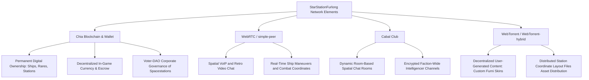

# IDEAS & INSPIRATION v001
*Analyzing Inspirations, Existing Ideas, and Crafting the Grand Vision for StarStationFurlong*

---

## 1. Game Inspiration Analysis & Alignment

This section researches the ten games that form the inspiration roster for **StarStationFurlong**, exploring what made them fun, engaging, and unique, and translates those lessons into concrete mechanics for this decentralized hangout game.

### Habbo Hotel
* **Summary**: A classic isometric virtual world and social networking service where players personalize avatars, design hotel rooms with virtual furniture ("furni"), chat, run user-driven games, and form clubs.
* **What Made it Fun & Engaging**:
  * **Room Customization & Pride**: Players loved creating thematic rooms, showing off rare items ("rares"), and curating social spaces.
  * **The Rares Economy**: Collecting, trading, and bartering limited-edition items created a highly active, self-sustaining virtual economy.
  * **Spatial Socializing**: Isometric rooms localized social bubbles, making online interaction visual, approachable, and intimate.
* **Alignment with StarStationFurlong**: Room-based decoration using custom spacecraft/station modules. A decentralized inventory (Chia blockchain NFTs) can power a similar "rares" economic loop, with players showcasing unique assets in their leased or owned space station rooms.

### Workadventure
* **Summary**: A web-based collaborative RPG-style workspace. When players' 16-bit 2D avatar figures stand near one another, a video and audio call launches automatically using Peer-to-Peer (WebRTC) technology.
* **What Made it Fun & Engaging**:
  * **Organic Socializing**: Standardized office video tools are stiff, but popping in on a colleague by walking your character over to their desk mimics running into someone at a real water cooler.
  * **Interactive Map Flow**: Group meetings spawn, split, and merge naturally as pixel avatars walk around the environment.
* **Alignment with StarStationFurlong**: Integrating proximity-based text/voice chat using WebRTC (`simple-peer`). Walking near another player's spacestation deck or starship captain's chair seamlessly launches a pixelated webcam feed or voice connection.

### StarCraft
* **Summary**: A legendary military sci-fi real-time strategy (RTS) game. Players collect minerals and gases to build bases, research tech, and wage physical map control warfare across asymmetrical factions.
* **What Made it Fun & Engaging**:
  * **Tense Resource Scarcity**: Fighting over choke points and high-yield mining nodes forces constant geopolitical friction.
  * **Systemic Interdependence**: Distinct races require completely different strategies and building-tech trees, creating rich asymmetric gameplay.
* **Alignment with StarStationFurlong**: Space stations act as hubs requiring raw materials (metals, ores, and planetary gases) for construction or maintenance. Player factions must compete or trade to secure mineral-rich asteroid fields, with real logistical supply chains flowing through space sectors.

### EverQuest
* **Summary**: One of the absolute cornerstones of 3D MMORPG history, feared and loved for its brutal difficulty, deep roleplay components, and complex long-tail crafting chains.
* **What Made it Fun & Engaging**:
  * **Community Interdependence**: In Norrath, survival alone was impossible. High risk (corpse runs, severe death penalties) forged extremely tight-knit communities.
  * **Complex Crafting Recipes**: Crafting was not just a side-quest; it required dozens of cross-profession inputs, specialized tools, and high devotion.
* **Alignment with StarStationFurlong**: StarStationFurlong can champion meaningful risk/reward. Implementing deep crafting trees (e.g., building station reactors, advanced shields, life support) that require raw material refinement and highly specialized player roles, forcing space stations to work together.

### Space Trader (Palm OS)
* **Summary**: A seminal turn-based strategy/trading game where player captains buy and sell goods (ranging from standard provisions to illicit weaponry) while upgrading their ship's shields, hyperdrives, and weapon systems across diverse planetary markets.
* **What Made it Fun & Engaging**:
  * **Dynamic Markets**: Planet economies reacted to resources, tech levels, and political climates (e.g., plague, warfare, famine).
  * **The Smuggling Risk**: Evading police patrols with contraband provided a high-intensity option for massive profits.
* **Alignment with StarStationFurlong**: The trade loop. Dynamic market price fluctuations across different star sectors. Players can load cargo holds, navigate transport lanes, pay spacefuel tolls, and hazard pirate sectors or security checkpoints to deliver rare commodities.

### Second Life
* **Summary**: A digital platform where virtual residents write scripts, construct land plots, design wearables, and trade virtual creations in a fully user-developed digital sandbox economy.
* **What Made it Fun & Engaging**:
  * **Absolute Creative Sandbox**: Virtually everything in the world is crafted and owned by players.
  * **Land Rental & Real Estate**: Players bought/leased coordinate chunks to assemble public venues, clubs, or quiet virtual islands.
* **Alignment with StarStationFurlong**: Space stations support modular design where owners can lease individual rooms, shops, or arcade rooms using smart contracts, complete with custom user-generated behaviors and media.

### Minecraft
* **Summary**: A block-based open-world survival game allowing players to sculpt landscapes, extract raw ores, automate production, and assemble creations.
* **What Made it Fun & Engaging**:
  * **Modular Freedom**: The world is a canvas of blocks, making building immediate and intuitive.
  * **Emergent Gameplay**: Survival mode combined with creative systems (redstone wiring) leads to intricate, self-made automation and defense systems.
* **Alignment with StarStationFurlong**: Spacestation blocks. Instead of flat pre-rendered maps, stations are modularly expanded block-by-block using farmed materials. Players craft physical walls, solar arrays, defenses, and engines node-by-node.

### Star Wars Galaxies (SWG)
* **Summary**: A historic sandbox MMORPG famed for its completely player-driven economy, non-combat careers (like Politician, Master Doctor, Merchant), and player-run planetary settlements.
* **What Made it Fun & Engaging**:
  * **Deep Interdependency & Social Anchors**: Combat builds were impossible without entertainers healing mental fatigue or doctors treating wounds. The best armor/weapons were crafted from raw resources whose stats (conductivity, density) cycled dynamically week-to-week.
  * **Player Towns**: Establishing physical footprints on worlds made players deeply attached to their space.
* **Alignment with StarStationFurlong**: Specialized non-combat roles. Space stations aren't just for pilots; players can opt to be Station Technicians, Asteroid Miners, Casino Managers, Lounge Musicians, or Stockbrokers. Game items are crafted from raw materials that feature randomized quality metrics (influencing fuel efficiency, shield strength, etc.).

### OpenTTD
* **Summary**: An open-source simulation strategy clone of Transport Tycoon Deluxe. Players build intricate transport systems (railways, highways, flights, ship lanes) to move freight and travelers optimally.
* **What Made it Fun & Engaging**:
  * **Logistics & Pathfinding**: Constructing the ultimate high-throughput system on complex maps.
  * **Rivalry & Market Subjugation**: Manipulating cargo paths to steal raw goods from competing freight empires.
* **Alignment with StarStationFurlong**: Logistics. A space trade network where players cooperate or compete to run ferry lines, fuel cargo supply chains, and freight networks between asteroid mining sites and core starports.

### The Legend of the Mystical Ninja (SNES)
* **Summary**: Konami’s action-adventure masterpiece blending side-scrolling combat with top-down RPG town hubs featuring mini-games, lottery booths, arcades, and restaurants.
* **What Made it Fun & Engaging**:
  * **Charming Town Activities**: Exploring the active cities, stopping by a restaurant to heal, buying goods, and playing arcade variants.
  * **Cooperative Fun**: Fun co-op mechanics where characters interact or piggyback on one another.
* **Alignment with StarStationFurlong**: Social station interiors. A lounge where players sit down at a visual casino card game, order drinks, play retro multi-peer mini-games, and experience high-flavor environments amidst their space travel downtime.

---

## 2. Innovative Sandbox Gameplay Proposals

With the above foundations in mind, we can synthesize existing gameplay outlines and draft actionable, exciting sandbox mechanics:

### A. Proximity-to-Detail Zoom (3D-to-2D Transitions)
* **The Concept**: The overarching game view is represented using a classic parallel 2D projection (2D tile-pixel feel via Three.js assets). However, when players approach a specific system element, they trigger a dramatic camera zoom into a specialized interface:
  * **The Casino Sit-Down**: Walking over to a Poker or Blackjack station morphs the view into a high-detail table top interface.
  * **Captain’s Bridge**: Interacting with the command seat zooms the camera into a holographic star-chart where they plot hyper-lane coordinates.
  * **The Desk Job**: Walking to an administration workstation changes the game window into a multi-window dashboard (viewing cargo sheets, active trade prices, or running a business ledger).

### B. The Spacephone & Pixelated Holograms
* **The Concept**: Physical distance between stations creates communication silos. If a player wants to communicate with someone halfway across the sector, they must make a "Spacephone Call" via Cabal networks:
  * **Pixel Shovel-Filter**: To maintain a retro thematic aesthetic, the game captures the caller's native webcam stream and projects it as an animated, highly retro, 8-bit monochromatic pixel grid (floating like a Star Wars hologram) on the recipient's viewport.
  * **Space Intercepts**: Unencrypted calls can be intercepted by players piloting ships close to the route of transmitting data nodes, adding a rich corporate espionage mechanic.

### C. Spacefuel Friction and Sector "Moats"
* **The Concept**: Space is vast, and moving starships requires Spacefuel. 
  * **Economic Moats**: Fuel burn prevents players from instantly flooding every market. Moving between distant spacestations requires significant initial fuel investments, isolating local regional supply and demand. This creates distinct "cultural" pockets in different spacestations.
  * **Logistical Transport Roles**: Players who own massive freighters can specialize in bulk-shipping smaller ships and regional goods across these empty "moats," charging space coins to ferry passenger vessels and miners.

### D. Interdependent Station Economies & Careers
* **The Concept**: Introducing dedicated, persistent profession slots that gain level ranks as they are utilized, limitable to promote group dependency (similar to Star Wars Galaxies):
  * **The Station Engineer**: Spacestations lose oxygen, shields, and structural integrity under cosmic radiation or meteor showers. Engineers must continually adjust power grids, repair hull plating, and swap filters.
  * **The Asteroid Harvester**: Mines asteroid bands for raw metals. Must coordinate with pilots and cargo haulers.
  * **The Smuggler/Outlaw**: Operates in the lawless fringes, evading scanning satellites to deliver high-value contraband directly to spacestation black markets.

---

## 3. The Grand Picture: Overarching Vision for StarStationFurlong

Imagine a vast, persistent, and entirely **decentralized retro outer-space metropolis**. There are no heavy corporate central servers. Instead, **StarStationFurlong** exists entirely on the distributed devices of its active players. 

When you log in, you are greeted by an isometric, pixelated multi-deck spacestation. You walk past bustling bars where automated jukeboxes stream music, navigate through custom arcade sections, browse dynamic trading terminals, and watch ships dock at the lower port. This space is not generated by a single company; it is modularly owned and expanded by players. A massive corporations alliance leases workspace to a network of miners, while an independent entrepreneur sets up a high-stakes casino deck near the outer asteroid ring.

Economic activity is real and player-driven: if you want a faster ship, you don't buy it from a template store—you buy the hull from a master ship builder, the engines from a specialized power engineer, and the shields from an asteroid metal refiner. The logistics of the universe require active shipping lines ensuring raw elements are carted through unpredictable sectors (where pirates might lie in wait). Local group interactions feel raw and personal, utilizing proximity-triggered spatial audio/video. Communication from sector to sector is handled by pixelated holographic monitors. 

StarStationFurlong is a living, breathing virtual colony that belongs to, and is hosted by, its citizens.

---

## 4. Decentralized Tech: Driving Gameplay Features

Our technology stack isn't just an infrastructure choice—it's a goldmine for **gameplay systems**:

### 1. Chia Network & Chia Gaming
* **Long-Term Ownership (NFTs & Assets)**: In-game items like ship hulls, modular station blocks (rooms, lounge equipment, factories), and rare avatar customization skins are minted as standard Chia NFTs. Players have absolute sovereign ownership; they can trade assets natively outside of the game client.
* **Smart Coin Contracts for Escrow & Banking**: Facilitates secure multi-sig agreements. Players can build functional *banks* that yield loans to other players to purchase expensive mining vessels, storing collateral directly in the Chia blockchain.
* **Corporate Shares & Station Governance**: Spacestations can form as "DAOs" (Decentralized Autonomous Organizations). If a station wants to construct a new docking wing, the station owners vote using utility station-shares. Profits earned from station docking fees, casino house edges, and spacefuel tax are automatically distributed proportionally to holders of these Chia-based shares.

### 2. Cabal Club
* **Dynamic Location-Based Rooms**: Cabal is a peer-to-peer chat system built on hypercore. The universe map scales by translating grid coordinates into distinct Cabal chat channels (rooms). Entering a room automatically connects the player to that room's Cabal swarm, ensuring spatial chat message distribution.
* **Physical Coordinate Syncing**: Cabal's robust gossip protocol can be used to synchronize short-term character coordinates, player headings, action states, and visual poses without central coordinate servers.

### 3. WebRTC via Simple-Peer
* **Spatial Media Corridors**: Real-time voice/video chat triggers when players' circles intersect. As you walk closer to someone in a corridor or sit opposite them at a lounge booth, WebRTC establishes high-speed P2P channels for immediate call performance.
* **Direct Handshake Trade Agreements**: Peer-to-peer handshakes ensure incredibly low-latency verification when exchanging items in local inventories.

### 4. WebTorrent & WebTorrent-Hybrid
* **Distributed Game Asset Loading**: Rather than downloading heavy graphical assets from a standard CDN, players seed modular asset packages (such as 3D Three.js files, custom retro textures, soundscapes, or user-built furniture configurations) to one another.
* **Custom User-Generated Content (UGC)**: Want to paint your space station suite with unique custom murals or upload an retro 8-bit jukebox tune? WebTorrent handles the instant, serverless distribution of your assets to nearby visitors automatically.

### 5. RetroShare
* **Inter-Sector Logistics & Supply Networks**: RetroShare provides secure, encrypted friend-to-friend (F2F) tunnels. This is perfect for the establishment of secretive **intelligence networks** where player corporations exchange encrypted trade lane logs, market pricing lists, cargo manifests, and planned mining raids completely out of view of local space authorities.
