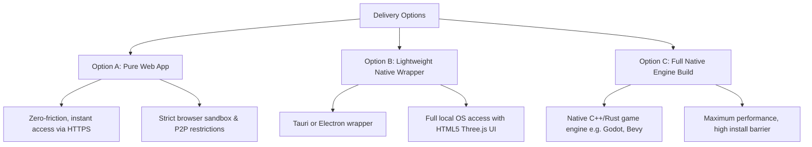

# STUDY - System Requirements & Software Form Options v001
*Analyzing Native Desktop vs. Pure Web Architectures, Protocol Limitations, and Gameplay Tradeoffs for StarStationFurlong*

---

## 1. Executive Summary

A core question in the development of **StarStationFurlong** is its final software delivery vehicle: **Should it be a full native download or a frictionless, web-only experience?**

To build a truly peer-to-peer (P2P) gaming metaverse that utilizes innovative mechanics—such as proximity voice/video chat via WebRTC, persistent chat/position tracking via Cabal Club, decentralized asset streaming via WebTorrent, and digital sovereign ownership via the Chia Blockchain—we must understand the architectural realities of the web platform. 

This study examines our software form options, analyzes the technical boundaries of webless browser sandboxes, details the performance profiles of our decentralized protocol stack, and summarizes what we must give up or solve to achieve a zero-install experience.

---

## 2. Software Form Options

We have three primary software delivery models to evaluate:



### Option A: Pure Web App (Zero-Install Browser Client)
The game runs entirely inside the user's web browser (Chrome, Firefox, Safari). Players visit a website (e.g., `https://furlong.space`) and are instantly introduced to the game lobby without installing anything.
* **Tech Stack**: Three.js (WebGL/WebGPU), React/Svelte for overlays, pure WebRTC (`simple-peer`), WebTorrent-hybrid networks, and injected browser wallet APIs.
* **Friction**: None. Absolute simplicity for onboarded players. 

### Option B: Lightweight Native Wrapper (Tauri / Electron)
The game frontend remains web-based (HTML5/Three.js) but is packaged inside a native desktop wrapper. 
* **Tauri (Recommended)**: Utilizes a lightweight Rust backend and the system's native Webview (yielding installers as tiny as 10-15 MB). It allows us to compile native P2P protocols (like raw Hypercore TCP/UDP connections for Cabal and full BitTorrent seeding) directly into the native runner, passing clean data APIs to the Three.js front-end.
* **Electron**: Uses Chromium + Node.js. It offers full Node.js API support but results in bulky installation packages (~100-150 MB empty shell) and heavy RAM consumption.
* **Friction**: Medium. Requires downloading and executing an installer, but offers rich, native-grade P2P capabilities.

### Option C: Heavy Engine Build (Godot, Bevy, Unity)
The game is compiled natively via a traditional game engine.
* **Tech Stack**: Native code (C++, Rust, C#) compiled directly to assembly, running with direct graphics API support (Vulkan/DirectX).
* **Friction**: High. Large client download, manually updated executables, and high development complexity when bridging custom decentralization libraries (such as Cabal, RetroShare, or Chia commands) into game engine frameworks.

---

## 3. The Pure Browser Sandbox: Key Gameplay Limitations

If we commit to **no `.exe` or installation process** (Option A), we have to design the gameplay surrounding strict browser sandbox constraints. 

### I. The "Active Tab" Tyranny (No Passive / AFK Activities)
Browsers aggressively throttle inactive browser tabs to save battery and system resources. 
* **The Gameplay Impact**: If a player minimizes their browser or switches to another tab, their WebGL framerate drops to near-zero, and JS execution is heavily scaled back. 
* **Loss of AFK Mechanics**: Idle features proposed in [DEV/IDEAS-GameTechnology.md](DEV/IDEAS-GameTechnology.md)—such as passively attending ship school, auto-piloting across empty sectors, or slow-crafting structural blocks while away from keys—will fail or constantly disconnect if the user isn't actively focusing on the tab.
* **Node Dropout**: When users close the browser tab, their local client vanishes instantly. They cannot act as persistent network seeders or communication relays to help others.

### II. Storage Volatility (The Temporary Universe)
Browsers do not guarantee permanent storage. Methods like LocalStorage, SessionStorage, and IndexedDB are subject to aggressive browser-level housekeeping.
* **The Gameplay Impact**: If a user runs low on local disk space, the browser will wipe IndexedDB without prompting.
* **Asset Re-downloading**: High-fidelity Three.js room layouts, custom skin files, and soundscapes must be completely re-fetched or re-seeded on subsequent logins, degrading the instant-loading experience.
* **Key Loss Risk**: If a user stores an unbacked-up seed phrase or private key in the browser state, clearing browser cookies/cache will permanently erase their access to their game assets and credentials.

### III. Socket Limitation (No Listening Ports)
A browser-based client cannot create a "listening socket." It can only establish outbound connections.
* **The Gameplay Impact**: Pure P2P requires at least one peer to act as a receiver. If the entire player base is browser-bound, no two players can connect to one another directly without an intermediate signaling layer or proxy server.

---

## 4. Decentralized Protocol Breakdown under Web Constraints

Let's inspect how our core decentralization technologies react when restricted to a pure web browser environment.

```
+------------------+----------------------------------+--------------------------------------+
| Technology       | Native Desktop Capability        | Web Browser Restriction              |
+------------------+----------------------------------+--------------------------------------+
| WebRTC           | Native UDP/TCP, fallback-free    | Requires external Signaling & TURN   |
| Cabal / Chat     | Raw TCP/UDP Swarm, Tor routing   | WebSocket proxy or WebRTC data bridge|
| WebTorrent       | Raw BitTorrent TCP/UDP, DHT      | WebRTC-only (isolated from BitTorrent)|
| Chia Wallet      | RPC local daemon, offline keys   | Injected extension or API proxy     |
+------------------+----------------------------------+--------------------------------------+
```

### A. WebRTC (via Simple-Peer)
While WebRTC was designed for web browsers, it is not completely central-serverless.
* **Signaling Requirement**: WebRTC cannot find peers on its own. It requires a **signaling server** (an external WebSocket connection) to swap session descriptions (SDPs) between player clients. If this signaling server goes down, players cannot find or connect to each other.
* **Symmetric NAT Traversal**: If players are behind restrictive firewalls (such as university dorms, office connections, or symmetric cellular NATs), direct peer connections are physically impossible. They must fall back to a **TURN relay server**. 
* **The Financial Cost**: Routing voice streams and real-time movement frames through a TURN server converts StarStationFurlong from a cost-free serverless game into one with heavy bandwidth bills.
* **Mesh Bottleneck**: Maintaining a real-time mesh swarm of spatial channels causes high CPU overhead. Browsers will suffer immense stuttering if more than 10-15 active real-time WebRTC coordinates and streams are running concurrently.

### B. Cabal Club (Hypercore-based Chat & Coordinates)
Native Cabal operates on Hypercore over TCP/UDP and local Tor daemons, enabling truly serverless chat.
* **Browser Roadblock**: Browsers cannot speak TCP or join the native Hypercore DHT directly.
* **Web Workaround**: To make Cabal run in a browser, we must run **proxy gateways** that talk WebSockets to the browser clients and TCP to the native Cabal swarms.
* **The Sacrifice**: This introduces centralized hosting points. If our proxy servers go offline, browser clients lose access to short-term chat rooms, physical room-based coordinates, and spatial bulletin boards.

### C. WebTorrent (Game Asset & UGC Delivery)
We intend to distribute heavy files (Three.js models, modular templates, background tracks) via BitTorrent.
* **Browser Isolation**: Browsers running WebTorrent can *only* connect to other peers that support WebRTC data channels. They **cannot** download directly from the millions of traditional BitTorrent TCP/UDP clients.
* **The Cold Start Problem**: If you log into a quiet sector and there are no other browser-based players online to seed that sector's skin, you cannot download it. We would need to host permanently active, hybrid-seeding cloud daemons (running both WebSockets and native torrent clients) to guarantee file availability, creating server dependency.

### D. Chia wallets (Digital Economy & Sovereignty)
The Chia Network manages StarStationFurlong assets (ships, stations, spacefuel) securely.
* **Browser Roadblock**: Browsers cannot run a native Chia light client engine securely or efficiently inside standard runtime, nor can they safely host secret keys directly in JS variables (due to cross-site scripting/XSS vulnerability vectors).
* **The Tradeoff Options**:
  1. **Extension Dependence**: Force users to install browser extensions like Goby Wallet. This voids the "frictionless" promise because users must still install extra components.
  2. **Centralized Provider Nodes**: Connect the browser client to a central API service we run to make RPC blockchain calls. This re-centralizes trusted ledger access and requires us to maintain heavy blockchain indexing nodes.

---

## 5. What We Must Give Up for Simplicity (Pure Web)

If we reject any native executable launcher and commit to a **pure zero-install browser game**, here is what we must give up:

1. **Absolute Serverless Independence**: We must host and fund robust auxiliary infrastructure, including:
   * **WebRTC Signaling/STUN servers** (to coordinate P2P handshakes).
   * **TURN Relay servers** (to pass traffic through locked-down networks).
   * **WebSocket-Cabal Gateways** (to connect browser players to the Hypercore network).
   * **WebTorrent Hybrid Seeders** (to act as fallback asset servers).
   * **Chia RPC Nodes** (to sign ledger details).
2. **True AFK Progress**: Deep simulation systems like space travel, offline instruction, and offline ship defense are impossible if closing the browser tab shuts down the client instantly.
3. **P2P Coordinate Syncing at Scale**: WebRTC data channels cannot support 100+ players on a single deck in a full peer mesh. Large-scale social areas would require fallback central relays.

---

## 2. Recommended Hybrid Approach: The "Web-First, Tauri-Best" Blueprint

To avoid sacrificing these rich systems while keeping entry friction incredibly low, we should pursue a **Dual-Delivery Hybrid Strategy**:

```
                              ┌───────────────────────────────┐
                              │  STARSTATIONFURLONG WEB CORE  │
                              │    (Three.js, UI, WebRTC)     │
                              └───────────────┬───────────────┘
                                              │
                     ┌────────────────────────┴────────────────────────┐
                     ▼                                                 ▼
        ┌─────────────────────────┐                       ┌─────────────────────────┐
        │   PURE BROWSER CLIENT   │                       │      TAURI LAUNCHER     │
        │    (Zero-Installation)  │                       │   (Low-Friction .exe)   │
        └────────────┬────────────┘                       └────────────┬────────────┘
                     │                                                 │
        ┌────────────┴────────────┐                       ┌────────────┴────────────┐
        │ - Uses Web proxies      │                       │ - Runs Local Hypercore  │
        │ - Relay-based WebRTC    │                       │ - Direct P2P TCP Swarm  │
        │ - External light wallet │                       │ - Full BitTorrent Node │
        │ - No offline AFK play   │                       │ - Persistent AFK background│
        └─────────────────────────┘                       └─────────────────────────┘
```

### Phase 1: The Casual Layer (Zero-Install HTML5 Client)
* A player visits our web link.
* They get to roam the main default station (Furlong) using WebRTC and standard WebGL rendering.
* Ideal for socializing, checking dynamic markets, and trading items using web-extension wallets (like Goby).
* Fallback assets are quietly downloaded via WebTorrent web peers or traditional HTTPS backup buckets.

### Phase 2: The Hardcore Layer (Tauri Desktop Executable)
* When a player decides to own a space station, execute multi-sig escrow loans, run a high-capacity mining company, or coordinate automation loops, they download our tiny (~12MB) lightweight Tauri executable.
* This application loads the *exact same* web frontend but initiates raw local background processes:
  * A local **native Hypercore stack** that doesn't need Web-to-TCP proxies.
  * A **native BitTorrent engine** to seed room assets directly to web clients.
  * A secure, sandboxed local Chia wallet engine to manage keys securely without extension popups.
  * The ability to run minimized to the OS tray for persistent **AFK manufacturing/logistics** and background network seeding.

---

### Key Next Steps & Architecture Questions
1. Do we want to develop the initial tech proof-of-concept (POC) as a pure web mock-up so we can easily test visual assets?
2. Which aspects of the smart ledger are considered immediate launches—should currency and assets run on Testnet before committing to mainnet pools?
3. Should we structure our early developer codebase explicitly in standard ECMAScript so that the same files run inside both a web runner and a Tauri wrapper shell?

---
*For details on game influences and lore design, refer to [AI NOTES/IDEAS-INSPIRATION v001.md](AI%20NOTES/IDEAS-INSPIRATION%20v001.md) and technical ideas in [DEV/IDEAS-GameTechnology.md](DEV/IDEAS-GameTechnology.md).*