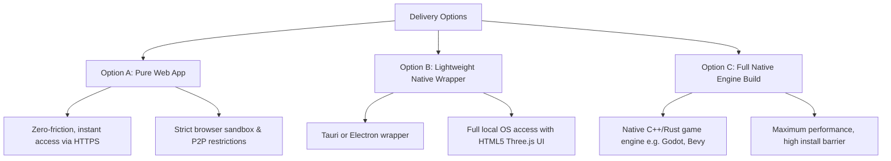
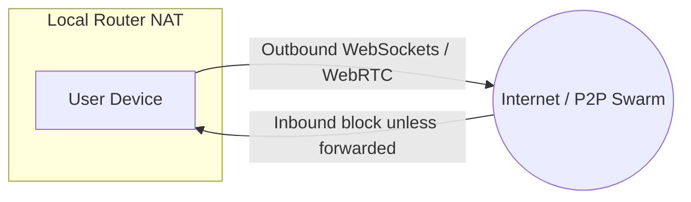

# STUDY - System Requirements & Software Form Options v001
*Analyzing Native Desktop vs. Pure Web Architectures, Protocol Limitations, and Gameplay Tradeoffs for StarStationFurlong*

---

## 1. Executive Summary

A core question in the development of **StarStationFurlong** is its final software delivery vehicle: **Should it be a full native download or a frictionless, web-only experience?**

To build a truly peer-to-peer (P2P) gaming metaverse that utilizes innovative mechanics—such as proximity voice/video chat via WebRTC, persistent chat/position tracking via Cabal Club, decentralized asset streaming via WebTorrent, and digital sovereign ownership via the Chia Blockchain—we must understand the architectural realities of the web platform. 

This study examines our software form options, analyzes the technical boundaries of webless browser sandboxes, details the performance profiles of our decentralized protocol stack, and summarizes what we must give up or solve to achieve a zero-install experience.

---

## 2. Software Form Options

We have three primary software delivery models to evaluate:



### Option A: Pure Web App (Zero-Install Browser Client)
The game runs entirely inside the user's web browser (Chrome, Firefox, Safari). Players visit a website (e.g., `https://furlong.space`) and are instantly introduced to the game lobby without installing anything.
* **Tech Stack**: Three.js (WebGL/WebGPU), React/Svelte for overlays, pure WebRTC (`simple-peer`), WebTorrent-hybrid networks, and injected browser wallet APIs.
* **Friction**: None. Absolute simplicity for onboarded players. 

### Option B: Lightweight Native Wrapper (Tauri / Electron)
The game frontend remains web-based (HTML5/Three.js) but is packaged inside a native desktop wrapper. 
* **Tauri (Recommended)**: Utilizes a lightweight Rust backend and the system's native Webview (yielding installers as tiny as 10-15 MB). It allows us to compile native P2P protocols (like raw Hypercore TCP/UDP connections for Cabal and full BitTorrent seeding) directly into the native runner, passing clean data APIs to the Three.js front-end.
* **Electron**: Uses Chromium + Node.js. It offers full Node.js API support but results in bulky installation packages (~100-150 MB empty shell) and heavy RAM consumption.
* **Friction**: Medium. Requires downloading and executing an installer, but offers rich, native-grade P2P capabilities.

### Option C: Heavy Engine Build (Godot, Bevy, Unity)
The game is compiled natively via a traditional game engine.
* **Tech Stack**: Native code (C++, Rust, C#) compiled directly to assembly, running with direct graphics API support (Vulkan/DirectX).
* **Friction**: High. Large client download, manually updated executables, and high development complexity when bridging custom decentralization libraries (such as Cabal, RetroShare, or Chia commands) into game engine frameworks.

---

## 3. The Pure Browser Sandbox: Key Gameplay Limitations

If we commit to **no `.exe` or installation process** (Option A), we have to design the gameplay surrounding strict browser sandbox constraints. 

### I. The "Active Tab" Tyranny (No Passive / AFK Activities)
Browsers aggressively throttle inactive browser tabs to save battery and system resources. 
* **The Gameplay Impact**: If a player minimizes their browser or switches to another tab, their WebGL framerate drops to near-zero, and JS execution is heavily scaled back. 
* **Loss of AFK Mechanics**: Idle features proposed in [DEV/IDEAS-GameTechnology.md](DEV/IDEAS-GameTechnology.md)—such as passively attending ship school, auto-piloting across empty sectors, or slow-crafting structural blocks while away from keys—will fail or constantly disconnect if the user isn't actively focusing on the tab.
* **Node Dropout**: When users close the browser tab, their local client vanishes instantly. They cannot act as persistent network seeders or communication relays to help others.

### II. Storage Volatility (The Temporary Universe)
Browsers do not guarantee permanent storage. Methods like LocalStorage, SessionStorage, and IndexedDB are subject to aggressive browser-level housekeeping.
* **The Gameplay Impact**: If a user runs low on local disk space, the browser will wipe IndexedDB without prompting.
* **Asset Re-downloading**: High-fidelity Three.js room layouts, custom skin files, and soundscapes must be completely re-fetched or re-seeded on subsequent logins, degrading the instant-loading experience.
* **Key Loss Risk**: If a user stores an unbacked-up seed phrase or private key in the browser state, clearing browser cookies/cache will permanently erase their access to their game assets and credentials.

### III. Socket Limitation (No Listening Ports)
A browser-based client cannot create a "listening socket." It can only establish outbound connections.
* **The Gameplay Impact**: Pure P2P requires at least one peer to act as a receiver. If the entire player base is browser-bound, no two players can connect to one another directly without an intermediate signaling layer or proxy server.

---

## 4. Decentralized Protocol Breakdown under Web Constraints

Let's inspect how our core decentralization technologies react when restricted to a pure web browser environment.

```
+------------------+----------------------------------+--------------------------------------+
| Technology       | Native Desktop Capability        | Web Browser Restriction              |
+------------------+----------------------------------+--------------------------------------+
| WebRTC           | Native UDP/TCP, fallback-free    | Requires external Signaling & TURN   |
| Cabal / Chat     | Raw TCP/UDP Swarm, Tor routing   | WebSocket proxy or WebRTC data bridge|
| WebTorrent       | Raw BitTorrent TCP/UDP, DHT      | WebRTC-only (isolated from BitTorrent)|
| Chia Wallet      | RPC local daemon, offline keys   | Injected extension or API proxy     |
+------------------+----------------------------------+--------------------------------------+
```

### A. WebRTC (via Simple-Peer)
While WebRTC was designed for web browsers, it is not completely central-serverless.
* **Signaling Requirement**: WebRTC cannot find peers on its own. It requires a **signaling server** (an external WebSocket connection) to swap session descriptions (SDPs) between player clients. If this signaling server goes down, players cannot find or connect to each other.
* **Symmetric NAT Traversal**: If players are behind restrictive firewalls (such as university dorms, office connections, or symmetric cellular NATs), direct peer connections are physically impossible. They must fall back to a **TURN relay server**. 
* **The Financial Cost**: Routing voice streams and real-time movement frames through a TURN server converts StarStationFurlong from a cost-free serverless game into one with heavy bandwidth bills.
* **Mesh Bottleneck**: Maintaining a real-time mesh swarm of spatial channels causes high CPU overhead. Browsers will suffer immense stuttering if more than 10-15 active real-time WebRTC coordinates and streams are running concurrently.

### B. Cabal Club (Hypercore-based Chat & Coordinates)
Native Cabal operates on Hypercore over TCP/UDP and local Tor daemons, enabling truly serverless chat.
* **Browser Roadblock**: Browsers cannot speak TCP or join the native Hypercore DHT directly.
* **Web Workaround**: To make Cabal run in a browser, we must run **proxy gateways** that talk WebSockets to the browser clients and TCP to the native Cabal swarms.
* **The Sacrifice**: This introduces centralized hosting points. If our proxy servers go offline, browser clients lose access to short-term chat rooms, physical room-based coordinates, and spatial bulletin boards.

### C. WebTorrent (Game Asset & UGC Delivery)
We intend to distribute heavy files (Three.js models, modular templates, background tracks) via BitTorrent.
* **Browser Isolation**: Browsers running WebTorrent can *only* connect to other peers that support WebRTC data channels. They **cannot** download directly from the millions of traditional BitTorrent TCP/UDP clients.
* **The Cold Start Problem**: If you log into a quiet sector and there are no other browser-based players online to seed that sector's skin, you cannot download it. We would need to host permanently active, hybrid-seeding cloud daemons (running both WebSockets and native torrent clients) to guarantee file availability, creating server dependency.

### D. Chia wallets (Digital Economy & Sovereignty)
The Chia Network manages StarStationFurlong assets (ships, stations, spacefuel) securely.
* **Browser Roadblock**: Browsers cannot run a native Chia light client engine securely or efficiently inside standard runtime, nor can they safely host secret keys directly in JS variables (due to cross-site scripting/XSS vulnerability vectors).
* **The Tradeoff Options**:
  1. **Extension Dependence**: Force users to install browser extensions like Goby Wallet. This voids the "frictionless" promise because users must still install extra components.
  2. **Centralized Provider Nodes**: Connect the browser client to a central API service we run to make RPC blockchain calls. This re-centralizes trusted ledger access and requires us to maintain heavy blockchain indexing nodes.

---

## 5. What We Must Give Up for Simplicity (Pure Web)

If we reject any native executable launcher and commit to a **pure zero-install browser game**, here is what we must give up:

1. **Absolute Serverless Independence**: We must host and fund robust auxiliary infrastructure, including:
   * **WebRTC Signaling/STUN servers** (to coordinate P2P handshakes).
   * **TURN Relay servers** (to pass traffic through locked-down networks).
   * **WebSocket-Cabal Gateways** (to connect browser players to the Hypercore network).
   * **WebTorrent Hybrid Seeders** (to act as fallback asset servers).
   * **Chia RPC Nodes** (to sign ledger details).
2. **True AFK Progress**: Deep simulation systems like space travel, offline instruction, and offline ship defense are impossible if closing the browser tab shuts down the client instantly.
3. **P2P Coordinate Syncing at Scale**: WebRTC data channels cannot support 100+ players on a single deck in a full peer mesh. Large-scale social areas would require fallback central relays.

---

## 6. Security, Code Signing, & OS Gatekeepers

Developing native installers (Tauri/Electron) or native compiled engines introduces strict OS-level installation friction that pure web pages entirely bypass.

### I. Code Signing Certificate Requirements
When players download an unsigned executable on modern operating systems, they are greeted by intimidating, blocks-by-default security screens.

* **Option A: Pure Web Client**:
  * **Certificate Cost**: $0 (Free). Bypasses installation security altogether; only requires standard domain TLS certificates issued by Let's Encrypt.
* **Option B & C: Native Installers (Tauri / Electron / Godot)**:
  * **Windows SmartScreen**: Requires an **Authenticode Certificate** to sign `.exe` or `.msi` installers. Without signing, Windows throws a full-screen red warning warning that the publisher is unknown. A standard OV (Organization Validated) certificate costs roughly **$300 - $500/year**, and an EV (Extended Validation) certificate to immediately bypass the reputation filter costs **$400 - $700+/year**.
  * **macOS Gatekeeper**: Requires a paid membership in the **Apple Developer Program ($99/year)** to sign binaries using a *Developer ID Certificate*. Furthermore, the signed installer must be submitted to Apple's notarization servers to bypass the macOS "App is damaged and cannot be opened" quarantine screen.
  * **Linux**: Free. Normally does not rely on centralized signing gatekeepers, allowing users to distribute binaries via package formats (AppImage, Flatpak, deb/rpm) without recurring annual certificate fees.

---

## 7. Network Architecture: Port Forwarding & NAT Traversal

A primary technical divergence between pure web apps and native executables is how incoming and outgoing connections are handled on the user's home network.



### I. Pure Browser (Option A) — Outbound Network Only
Browsers are sandboxed and **cannot open listening sockets** or request custom port mappings.
* **Port Requirements**: None. Connection is entirely outbound over port `80`/`443` (HTTP/WebSockets) and arbitrary UDP ports negotiated by WebRTC.
* **NAT Traversal**: Because browsers cannot be reached directly, other players behind standard symmetric routers cannot see them without a third-party STUN/TURN coordinator. If a connection is symmetric-to-symmetric, a paid TURN server must act as a relay.

### II. Tauri / Native Client (Option B & C) — Active Listening Nodes
A native client can act as a fully fledged, independent node in the P2P swarm. To achieve direct connectivity without intermediaries, it must handle inbound traffic.

* **Universal Plug and Play (UPnP)**: Tauri can embed rust libraries (such as `igupnp` or `miniupnp`) to automatically communicate with the player's home router. It dynamically requests a temporary port translation (opening and forwarding external ports to the target machine) on startup.
* **Manual Port Forwarding**: If UPnP is disabled by default on the user's router (standard on highly secure networks, apartments, university corridors, and office setups), players wishing to act as **Super-Seeders** (or host space stations) must manually forward ports in their router's admin interface:
  * **Cabal / Hypercore Swarms**: Typically port `4999` or custom configured TCP/UDP ranges.
  * **BitTorrent / WebTorrent**: Typically ports `6881-6889` TCP/UDP ranges.
* **Passive Mode Fallback**: If ports cannot be opened via UPnP or manual configuration, the client falls back to "passive mode." They can still connect to peers that *do* have open ports, but cannot make direct connections to other passive peers.

---

## 8. NAT Traversal & Routing Workarounds

To mitigate the limits of passive/dorm-room connections without forcing central server hosts to bear all bandwidth costs, we can utilize several technical routing workarounds:

### I. Decentralized Application-Layer Relaying (Peer-to-Peer Circuit Relays)
Instead of forcing passive players to connect through a centralized company TURN server, we can write our networking stack to allow **Active Players** (with open ports/UPnP) to act as voluntary, decentralized relays.
* **How it works**: If peer Alice (passive) and peer Bob (passive) cannot open connections to each other, they query the network for an active peer, Charlie (who has open ports). Alice and Bob both open outbound connections to Charlie. Charlie then routes Alice and Bob's packets between them.
* **Advantage**: Bypasses strict firewalls completely. Offloads bandwidth and server infrastructure costs away from the developers onto the player swarm.
* **Drawback**: Increases latency slightly (A $\rightarrow$ C $\rightarrow$ B). Charlie must have sufficient upload bandwidth. Highly suitable for chat and logistics, but less optimal for high-speed action maneuvers.

### II. UDP Hole Punching (Session Traversal Utilities for NAT)
Although firewalls block unsolicited inbound traffic, they allow returning outbound traffic.
* **How it works**: Alice and Bob both ping a public STUN server to register their external ports. The STUN server tells them what their public ports are. They then simultaneously flood packets directly at each other's registered public endpoints. Upon sending of outbound packets, their routers open physical NAT mappings, allowing the incoming target packets to enter.
* **Success Rate**: Highly successful on "Full Cone" and "Port-Restricted Cone" NATs (standard home routers). Fails on "Symmetric NATs" (most corporate environments or university campus dorms), where the router dynamically randomizes external port mappings for every new outbound target.

### III. IPv6 (Bypassing the NAT Layer Entirely)
Most strict NAT issues exist purely because of IPv4 address exhaustion, which forces ports to be shared.
* **How it works**: Standard IPv6 provides a globally unique, public IP address to every device on a network, completely eliminating the need for NAT or port mappings.
* **Advantage**: If both players' ISPs support IPv6 (over 40-50% global adoption currently, and much higher inside university dorm networks), they can establish a direct, peer-to-peer connection instantly with no configuration.
* **Drawback**: Local firewalls on the user's OS or router might still block unsolicited incoming IPv6 packets by default. The client must still negotiate standard firewall exceptions.

### IV. WebRTC Data Channel Cascading (Seeding via Multi-Hop Chain)
For asset distribution (WebTorrent), if Alice (passive) and Bob (passive) are both connected to Charlie (active), they cannot direct-seed to each other. However, Charlie can play a "seeding relay" role.
* **WebTorrent Chain**: Charlie downloads a room layout from Alice, and then Charlie automatically feeds those blocks to Bob. Because WebRTC supports data streams naturally in browsers, this cascading download functions transparently behind the scenes, creating a multi-hop mesh.

### V. Leveraging Tribler / IPv8 Technology (Academically-Pure P2P Network Overlays)
As a highly resilient routing alternative, we can draw directly from the open-source architecture of the **Tribler** client and its underlying communication submodule, **IPv8** (`py-ipv8`), developed by the Delft University of Technology.

* **What is Tribler / IPv8?**
  * **Tribler**: A privacy-enhanced, decentralized Bittorrent client that does not rely on static tracker servers or centralized search portals. It implements its own custom Tor-like onion routing protocol over UDP to bypass censorship and infrastructure shutdowns.
  * **IPv8**: The core peer-to-peer overlay network library powering Tribler. It Abstracts away physical IP addresses and NAT positions, enabling direct communication between cryptographic public key pairs.

* **Key Workaround Capabilities Compatible with StarStationFurlong**:
  1. **UDP-Based Onion Routing Tunneling**: Traditional Tor uses TCP (which gets blocked easily by OS firewalls and has terrible congestion control issues). Tribler’s IPv8 implements a custom lightweight, end-to-end encrypted onion routing wire protocol using **UDP**. This allows anonymous or tunneled traffic to traverse strict homestyle NAT configurations.
  2. **Every Peer is a Relay (Reciprocal Bandwidth / Tit-for-Tat Darknet)**: In Tribler, players who wish to download/play anonymously must automatically act as middle relays for other network members. We can adopt this "tit-for-tat" paradigm: any player utilizing a native launcher (Option B or C) automatically donates a small fraction of their network upstream to act as an onion circuit node, helping passive dorm players route their map updates and spatial assets completely free of developer server costs.
  3. **Universal UDP Hole Punching (Trustless NAT Traversal)**: IPv8 has exceptionally optimized UDP hole punching strategies designed specifically for restricted consumer NAT environments (doing away with centralized STUN infrastructure). 
  4. **Trust Web-of-Trust (Attestation Overlays)**: IPv8 allows peers to establish cryptographically verifiable reputation loops ("Trustchain" or Attestation chains). We can match this directly with in-game faction networks: players who physically interact, trade, or share space stations with high-reputation characters are automatically mapped into local webs of trust, ensuring secure, sybil-resistant coordinate synchronization.

* **Integration Tradeoffs**:
  * **Language Barrier**: `py-ipv8` is written entirely in **Python 3**. Since our proposed Tauri backend is written in **Rust**, we would either need to:
    * Compile a lightweight Python system daemon inside our installer wrapper (which expands the installer size and RAM usage).
    * Re-implement or bind the core IPv8 packet serialization and UDP circuit wire protocol directly in **Rust** (highly efficient, maintains our small ~12MB target installer footprint, but requires custom engineering).
  * **Browser Sandbox Block**: Since IPv8 is a raw UDP/packet-level overlay protocol, it absolutely cannot run inside a standard browser environment (Option A). Pure web clients must still rely on a native desktop player to act as an IPv8-to-WebSocket gateway.

---

## 9. Recommended Hybrid Approach: The "Web-First, Tauri-Best" Blueprint

To avoid sacrificing these rich systems while keeping entry friction incredibly low, we should pursue a **Dual-Delivery Hybrid Strategy**:

```
                              ┌───────────────────────────────┐
                              │  STARSTATIONFURLONG WEB CORE  │
                              │    (Three.js, UI, WebRTC)     │
                              └───────────────┬───────────────┘
                                              │
                     ┌────────────────────────┴────────────────────────┐
                     ▼                                                 ▼
        ┌─────────────────────────┐                       ┌─────────────────────────┐
        │   PURE BROWSER CLIENT   │                       │      TAURI LAUNCHER     │
        │    (Zero-Installation)  │                       │   (Low-Friction .exe)   │
        └────────────┬────────────┘                       └────────────┬────────────┘
                     │                                                 │
        ┌────────────┴────────────┐                       ┌────────────┴────────────┐
        │ - Uses Web proxies      │                       │ - Runs Local Hypercore  │
        │ - Relay-based WebRTC    │                       │ - Direct P2P TCP Swarm  │
        │ - External light wallet │                       │ - Full BitTorrent Node │
        │ - No offline AFK play   │                       │ - Persistent AFK background│
        └─────────────────────────┘                       └─────────────────────────┘
```

### Phase 1: The Casual Layer (Zero-Install HTML5 Client)
* A player visits our web link.
* They get to roam the main default station (Furlong) using WebRTC and standard WebGL rendering.
* Ideal for socializing, checking dynamic markets, and trading items using web-extension wallets (like Goby).
* Fallback assets are quietly downloaded via WebTorrent web peers or traditional HTTPS backup buckets.

### Phase 2: The Hardcore Layer (Tauri Desktop Executable)
* When a player decides to own a space station, execute multi-sig escrow loans, run a high-capacity mining company, or coordinate automation loops, they download our tiny (~12MB) lightweight Tauri executable.
* This application loads the *exact same* web frontend but initiates raw local background processes:
  * A local **native Hypercore stack** that doesn't need Web-to-TCP proxies.
  * A **native BitTorrent engine** to seed room assets directly to web clients.
  * A secure, sandboxed local Chia wallet engine to manage keys securely without extension popups.
  * The ability to run minimized to the OS tray for persistent **AFK manufacturing/logistics** and background network seeding.

---

### Key Next Steps & Architecture Questions
1. Do we want to develop the initial tech proof-of-concept (POC) as a pure web mock-up so we can easily test visual assets?
2. Which aspects of the smart ledger are considered immediate launches—should currency and assets run on Testnet before committing to mainnet pools?
3. Should we structure our early developer codebase explicitly in standard ECMAScript so that the same files run inside both a web runner and a Tauri wrapper shell?

---

## 10. Ultimate Recommendation: The Custom Rust & Tauri Path

Given the willingness to execute custom Rust systems programming, **the ultimate recommended path is a Custom Rust-Backed Tauri Client supporting a lightweight HTML5/Three.js frontend.**

This approach delivers the absolute highest network robustness and zero setup friction for security/keys, while avoiding the bulk of python dependencies.

### The Recommended Architecture
```
                        ┌───────────────────────────────────┐
                        │    TAURI CLIENT (Rust Backend)    │
                        └─────────────────┬─────────────────┘
                                          │
                  ┌───────────────────────┴───────────────────────┐
                  ▼                                               ▼
     ┌───────────────────────────┐                   ┌───────────────────────────┐
     │   Rust P2P Engine Core    │                   │   Three.js Render UI      │
     │  - tokio / rust-libp2p    │                   │   - Shared HTML5 Codebase │
     │  - NAT Hole Punching &    │                   │   - Renders 2D Map / 3D   │
     │    Circuit Relaying       │                   │   - Talks to Rust via IPC │
     │  - Native Chia Wallet SSL │                   ├───────────────────────────┘
     │  - Chia P2P Peer Crawler  │                   │
     └───────────────────────────┘                   │
                  ▲                                  ▼
                  └─────────────────────────◄────────┘
                            Native IPC Commands
```

### Why Custom Rust in Tauri is the Winning Play:
1. **Lightweight, Native P2P Performance**: Real-time position tracking and spatial lobbies can be powered by custom **Tokio-UDP** sockets in Rust, executing direct hole-punching and client relay hops. This removes the performance limit of browser WebRTC meshes.
2. **Built-in Sovereign Infrastructure (Zero Servers)**: Rather than paying for dedicated servers, we can cross-reference the public **Chia Network L1** block ledger and full-node peer tables directly in Rust to bootstrap. This means the client discovers other players and retrieves reliable DNS seedings simply by looking up who is actively trading/transacting our game's keys or tokens.
3. **Clean separation of concerns**: The web client (Three.js/WebGL) strictly manages visuals, layout rendering, and player controls. When it needs to send a packet, load a large space station layout, or sign a smart coin, it passes a lightweight payload to the Rust core via Tauri's IPC commands.
4. **Rust-Based Chia Integration**: Rust can easily locate and securely bind the local Chia wallet SSL configuration, creating a secure loop between local keys and the screen.
5. **Clean Web Fallback**: Because the frontend is built entirely in standard JS/WebGL, you can easily host the exact same assets on a browser-based site (relying on hybrid proxy bridges) for casual players, while keeping your high-tier features (deep crafting, offline tasks, space navigation) reserved for player running the Tauri-Rust package.

---

## 11. Chia Blockchain: Storage, Tokenomics, & Transaction Routing

To integrate the Chia Blockchain smoothly into our decentralized universe, we must address three architectural criteria: data storage, token structures, and transaction flexibility for users.

### I. How to Use Chia for Storage (On-Chain vs. Off-Chain Hybrid)
Storing complete 3D assets, textures, or room configurations directly on-chain is structurally impossible due to massive transaction size restrictions and high coin minting fees. Instead, we use an **On-Chain Identity with Off-Chain Data** architecture.

```
┌─────────────────────────────────┐       ┌─────────────────────────────────┐
│       CHIA BLOCKCHAIN (L1)      │       │     P2P SWARM / WEBTORRENT      │
├─────────────────────────────────┤       ├─────────────────────────────────┤
│ NFT / Singleton                 │       │ Read URI Hash:                  │
│  - Metadata URI: torrent://hash ├──────►│  - Downloads Three.js 3D models │
│  - Owner: Player Public Key     │       │  - Fetches Space Station Layout │
└─────────────────────────────────┘       └─────────────────────────────────┘
```

1. **Cryptographic Indexing**: All ownership items—ships, custom hulls, modular furniture, space station decks—are minted as **Chia NFTs (using standard DID / Decentralized Identifiers)** or **Singletons** (custom state-tracking coins).
2. **Deterministic Metadata**: The NFT contains an immutable, cryptographically signed URI pointing to a **WebTorrent InfoHash** or **Cabal magnet link**.
3. **The Data Loop**: When a player approaches a custom space station room, the game client reads the Chia NFT's metadata, grabs the torrent infohash from the blockchain, and downloads the actual WebGL layout data from the peer-to-peer seating pool. The chain validates *who owns it* and *what it contains*, while WebTorrent distributes the *actual file bytes*.

### II. Native Chia (XCH) vs. Custom Token (CAT) vs. Spinoff Fork
To secure our economies, we have three paths for token architecture:

1. **Spinoff Fork (Alt-L1)**: Generating a separate, independent fork of the Chia blockchain codebase.
   * *Verdict*: **Not Recommended**. Building a brand-new consensus network lacks validator/farmer security. It leaves us highly vulnerable to 51% double-spend collusion attacks and divorces us from the massive network of existing, pre-installed Chia wallets.
2. **Native Chia Coins (XCH / Mojos)**: Using native base network currency for all actions.
   * *Verdict*: **Excellent for High-Value Markets**, but lacks operational flexibility for gameplay mechanics (like paying out tiny fuel bonuses, AFK sleep rewards, and managing localized inflation).
3. **In-game Chia Asset Token (CAT)**: Minting custom, smart-contract tokens (e.g., *Spacefuel Token - SFUEL* or *Furlong Coins - FURL*) that run natively on the main Chia L1.
   * *Verdict*: **Highly Recommended**. Because CATs run directly inside the main Chia Network, they are secured by the full hashing power of Chia's global farming consensus. They can be integrated into custom Chialisp puzzles to manage the game's "House Edge," auto-burn rates, and spatial taxes entirely decentralized.

### III. Flexible Multi-Coin Transactions & Background Management
If we allow players to buy, trade, or pay for ferry routes using *any* coin they want (e.g., trading a ship for XCH, stablecoins like USDS, or another company's CAT), we must handle background gas and state management:

1. **The XCH Gas Requirement**: No matter what asset is traded, **native XCH (Mojos) must be spent** to cover the L1 network transaction transaction fee.
   * *Solution*: The game client's local Rust engine manages a small "Mojo Reserve" or acts as an automated transaction aggregator. When players swap CATs, a fraction of a cent in native XCH is included to push the transaction through the block pools.
2. **P2P Escrow Puzzles (Chialisp)**:
   * When two players execute a trade, they do not trust one another. Instead, a custom Chialisp **escrow puzzle** is compiled locally by the seller's Rust engine.
   * This smart coin specifies: *"This Ship NFT is unlocked if and only if the specified amount of [Target Asset/CAT/XCH] is deposited into this slot."*
   * This allows players to swap any compatible CAT natively and safely, with the smart contract handling the coin-to-coin atomic exchange in a single block spend bundle.
3. **State Syncing**:
   * Short-term gameplay variables (such as coordinate updates, ship health, current fuel levels) do not belong on the blockchain. Writing to the blockchain on every joystick movement is restricted by block times (~18 seconds) and transaction fees.
   * *State Loop*: Game variables are shared instantly over **Cabal/UDP micro-torrents**. Only long-term persistent milestones (buying a ship, docking at a new capital station, or banking currency earnings) commit ledger spends back to the Chia L1.

### IV. Expanding Chia P2P Capabilities Farther up the Stack
We can exploit Chia's globally distributed ledger infrastructure to replace multiple layers of traditional game engineering entirely:

1. **Replacing the DNS WebTorrent Tracker (Asset Seeding List)**:
   * Normally, WebTorrent requires a static tracker server list (like `wss://tracker.openwebtorrent.com`) to coordinate who is actively seeding which 3D model files.
   * *The Workaround*: Active seeders of modular assets (e.g. ship hulls, custom room skins) register their IP address directly onto a smart coin associated with that asset's **DID NFT identifier** on-chain. When a player flies into a custom room, their client reads the coin's dynamic spend history on the blockchain to immediately find and download from active, localized storage seeds, bypassing centralized torrent tracker lists.
2. **Replacing the STUN/TURN Discovery Layer (WebRTC Signaling)**:
   * To coordinate real-time spatial voice and video feeds over WebRTC, clients must share session logs (SDPs). This typically requires hosting a central Signaling/WebSocket server.
   * *The Workaround*: Two players wanting to establish a secure, spatial media connection can write and read transient, encrypted network session codes directly inside a specialized on-chain **micro-transaction memo field** or off-chain **Datalayer** channel. This turns the Chia Network into our global WebRTC signaling coordinator.
3. **Replacing Core Faction/Company Database Records**:
   * Traditional MMOs run centralized corporate servers storing guilds, player corporations, and mutual rosters.
   * *The Workaround*: We use specialized **Chia Datalayer (DL)** instances. Datalayer allows players to subscribe to cryptographically signed data trees hosted by guild leaders. By updating and replicating player corporation databases directly across the Chia network, factions can manage company bank books, access authorizations for space stations, and trade lists automatically via secure and verified decentralized nodes.

---

## 12. Engineering Path: Porting vs. Replacing Software with Native Rust

When incorporating decentralized protocols into our stack, we must decide whether to **write/port everything to custom Rust** (e.g., rewriting Cabal Club or WebTorrent) or **leverage native replacements and smart wrapping** to minimize technical debt.

### I. Porting or Rewriting Cabal Club in Rust? (Not Recommended)
Cabal is a peer-to-peer chat system built on Hypercore (Node.js/JavaScript), maintaining complex append-only append-logs, custom discovery swarms, and rendering logic.
* **The Conflict**: Writing a custom Rust implementation of the full Cabal specification from scratch is a massive, multi-month undertaking. There is a rust `hypercore` library, but it lags far behind JS's Node.js hypercore stack in parity and maintenance.
* **The Recommended Workaround—Replace with `rust-libp2p` / Gossipsub**:
  Instead of trying to run or port Cabal, we can native-compile **`rust-libp2p`** directly into our Tauri Rust backend. 
  * `libp2p` has standard, exceptionally mature peer discovery (Kademlia DHT, MDNS), encryption (Noise), and message-sharing protocols (**Gossipsub**).
  * We can use native `rust-libp2p` Gossipsub channels to handle chat, bulletin boards, and spatial coordinate feeds natively. This accomplishes the exact same goal as Cabal, runs natively in Rust at incredible speeds, and is fully supported by the IPFS/libp2p global developer ecosystem.

### II. Rust Strategy for WebTorrent & Assets
WebTorrent allows web browser clients (via WebRTC data channels) to download files from active seeds.
* **The Conflict**: Writing a custom Rust WebRTC-BitTorrent clients from scratch is extremely complex due to sparse WebRTC-WebTorrent bindings in raw Rust.
* **The Recommended Workaround—The Tauri Webview Bridge**:
  Because Tauri uses the native OS Webview, **the Tauri app environment inherently runs a high-performance chromium-grade JavaScript sandbox!**
  * We can run the standard, bulletproof JS **WebTorrent** library directly inside Tauri’s frontend webview!
  * Since Webview gets native access to local storage APIs under Tauri, the JS Webview can download Three.js assets via its standard built-in WebRTC connections, then save them directly to the native host directory that our Rust backend reads.
  * This preserves our lightweight, zero-port-required clients for downloads without writing a single line of raw WebRTC torrent code in Rust.

### III. The Rust Coding Blueprint: Developer Summary
To build StarStationFurlong efficiently without reinventing the wheel, we should split our engineering focus:

* **What to Code in Custom Rust**:
  * **Network Discovery**: Custom `rust-libp2p` overlay node config (establishing local MDNS discovery and bootstrap DHT routing).
  * **Chia RPC Interface**: Simple secure Native loop connecting to local Chia daemon directories and executing secure local TCP SSL commands.
  * **TCP/UDP Socket Controllers**: High-efficiency low-latency coordinate relays for fast-moving ships, bypassing heavy meshes.
* **What to Retain in JavaScript (Tauri Frontend / Webview)**:
  * **UI & Rendering Engine**: Three.js rendering overlays, interactive 2D canvas, sprite sheets.
  * **WebTorrent engine**: JS WebTorrent library to connect directly to the browser WebRTC swarm for asset delivery.
  * **WebRTC Spatial Voice/Video**: Simple-peer connections managed inside the web view context to stream media frames directly.

---

## 13. Hardening the Stack: Addressing Overlooked Game Architecture Gaps

While we have detailed the core transport and blockchain layers, an organic self-hosted multiplayer game requires solving a few critical, often-overlooked peripheral modules to resist security threats, lag, and data corruption.

### I. Bootstrapping the P2P Swarm (The "First Connection" Problem)
A peer-to-peer network (`rust-libp2p` or DHT) cannot find any nodes out of thin air when launched for the very first time on a fresh system.
* **Overlooked Component**: **Bootstrap Seed Nodes (Beacon Peers)**.
* **The Traditional Solution**: We must maintain a hardcoded pool of permanent public DNS/IP bootstrap seed nodes (or use community-run instances) inside our Rust client configuration file.
* **The Decentralized Workaround: Chia Blockchain Bootstrapping & Peer Crawling**
  To avoid relying on a centralized developer pool of seed servers, we can leverage the **Chia Blockchain** itself to periodically post and crawl bootstrap connections:
  
  1. **On-Chain Seed Advertising via DIDs/Singletons**:
     * Fully active, port-forwarded **Space Station Hosts** or stable native players periodically mint or spend a public **Singleton** (a unique smart coin that can change state) or update their **DID (Decentralized Identifier)** metadata on the Chia network with their current external IP address and port (e.g., `12.34.56.78:4999`).
     * To prevent spam, we can implement a requirement that they commit a tiny mojo burn or hold a specific quantity of our project's CAT.
     * When a brand-new player opens the game, their local Tauri-Rust engine queries the Chia Blockchain (using local wallet RPCs or public mainnet peer nodes) for files edited by the official game creator's DID. It parses the chain log to extract the most recently posted IP addresses of registered space stations, and instantly handshakes them.
  
  2. **The "CAT Wallets Peer Discovery" Strategy**:
     * Since every transaction is recorded publicly on the block ledger, we can inspect addresses that have traded or held our project's Custom Asset Tokens (like Spacefuel or Furlong Coin).
     * While the ledger records only wallet addresses and UTXO coins, we can scan the public peer list of the main **Chia Full Node peer pool** (which is publicly accessible by any local client running a full node). 
     * By writing a crawler in our Tauri-Rust core, we find IP addresses actively connected to the Chia P2P network that are concurrently transacting or holding Furlong token structures. We can send lightweight, non-intrusive TCP handshakes over our game's custom P2P port to these target IPs. If the target IP responds with a StarStationFurlong signature, we immediately add them to our local P2P swarm table.
     * **Advantage**: Creates an indestructible, completely decentralized peer discovery network that operates without a single central asset server or hardcoded DNS pool. If our game is online, the bootstrap mechanism functions perfectly.

### II. Serialization Formats (Replacing Heavy JSON)
Using JSON or standard text frames to transmit player coordinates, headings, velocity, and action triggers over UDP socket connections will quickly choke CPU queues and exceed network bandwidth caps.
* **Overlooked Component**: **Binary Serialization Protocol**.
* **The Solution**: Use **MessagePack (msgpack)** or **FlatBuffers** in Rust and JS. 
  * *Why FlatBuffers?* Unlike JSON, FlatBuffers allow reading packet memory directly without deserializing it first. It is extremely fast in both Rust and JS, keeping positional ticks micro-sized (a few dozen bytes per player movement tick instead of thousands of bytes for verbose JSON strings).

### III. Embedded Local Database Cache (Saving State Offline)
A pure virtual environment needs to store and index raw layout files, chat channel history threads, and inventory/asset definitions locally so players do not experience massive loading lags every time they slide into a new spacestation room.
* **Overlooked Component**: **Embedded, Zero-Admin Database (Sled or SQLite)**.
* **The Solution**: Integrate **Sled** (a modern, lightning-fast pure Rust keystore) or **SQLite** (via native `sqlx`/`rusqlite` inside Tauri) to run inside the background. When assets are fetched via WebTorrent, they are permanently compiled and cached inside this fast local database.

### IV. Safety Sanitize Engine (Defending Against Malicious Assets)
Since we are allowing players to upload custom user-generated assets (3D meshes, player skins, scripts) via WebTorrent and seed them natively, this exposes clients to structural exploit threats.
* **Overlooked Component**: **Safe Asset Verification Sandbox**.
* **The Threat**: A hostile player could upload a `gltf` model featuring 10,000,000 polygons or a massive custom script, triggering an instant memory overflow or GPU lockup on anyone entering their custom space station room.
* **The Solution**: Inside our Rust asset processing layer, we construct a **Rigid Sanitizer Pipeline**. When a raw player file is loaded from WebTorrent, the Rust backend parses the `.gltf`/`.glb` header to assert constraints (e.g. enforcing hard limit bounds: maximum 15MB file size, maximum 50,000 vertex limits, safety inspection checks of texture memory buffers) before passing the binary coordinates over the Tauri IPC loop to be rendered in Three.js.

### V. Deterministic Physics Loop (Anti-Cheat Server Model)
In a client-run peer-to-peer game, players can effortlessly hack their client code to fly at lightspeed or phase through spacestation steel walls.
* **Overlooked Component**: **Local Collision Checks / Hybrid Validation**.
* **The Solution**: We utilize a **deterministic spatial loop library** (such as **Rapier Physics** compiled natively in our Rust layer). If a player is playing a multiplayer casino mini-game or spaceship route, nearby peers run identical, background local simulations verifying the raw movement vectors of their neighbors. If a target player coordinates violate basic laws of movement acceleration or collision walls, they are immediately flagged, and their peer signature is dropped/blocked by the localized swarm.

---
*For details on game influences and lore design, refer to [AI NOTES/IDEAS-INSPIRATION v001.md](AI%20NOTES/IDEAS-INSPIRATION%20v001.md) and technical ideas in [DEV/IDEAS-GameTechnology.md](DEV/IDEAS-GameTechnology.md).*