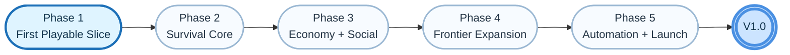
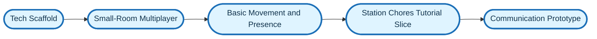
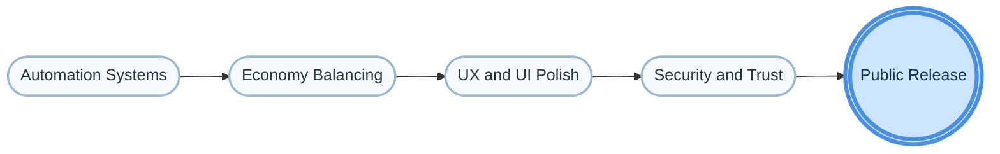

# High-Level Roadmap: StarStationFurlong

This roadmap outlines the milestones from initial prototyping to a fully playable decentralized hangout game. It bridges our high-level game design (GDD) with the technical architecture (TDD).

## Review Summary

After comparing the roadmap against the GDD, the overall direction makes sense, but the original roadmap underrepresented three important design pillars:

* The early-game fantasy of waking up as a clone-born station citizen and learning the world through hands-on station work.
* The survival simulation loop of power, repairs, food, fuel, medicine, and fragile infrastructure.
* The colony-scale arc of outposts, supply lines, specialization, and civilization recovery.

The roadmap below adds those missing beats so the game grows from a strong first playable slice instead of jumping too quickly to late-stage features.

## GDD Integration Checklist

This roadmap now explicitly incorporates the major idea groups from the GDD:

* `Storyline`: clone-born origin, frontier-station onboarding, human survival stakes, identity themes, and colony recovery.
* `Gameplay`: localized chat, SpacePhone, ATMs, Spacefuel friction, robotic captains, multi-scale maps, fog-of-war, and degraded map access.
* `Craft System`: core materials, multi-stage processing, quality tiers, habitat furniture, ship parts, consumables, and trade goods.
* `Tech Tree`: practical skill careers, use-based progression, specialization slots, cooperative roles, and long-term paths like shipbuilding or station leadership.

## Design Pillars

* `Social Hangout`: proximity chat, SpacePhone, room presence, player-run spaces.
* `Station Survival`: maintenance, scarcity, fuel, crafting, medical and food support.
* `Player Careers`: engineering, trade, crafting, exploration, station jobs.
* `Colony Expansion`: maps, outposts, logistics, automation, frontier growth.

## 🗺️ Visual Roadmap Tracker

Priority flow: `learn the station -> keep it alive -> trade and specialize -> expand the frontier -> automate at scale`

## Phase 1: Foundation & Prototyping (Current)
**Goal:** Prove the technical viability of a decentralized, browser-based spatial environment.

* [ ] **Tech Scaffold:** Initialize the prototype stack in `prototypes/` with a web client, rendering layer, and simple world state.
* [ ] **Small-Room Multiplayer:** Prototype WebRTC or equivalent P2P connectivity for 2-4 players in a single room.
* [ ] **Basic Movement and Presence:** Implement avatar rendering, movement, and clear nearby player presence.
* [ ] **Clone-Born Onboarding:** Start the player in a nursery or starter habitat and establish the clone-citizen fantasy immediately.
* [ ] **Station Chores Tutorial Slice:** Add one short loop where a new player completes a simple delivery, repair, food-production, or maintenance task.
* [ ] **Communication Prototype:** Add proximity-based text chat before voice and SpacePhone features.
* [ ] **Narrative Tone Test:** Validate the battered, salvage-built frontier mood through one room, one job loop, and one clear human-survival hook.

## Phase 2: Core Loop & Spatial Expansion (Pre-Alpha)
**Goal:** Establish the station survival loop and the player's first career progression.

* [ ] **Inventory & Elements:** Implement the foundational Element System from the TDD as the basis for items, materials, and resources.
* [ ] **Core Material Economy:** Establish metal, fuel, plastic, fabric, food, and rare salvaged components as the main crafting inputs.
* [ ] **Crafting & Processing:** Support refining, workbench use, machine-shop processing, and multi-stage item assembly.
* [ ] **Crafting Categories V1:** Include basic tools, habitat furniture, station parts, consumables, and a first set of trade goods.
* [ ] **Quality and Scarcity:** Let material quality, scarcity, time, energy, and station capacity affect outputs and durability.
* [ ] **Skill Progression:** Add early specialization tracks in survival, engineering, crafting, trade, and exploration.
* [ ] **Use-Based Advancement:** Reward real actions such as fixing, hauling, crafting, and system operation rather than abstract grinding.
* [ ] **Station Survival Systems:** Model power, food, fuel, medicine, shelter, and repairs at a simple but playable level.
* [ ] **Local Maps & Fog of War:** Implement station or room-scale map access, visibility limits, and traversal between connected spaces.
* [ ] **Physical Map Interaction:** Test map use through terminals, consoles, desks, or wearable displays rather than menu-only interaction.

## Phase 3: Trade, Economy & Advanced Communication (Alpha)
**Goal:** Turn the station into a social economy with meaningful player roles and trade friction.

* [ ] **In-Game Economy:** Introduce trade systems, pricing pressure, Spacefuel constraints, player-run or deployable ATMs, and visible market demand.
* [ ] **Player Jobs and Roles:** Add repeatable station work, hauling, repair, medical, trade, cargo handling, and inventory-management responsibilities.
* [ ] **Advanced Communication:** Implement voice chat and the SpacePhone concept with pixelated live-avatar identity.
* [ ] **Station Identity:** Add clearer ownership, room personalization, furniture, storage, and visible social status through spaces and equipment.
* [ ] **Crafting Economy Integration:** Allow crafted goods to be sold, traded, leased, or used to upgrade rooms, stations, and outposts.
* [ ] **Specialization Slots:** Introduce a limited career-shaping specialization model so players cannot master everything at once.
* [ ] **Crypto / Decentralized Tie-Ins:** Integrate experimental Chia or decentralized persistence only after the core economy feels good without it.

## Phase 4: Automation & Grand Strategy (Beta)
**Goal:** Expand beyond a single station into a fragile network of outposts, routes, and shared infrastructure.

* [ ] **Macro Maps:** Implement station, planet, system, galaxy, and wider-universe map layers with different interaction styles.
* [ ] **Map Identity by Scale:** Use room or station layouts locally, OpenTTD-like strategic views for planets and systems, and starfield or point-cloud views for the wider frontier.
* [ ] **Outposts and Supply Lines:** Let players establish or support remote settlements that depend on logistics, food, medicine, fuel, and maintenance.
* [ ] **Contract System:** Allow users to hire real players to pilot ships, move cargo, or maintain remote locations.
* [ ] **Advanced Map Mechanics:** Support damageable map systems, sensor authority, tech-gated access, hologram projectors, and physical printed fallback maps.
* [ ] **Exploration Career Path:** Expand navigation, scouting, and outpost deployment into a distinct late-midgame specialization.
* [ ] **Cooperative Colony Growth:** Let advanced roles increase outpost efficiency, reduce waste, and improve colony output through coordinated play.
* [ ] **Performance & P2P Scaling:** Stabilize networking and discovery for larger sectors of the frontier.

## Phase 5: Polish, Balance & V1.0 Launch
**Goal:** Make the expanding colony stable, readable, and worth returning to.

* [ ] **Automation Systems:** Add robotic starships and AI captains to scale trade and mining without pure grind and free players for higher-level roles.
* [ ] **Long-Term Career Destinations:** Support station management, trade-route ownership, shipbuilding, and frontier leadership as credible endgame identities.
* [ ] **Economy Balancing:** Tune scarcity, route profitability, fuel costs, item quality, crafting times, and the value of specialized labor.
* [ ] **UX/UI Polish:** Refine spatial UI, terminals, maps, console interactions, onboarding clarity, and degraded-state readability when systems fail.
* [ ] **Security and Trust:** Harden decentralized state reconciliation and reduce obvious cheating vectors.
* [ ] **Thematic Cohesion:** Make sure hope, cloning ethics, scarcity, and the tension between personal freedom and species survival are visible in the shipped experience.
* [ ] **Public Release:** Ship a version that delivers social survival, frontier specialization, and civilization recovery on a growing colony network.
