# High-Level Roadmap: StarStationFurlong

This roadmap outlines the milestones from initial prototyping to a fully playable decentralized hangout game. It bridges our high-level game design (GDD) with the technical architecture (TDD).

## Review Summary

After comparing the roadmap against the GDD, the overall direction makes sense, but the original roadmap underrepresented three important design pillars:

* The early-game fantasy of waking up as a clone-born station citizen and learning the world through hands-on station work.
* The survival simulation loop of power, repairs, food, fuel, medicine, and fragile infrastructure.
* The colony-scale arc of outposts, supply lines, specialization, and civilization recovery.

The roadmap below adds those missing beats so the game grows from a strong first playable slice instead of jumping too quickly to late-stage features.

## Design Pillars

* `Social Hangout`: proximity chat, SpacePhone, room presence, player-run spaces.
* `Station Survival`: maintenance, scarcity, fuel, crafting, medical and food support.
* `Player Careers`: engineering, trade, crafting, exploration, station jobs.
* `Colony Expansion`: maps, outposts, logistics, automation, frontier growth.

## 🗺️ Visual Roadmap Tracker

```mermaid
flowchart LR
    classDef current fill:#dff4ff,stroke:#1d70b8,stroke-width:3px,color:#12344d,rx:10px,ry:10px
    classDef future fill:#f7fbff,stroke:#9bb8d3,stroke-width:2px,color:#234,rx:10px,ry:10px
    classDef milestone fill:#cce4ff,stroke:#4a90e2,stroke-width:4px,color:#12344d,rx:18px,ry:18px
    classDef note fill:#f4f7fb,stroke:#c7d4e2,stroke-width:1px,color:#4a5568,rx:8px,ry:8px

    Start([Clone-born arrival<br/>first room, first tasks]):::current --> P1
    P1 --> P2 --> P3 --> P4 --> P5 --> Launch

    subgraph P1[Phase 1 · First Playable Slice]
        direction TB
        P1A[Movement + room feel]:::current
        P1B[Small-room multiplayer<br/>text chat + P2P sync]:::current
        P1C[Station chores tutorial<br/>repair, delivery, upkeep]:::current
    end

    subgraph P2[Phase 2 · Survival Core]
        direction TB
        P2A[Inventory + element system]:::future
        P2B[Crafting + skill progression]:::future
        P2C[Power, food, fuel,<br/>medicine, repairs]:::future
        P2D[Local map + fog of war]:::future
    end

    subgraph P3[Phase 3 · Economy And Social Depth]
        direction TB
        P3A[Trade, markets, ATMs]:::future
        P3B[SpacePhone + voice]:::future
        P3C[Player roles and jobs]:::future
        P3D[Station ownership signals]:::future
    end

    subgraph P4[Phase 4 · Frontier Expansion]
        direction TB
        P4A[Outposts + supply lines]:::future
        P4B[System and galaxy maps]:::future
        P4C[Map hardware, failures,<br/>printed fallback]:::future
        P4D[Contracts + shared logistics]:::future
    end

    subgraph P5[Phase 5 · Automation And Launch]
        direction TB
        P5A[AI captains + ship automation]:::future
        P5B[P2P scale + anti-cheat]:::future
        P5C[Balance, UX polish,<br/>public onboarding]:::future
    end

    Launch(((V1.0 Colony Network))):::milestone
    Note[Priority order:<br/>learn the station -> keep it alive -> trade and specialize -> expand the frontier -> automate at scale]:::note
    Start -. fantasy .-> Note
```

## Phase 1: Foundation & Prototyping (Current)
**Goal:** Prove the technical viability of a decentralized, browser-based spatial environment.
* [ ] **Tech Scaffold:** Initialize the prototype stack in `prototypes/` with a web client, rendering layer, and simple world state.
* [ ] **Small-Room Multiplayer:** Prototype WebRTC or equivalent P2P connectivity for 2-4 players in a single room.
* [ ] **Basic Movement and Presence:** Implement avatar rendering, movement, and clear nearby player presence.
* [ ] **Station Chores Tutorial Slice:** Add one short loop where a new player completes a simple delivery, repair, or maintenance task.
* [ ] **Communication Prototype:** Add proximity-based text chat before voice and SpacePhone features.

## Phase 2: Core Loop & Spatial Expansion (Pre-Alpha)
**Goal:** Establish the station survival loop and the player's first career progression.
* [ ] **Inventory & Elements:** Implement the foundational Element System from the TDD as the basis for items, materials, and resources.
* [ ] **Crafting & Processing:** Support basic refining, workbench crafting, and multi-stage item assembly.
* [ ] **Skill Progression:** Add early specialization tracks such as survival, engineering, crafting, trade, or exploration.
* [ ] **Station Survival Systems:** Model power, food, fuel, repairs, and medical supply pressure at a simple but playable level.
* [ ] **Local Maps & Fog of War:** Implement station or room-scale map access, visibility limits, and traversal between connected spaces.

## Phase 3: Trade, Economy & Advanced Communication (Alpha)
**Goal:** Turn the station into a social economy with meaningful player roles and trade friction.
* [ ] **In-Game Economy:** Introduce trade systems, pricing pressure, Spacefuel constraints, and deployable ATMs.
* [ ] **Player Jobs and Roles:** Add repeatable station work, hauling, repair, medical, trade, or admin-like responsibilities.
* [ ] **Advanced Communication:** Implement voice chat and the SpacePhone concept with pixelated live-avatar identity.
* [ ] **Station Identity:** Add clearer ownership, room personalization, and visible social status through spaces and equipment.
* [ ] **Crypto / Decentralized Tie-Ins:** Integrate experimental Chia or decentralized persistence only after the core economy feels good without it.

## Phase 4: Automation & Grand Strategy (Beta)
**Goal:** Expand beyond a single station into a fragile network of outposts, routes, and shared infrastructure.
* [ ] **Macro Maps:** Implement planet, system, and galaxy map layers with different interaction styles.
* [ ] **Outposts and Supply Lines:** Let players establish or support remote settlements that depend on logistics.
* [ ] **Contract System:** Allow users to hire real players to pilot ships, move cargo, or maintain remote locations.
* [ ] **Advanced Map Mechanics:** Support damageable map systems, sensor authority, and physical printed fallback maps.
* [ ] **Performance & P2P Scaling:** Stabilize networking and discovery for larger sectors of the frontier.

## Phase 5: Polish, Balance & V1.0 Launch
**Goal:** Make the expanding colony stable, readable, and worth returning to.
* [ ] **Automation Systems:** Add robotic starships and AI captains to scale trade and mining without pure grind.
* [ ] **Economy Balancing:** Tune scarcity, route profitability, fuel costs, item quality, and crafting times.
* [ ] **UX/UI Polish:** Refine spatial UI, terminals, maps, console interactions, and onboarding clarity.
* [ ] **Security and Trust:** Harden decentralized state reconciliation and reduce obvious cheating vectors.
* [ ] **Public Release:** Ship a version that delivers the fantasy of social survival on a growing frontier.
