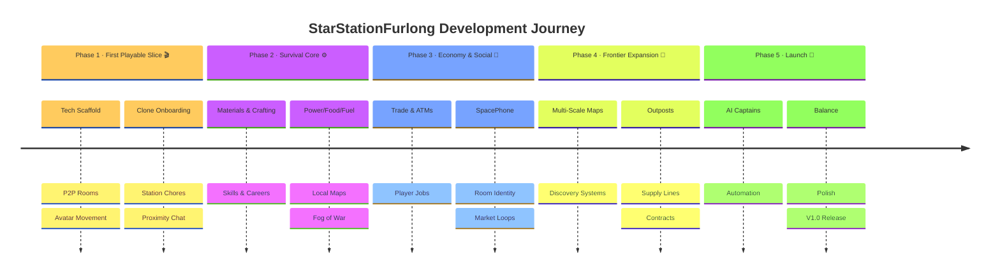
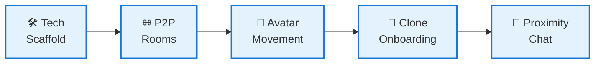
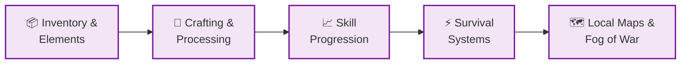
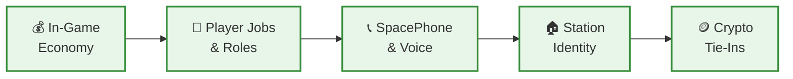
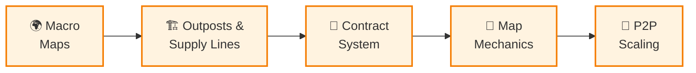
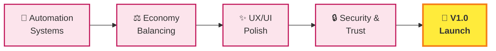

# 🚀 StarStationFurlong — Development Roadmap

> **From clone-born survival to colony network mastery**  
> A decentralized frontier hangout where you wake up as a clone citizen, learn to keep a struggling station alive, specialize in careers, expand fragile outposts, and automate at scale.

## 🎯 Core Design Pillars

| Pillar | What it means |
|--------|---------------|
| **🏠 Social Hangout** | Proximity chat, SpacePhone, room presence, player-run spaces |
| **⚙️ Station Survival** | Power, repairs, food, fuel, medicine — always one failure away from collapse |
| **👷 Player Careers** | Engineering, trade, crafting, exploration — practical skill paths, not stat grinds |
| **🌌 Colony Expansion** | Outposts, supply lines, multi-scale maps, automation, frontier growth |

## 📋 GDD Coverage Status

✅ **All major ideas from GDD are integrated into this roadmap:**
- **Storyline**: Clone identity, frontier onboarding, human survival stakes, ethics of cloning
- **Gameplay**: Localized chat, SpacePhone, ATMs, Spacefuel friction, robotic captains, multi-scale maps, fog-of-war, degraded map access
- **Craft System**: Core materials (metal/fuel/plastic/fabric/food), multi-stage processing, quality tiers, furniture, ship parts, consumables, trade goods
- **Tech System**: Use-based progression, career specializations, limited specialization slots, co-op roles, endgame paths

The remaining work is **execution priority**, not idea discovery.

## 📅 Roadmap At A Glance

| 🏷️ Phase | 🎮 Player Experience | 🛠️ Team Deliverables | 📊 Status |
|----------|---------------------|----------------------|----------|
| **Phase 1** *First Playable Slice* | "I was born into a struggling station. I can move, chat, and help keep it alive." | Prototype client, P2P multiplayer, onboarding, first chores | 🔵 **Current** |
| **Phase 2** *Survival Core* | "I can survive, craft, learn a job, and keep the station functioning." | Materials, recipes, tools, survival pressure, local maps | ⚪ Planned |
| **Phase 3** *Economy & Social* | "I can trade, specialize, socialize, and build status through work and spaces." | Economy, ATMs, roles, SpacePhone, room identity, market loops | ⚪ Planned |
| **Phase 4** *Frontier Expansion* | "I can explore farther, run supply lines, and grow fragile outposts." | Multi-scale maps, contracts, logistics, expansion systems | ⚪ Planned |
| **Phase 5** *Automation & Launch* | "I can automate at scale and shape the colony's long-term future." | AI captains, balance, anti-cheat, endgame careers, polish | ⚪ Planned |

**Priority flow:** `learn the station → keep it alive → trade & specialize → expand frontier → automate at scale`

## 🗺️ Visual Development Timeline

---

## 🎬 Phase 1: Foundation & Prototyping *(Current)*

**Goal:** Prove the technical viability and nail the clone-born survival fantasy in a single room.

* [ ] **Tech Scaffold:** Initialize the prototype stack in `prototypes/` with a web client, rendering layer, and simple world state.
* [ ] **Small-Room Multiplayer:** Prototype WebRTC or equivalent P2P connectivity for 2-4 players in a single room.
* [ ] **Basic Movement and Presence:** Implement avatar rendering, movement, and clear nearby player presence.
* [ ] **Clone-Born Onboarding:** Start the player in a nursery or starter habitat and establish the clone-citizen fantasy immediately.
* [ ] **Station Chores Tutorial Slice:** Add one short loop where a new player completes a simple delivery, repair, food-production, or maintenance task.
* [ ] **Communication Prototype:** Add proximity-based text chat before voice and SpacePhone features.
* [ ] **Narrative Tone Test:** Validate the battered, salvage-built frontier mood through one room, one job loop, and one clear human-survival hook.
* [ ] **Identity Friction Setup:** Seed how other settlers react with curiosity, suspicion, or hope so the clone identity matters from the start.

---

## ⚙️ Phase 2: Core Loop & Spatial Expansion *(Pre-Alpha)*

**Goal:** Establish the station survival loop and let players learn their first career.

* [ ] **Inventory & Elements:** Implement the foundational Element System from the TDD as the basis for items, materials, and resources.
* [ ] **Core Material Economy:** Establish metal, fuel, plastic, fabric, food, and rare salvaged components as the main crafting inputs.
* [ ] **Crafting & Processing:** Support refining, workbench use, machine-shop processing, and multi-stage item assembly.
* [ ] **Crafting Categories V1:** Include basic tools, habitat furniture, station parts, consumables, and a first set of trade goods.
* [ ] **Recipe Clarity:** Show required inputs, tools, and station facilities clearly in recipe and work-order flows.
* [ ] **Quality and Scarcity:** Let material quality, scarcity, time, energy, and station capacity affect outputs and durability.
* [ ] **Skill Progression:** Add early specialization tracks in survival, engineering, crafting, trade, and exploration.
* [ ] **Use-Based Advancement:** Reward real actions such as fixing, hauling, crafting, and system operation rather than abstract grinding.
* [ ] **Station Survival Systems:** Model power, food, fuel, medicine, shelter, and repairs at a simple but playable level.
* [ ] **Housing Tiers — Starter Dormitory:** Assign new clones to shared bunk-bed rooms at Furlong Station as the default free housing tier.
* [ ] **Housing Tiers — Capsule Rooms:** Let players earn a private capsule room by completing basic resource-gathering tasks and accumulating enough points.
* [ ] **Local Maps & Fog of War:** Implement station or room-scale map access, visibility limits, and traversal between connected spaces.
* [ ] **Physical Map Interaction:** Test map use through terminals, consoles, desks, or wearable displays rather than menu-only interaction.
* [ ] **Advanced Tools Unlocks:** Let better tools and higher ranks improve yield, reduce waste, and unlock stronger recipes.

---

## 💎 Phase 3: Trade, Economy & Advanced Communication *(Alpha)*

**Goal:** Turn the station into a social economy with meaningful player roles and trade friction.

* [ ] **In-Game Economy:** Introduce trade systems, pricing pressure, Spacefuel constraints, player-run or deployable ATMs, and visible market demand.
* [ ] **Furlong Station Rent Model:** Implement the capsule-rent system — first month free, then high recurring rent — to create natural pressure for players to graduate to private stations nearby.
* [ ] **Starter Station Development Cap:** Enforce Furlong Station's intentional development ceiling so players cannot fully settle there and are pushed toward the wider colony network.
* [ ] **Player Jobs and Roles:** Add repeatable station work, hauling, repair, medical, trade, cargo handling, and inventory-management responsibilities.
* [ ] **Advanced Communication:** Implement voice chat and the SpacePhone concept with pixelated live-avatar identity.
* [ ] **Station Identity:** Add clearer ownership, room personalization, furniture, storage, and visible social status through spaces and equipment.
* [ ] **Crafting Economy Integration:** Allow crafted goods to be sold, traded, leased, or used to upgrade rooms, stations, and outposts.
* [ ] **Specialization Slots:** Introduce a limited career-shaping specialization model so players cannot master everything at once.
* [ ] **Advanced Job Access:** Tie better stations, stronger tools, and higher-value work to progression so careers feel practical.
* [ ] **Crypto / Decentralized Tie-Ins:** Integrate experimental Chia or decentralized persistence only after the core economy feels good without it.

---

## 🌌 Phase 4: Automation & Grand Strategy *(Beta)*

**Goal:** Expand beyond a single station into a fragile network of outposts, routes, and shared infrastructure.

* [ ] **Macro Maps:** Implement station, planet, system, galaxy, and wider-universe map layers with different interaction styles.
* [ ] **Map Identity by Scale:** Use room or station layouts locally, OpenTTD-like strategic views for planets and systems, and starfield or point-cloud views for the wider frontier.
* [ ] **Discovery Systems:** Let telescopes, sensors, and travel reveal new regions so the universe grows as players push farther out.
* [ ] **Outposts and Supply Lines:** Let players establish or support remote settlements that depend on logistics, food, medicine, fuel, and maintenance.
* [ ] **Contract System:** Allow users to hire real players to pilot ships, move cargo, or maintain remote locations.
* [ ] **Advanced Map Mechanics:** Support damageable map systems, sensor authority, tech-gated access, hologram projectors, and physical printed fallback maps.
* [ ] **Exploration Career Path:** Expand navigation, scouting, and outpost deployment into a distinct late-midgame specialization.
* [ ] **Cooperative Colony Growth:** Let advanced roles increase outpost efficiency, reduce waste, and improve colony output through coordinated play.
* [ ] **Scarcity and Danger:** Add frontier risk so outposts need defense, upkeep, and coordinated response rather than acting as free expansion.
* [ ] **Performance & P2P Scaling:** Stabilize networking and discovery for larger sectors of the frontier.

---

## 🚀 Phase 5: Polish, Balance & V1.0 Launch

**Goal:** Make the expanding colony stable, readable, and worth returning to — then ship it.

* [ ] **Automation Systems:** Add robotic starships and AI captains to scale trade and mining without pure grind and free players for higher-level roles.
* [ ] **Long-Term Career Destinations:** Support station management, trade-route ownership, shipbuilding, and frontier leadership as credible endgame identities.
* [ ] **Economy Balancing:** Tune scarcity, route profitability, fuel costs, item quality, crafting times, and the value of specialized labor.
* [ ] **UX/UI Polish:** Refine spatial UI, terminals, maps, console interactions, onboarding clarity, and degraded-state readability when systems fail.
* [ ] **Security and Trust:** Harden decentralized state reconciliation and reduce obvious cheating vectors.
* [ ] **Thematic Cohesion:** Make sure hope, cloning ethics, scarcity, and the tension between personal freedom and species survival are visible in the shipped experience.
* [ ] **Public Release:** Ship a version that delivers social survival, frontier specialization, and civilization recovery on a growing colony network.
