# High-Level Roadmap: StarStationFurlong

This roadmap outlines the milestones from initial prototyping to a fully playable decentralized hangout game. It bridges our high-level game design (GDD) with the technical architecture (TDD).

## 🗺️ Visual Roadmap Tracker

```mermaid
flowchart TB
    classDef phase1 fill:#1e3745,stroke:#00b894,stroke-width:2px,color:#fff
    classDef phase2 fill:#2d3436,stroke:#74b9ff,stroke-width:2px,color:#fff
    classDef item fill:#0984e3,stroke:#fff,stroke-width:0px,color:#fff,rx:5px,ry:5px
    classDef current fill:#e84393,stroke:#fff,stroke-width:2px,color:#fff,rx:5px,ry:5px
    classDef milestone fill:#fdcb6e,stroke:#fff,stroke-width:3px,color:#2d3436,rx:15px,ry:15px

    subgraph P1 [Phase 1: Foundation & Prototyping]
        direction TB
        A1[Tech Scaffold]:::current --> A2[P2P Networking]:::item
        A2 --> A3[Basic Movement]:::item
        A3 --> A4[Chat Prototype]:::item
    end

    subgraph P2 [Phase 2: Core Loop & Spatial Expansion]
        direction TB
        B1[Map System V1]:::item --> B2[Elements System]:::item
        B2 --> B3[Tech Trees]:::item
        B3 --> B4[Fog of War]:::item
    end

    subgraph P3 [Phase 3: Economy & Social]
        direction TB
        C1[SpacePhone & Voice]:::item --> C2[Economy & Spacefuel]:::item
        C2 --> C3[Crypto/Chia Integrations]:::item
    end
    
    subgraph P4 [Phase 4: Grand Strategy]
        direction TB
        D1[AI Starships]:::item --> D2[Contract System]:::item
        D2 --> D3[Damage & Map Disruptions]:::item
    end

    subgraph P5 [Phase 5: Launch]
        direction TB
        E1[Balance Economy]:::item --> E2[UI/UX Polish]:::item
        E2 --> E3((V1.0 Release!)):::milestone
    end

    P1 == Next ==> P2 == Next ==> P3 == Next ==> P4 == Next ==> P5
    
    class P1 phase1
    class P2,P3,P4,P5 phase2
```

## Phase 1: Foundation & Prototyping (Current)
**Goal:** Prove the technical viability of a decentralized, browser-based spatial environment.
* [ ] **Tech Scaffold:** Initialize the `src/` directory with a 3D renderer (e.g., Three.js) or 2D canvas.
* [ ] **P2P Networking:** Prototype basic WebRTC/Simple-peer connectivity for 2-4 players in a single "Room".
* [ ] **Basic Movement:** Implement avatar rendering and movement in a local space.
* [ ] **Communication Prototype:** Add basic proximity-based text chat.

## Phase 2: Core Loop & Spatial Expansion (Pre-Alpha)
**Goal:** Implement the primary player interactions, inventory, and map systems.
* [ ] **Multi-scale Map System (V1):** Implement the local station/room scale map and transition logic between connected rooms.
* [ ] **Inventory & Elements:** Implement the foundational Element System (from `docs/TDD/02-Systems/ElementSystem.md`).
* [ ] **Crafting & Tech Trees (V1):** Basic UI to view tech requirements and combine elemental items.
* [ ] **Fog of War:** Basic visibility hiding for unexplored rooms/areas.

## Phase 3: Trade, Economy & Advanced Communication (Alpha)
**Goal:** Bring the universe to life with economy, resources, and deeper social bridging.
* [ ] **Advanced Communication:** Implement the "SpacePhone" (webcam -> pixelated avatar) and voice chat integration.
* [ ] **In-Game Economy:** Introduce Trade systems, "Spacefuel" for movement constraints, and deployable ATMs.
* [ ] **Crypto/Decentralized Tie-ins:** Integrate experimental Chia coin interactions or decentralized data persistence (e.g., WebTorrent/Tribler).
* [ ] **Macro Maps:** Implement solar system/galaxy scale maps (OpenTTD strategic view style).

## Phase 4: Automation & Grand Strategy (Beta)
**Goal:** Allow players to scale their presence across the galaxy without grinding.
* [ ] **Automation Systems:** Construct/buy robotic starships and AI captains to run trade routes.
* [ ] **Contract System:** Allow users to hire other real users to pilot ships or run stations.
* [ ] **Advanced Map Mechanics:** Damageable map systems, tech-tree dependent sensor arrays, and physical "Printed Maps" fallback.
* [ ] **Performance & P2P Scaling:** Stabilize peer discovery networks for larger galaxies.

## Phase 5: Polish, Balance & V1.0 Launch
**Goal:** Balance the tech tree, optimize network traffic, and prepare for public access.
* [ ] **Economy Balancing:** Adjust resource spawn rates, fuel costs, and crafting times.
* [ ] **UX/UI Polish:** Refine spatial UI, console interactions, and hologram projectors.
* [ ] **Security:** Ensure decentralized state reconciliation (preventing easy cheating in a P2P environment).
* [ ] **Public Release!**
