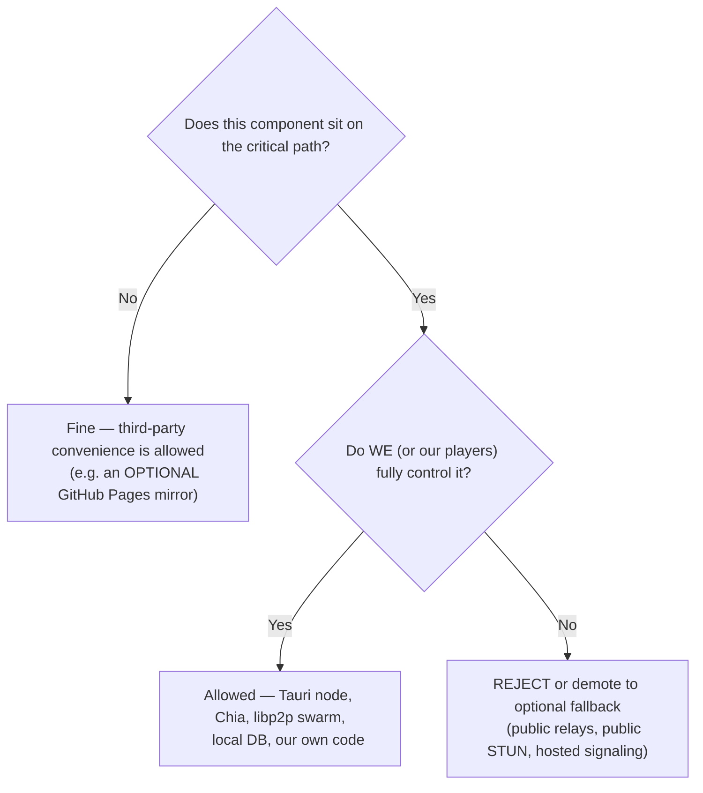
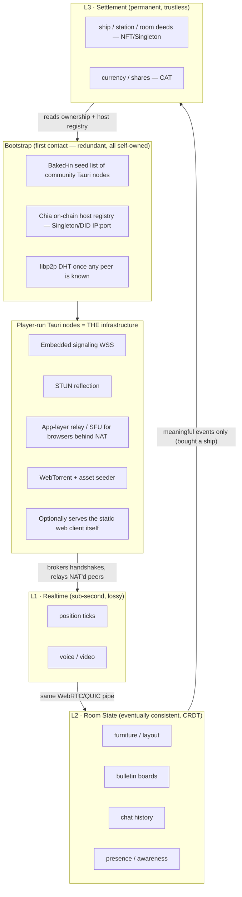

# STUDY — Architecture Distilled v002
*A focused re-analysis of [docs/TDD/01-Architecture.md](../../docs/TDD/01-Architecture.md): keeping the concepts that earn their place, cutting the ones that don't, and proposing a buildable **and sovereign** blueprint for StarStationFurlong.*

> **Reading this doc:** v001 was an exhaustive survey of *everything possible*. This v002 is an opinionated *decision document*. It boils the survey down to a layered architecture, evaluates every original idea (Keep / Modify / Drop), proposes concrete improvements with code, and ends with the forks still worth prototyping plus a single final recommendation.
>
> **The non-negotiable premise (corrected from an earlier draft):** v001 is fundamentally a **sovereignty** document. Its thesis is *"the only way to take StarStationFurlong down is to take down the Internet and the Chia network itself."* Therefore **nothing on the critical path may depend on infrastructure we do not control** — no public signaling servers, no public STUN/TURN, no public Nostr relays, no public BitTorrent trackers, no mandatory GitHub/Cloudflare hosting. Anything "free and already out there" is, at best, an *optional convenience mirror* — never a dependency. Where coordination infrastructure is unavoidable (and for browsers, some always is), **we run it ourselves inside the Tauri client, and Chia is the bootstrap registry.**

---

## 1. TL;DR — The Verdict

StarStationFurlong is, first and foremost, a **social hangout** (Habbo × Workadventure) with **optional** survival, trade, and economy depth layered on top — and it must be **sovereign / unstoppable**. Those two priorities — *socializing must feel instant and great; the game must not be killable by removing any third party* — drive every decision below.

The single most important reframing in this study: **stop treating "decentralization" as one problem, and split the system into four layers by data lifetime and trust requirement.** Then give each layer the cheapest tool that satisfies it **without importing a third-party dependency onto the critical path.**

| Layer | Data | Lifetime | Trust need | Tool (v002 pick) | v001 equivalent |
|-------|------|----------|------------|------------------|-----------------|
| **L0 Transport** | byte pipes | per-session | none | WebRTC (web) + QUIC/`libp2p` (native) | WebRTC / rust-libp2p |
| **L1 Realtime** | position, voice, video | sub-second, lossy OK | none | Unreliable WebRTC datachannels + media | WebRTC mesh |
| **L2 Room state** | layout, furniture, bulletin boards, chat, presence | seconds, eventually-consistent | low (room-host soft authority) | **CRDT (Yjs/Automerge)** over our own transport | Cabal Club |
| **L3 Settlement** | ship/station/room deeds, currency, shares | permanent, must be trustless | high | **Chia** NFT / Singleton / CAT | Chia blockchain |
| *Cross-cutting* | peer discovery, signaling, NAT relay, presence beacons | transient | none — **but must be self-owned** | **Tauri nodes ARE the infrastructure** (embedded signaling + STUN + app-relay) **+ Chia on-chain host registry + libp2p DHT/mDNS** | on-chain memos / Chia peer-crawl |

The cross-cutting row is the heart of this revision. **We do not outsource discovery.** Player-run Tauri nodes provide signaling, NAT reflection, and relay for the browser clients; the native swarm finds itself via `libp2p` with no servers at all; and Chia is the censorship-proof registry that lets a brand-new client find its first live node. Everything below justifies this table.

---

## 2. Method: Let Gameplay *and* the Sovereignty Test Pick the Architecture

Two filters decide every technology choice. First, the gameplay requirements pulled from the [GDD](../../docs/GDD/) and [ROADMAP](../../ROADMAP.md):

| # | Gameplay requirement | Architectural pressure |
|---|----------------------|------------------------|
| R1 | Walk near someone → instant proximity text/voice/video | Low-latency P2P + self-owned signaling |
| R2 | Rooms feel alive: see others move in real time | High-rate, lossy, ephemeral position sync |
| R3 | Bulletin boards: walk up, read, post; **local to the board** | Small eventually-consistent shared doc, *no* central server |
| R4 | Decorate/own rooms; show off "rares" | Shared room layout state + trustless ownership |
| R5 | Trade ships/stations/shares with strangers safely | Trustless settlement, atomic swaps |
| R6 | Optional AFK (sleep, autopilot, slow-craft) | A client that survives backgrounding |
| R7 | Zero-friction onboarding ("just click and you're in Furlong") | A no-install path |
| R8 | UGC assets (skins, room models) shared between players | Asset distribution + safety sanitization |
| R9 | Resist cheating (speedhacks, wall-clip, dupes) | Authority model + validation |
| R10 | **Survive de-platforming (the sovereign ethos)** | **No hard dependency on any third party** |

Second — and given equal weight — the **Sovereignty Test** (§3). R10 is not one requirement among ten; it is a veto. A design that nails R1–R9 but fails the Sovereignty Test is rejected, because it stops being the game v001 describes.

Note the real tension this creates: **R7 (no install)** fights **R10 (sovereignty)**, because a browser *cannot* be sovereign on its own — it can't open listening sockets, can't seed, can't AFK, and always needs *someone* to broker its first connection. v002 resolves this honestly: the **Tauri client is the sovereign core that carries the network**, and the **web client is a convenience skin that rides on top of player-run Tauri nodes** — never on a third party.

---

## 3. The Sovereignty Test (the litmus principle)

Apply this to every component, repeatedly:

> **"If every third party we don't control vanished overnight — GitHub, Cloudflare, public STUN, public Nostr relays, public torrent trackers, every commercial cloud — would StarStationFurlong still boot, find peers, and play?"**



The answer for the v002 architecture is **yes, it still runs**, because the only things on the critical path are (a) player-run Tauri nodes, (b) the Chia network (a global consensus owned by no one, secured by farmers), and (c) the players' own devices. That is exactly the bar v001 set, and it's the bar an earlier draft of this study failed by reaching for public Nostr relays.

**Worked examples of the test in action:**

| Component | On critical path? | We control it? | Verdict |
|-----------|-------------------|----------------|---------|
| Player-run Tauri node (signaling/STUN/relay/seed) | Yes | Yes (us + players) | ✅ Allowed |
| Chia L1 (ownership + host registry) | Yes | No single party — but unkillable consensus | ✅ Allowed (sovereign by design) |
| `libp2p` DHT / mDNS (native discovery) | Yes | Yes (runs in our binary) | ✅ Allowed |
| Public Nostr relay | Yes (as I wrongly proposed) | **No** | ❌ Rejected |
| Public STUN (e.g. Google) | Yes | **No** | ❌ Rejected → run STUN in Tauri node |
| Public WebTorrent tracker | Yes | **No** | ❌ Rejected → Chia infohash registry + our seeders |
| GitHub Pages hosting the SPA | No (Tauri nodes can serve it too) | No | ⚠️ Optional mirror only |
| Goby/Pawket browser wallet | Yes (for web wallet ops) | No, but user-held keys + swappable | ⚠️ Acceptable; native wallet is the sovereign path |

---

## 4. The Core Model: Four Layers + Self-Hosted Discovery



**Why this is the right spine:**

- **It passes the Sovereignty Test.** Every box is a player-run binary, our own code, or the Chia consensus. No third party can switch it off.
- **Each layer fails independently and degrades gracefully.** If the seed list is stale, Chia still finds a host. If a host drops, the swarm re-routes via `libp2p`. If a peer disconnects, the CRDT reconciles on rejoin. If Chia is congested, gameplay continues — only *settlement* waits.
- **The blockchain is off the hot path but back on the bootstrap path.** v001 was right to use Chia for the host registry (sovereign discovery), and right that it must *not* arbitrate movement. An 18-second block time has no business near "I walked three tiles left," but it's perfect for "here is a station host that was online as of recently."
- **The expensive, bespoke pieces are optional and late.** L0/L1/L2 ship a fun social game with the Tauri node + a tiny embedded signaler. The Chia registry, Chialisp escrow, and native super-relays layer on without rewrites.

---

## 5. Delivery Model: "Web-First, Tauri-Best" — and the Tauri node IS the server

v001's instinct is correct and central: a **pure web client for casual play** and a **Tauri (Rust) client for power users** — but the sharper framing is that **the Tauri client is not just a "better player," it is the network's infrastructure.** Every native node optionally contributes signaling, STUN reflection, NAT relay, asset seeding, and can even serve the web SPA itself. The browser client is sovereign-by-proxy: it depends only on *some* player's Tauri node, never on us or a third party.

Drop Electron (bloated) and the heavy native engine / Option C (wrong art style, high friction, painful to bridge decentralized libs into).

The structural improvement v002 adds is a **discipline**: organize the codebase with **ports & adapters (hexagonal architecture)** so the *exact same* game logic runs in both shells, and the shell only swaps the implementation of a few interfaces.

```ts
// core/ports.ts — the game core depends ONLY on these interfaces,
// never on WebRTC, libp2p, SQLite, or any wallet directly.

export interface NetworkProvider {
  joinRoom(roomId: string): Promise<RoomChannel>;
  leaveRoom(roomId: string): Promise<void>;
}

export interface RoomChannel {
  /** Unreliable + unordered: movement, voice. Dropped packets are fine. */
  sendRealtime(bytes: Uint8Array): void;
  onRealtime(cb: (from: string, bytes: Uint8Array) => void): void;
  /** Reliable + ordered: interactions, CRDT sync, chat. */
  sendReliable(bytes: Uint8Array): void;
  onReliable(cb: (from: string, bytes: Uint8Array) => void): void;
  readonly peers: ReadonlySet<string>;
}

export interface DiscoveryProvider {
  /** Find live hosts for a room WITHOUT any third-party server. */
  findHosts(roomId: string): Promise<HostRef[]>;   // seed list ∪ Chia registry ∪ DHT
  /** Native nodes call this to advertise themselves as a host. */
  advertiseHost?(roomId: string, endpoint: HostRef): Promise<void>;
}

export interface StorageProvider {
  get(key: string): Promise<Uint8Array | null>;
  put(key: string, value: Uint8Array): Promise<void>;
  query<T>(sql: string, params?: unknown[]): Promise<T[]>;
}

export interface LedgerProvider {
  address(): Promise<string>;
  ownedAssets(): Promise<AssetRef[]>;
  /** Build + sign a settlement. NEVER called on the gameplay hot path. */
  settle(intent: SettlementIntent): Promise<string /* txId */>;
}
```

The two shells provide different wiring — and crucially, **neither wiring points at a third party**:

| Port | Web shell (casual, zero-install) | Tauri shell (power, ~12 MB — *and is itself a host*) |
|------|----------------------------------|------------------------------|
| `NetworkProvider` | WebRTC to a **player-run Tauri signaling node** | Rust `libp2p` (QUIC, gossipsub, DHT) — no signaling server at all |
| `DiscoveryProvider` | Chia registry (via wallet) ∪ baked seed list | `libp2p` DHT/mDNS ∪ Chia registry ∪ seed list |
| `StorageProvider` | IndexedDB (Dexie / `idb`) | SQLite (`rusqlite`/`sqlx`) |
| `LedgerProvider` | injected wallet (Goby/Pawket) | **native** Chia light wallet in Rust |

**This is what makes "Web-First, Tauri-Best" real *and* sovereign.** The casual web build is never a throwaway prototype — it's the same game with smaller boots that borrows a neighbor's Tauri node for the things a browser can't do itself. The native client adds capabilities (AFK background process, direct seeding, NAT relay, native wallet, hosting the SPA) by upgrading adapters, not by forking the game.

> Practical note: this matches v001's §14 insight that WebTorrent and `simple-peer` should *stay in JavaScript inside the Tauri webview* rather than being rewritten in Rust. Keep render, WebRTC media, and torrent logic in the shared TS layer; reserve Rust for what only Rust can do (raw sockets, embedded signaling/STUN/relay, native wallet, background daemon, asset sanitization).

---

## 6. The Sovereign Discovery & Signaling Layer *(the corrected core)*

This section replaces the earlier, mistaken "use Nostr" proposal. The job — get two players connected with **zero third-party infrastructure** — is solved by combining three self-owned mechanisms that v001 already identified.

### 6.1 Native ↔ native: `libp2p`, no servers at all
The Tauri swarm needs no help. `rust-libp2p` provides everything in-process:

- **Kademlia DHT** — peer routing *and* content routing (who has room `X`, who seeds asset `Y`).
- **mDNS** — instant LAN discovery (LAN parties, dorm subnets).
- **DCUtR + Circuit Relay v2** — hole-punching, and relaying through any peer that has an open port. This is v001's "active players relay for passive players," already standardized.
- **Noise** — encryption.

No STUN vendor, no signaling host, nobody to shut down. This is the most sovereign path and it's why the *native* client is the backbone.

### 6.2 Browser bootstrap: the Tauri node is the signaling server
A browser can't join a DHT or open a listening socket, so it needs a broker for its first WebRTC handshake. **That broker is a player-run Tauri node, discovered without a third party:**

1. **Baked-in seed list** — a handful of community/dev Tauri node addresses shipped in the build (and updatable in-game). Fast path.
2. **Chia on-chain host registry** — station hosts advertise their current `IP:port` in a Singleton/DID; the browser reads it via an injected wallet or any public Chia node. Censorship-proof path.
3. Once connected to **any** Tauri node, that node hands over more peers and relays the rest.

The Tauri node, in one process, plays every infrastructure role a browser would otherwise rent from a third party:

```
   Browser (casual)                         Player-run TAURI NODE (sovereign infra)
   ────────────────                         ──────────────────────────────────────
   1. read Chia registry  ───────────────►  (advertised its IP:port on-chain)
   2. open WSS to node     ──────────────►  embedded signaling server (broker SDP)
   3. ask "what's my IP?"  ──────────────►  STUN reflection (echo public mapping)
   4. can't reach peer directly? ────────►  app-layer relay / SFU (forward frames)
   5. need the room's 3D models  ────────►  WebTorrent seeder (serve assets)
   6. (even) need the web app itself ────►  optionally serves the static SPA
```

No box in that list is a company we depend on. If the dev disappears, any player running a Tauri node keeps the lights on.

### 6.3 Chia as the unkillable registry (v001 was right; I was wrong to drop it)
Using Chia to *arbitrate gameplay* is wrong (too slow, costs money) — that part of my earlier critique stands. But using Chia as a **bootstrap registry and ownership anchor** is exactly right and *is* sovereign, because the Chia network is a global consensus no one can switch off. Two uses, both keep Chia off the hot path:

- **Host registry:** a node advertises `IP:port` by updating a Singleton/DID. New clients read recent advertisements to find first contact.
- **Asset infohash registry:** seeders register the torrent infohash of a room's models against the room's NFT — replacing public BitTorrent trackers with on-chain content routing (v001 §13.IV.1).

### 6.4 What this deletes from my earlier draft
- ❌ Public Nostr relays — **removed entirely** (third-party, not ours).
- ❌ `trystero/nostr`, public `y-webrtc` signaling servers, public STUN — **removed** (all third-party). Yjs now syncs over *our* transport (see §9.3).
- ✅ Restored: Chia on-chain host registry as the sovereign bootstrap (v001 §15).
- ✅ Restored & elevated: magnet-link installer distribution (v001 §16) as a first-class sovereignty feature, not a "someday."

> Layering note: Bootstrap (seed list ∪ Chia registry ∪ DHT) → Tauri-node signaling/relay → WebRTC/`libp2p` (L0/L1) → Yjs (L2) → Chia settlement (L3). Each hands the next a small, well-typed payload (a host endpoint, a byte pipe, a CRDT update, a settlement intent), and none of them is rented from a third party.

---

## 7. Concept-by-Concept Ruling

Each original idea from v001, judged against the four-layer model **and the Sovereignty Test**. **Keep** = build it. **Modify** = good instinct, better execution exists. **Drop** = cut it (now, or entirely).

### 7.1 Delivery & shell

| Idea (v001) | Ruling | Reasoning |
|-------------|--------|-----------|
| Tauri + Rust backend | **Keep** | Tiny installer, native webview = free Chromium-grade JS for Three.js/WebTorrent, Rust for sockets/wallet/daemon/embedded-signaling. The sovereign backbone. |
| Electron | **Drop** | 100–150 MB shell, heavy RAM, no advantage here. |
| Heavy native engine (Godot/Bevy/Unity) | **Drop** | 2D-projected pixel art over Three.js needs none of it; massive friction, bridging decentralized libs is painful. |
| Pure web client | **Keep (as the casual on-ramp)** | Essential for R7. Accept that it is *sovereign-by-proxy* — it rides on player-run Tauri nodes, never a third party. Its limits (no AFK, no listening socket, no seeding) are exactly what the Tauri client is *for*. |

### 7.2 Networking, discovery & realtime (L0/L1 + bootstrap)

| Idea (v001) | Ruling | Reasoning / improvement |
|-------------|--------|--------------------------|
| WebRTC for proximity voice/video | **Keep** | Only real browser option, and the right one. Mesh for ≤ ~12 peers/room; beyond that, the room host relays (§7.6). |
| Signaling / STUN / TURN | **Keep — but self-hosted** | Unavoidable for browsers. **Run all three inside the Tauri node**: embedded WSS signaling, STUN reflection, app-layer relay. **No public STUN/TURN, no hosted signaler.** This is the key correction. |
| `rust-libp2p` to replace Cabal | **Keep — it's the native backbone** | QUIC, gossipsub, Kademlia, Noise, DCUtR, Relay v2 — sovereign discovery with zero servers. The browser can't run it, so it covers *native*; Tauri nodes bridge browsers in. |
| Custom Tokio UDP hole-punching, circuit relays | **Modify → use libp2p first** | v001's instinct (active peers relay passive peers) is right and is exactly DCUtR + Relay v2. Adopt those before hand-rolling raw UDP; only fork to custom sockets if measured NAT success is poor. |
| Chia on-chain host registry for bootstrap | **Keep (restored)** | The sovereign answer to "find first contact with no server." v001 §12/§15. Off the hot path, on the bootstrap path. |
| Chia full-node *peer-crawl* for discovery | **Modify → secondary** | Clever but fragile and privacy-smelly as a *primary*. Keep as a tertiary fallback behind the explicit host registry + seed list. |
| Mesh for 100+ players on one deck | **Modify → room-host soft authority** | Full mesh dies at ~12–15 peers (v001 admits this). The host (a Tauri node) fans out state; clients don't all-to-all (§7.6). |

### 7.3 Chat, presence, bulletin boards (L2)

| Idea (v001) | Ruling | Reasoning / improvement |
|-------------|--------|--------------------------|
| Cabal Club for chat + position | **Drop as a dependency, honor its goal** | Cabal's *goal* — serverless, local, persistent room chat — is precisely our sovereignty goal, so respect it. But its Node/Hypercore stack is awkward in-browser and needs proxy gateways (which re-centralize). We hit the same goal with a CRDT over our own transport. |
| Replace Cabal with `libp2p` gossipsub | **Keep for native transport** | Great pub/sub for ephemeral fan-out (position, chat firehose) on the native side. |
| Bulletin boards = local, persistent, shared | **Modify → CRDT** | The breakout improvement. A bulletin board *is* a shared, offline-first, conflict-free document. Model boards, furniture, and chat as **Yjs/Automerge CRDTs** synced over *our* WebRTC/`libp2p` transport — no third-party signaling, no Cabal, no proxy gateway. Solves R3+R4 with one mature primitive. |
| "Active tab tyranny" kills AFK in browser | **Keep (accept)** | True and unfixable in-browser. Don't fight it — AFK (R6) is a *native-client* feature. |

### 7.4 Asset distribution (L0/L2 payload)

| Idea (v001) | Ruling | Reasoning / improvement |
|-------------|--------|--------------------------|
| WebTorrent for models/skins/layouts | **Keep** | Good P2P offload, runs in the Tauri webview. |
| Public WebTorrent trackers | **Drop → Chia infohash registry** | Public trackers are third-party. Replace with on-chain infohash registration (v001 §13.IV.1) + `libp2p` content routing. Sovereign content discovery. |
| Cold-start / guaranteed availability | **Modify → our own seeders, not a CDN** | The cold-start problem is real (a quiet sector has no seeders). The sovereign fix is **always-on Tauri seed nodes we/community run**, not Cloudflare/Backblaze. An optional HTTP mirror is allowed *only* as a non-critical convenience, never the guarantee. |
| Run WebTorrent JS inside Tauri webview | **Keep** | Avoids rewriting WebRTC-torrent in Rust (v001 §14.II). |

### 7.5 Blockchain / Chia (L3 + bootstrap)

| Idea (v001) | Ruling | Reasoning / improvement |
|-------------|--------|--------------------------|
| On-chain ownership: ships/stations/rooms as NFT/Singleton | **Keep** | The flagship blockchain use. Trustless deeds + transfer history (R4/R5). On-chain *identity*, off-chain *data* (metadata URI → torrent infohash) is the correct pattern. |
| CAT in-game currency (SFUEL/FURL) | **Modify → defer, then settle** | Sound long-term, but 18 s blocks + per-tx fees are friction for "pay 2 spacefuel." Start with an **off-chain signed balance ledger** (signed by the player's own key, reconciled P2P) that periodically *settles* to a CAT. Roadmap already gates crypto to Phase 3 — honor that. |
| Spinoff fork / alt-L1 | **Drop** | No farmer security, divorced from existing wallets, 51% risk. v001 already rejects it; agreed. |
| Chialisp escrow puzzles for atomic swaps | **Keep (Phase 3+)** | Correct mechanism for trustless trades. Build when trading matters, not before. |
| On-chain WebRTC signaling via tx memos | **Drop** | ~18 s per SDP and it costs money per handshake. Use the **embedded Tauri-node signaler** instead — it's both faster *and* sovereign. (This, not Nostr, is the right replacement.) |
| Chia as bootstrap host registry | **Keep (restored)** | See §6.3. Sovereign first-contact. |
| Chia Datalayer for faction/company DBs | **Modify → defer** | Interesting, heavy. A CRDT or a Chia-anchored roster is simpler for v1; revisit Datalayer if a tamper-evident shared DB becomes essential. |

### 7.6 Hardening & anti-cheat (L1/L2 integrity)

| Idea (v001) | Ruling | Reasoning / improvement |
|-------------|--------|--------------------------|
| Binary serialization (FlatBuffers/MessagePack) | **Keep → MessagePack default** | JSON over UDP is a non-starter, correct. **MessagePack** for general messages (tiny, ubiquitous in JS+Rust); a **hand-packed `DataView`** for the one hot path (movement ticks). FlatBuffers' zero-copy is overkill at this scale. |
| Embedded local DB (Sled or SQLite) | **Keep → SQLite (native) + IndexedDB (web)** | SQLite wins on maturity, queryability, tooling, cross-language support. In the browser, IndexedDB via Dexie. |
| Asset sanitizer (poly/texture/size caps) | **Keep — mandatory** | UGC is the biggest attack surface (R8). A malicious 10 M-poly glTF is a trivial griefing DoS. Validate in Rust before it reaches Three.js. |
| Deterministic physics mesh (Rapier, all peers simulate) | **Modify → room-host soft authority** | Full deterministic lockstep across a P2P mesh is a research project and breaks at scale. Instead, each room has a **host** (station owner's Tauri node, else an elected peer) that runs Rapier as *soft authority*: peers send intents, host validates + rebroadcasts, neighbors run cheap plausibility checks. Pragmatic, scalable, and the host is a *player's* node — still sovereign. |
| Bootstrap seed nodes (beacon peers) | **Keep** | Every P2P net needs first contact. A small, community-runnable seed set **+ the Chia registry** (not a third-party relay). |

### 7.7 Sovereignty extras

| Idea (v001) | Ruling | Reasoning |
|-------------|--------|-----------|
| Tribler / IPv8 onion routing in Rust | **Drop the dependency, harvest the ideas** | IPv8's *useful* parts — every-peer-a-relay and aggressive UDP NAT traversal *without* central STUN — are real and on-thesis. But adopting `py-ipv8` drags in Python, and a full Rust rewrite is months. **`rust-libp2p` already delivers the same sovereign NAT traversal (DCUtR + Relay v2) natively**, so take the concepts, skip the dependency. (Onion *anonymity* itself is not a design pillar.) |
| `.onion` hosting of the web client | **Defer** | Tor disables WebRTC by default → no proximity voice/multiplayer. Niche; revisit later. |
| Decentralized static hosting (IPFS / Tauri-served SPA) | **Keep (reframed)** | The web client should be servable **by player Tauri nodes themselves** and mirrored on IPFS — so even the *page* isn't hostage to GitHub/Cloudflare. GitHub Pages is allowed only as an *optional* convenience mirror. |
| Magnet-link installer distribution (no website) | **Keep — elevate to a feature** | This is the purest expression of the sovereignty thesis (v001 §16) and it's cheap: publish the installer as a torrent, share the magnet over any channel, bootstrap via Chia. Not a "someday" — a differentiator. |

---

## 8. Interoperability Walkthrough: One Player, All Layers, Zero Third Parties

Concrete scenario — *"A clone opens the web client, walks into the Furlong cantina, chats, then buys a ship off another player"* — proving the layers cooperate without renting anything:

```mermaid
sequenceDiagram
    participant U as Player (web client)
    participant CH as Chia (registry + L3)
    participant H as Furlong host (a player's Tauri node)
    participant Y as Yjs room doc
    participant P as Other players

    U->>CH: read host registry for "deck:furlong:cantina"
    CH-->>U: recent host endpoint(s) — IP:port of H
    U->>H: open WSS to H's EMBEDDED signaling (no third party)
    H-->>U: broker SDP + STUN reflection; relay if NAT-blocked
    U->>P: WebRTC datachannels open (via H's brokering)
    U->>P: move ticks 30Hz (L1, unreliable, peer-to-peer)
    P-->>U: others' positions (host fans out if room is busy)
    U->>Y: sync CRDT over our transport — furniture, bulletin, chat (L2)
    Y-->>U: current room layout + last 50 chat lines
    Note over U,P: Ship trade negotiated in proximity voice
    U->>CH: settle(SwapShipForCAT) via wallet (L3)
    CH-->>U: tx confirmed — NFT deed reassigned
    U->>Y: broadcast "deed changed" (L2 invalidates cache)
```

Division of labor — note that **every participant is a player, our code, or the Chia consensus**:
- **Bootstrap** found first contact via the Chia registry — no signaling company.
- **A player's Tauri node** (H) brokered the handshake, reflected NAT, and relayed — no public STUN/TURN.
- **L1** made the room live (positions) peer-to-peer and never touched disk or chain.
- **L2** rendered the *persistent* room (furniture placed last week, the bulletin board) via a CRDT over our own transport — no Cabal, no third-party signaling.
- **L3** moved the *only* trustless thing — the ship's deed — and nothing else waited on the block.

That clean separation is the whole point. v001 had all these pieces; v002's contribution is the *sovereign seams* between them.

---

## 9. Coding Concepts & Examples

### 9.1 The hot path: a 13-byte movement tick (no JSON, no MessagePack)

```ts
// Movement is the highest-frequency message. Hand-pack it.
// type(u8) tick(u16) x(f32) y(f32) facing(u8) state(u8) = 13 bytes.
const MOVE = 0x01;

export function encodeMoveTick(a: Avatar): Uint8Array {
  const buf = new ArrayBuffer(13);
  const v = new DataView(buf);
  v.setUint8(0, MOVE);
  v.setUint16(1, a.tick & 0xffff);
  v.setFloat32(3, a.x);
  v.setFloat32(7, a.y);
  v.setUint8(11, a.facing);          // 0..255 → ~1.4° resolution
  v.setUint8(12, a.state);           // idle/walk/sit/...
  return new Uint8Array(buf);
}

export function decodeMoveTick(bytes: Uint8Array): MoveTick {
  const v = new DataView(bytes.buffer, bytes.byteOffset, bytes.byteLength);
  return {
    tick:   v.getUint16(1),
    x:      v.getFloat32(3),
    y:      v.getFloat32(7),
    facing: v.getUint8(11),
    state:  v.getUint8(12),
  };
}
// 13 bytes * 30 Hz * 12 peers ≈ 4.7 KB/s per client — trivial.
// (Quantize x/y to u16 grid coords later to halve it again.)
```

Everything that is *not* the hot path (chat, interactions, CRDT updates) uses MessagePack for ergonomics.

### 9.2 The sovereign signaler — embedded in the Tauri node (Rust)

This is the piece that replaces "rent a signaling server / public Nostr relay." It's a ~small WebSocket broker that runs *inside every Tauri client*, so the infrastructure is the player base.

```rust
// src-tauri/src/signaling.rs — a player's Tauri node brokers WebRTC SDP
// for browser clients. No third party involved. ~one screen of real code.
use std::collections::HashMap;
use std::sync::Arc;
use tokio::sync::{mpsc, Mutex};
use axum::{
    extract::{ws::{Message, WebSocket, WebSocketUpgrade}, State},
    response::Response, routing::get, Router,
};

type Tx = mpsc::UnboundedSender<Message>;
#[derive(Clone, Default)]
struct Hub { rooms: Arc<Mutex<HashMap<String, Vec<(String, Tx)>>>> } // roomId -> [(peerId, tx)]

pub async fn serve(port: u16) {
    let app = Router::new()
        .route("/sig", get(upgrade))
        .with_state(Hub::default());
    let listener = tokio::net::TcpListener::bind(("0.0.0.0", port)).await.unwrap();
    axum::serve(listener, app).await.unwrap();
}

async fn upgrade(ws: WebSocketUpgrade, State(hub): State<Hub>) -> Response {
    ws.on_upgrade(move |socket| handle(socket, hub))
}

// Relay any peer's SDP/ICE to the other peers in the same room. The node
// reads nothing, stores nothing long-term — it is a pure handshake broker.
async fn handle(socket: WebSocket, hub: Hub) {
    let (mut sink, mut stream) = socket.split();
    let (tx, mut rx) = mpsc::unbounded_channel::<Message>();
    tokio::spawn(async move { while let Some(m) = rx.recv().await { let _ = sink.send(m).await; } });

    use futures_util::{SinkExt, StreamExt};
    let (mut room_id, mut peer_id) = (String::new(), String::new());
    while let Some(Ok(msg)) = stream.next().await {
        if let Message::Text(txt) = msg {
            let env: Envelope = serde_json::from_str(&txt).unwrap_or_default();
            match env.kind.as_str() {
                "join" => { // register this browser in the room
                    room_id = env.room.clone(); peer_id = env.from.clone();
                    hub.rooms.lock().await.entry(room_id.clone())
                        .or_default().push((peer_id.clone(), tx.clone()));
                }
                "sdp" | "ice" => { // forward to everyone else in the room
                    if let Some(peers) = hub.rooms.lock().await.get(&room_id) {
                        for (pid, ptx) in peers {
                            if pid != &peer_id { let _ = ptx.send(Message::Text(txt.clone())); }
                        }
                    }
                }
                _ => {}
            }
        }
    }
}

#[derive(serde::Deserialize, Default)]
struct Envelope { kind: String, room: String, from: String }
```

The browser side simply opens a socket to a Tauri node it discovered via the Chia registry or seed list — **our endpoint, not a public one**:

```ts
// Web client: connect to a PLAYER-RUN signaling node, never a third party.
async function connectViaSovereignSignaler(disc: DiscoveryProvider, roomId: string) {
  const hosts = await disc.findHosts(roomId);        // Chia registry ∪ seed list
  for (const h of hosts) {
    try {
      const ws = new WebSocket(`wss://${h.ip}:${h.port}/sig`);
      await waitOpen(ws);
      ws.send(JSON.stringify({ kind: 'join', room: roomId, from: myPeerId }));
      return brokerWebRtc(ws);                        // exchange SDP/ICE, then P2P
    } catch { /* try the next host — redundancy = sovereignty */ }
  }
  throw new Error('no live host found (seed list + Chia registry exhausted)');
}
```

### 9.3 Room state as a CRDT over *our* transport (no public signaling)

```ts
import * as Y from 'yjs';
import { Awareness, applyAwarenessUpdate, encodeAwarenessUpdate }
  from 'y-protocols/awareness';
import { encodeStateAsUpdate, applyUpdate } from 'yjs';

// Yjs is transport-agnostic. We pipe its sync/awareness bytes over the
// RoomChannel from our ports (WebRTC brokered by a Tauri node, or libp2p).
// NOTHING here touches y-webrtc's public signaling servers.
export function openRoom(channel: RoomChannel) {
  const doc = new Y.Doc();
  const awareness = new Awareness(doc);

  const furniture = doc.getMap<FurnitureItem>('furniture'); // R4 room decoration
  const bulletin  = doc.getArray<BoardPost>('bulletin');    // R3 local board
  const chat      = doc.getArray<ChatLine>('chat');         // recent history

  // Outgoing: CRDT deltas go on the RELIABLE lane.
  doc.on('update', (update: Uint8Array) => channel.sendReliable(tag(0x10, update)));
  awareness.on('update', ({ added, updated, removed }) => {
    const ids = [...added, ...updated, ...removed];
    channel.sendReliable(tag(0x11, encodeAwarenessUpdate(awareness, ids)));
  });

  // Incoming: route by tag back into Yjs.
  channel.onReliable((_from, bytes) => {
    const [t, body] = untag(bytes);
    if (t === 0x10) applyUpdate(doc, body);
    else if (t === 0x11) applyAwarenessUpdate(awareness, body, 'remote');
  });

  // New peer joined? send them our whole state once.
  return {
    doc, furniture, bulletin, chat, awareness,
    greet: () => channel.sendReliable(tag(0x10, encodeStateAsUpdate(doc))),
  };
}

// Posting to a bulletin board = appending to a CRDT array.
// Two players post at once? CRDT merges both — no server, no lost writes.
export function postToBoard(room: ReturnType<typeof openRoom>, post: BoardPost) {
  room.bulletin.push([post]);
}
```

One mature primitive (Yjs) satisfies R3 (boards), R4 (room layout), and presence — replacing Cabal, **and it never imports a third-party signaling server because it rides our own `RoomChannel`.**

### 9.4 Native discovery with `libp2p` — zero servers (Rust)

```rust
// src-tauri/src/swarm.rs — the native node finds peers with NO third party:
// DHT for routing, mDNS for LAN, relay+dcutr for NAT traversal.
use libp2p::{kad, mdns, relay, dcutr, identify, noise, yamux, tcp, quic, SwarmBuilder};

#[derive(libp2p::swarm::NetworkBehaviour)]
struct Behaviour {
    kademlia: kad::Behaviour<kad::store::MemoryStore>, // peer + content routing
    mdns: mdns::tokio::Behaviour,                      // LAN discovery
    relay_client: relay::client::Behaviour,            // be relayed when NAT'd
    dcutr: dcutr::Behaviour,                           // hole-punch to direct
    identify: identify::Behaviour,
}

pub async fn build() -> anyhow::Result<libp2p::Swarm<Behaviour>> {
    let swarm = SwarmBuilder::with_new_identity()
        .with_tokio()
        .with_tcp(tcp::Config::default(), noise::Config::new, yamux::Config::default)?
        .with_quic()
        .with_relay_client(noise::Config::new, yamux::Config::default)?
        .with_behaviour(|key, relay_client| Behaviour {
            kademlia: kad::Behaviour::new(
                key.public().to_peer_id(),
                kad::store::MemoryStore::new(key.public().to_peer_id()),
            ),
            mdns: mdns::tokio::Behaviour::new(
                mdns::Config::default(), key.public().to_peer_id())?,
            relay_client,
            dcutr: dcutr::Behaviour::new(key.public().to_peer_id()),
            identify: identify::Behaviour::new(identify::Config::new(
                "/ssf/1.0.0".into(), key.public())),
        })?
        .build();
    Ok(swarm)
    // Bootstrap the DHT from the seed list ∪ Chia-registry endpoints — our own nodes.
}
```

### 9.5 Room-host soft authority (pragmatic anti-cheat for R9)

```ts
// Runs on the room HOST (a station owner's Tauri node, else an elected peer).
// Clients send *intents*; the host validates and rebroadcasts truth.
const MAX_SPEED = 4; // tiles/sec

export function validateMove(prev: Pos, next: Pos, dtMs: number): boolean {
  const dist = Math.hypot(next.x - prev.x, next.y - prev.y);
  const allowed = MAX_SPEED * (dtMs / 1000) * 1.25; // 25% latency slack
  if (dist > allowed) return false;     // speed hack / teleport
  if (isInsideWall(next)) return false; // clip through hull
  return true;
}

// Neighbors run the SAME cheap check on what the host relays; a host that
// lies about physics gets flagged by the swarm and its room de-trusted.
```

This sidesteps full deterministic lockstep (a research trap) while denying the obvious cheats, and it scales because clients talk to *one* host (a player's node), not to *everyone*.

### 9.6 Native-only power: glTF sanitizer over Tauri IPC (R8)

```rust
// src-tauri/src/assets.rs — runs in Rust BEFORE any UGC reaches Three.js.
#[derive(serde::Serialize)]
pub struct AssetMeta { bytes: usize, vertices: usize }

#[tauri::command]
pub fn validate_asset(bytes: Vec<u8>) -> Result<AssetMeta, String> {
    const MAX_BYTES: usize = 15 * 1024 * 1024; // 15 MB
    const MAX_VERTS: usize = 50_000;

    if bytes.len() > MAX_BYTES {
        return Err(format!("asset too large: {} bytes", bytes.len()));
    }
    let gltf = gltf::Gltf::from_slice(&bytes).map_err(|e| e.to_string())?;
    let vertices: usize = gltf
        .meshes()
        .flat_map(|m| m.primitives())
        .filter_map(|p| p.get(&gltf::Semantic::Positions))
        .map(|a| a.count())
        .sum();
    if vertices > MAX_VERTS {
        return Err(format!("vertex budget exceeded: {vertices}"));
    }
    Ok(AssetMeta { bytes: bytes.len(), vertices })
}
```

The web client gets a weaker JS-side version of the same check; the native node gets the authoritative one — "same game, native adds muscle."

### 9.7 Settlement intent (L3) — the only thing that touches the chain

```ts
// The game core never imports a wallet. It expresses *intent*; the adapter signs.
interface SwapShipForCAT {
  kind: 'swap';
  give: { nft: string };           // ship deed singleton
  want: { cat: string; amount: bigint };
  counterparty: string;            // address
}

async function sellShip(ledger: LedgerProvider, deal: SwapShipForCAT) {
  // Adapter compiles a Chialisp escrow puzzle + offer file under the hood.
  const txId = await ledger.settle(deal);
  // On confirm, broadcast an L2 event so every cached client invalidates the deed.
  return txId;
}
```

---

## 10. Where v002 Improves on v001 (Summary)

1. **Layer the system by lifetime/trust** instead of debating "web vs native" or "P2P vs chain" as monoliths. Each requirement (R1–R10) maps to a layer.
2. **Make sovereignty a veto, via the Sovereignty Test (§3).** Every critical-path component must be a player-run node, our own code, or the Chia consensus — *nothing rented from a third party.* (This corrects an earlier draft that wrongly proposed public Nostr relays.)
3. **Tauri nodes ARE the infrastructure.** Embedded signaling + STUN reflection + app-layer relay + asset seeding (and optionally serving the SPA) mean browsers depend only on *some player's* node — never on us or a vendor. This sharpens v001 §12 into a concrete, codeable layer (§9.2).
4. **Restore Chia's two sovereign roles** — on-chain **host registry** (bootstrap) and **infohash registry** (replacing public trackers) — while keeping it off the gameplay hot path. v001 was right here; honor it.
5. **CRDTs (Yjs/Automerge) replace Cabal** and collapse bulletin boards + room layout + chat into one offline-first primitive that rides *our* transport — no proxy gateways, no public signaling.
6. **Room-host soft authority replaces the deterministic-mesh dream** — scalable, good-enough anti-cheat, and the host is a player's node (still sovereign).
7. **Harvest Tribler/IPv8's ideas via `libp2p`** (every-peer-a-relay + serverless NAT traversal) without its Python dependency or a months-long rewrite.
8. **Elevate magnet-link installer distribution + Tauri/IPFS-served SPA** to first-class sovereignty features, so even *acquiring and loading* the game needs no third party.

---

## 11. Ideas Worth Pursuing Further *(open forks — prototype before committing)*

Places where **more than one option is genuinely viable** and the right call needs a spike, not an opinion. Each is a candidate for a throwaway prototype in [prototypes/](../../prototypes/).

1. **Browser bootstrap mechanism: embedded WSS signaling vs `libp2p` Circuit Relay v2 (js-libp2p in the browser).**
   - *WSS-in-Tauri:* dead simple, ~one file (§9.2), trivially sovereign.
   - *js-libp2p ↔ Relay v2:* unifies web and native on one stack; browser speaks the same protocol as the swarm.
   - *Spike:* measure time-to-first-peer and NAT-traversal success for both, browser→Tauri-host, on a symmetric (dorm) NAT.

2. **L2 CRDT engine: Yjs vs Automerge.**
   - *Yjs:* faster, smaller deltas, huge ecosystem; transport-agnostic (we already pipe it over our channel in §9.3).
   - *Automerge:* richer history/merge, **Rust core (`automerge-rs`)** → one CRDT impl shared by web *and* the native node.
   - *Spike:* sync a 200-item furniture room + a 500-post board across 8 simulated peers; measure delta size, merge time, memory.

3. **Chia host registry shape: Singleton vs DID vs CAT-holder crawl.**
   - Explicit Singleton/DID advertisement is clean; the CAT-holder peer-crawl (v001 §15) is a fascinating zero-advertisement fallback.
   - *Spike:* write + read a host advertisement on testnet; measure freshness, read latency via wallet vs public node, and spam-resistance (require a mojo burn / CAT hold to advertise).

4. **In-game currency: off-chain signed ledger → periodic CAT settlement, vs native XCH, vs full CAT from day one.**
   - The off-chain-then-settle hybrid likely gives the best UX *and* keeps trustlessness for withdrawals. Model the settlement cadence and float risk.

5. **NAT traversal: `libp2p` built-ins (DCUtR + Relay v2) vs harvesting specific IPv8 tactics.**
   - Start with built-ins; only port a specific IPv8 hole-punching trick if measured success on symmetric NATs is unacceptable.

6. **Self-hosted SPA delivery: Tauri-served page vs IPFS mirror vs optional GitHub Pages.**
   - Prove the web client can be loaded from a player's Tauri node and from IPFS, with GitHub Pages as a pure convenience. Closes the last third-party gap.

7. **Hot-path serialization: hand-packed `DataView` vs MessagePack vs FlatBuffers.**
   - Hypothesis: `DataView` for movement, MessagePack for everything else, FlatBuffers never. Confirm with a bandwidth/CPU bench at 12 peers × 30 Hz.

---

## 12. Final Recommendation

**Build StarStationFurlong as a single shared TypeScript/Three.js game core wrapped in two shells — a zero-install Web client for casual play and a ~12 MB Tauri/Rust client that is simultaneously the player *and* the network's infrastructure — organized around four layers (Realtime over WebRTC/`libp2p`, Room State over Yjs CRDTs, Settlement on Chia) with a fully self-hosted discovery layer: Tauri nodes provide signaling/STUN/relay, Chia is the on-chain bootstrap + ownership registry, `libp2p` finds the native swarm, and room-host soft authority keeps it honest.**

I recommend this over both v001's "custom-Rust-everything" sprawl *and* over my own earlier (wrong) "lean on public Nostr" draft, for five concrete reasons:

1. **It passes the Sovereignty Test — which is the whole point of the project.** Every critical-path box is a player-run binary, our own code, or the unkillable Chia consensus. Remove GitHub, Cloudflare, every public relay/STUN/tracker, even the dev team, and the game still boots (Chia registry → a player's Tauri node), finds peers (`libp2p` + that node's signaling), and plays. That is v001's "only the Internet itself can stop us" promise, delivered concretely. My earlier Nostr proposal failed exactly here, and this design fixes it.

2. **It honors the gameplay priority.** Socializing (R1–R3) is instant because positions and voice are peer-to-peer and the only thing brokering them is a nearby player's node, not a slow chain or a distant server. The blockchain — the highest-friction component — touches gameplay *only* at real ownership change, the one moment players accept a short wait.

3. **It is buildable now, by a small team, in roadmap order.** Phase 1–2 ship a fun hangout with the Tauri node + the ~one-file embedded signaler (§9.2) + Yjs + WebRTC + Three.js. The harder, bespoke work (Chia registry tooling, Chialisp escrow, native super-relays, asset sanitizer) is genuinely *optional and late*, matching the roadmap's phasing.

4. **It scales past the mesh ceiling without surrendering sovereignty.** Full WebRTC mesh and full deterministic physics both collapse around a dozen peers — v001 acknowledges this but doesn't resolve it. Room-host soft authority gives a clear answer for busy decks, and because the host is a *player's* Tauri node, scaling up does not introduce a company-owned server.

5. **It preserves every good idea in v001 — including the ones I previously mis-cut.** Tauri + Rust for sockets/wallet/signaling, WebTorrent-in-webview, on-chain identity + off-chain data, **Chia as the bootstrap host registry**, **magnet-link/website-less distribution**, binary serialization, local DB cache, and asset sanitization are all kept. The IPv8 *ideas* are harvested through `libp2p`. What's cut — Electron, alt-L1 fork, on-chain per-handshake signaling, and any reliance on third-party relays/STUN/trackers — costs the game nothing it needs.

In one line: **make every player's Tauri node a piece of the game's infrastructure, anchor identity and first-contact on Chia, keep the chain off the hot path, and let the web client ride sovereignly on the swarm — so the game belongs to its players and cannot be switched off by anyone else.** That is the architecture most likely to actually ship the living, player-owned, *unstoppable* space colony the [GDD](../../docs/GDD/) and v001 describe.

---

*Companion to [docs/TDD/01-Architecture.md](../../docs/TDD/01-Architecture.md). Open forks in §11 should each get a throwaway spike in [prototypes/](../../prototypes/) before being promoted into the [TDD](../../docs/TDD/).*
