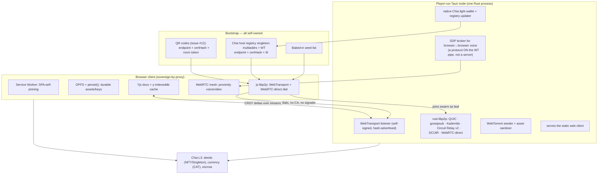

# STUDY — Architecture Distilled v003
*A critical review of [STUDY-Architecture v002](STUDY-Architecture%20v002.md) against the current state of the repository (prototypes 01–04, issues #1–#12, PRs #2–#11), plus new proposals: a fix for v002's hidden third-party dependency, a unified browser↔native transport, a full deployment playbook with code, and a survey of every browser-built-in protocol we can creatively exploit.*

> **Reading this doc:** v001 surveyed everything possible. v002 turned it into an opinionated, layered, sovereignty-first decision document. This v003 **agrees with v002's spine** — four layers, Sovereignty Test, "Tauri nodes ARE the infrastructure," Chia as bootstrap + settlement — and then does three things v002 didn't:
>
> 1. **Finds and fixes v002's one remaining hidden third-party dependency** (the TLS certificate authority system) — §4.
> 2. **Proposes a concrete deployment story with runnable code** — how a player, a community volunteer, or the dev team actually stands the network up — §7.
> 3. **Mines the browser itself for free capabilities** — WebRTC and WebTorrent as requested, plus WebTransport, Service Workers, OPFS, WebCodecs, BroadcastChannel, BarcodeDetector (the issue #12 QR phone-chat!), WebAuthn, Web Locks, WASM and more — §6.
>
> The sovereign serverless premise is **kept and hardened**: nothing on the critical path may depend on infrastructure we (or our players) do not control. Where v003 differs from v002, it is on *how* sovereignty is best accomplished, never *whether*.

---

## 1. TL;DR — What v003 Changes

| Topic | v002 said | v003 verdict |
|-------|-----------|--------------|
| Four layers (L0 transport → L1 realtime → L2 CRDT room state → L3 Chia settlement) | Core spine | ✅ **Keep unchanged.** It has already survived contact with reality: prototypes 01–04 are structured exactly this way (`network/NetworkProvider.ts`, `network/YjsSync.ts` stubs waiting for Sprint 3–4). |
| Sovereignty Test as a veto | Core principle | ✅ **Keep — and apply it harder.** v002 itself fails its own test in one place (§4). |
| Tauri node = embedded **WSS** signaling + STUN + relay | The corrected core | ⚠️ **Modify.** Plain `wss://<player-ip>` cannot work in production browsers without a CA-signed certificate — which silently re-imports a third party (the CA/DNS system). Replace/augment with **WebTransport + `serverCertificateHashes`** and/or **libp2p WebRTC-direct**, both of which let a browser dial a self-signed player node with *zero* certificate authority. §4. |
| Web and native use two different network stacks (WSS-brokered WebRTC vs rust-libp2p) | Two adapters behind one port | ⚠️ **Modify → unify on libp2p where practical.** js-libp2p in the browser can now dial rust-libp2p nodes directly over WebTransport / WebRTC-direct and participate in gossipsub. One protocol, one peer-ID space, one DHT. Keep the tiny WSS signaler as a fallback adapter, not the primary. §5. |
| Yjs CRDT for room state, boards, chat | Keep | ✅ **Keep.** Also adopt `y-indexeddb` (web) so rooms load instantly from local cache before the first peer appears. |
| Chia host registry + infohash registry | Restored from v001 | ✅ **Keep — and extend the record format** to carry the node's *certificate hash* and *multiaddrs*, which is what makes §4's CA-free dialing possible. |
| Room-host soft authority | Keep | ✅ **Keep.** Matches the direction of prototypes and roadmap Phase 5 anti-cheat. |
| Deployment | Not covered | ➕ **New: §7** — Tauri node config, headless community seed node (systemd), Chia registry advertisement, magnet-link installer publishing, IPFS + Tauri-served SPA, Service-Worker self-pinning. |
| Browser built-ins beyond WebRTC/WebTorrent | Not covered | ➕ **New: §6** — twelve browser capabilities ranked by leverage, including the QR/phone-chat path for issue #12. |

---

## 2. Repo Reality Check — What Exists Today

Grounding the study in what's actually in the tree and tracker, so proposals attach to real work:

| Artifact | State | Architectural relevance |
|----------|-------|--------------------------|
| `prototypes/01-core-loop-demo` (PR #5, merged) | Playable | Vite + TypeScript + Three.js core loop; `network/NetworkProvider.ts` and `network/YjsSync.ts` exist as **stubs** — the ports-and-adapters seam v002 §5 proposed is already scaffolded. |
| `prototypes/02-ortho-camera-demo` (PR #7, merged) | Playable | Locked orthographic camera, pixelation, 8-way snap. Camera/render decisions are settling. |
| `prototypes/03-character-model-demo` (PR #9, open) | In review | Rigged voxel avatar with decoupled logical vs visual rotation — exactly the split the 13-byte move tick (v002 §9.1) needs: network the logical angle, snap visually. |
| `prototypes/04-navigation-demo` (PR #11, open) | In review | A* point-and-click + WASD hybrid (issue #10). Waypoint navigation means clients can send *destination intents* instead of 30 Hz ticks while pathing — a free bandwidth win and a cleaner input for host-side validation (§5.4). |
| Issue #12 — mobile phone chat via QR | Open, active discussion | A **second client class**: a phone browser that joins one room's chat only. Strong test case for the sovereign browser bootstrap — the QR code can carry endpoint + certificate hash + access token (§6.9). |
| Issue #1 / PRs #2–#4 | Merged into GDD/TDD/ROADMAP | Rooms-as-cargo (CubeSat classes), on-chain deed transfer on docking/undocking, company shares as CATs — all L3 settlement items; nothing in them stresses the v002 spine. |
| ROADMAP Phase 1 | Current | "P2P Rooms" and "Proximity Chat" are the next multiplayer deliverables — i.e., the decisions in this study are on the near-term critical path, not hypothetical. |

**Takeaway:** the codebase has been converging on v002's shape *before* the networking is written. That is the ideal moment to fix the transport-layer issues below — nothing has to be torn up.

---

## 3. Analysis of v002's Proposals (Keep / Modify / Challenge)

### 3.1 What v002 got right (keep, with evidence)

1. **Layering by data lifetime and trust.** Position ticks, CRDT room docs, and NFT deeds genuinely have different consistency needs; giving each the cheapest sufficient tool is the correct engineering economy. The prototypes' file layout already mirrors it.
2. **The Sovereignty Test as a veto.** It correctly killed the earlier Nostr draft and public STUN/trackers. v003 re-applies the same test to v002 itself in §4 — the test is doing its job.
3. **"Tauri nodes ARE the infrastructure."** The single best idea in v002. Every alternative (rented TURN, hosted signaling) fails the test; every player-run alternative passes. v003 keeps this and only upgrades *which protocols* the node speaks.
4. **Chia on bootstrap + settlement, never the hot path.** 18-second finality has no business near movement, and full business near deeds. Correct on both sides.
5. **CRDTs over our own transport.** Yjs is transport-agnostic; piping its updates over our channel (v002 §9.3) avoids `y-webrtc`'s public signaling entirely. Correct and already the plan in the prototype stubs.
6. **Room-host soft authority.** Full deterministic lockstep over an open P2P mesh is a research trap; intent-validate-rebroadcast by a player-run host is buildable and "sovereign enough."
7. **Magnet-link installer + Tauri/IPFS-served SPA.** Cheap, on-thesis, great marketing. Elevated further in §7.5.

### 3.2 Where v002 is underspecified or wrong (modify)

1. **❌ The WSS signaler has a hidden third-party dependency — the CA system.** v002 §9.2's browser code opens `wss://<host-ip>:<port>/sig`. A production browser **refuses** a WSS connection to a bare IP or self-signed certificate — no user-facing bypass exists for WebSocket (unlike page loads, there is no "proceed anyway" for sockets). The "fixes" all fail the Sovereignty Test:
   - Buy/issue a real cert → needs a domain (rented) + a CA (third party) + DNS (revocable).
   - Plex-style per-node wildcard certs → requires *us* to run a cert-issuing service forever (single point of failure, and a CA can still revoke).
   - `ws://` plaintext → blocked as mixed content from any `https://` page, and unacceptable anyway.

   **This is v002's one real architectural bug.** The fix exists in the browser platform itself and is the centerpiece of §4.

2. **⚠️ Two parallel network stacks is avoidable now.** v002 assumed browsers can't join the libp2p swarm, so it built a WSS bridge. That was true in 2021; it is not true now. js-libp2p ships **WebTransport** and **WebRTC-direct** transports that dial rust-libp2p listeners *without any signaling server and without CA certificates*. Unifying means: one peer-ID space, one gossipsub mesh, one Kademlia DHT with browsers as ephemeral leaf nodes, one protocol to test. §5.
3. **⚠️ The Chia registry record is underspecified.** For the CA-free dial to work, the on-chain host advertisement must carry more than `IP:port` — it needs the node's **certificate hash** (for WebTransport) and **multiaddrs** (for libp2p). Trivial change, big consequence. §5.2.
4. **⚠️ Browser storage volatility is solvable, not just acceptable.** v001/v002 treat IndexedDB eviction as a fact of life. `navigator.storage.persist()` + **OPFS** + a Service Worker that pins the SPA make the web client *far* more durable than v001 assumed. §6.
5. **⚠️ "Mesh for ≤12 peers then host fan-out" needs a media plan, not just data.** Voice/video mesh dies faster than datachannel mesh (encode cost × N). The room host should act as a selective forwarder for *media* too; **WebCodecs + WebTransport** makes a JS-only SFU-lite feasible inside the Tauri node's webview. §6.6.

### 3.3 Open forks from v002 §11 — v003's calls

| v002 open fork | v003 recommendation |
|----------------|---------------------|
| WSS-in-Tauri vs js-libp2p Circuit Relay for browser bootstrap | **js-libp2p (WebTransport + WebRTC-direct) primary; tiny WSS signaler demoted to LAN/dev fallback.** The cert problem (§4) decides this fork on its own. |
| Yjs vs Automerge | **Yjs now** (smaller deltas, `y-indexeddb`, huge ecosystem). Re-evaluate `automerge-rs` only if the native node ever needs to *host* room docs without a webview. |
| Chia registry shape: Singleton vs DID vs CAT-crawl | **Singleton with a versioned JSON payload** (§5.2) — simplest to read from a wallet or public full-node RPC; keep CAT-holder crawl as tertiary. |
| Currency: off-chain ledger → CAT settlement | **Keep v002's hybrid**, unchanged. Roadmap gates crypto to Phase 3; honor it. |
| NAT traversal: libp2p built-ins vs IPv8 tactics | **libp2p built-ins (DCUtR + Circuit Relay v2)**; measure before hand-rolling anything. |
| SPA delivery: Tauri-served vs IPFS vs GitHub Pages | **All three, in that order of authority** — plus the Service-Worker self-pinning trick (§6.4) which makes *any* successful first load durable. |
| Hot-path serialization | **Hand-packed `DataView` for move ticks, MessagePack elsewhere** — confirmed, and prototype 04's waypoint intents shrink the hot path further. |

---

## 4. The Certificate Problem — and the Browser-Native Fix

The deepest finding of this study. Restating the failure precisely:

> A browser page served over `https://` may only open `wss://` sockets to endpoints presenting a **CA-signed certificate for a real domain name**. Player-run nodes have neither a domain nor a CA cert. Therefore v002's "browser opens WSS to a player's Tauri node" **cannot ship as the primary path** without renting domains/CAs — a third-party dependency on the critical path. Fails the Sovereignty Test.

The browser platform itself provides **two** escape hatches, both designed exactly for P2P:

### 4.1 WebTransport + `serverCertificateHashes` (the headline fix)

WebTransport (HTTP/3 over QUIC) lets a page connect to a server presenting a **self-signed certificate**, provided the page supplies the certificate's SHA-256 hash up front:

```js
// Browser: dial a player-run node with NO certificate authority involved.
// The hash comes from the Chia host registry (or a QR code, or the seed list).
const wt = new WebTransport(`https://${host.ip}:${host.port}/ssf`, {
  serverCertificateHashes: [
    { algorithm: 'sha-256', value: base64ToBuf(host.certHash) },
  ],
});
await wt.ready;   // QUIC handshake, self-signed cert accepted because hash matches
```

Constraints (by spec, and they are *features* for us):
- The cert must be **ECDSA** and valid for **≤ 14 days** → nodes rotate certs automatically and re-advertise the new hash; a stale registry entry ages out by itself, which doubles as a liveness signal.
- The trust anchor moves from "the CA system" to "**whoever told you the hash**" — for us, that is **the Chia blockchain**. The unkillable consensus becomes the certificate authority. This is *more* sovereign than TLS, not a workaround.

WebTransport also gives us, for free: multiple independent **bidirectional streams** (no head-of-line blocking — perfect for CRDT sync vs chat vs asset chunks) and **unreliable datagrams** (perfect for the 13-byte move tick). It is, on its own, a better L0 for browser↔node than a WebSocket ever was.

### 4.2 libp2p **WebRTC-direct** (the unifier)

The same trick exists inside WebRTC: a rust-libp2p node listening on `/udp/<port>/webrtc-direct/certhash/<hash>` publishes its DTLS certificate hash in its multiaddr; a browser running js-libp2p dials it **with no signaling server at all** (the SDP is constructed locally from the multiaddr — "SDP munging"). Result: the browser is a real libp2p peer, speaking gossipsub and identify to the same swarm the native nodes use.

### 4.3 Decision

| Path | Signaling server needed | CA needed | Verdict |
|------|--------------------------|-----------|---------|
| WSS → WebRTC (v002 §9.2) | our own (fine) | **YES — fails test** | Demote to LAN/dev fallback (plain `ws://` is allowed to `localhost`/private LAN in dev) |
| **WebTransport w/ cert hashes** | none | none | ✅ **Primary browser↔node pipe** |
| **libp2p WebRTC-direct** | none | none | ✅ **Primary browser→swarm membership**; browser↔browser via Circuit Relay v2 + DCUtR through the node |
| Raw browser↔browser WebRTC (proximity voice) | broker = the node, over WebTransport | none | ✅ Kept — SDP/ICE exchanged over the already-open sovereign pipe |

**Every box is player-run or on-chain. The Sovereignty Test now passes with no asterisks.**

---

## 5. The Revised Blueprint (v002 spine, v003 plumbing)



### 5.1 Ports & adapters — unchanged interface, upgraded wiring

v002's `NetworkProvider` / `DiscoveryProvider` / `StorageProvider` / `LedgerProvider` ports survive verbatim (and match the stubs already in `prototypes/*/src/network/`). Only the adapter table changes:

| Port | Web shell | Tauri shell |
|------|-----------|-------------|
| `NetworkProvider` | **js-libp2p (WebTransport, WebRTC-direct)** → node; raw WebRTC mesh for proximity media | rust-libp2p (QUIC, gossipsub, DHT, Relay v2, DCUtR) |
| `DiscoveryProvider` | Chia registry (wallet or public full-node RPC) ∪ seed list ∪ QR payload | libp2p DHT/mDNS ∪ Chia registry ∪ seed list |
| `StorageProvider` | **OPFS + IndexedDB (`y-indexeddb`) + `storage.persist()`** | SQLite |
| `LedgerProvider` | injected wallet (Goby/Pawket) | native Chia light wallet |

### 5.2 The host-registry record (extended for CA-free dialing)

The singleton's payload gains three fields over v002 — this is the small change that unlocks §4:

```json
{
  "v": 3,
  "roomIds": ["deck:furlong:cantina", "deck:furlong:promenade"],
  "multiaddrs": [
    "/ip4/203.0.113.7/udp/4501/quic-v1",
    "/ip4/203.0.113.7/udp/4501/quic-v1/webtransport/certhash/uEiDy...",
    "/ip4/203.0.113.7/udp/4502/webrtc-direct/certhash/uEiBr..."
  ],
  "wt": { "url": "https://203.0.113.7:4443/ssf", "certHash": "3q2+7w...==", "notAfter": 1767225600 },
  "relay": true,
  "seed": ["magnet:?xt=urn:btih:..."],
  "sig": "<node-key signature over the payload>"
}
```

Freshness is enforced twice: the singleton's last-spend height (on-chain) and the ≤14-day cert expiry (protocol). Spam resistance: advertising requires spending the singleton (mojo cost) — v002's suggestion, kept.

### 5.3 Realtime & room state — unchanged

The 13-byte move tick (v002 §9.1) rides WebTransport **datagrams** (browser) or QUIC datagrams (native). Yjs deltas ride a dedicated reliable **stream**. Proximity voice stays raw WebRTC media between browsers (best echo-cancellation/jitter pipeline available), brokered over the node pipe. Nothing in v002 §9.3 changes except the transport underneath — which is the point of the ports.

### 5.4 A refinement from prototype 04: intent-based movement

Since PR #11 adds A* waypoint navigation, clients in point-and-click mode can send a single `MoveIntent {targetX, targetZ}` and let host + peers simulate the deterministic A* path locally, instead of 30 Hz ticks. WASD interrupt (already specified in issue #10) falls back to tick streaming. Wins: ~90 % hot-path bandwidth cut while pathing, and host-side validation becomes "is this path legal" — cheaper and stronger than per-tick speed checks.

---

## 6. Creative Browser Built-Ins — the Free Capability Audit

The requested survey. Everything below ships in evergreen browsers today (exceptions flagged). Ranked by leverage for StarStationFurlong.

| # | Capability | What we do with it | Sovereignty note |
|---|------------|--------------------|------------------|
| 1 | **WebRTC** (media + datachannels) | Proximity voice/video mesh; browser↔browser data; **WebRTC-direct** dialing of native nodes (§4.2) | No CA, no signaler needed for the direct-dial variant |
| 2 | **WebTransport** | Browser↔node pipe with self-signed certs via hash pinning; streams for CRDT/chat/assets, datagrams for ticks (§4.1) | **The** sovereign browser bootstrap. Safari lagging → WebRTC-direct is the fallback |
| 3 | **WebTorrent / WebRTC data** | Asset + UGC distribution; browsers seed to each other while in a room; infohashes on Chia instead of trackers (v002, kept) | Player-run Tauri seeders solve cold start |
| 4 | **Service Worker + Cache API** | **SPA self-pinning:** once loaded from *any* mirror (a node, IPFS, GitHub Pages), the SW caches the entire client; every later visit boots offline-first and merely *checks* for updates. De-platforming a mirror can't remove already-installed players | Converts "hosting" from a dependency into a one-time bootstrap |
| 5 | **PWA install + Web App Manifest** | "Install" the web client to desktop/home-screen with no store and no signed installer — the zero-friction sibling of the magnet-link Tauri installer | App-store-free distribution |
| 6 | **OPFS + `navigator.storage.persist()`** | Durable, fast (sync-access in workers) storage for assets, Yjs snapshots, and the wallet keystore; `persist()` exempts us from eviction on most browsers | Directly repairs v001 §3.II "storage volatility" |
| 7 | **WebCodecs (+ Insertable Streams)** | Host-side **SFU-lite**: decode-free forwarding of encoded voice frames when a room exceeds mesh size; per-frame E2E encryption of media relayed through a node (the relay can't listen) | Keeps big-room voice player-hosted, not vendor-hosted |
| 8 | **Web Crypto + WebAuthn/passkeys** | All CRDT/registry signature verification in-browser; **passkey-wrapped wallet keys** (hardware-backed, phish-proof) as the casual identity path before users graduate to a real Chia wallet | Keys never leave the device; no account server |
| 9 | **BarcodeDetector / camera QR** | **Issue #12 delivered sovereignly:** in-game phone shows a QR = `{wt endpoint, certHash, room token, expiry}`; phone browser scans → dials the same player node over WebTransport → joins that room's chat Yjs doc. The cert hash *in* the QR is what makes an SSL-less player node reachable from a phone — answering the issue's own question about Chrome blocking non-SSL sites | Access token gates drive-by traffic, per the issue |
| 10 | **BroadcastChannel + Web Locks** | Multi-tab hygiene: one tab owns the libp2p connection (Web Locks leader election) and fans state out to other tabs; prevents duplicate peers/avatars | Small but prevents real bugs |
| 11 | **WASM (+ threads/SIMD)** | Chia BLS signature verification and puzzle-hash tooling in-browser (`chia_rs`→wasm); Rapier physics already ships as WASM — the *same* physics build runs in host (native webview) and clients | One codebase for consensus-critical math |
| 12 | **WebGPU** | Already implicit via Three.js WebGPURenderer; also compute for pixelation post-FX from prototype 02 at higher res | Rendering only, no network relevance |

**Honorable mentions / rejected:**
- **Web Push** — would enable "your station is under-fueled" pings, but every push transits the *browser vendor's* push service. Third party on the path → optional convenience only, never a mechanic.
- **WebNFC / Web Bluetooth** — fun for meatspace easter eggs (tap phones to exchange contact cards); Chromium-Android-only; not architecture.
- **Local Peer-to-Peer API** (Chrome origin trial) — direct browser↔browser on a LAN with no server *at all*; exactly our thesis, watch it, don't depend on it.
- **`.onion` hosting** — unchanged from v002: Tor disables WebRTC; defer.

The pattern across #2, #4, #6, and #9: **the browser has quietly become a sovereignty-capable platform.** v001 treated the browser as the compromised convenience client; in 2026 it can pin its own app, persist its own state, verify its own signatures, and dial self-signed peers. The Tauri node is still the backbone (AFK, seeding, relay, wallet) — but the gap is smaller than v001 assumed, which strengthens the whole design.

---

## 7. Deployment Playbook (with code)

The requested section. Four deployment personas, from "just plays" to "runs infrastructure," each fully sovereign. All code is illustrative-but-realistic against current crates/APIs.

### 7.1 Persona A — a player's Tauri node (default: every install is infrastructure)

The node's infra roles ship enabled-by-default (opt-out), configured in one file:

```toml
# ~/.ssf/node.toml — created on first run
[node]
nickname   = "dorkmo-station-7"

[infra]                      # every player node strengthens the network
webtransport_port = 4443     # browser bootstrap pipe (self-signed, hash-advertised)
libp2p_quic_port  = 4501     # native swarm
webrtc_direct_port = 4502    # browser libp2p dial-in
relay             = true     # Circuit Relay v2 for NAT'd peers
seed_assets       = true     # WebTorrent re-seed of rooms I've visited
serve_spa         = true     # serve the web client at https://<my-ip>:4443/
upnp              = true     # try automatic port mapping; relay covers failure

[registry]                   # advertise on Chia when I host rooms
advertise         = "when_hosting"   # off | when_hosting | always
max_fee_mojos     = 50_000_000
```

The self-signed, 14-day, auto-rotating WebTransport identity (the §4 fix), in the node's Rust core:

```rust
// src-tauri/src/wt_listener.rs — sovereign browser endpoint. No CA, ever.
use wtransport::{Endpoint, Identity, ServerConfig};
use time::{Duration, OffsetDateTime};

pub struct WtIdentity { pub identity: Identity, pub cert_hash_b64: String,
                        pub not_after: OffsetDateTime }

pub fn fresh_identity() -> anyhow::Result<WtIdentity> {
    // ECDSA + <=14 days validity: the exact profile browsers accept
    // for WebTransport serverCertificateHashes.
    let identity = Identity::self_signed_builder()
        .subject_alt_names(["ssf-node"])
        .from_now_utc()
        .validity_days(13)                       // rotate with a day of slack
        .build()?;
    let hash = identity.certificate_chain().as_slice()[0].hash(); // SHA-256
    Ok(WtIdentity {
        cert_hash_b64: base64::encode(hash.as_ref()),
        not_after: OffsetDateTime::now_utc() + Duration::days(13),
        identity,
    })
}

pub async fn serve(id: &WtIdentity, port: u16) -> anyhow::Result<()> {
    let cfg = ServerConfig::builder()
        .with_bind_default(port)
        .with_identity(id.identity.clone_identity())
        .build();
    let server = Endpoint::server(cfg)?;
    loop {
        let conn = server.accept().await.await?;   // incoming browser
        tokio::spawn(handle_browser_session(conn)); // streams: crdt/chat/sdp-broker
    }                                               // datagrams: move ticks
}
// A scheduler re-runs fresh_identity() every ~12 days and re-advertises (7.3).
```

rust-libp2p side gains the browser-facing transport next to v002 §9.4's behaviours:

```rust
// Additions to the v002 swarm: WebTransport + WebRTC-direct listeners so
// js-libp2p browsers can dial us with certhash multiaddrs — no signaler.
let swarm = SwarmBuilder::with_existing_identity(keypair)
    .with_tokio()
    .with_quic()
    .with_other_transport(|key| {
        libp2p_webrtc::tokio::Transport::new(key.clone(), webrtc_cert.clone())
    })?
    // kademlia, gossipsub, relay (SERVER side too — we relay for others),
    // dcutr, identify: unchanged from v002 §9.4
    .build();
swarm.listen_on("/ip4/0.0.0.0/udp/4501/quic-v1".parse()?)?;
swarm.listen_on("/ip4/0.0.0.0/udp/4502/webrtc-direct".parse()?)?;
```

### 7.2 Persona B — the browser client, end to end

```ts
// web/src/adapters/sovereignNetwork.ts — the web NetworkProvider adapter.
import { createLibp2p } from 'libp2p';
import { webTransport } from '@libp2p/webtransport';
import { webRTCDirect, webRTC } from '@libp2p/webrtc';
import { circuitRelayTransport } from '@libp2p/circuit-relay-v2';
import { gossipsub } from '@chainsafe/libp2p-gossipsub';
import { noise } from '@chainsafe/libp2p-noise';
import { yamux } from '@chainsafe/libp2p-yamux';

export async function joinSwarm(disc: DiscoveryProvider, roomId: string) {
  // 1. Sovereign discovery: seed list ∪ Chia registry ∪ QR payload.
  const hosts = await disc.findHosts(roomId);      // each has multiaddrs w/ certhash

  // 2. One libp2p stack, same protocol family as the native swarm.
  const node = await createLibp2p({
    transports: [
      webTransport(),          // dials /webtransport/certhash/... (no CA!)
      webRTCDirect(),          // dials /webrtc-direct/certhash/... (no signaler!)
      webRTC(),                // browser<->browser, brokered via relayed streams
      circuitRelayTransport(), // reach NAT'd peers through any relaying node
    ],
    connectionEncrypters: [noise()],
    streamMuxers: [yamux()],
    services: { pubsub: gossipsub() },
  });

  // 3. Dial until one player-run node answers. Redundancy = sovereignty.
  for (const h of hosts) {
    try { await node.dial(multiaddr(h.multiaddrs[0])); break; } catch { /* next */ }
  }

  // 4. Realtime + room state on gossipsub topics; Yjs pipes over it (v002 §9.3).
  node.services.pubsub.subscribe(`ssf/room/${roomId}/rt`);   // move ticks
  node.services.pubsub.subscribe(`ssf/room/${roomId}/crdt`); // Yjs deltas
  return node;
}
```

Durability + self-pinning on the web side:

```ts
// web/src/boot.ts — make the browser client hard to evict and hard to de-platform.
if (navigator.storage?.persist) await navigator.storage.persist(); // opt out of eviction
await navigator.serviceWorker.register('/sw.js');                  // pin the SPA
const assets = await navigator.storage.getDirectory();             // OPFS for models
```

```js
// web/sw.js — after ONE successful load from ANY mirror, the game lives locally.
const SHELL = 'ssf-shell-v3';
self.addEventListener('install', (e) =>
  e.waitUntil(caches.open(SHELL).then((c) => c.addAll([
    '/', '/index.html', '/assets/game.js', '/assets/game.css',
  ]))));
self.addEventListener('fetch', (e) =>          // offline-first: cache, then network
  e.respondWith(caches.match(e.request).then((hit) => hit ?? fetch(e.request))));
```

### 7.3 Persona C — advertising on the Chia registry (host side)

```rust
// src-tauri/src/registry.rs — publish the §5.2 record by spending our singleton.
// Runs on cert rotation, IP change, or room-host start. Fee-capped by node.toml.
pub async fn advertise(wallet: &ChiaWallet, rec: HostRecord) -> anyhow::Result<Bytes32> {
    let payload = serde_json::to_vec(&rec)?;           // includes certHash + multiaddrs
    anyhow::ensure!(payload.len() <= 1024, "keep registry records tiny");
    let sig = wallet.node_key().sign(&payload);        // provenance
    let spend = wallet
        .spend_singleton(rec.singleton_id)
        .with_memos(vec![payload, sig.to_bytes().to_vec()])
        .with_fee(rec.max_fee_mojos)
        .build()?;
    Ok(wallet.push_tx(spend).await?)                   // ~18s later: discoverable forever
}
```

```ts
// Browser read path — via injected wallet, or ANY public Chia full-node RPC.
// (Public RPC is a convenience mirror; the wallet path is the sovereign one.)
export async function readHostRegistry(singletonId: string): Promise<HostRecord[]> {
  const coins = await chia.getSingletonHistory(singletonId, { last: 5 });
  return coins
    .flatMap((c) => parseMemos(c))
    .filter((r) => r.v === 3 && r.wt.notAfter > Date.now() / 1000) // cert-expiry TTL
    .filter((r) => verifyNodeSig(r));
}
```

### 7.4 Persona D — a headless community seed node (no GUI, a $5 box or a spare PC)

Same binary, `--headless`. This is the "always-on Tauri seed nodes we/community run" from v002 §7.4, made concrete:

```bash
# One-time setup on any Linux box (works on a Raspberry Pi).
curl -fsSL "magnet:?xt=urn:btih:<installer-infohash>" | ssf-fetch -o ssf-node  # or download from a mirror
./ssf-node --headless --init          # writes ~/.ssf/node.toml, generates keys
```

```ini
# /etc/systemd/system/ssf-node.service
[Unit]
Description=StarStationFurlong sovereign node (seed/relay/signal)
After=network-online.target

[Service]
ExecStart=/usr/local/bin/ssf-node --headless
Restart=always
User=ssf
# the node is its own infra: WebTransport 4443, QUIC 4501, WebRTC-direct 4502
[Install]
WantedBy=multi-user.target
```

```bash
sudo systemctl enable --now ssf-node
ssf-node status   # → advertising on Chia ✓ · relaying 3 peers · seeding 12 rooms · serving SPA ✓
```

No Docker registry, no cloud account, no domain name required. (A `Containerfile` can exist for convenience — but note that depending on Docker Hub would itself fail the Sovereignty Test, so the raw binary is the canonical distribution, via magnet link.)

### 7.5 Distribution of the software itself

```bash
# Release ritual — the game is published INTO its own network:
cargo tauri build                                   # ~12 MB installers per-OS
ssf-node torrent-create dist/ --announce-none       # trackerless: DHT + on-chain infohash
ssf-node registry-publish-infohash <infohash>       # Chia = the tracker
ipfs add -r web/dist                                # SPA mirror #1 (optional)
# GitHub Pages / any static host = SPA mirror #2 (optional convenience only)
# Every player node with serve_spa=true = SPA mirror #3..N (canonical, sovereign)
```

Acquisition paths, weakest dependency first: a friend's magnet link → any player node's `https://<ip>:4443/` (cert hash from QR/registry) → IPFS gateway → GitHub Pages. Kill the last three and the first still works; that is the v001 thesis operationalized.

### 7.6 The issue #12 phone-chat flow, deployed

```ts
// In-game: player presses the SpacePhone button → avatar raises phone 🤳
const qrPayload = {
  wt:   nodePublicEndpoint(),          // https://<host-ip>:4443/ssf
  cert: nodeCertHashB64(),             // lets the PHONE dial an SSL-less player node
  room: currentRoomId(),
  tok:  await mintRoomToken(currentRoomId(), { ttlMinutes: 60 }), // gate drive-bys
};
renderQr(`https://<any-spa-mirror>/#phone=${b64url(qrPayload)}`);
// Phone: scans → loads SPA (then SW pins it) → WebTransport dial w/ cert hash
// → joins the room's Yjs chat doc read/write → door list = adjacent roomIds in the doc.
```

This satisfies every constraint raised in the issue and its comment thread: web-based (no app store), works despite "Chrome blocking non-SSL websites" (cert-hash pinning), token-gated, and the door list for room-hopping falls out of the room CRDT for free.

---

## 8. What Still Needs a Spike (v003's shortlist)

Replacing v002 §11 with the forks that remain genuinely open *after* this study:

1. **WebTransport reachability in the wild.** UDP/QUIC is blocked on some networks. Measure browser→node success rates for WebTransport vs WebRTC-direct vs (fallback) relayed WSS across home/dorm/cellular NATs. Ship the top two as parallel adapters. *(Safari: WebTransport is the laggard — WebRTC-direct is the cross-browser floor.)*
2. **js-libp2p leaf-node cost.** Bundle size and battery/CPU of a browser gossipsub peer vs the thin "dumb pipe to host" model. If js-libp2p is too heavy on phones, the phone client (issue #12) uses bare WebTransport streams and only desktops join the swarm proper.
3. **Chia registry read path without a wallet.** Confirm a brand-new browser (no extension) can read singleton memos via public full-node RPCs with acceptable latency, and quantify how many independent RPC mirrors exist. (Reads are verifiable, so mirrors are trust-minimized — but count them anyway.)
4. **SFU-lite via WebCodecs.** Prototype 8→20 speaker fan-out through a host node's webview; measure added latency vs pure mesh at 8 peers.
5. **Move-intent vs tick streaming** (from prototype 04): validate the bandwidth and anti-cheat claims of §5.4 in a 12-peer simulated room.
6. **Cert-rotation ↔ registry cadence.** 13-day certs mean a mojo-cost singleton spend every ~12 days per advertising host. Confirm fee economics and batch multiple rooms per spend (§5.2 record already allows it).

---

## 9. Final Recommendation

**Keep v002's architecture — four layers, Sovereignty Test, player-run Tauri nodes as the infrastructure, Chia as bootstrap registry and settlement, Yjs room state, room-host soft authority — and upgrade its plumbing in one decisive way: make the browser a first-class sovereign citizen by replacing the CA-dependent WSS bootstrap with certificate-hash-pinned transports (WebTransport and libp2p WebRTC-direct), with the Chia registry carrying the hashes.** The blockchain doesn't just tell a new client *where* the network is; it tells it *what cryptographic identity to trust when it gets there*. Chia becomes the game's certificate authority — an unkillable one.

Around that core, v003 adds what v002 left open:

1. **A deployment story (§7)** in which every install is infrastructure by default, a community seed node is a systemd unit on a $5 box, the installer travels by magnet link, the SPA is served by the players' own nodes, and one successful page-load makes the client self-hosting via Service Worker pinning.
2. **A browser-capability audit (§6)** showing the platform now gives us — for free — durable storage (OPFS + `persist()`), app self-pinning (SW), in-browser consensus math (WASM), hardware-backed keys (WebAuthn), an SFU-lite path for big rooms (WebCodecs), and the exact mechanism issue #12's phone chat needs (QR-borne cert hashes + WebTransport).
3. **A tightened realtime plan (§5.4)** aligned with the actual prototypes: waypoint *intents* while pathing, ticks only under WASD.

In one line: **v002 made the players the servers; v003 makes the blockchain the certificate authority and the browser a full citizen — so the game boots, connects, persists, and distributes itself with no third party anywhere on the path.**

---

*Companion to [STUDY-Architecture v002](STUDY-Architecture%20v002.md) and [docs/TDD/01-Architecture.md](../../docs/TDD/01-Architecture.md). The spikes in §8 should land as throwaway prototypes in [prototypes/](../../prototypes/) — the WebTransport cert-hash dial (§8.1) is the highest-leverage first spike, since it de-risks the one load-bearing change v003 makes to v002.*
