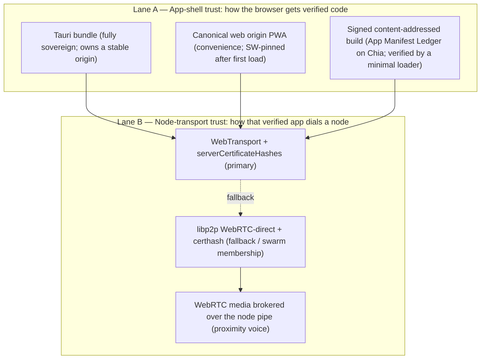
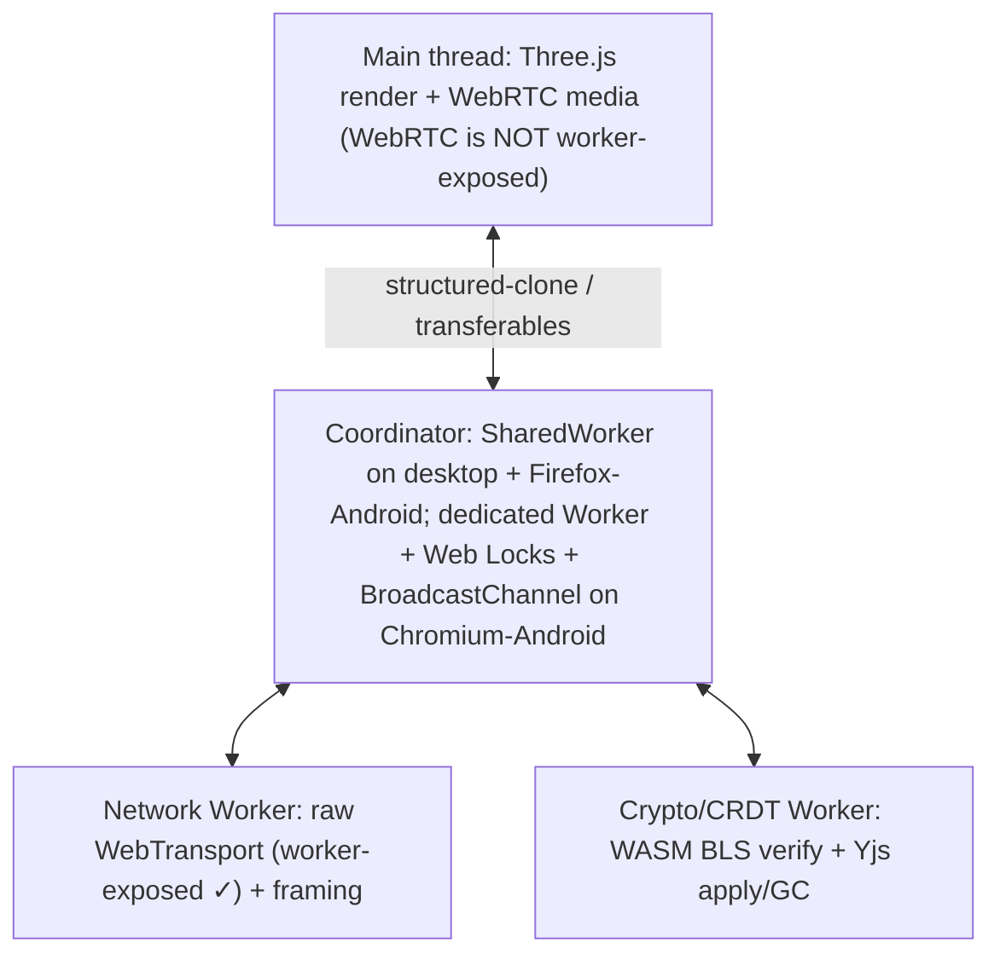

# STUDY — Architecture Distilled v004
*A verification-and-synthesis pass over [STUDY-Architecture v003](STUDY-Architecture%20v003.md) and its three independent reviews (GPT‑5.5, Gemini 3.1 Pro, Gemini 3.5 Flash), grounded in primary-source checks of the WebTransport spec, MDN/caniuse browser-support data, the Chrome Local Network Access rollout, and the libp2p transport source tree. It keeps v003's spine, **fixes the assumptions v003 got wrong or that have since changed**, adopts the reviewers' strongest corrections, and re-states the sovereign-serverless plan as separable trust layers with explicit failure modes.*

> **Reading this doc:** v001 surveyed the space. v002 made it an opinionated layered decision. v003 fixed v002's CA dependency with certificate-hash-pinned transports and wrote a deployment playbook. **v004 does four things:**
>
> 1. **Verifies every load-bearing claim** in v003 and the three reviews against primary sources — and corrects the five that are wrong or now out-of-date (§3). The headline: **Safari shipped WebTransport + `serverCertificateHashes` in 26.4; WebTransport is Baseline 2026.** v003's "Safari is the laggard" is no longer true, which *simplifies* the plan.
> 2. **Adjudicates the reviews** — adopt / modify / reject, with reasons (§4).
> 3. **Splits the one over-compressed idea into separable layers** — v003 folded *app-shell trust*, *node-transport trust*, *identity*, *room authority*, *relay policy*, and *settlement* into a single "Chia is the CA" story. They are distinct problems with distinct failure modes (§5–§11).
> 4. **Rewrites the deployment playbook and Phase 1 amendments** with the corrected transport interop story (§12–§13).
>
> The sovereign premise is unchanged: **nothing on the critical path may depend on infrastructure we or our players do not control.** v004 disagrees with v003 only on facts and layering, never on the thesis.

---

## 1. TL;DR — What v004 Changes vs v003

| Topic | v003 said | v004 verdict |
|-------|-----------|--------------|
| WebTransport + `serverCertificateHashes` as the CA-free browser↔node pipe | Primary; "Safari lagging, WebRTC-direct is the cross-browser floor" | ✅ **Keep as primary — and upgrade the claim.** Safari 26.4 + iOS 26.4 now support both WebTransport and `serverCertificateHashes`; the feature is **Baseline 2026** across Chrome/Edge/Firefox/Safari. WebRTC‑direct is now the *fallback*, not the floor. (§3.1) |
| "Unify on libp2p — browser dials rust-libp2p over WebTransport" | Core simplification | ⚠️ **Wrong as written.** `rust-libp2p` has **no WebTransport server**; its libp2p‑WebTransport is browser-**dial-only**. A raw `wtransport` server (v003's own code) does **not** speak the libp2p‑WebTransport handshake, so `js-libp2p.webTransport()` cannot reach it. Pick one lane per transport (§3.4, §6). |
| Chia "becomes the certificate authority" | Framing | 🔧 **Re-frame** (per GPT‑5.5): Chia is the **signed endpoint + key-discovery registry**. It authenticates *what to trust*; it does not issue X.509 certs. (§8) |
| One trust story ("cert hash makes every browser path sovereign") | Implied | ➗ **Split into two lanes:** *app-shell trust* (how the browser gets verified HTML/JS/WASM) and *node-transport trust* (how that app dials a node). Cert-hash pinning solves only the second. (§5) |
| `serve_spa=true` — player node is a canonical browser SPA mirror at `https://<ip>:4443/` | Deployment default | ❌ **Not production-safe for arbitrary phones.** Page navigation/SW/PWA/passkey are all origin-scoped and Web-PKI-gated; a bare-IP self-signed page still throws a TLS interstitial. Keep as LAN/dev/Tauri-webview convenience only. (§3.3, §5) |
| Locked networks | One-line "spike WebTransport reachability" | ➕ **Formal fallback ladder** (Tier 0 native → store-and-forward), with the honest correction that **WebTransport-over-HTTP/2 reliable-only is essentially Chrome-unsupported today**, so the real TCP/443 tiers are WSS-to-a-real-domain bridge and WebRTC/TURN-TCP relay. (§7) |
| SharedWorker as multi-tab orchestrator | Not in v003; all three reviews add it | ⚠️ **Adopt with a hard caveat: SharedWorker is unavailable on Chrome for Android.** For the Issue #12 phone client, use a dedicated Worker + Web Locks + BroadcastChannel. (§3.2, §10) |
| Move heavy work (Yjs, BLS) off the main thread | Not addressed | ✅ **Adopt** (Gemini 3.5 Flash). Note: **WebTransport works in Workers; WebRTC does not** — so the network worker can own WT but WebRTC media stays on the main thread. (§10) |
| Yjs room state | Keep | ✅ Keep — **plus** signed deltas (auth), subdocument boundaries, snapshot/compaction, and a moderation model. Yjs is trust-all by default. (§9) |
| Host soft authority | Keep | ✅ Keep — **plus** signed intents + sequence numbers, host-signed results, host migration, and **content-addressed signed room geometry**. (§9) |
| Registry record `v:3` | endpoint + certHash + multiaddrs | ➕ **`v:4`**: sequence number, node pubkey, protocol list, staged cert rollover (`current`/`next`), relay policy, signed app-build manifest hash, provenance signature. Light-verification of singleton lineage in-browser is an **open spike**, not a solved fact. (§8) |
| Relay/seed enabled by default | "every install is infrastructure" | 🔧 **Keep the spirit, cap the default:** reservation limits, per-peer/room quotas, capability-token-gated relay, bandwidth caps, blocklists. "Contribute safely," not "unbounded relay." (§11) |
| Passkeys as the casual identity | Keeps device keys | 🔧 **Modify:** WebAuthn RP-ID is domain-bound, so passkeys don't port across mirrors/IPs. Use them to *wrap* a portable, exportable game keypair; never as the only recovery path. (§8.4) |
| Browser targeting | Chrome-centric code samples; "Safari lagging" | ➕ **Firefox is a first-class target, not a fallback** — and on two points it beats Chrome (SharedWorker works on Firefox for Android; no Local Network Access gate yet). The stack is Baseline 2026, so nothing is Chrome-only. QR scanning uses a WASM decoder, not `BarcodeDetector`. (§6.4) |
| Mobile client | Web PWA on the phone (bounded first-load) | ➕ **Android gets a fully sovereign native client** — Tauri 2 builds an APK (Rust core as native `.so` + WebView UI) distributable via F-Droid / own-repo / sideload, bundling its own code so there is **no** first-load Web-PKI asterisk. Closes the mobile sovereignty gap (iOS still web-only). Relay/seed **off by default on mobile**. (§5.4) |

---

## 2. Method — Verify First, Then Synthesize

v003 and its reviews make dozens of platform claims. Several are load-bearing (the whole plan pivots on them) and a few are **wrong or have expired** since writing. Per the project's own Sovereignty Test discipline, an architecture re-anchored on a false platform assumption is worse than no change at all. So §3 is a **verification ledger**: each claim, the primary source checked, and the verdict. Only *after* that do §4–§13 build on what survived.

Primary sources consulted (2026‑07‑03):

- **W3C WebTransport Working Draft** (18 Jun 2026) — `serverCertificateHashes`, custom certificate requirements, `reliability`/`supportsReliableOnly`, HTTP/2 reliable-only, no-interstitial security note (§6.9, §14.3, §14.4).
- **MDN** `WebTransport` + `WebTransport()` — browser-compat tables, Baseline 2026, Local Network Access row.
- **caniuse** `webtransport` and `sharedworkers` — per-browser support incl. mobile.
- **Chrome for Developers** — "New permission prompt for Local Network Access" and the WebTransport capability guide.
- **libp2p/js-libp2p** and **libp2p/rust-libp2p** source trees — transport package inventory and the WebTransport "dial-only" note.

---

## 3. Verification Ledger — Claims Checked

### 3.1 ✅→⬆ WebTransport cert-hash pinning is real — and Safari is no longer the laggard

**Verified true**, and *better than v003 assumed.* The WebTransport spec's `serverCertificateHashes` lets a page trust a self-signed leaf cert by SHA‑256 hash, bypassing Web PKI, if the cert is X.509v3, uses an allowed public-key algorithm (**must include ECDSA secp256r1/P‑256; must not be RSA**), is currently valid, and has a **total validity period ≤ two weeks**. `allowPooling` must be `false`. Certificate-verification errors in WebTransport are **fatal with no interstitial bypass** (unlike a page load) — which is exactly why this, not WSS, is the sovereign pipe.

**The correction:** v003 §6/§8 and GPT‑5.5 both say "Safari is the laggard → WebRTC‑direct is the cross-browser floor." As of the current MDN/caniuse data this is **out of date**:

| Feature | Chrome/Edge | Firefox | Safari (desktop + iOS) | Status |
|---|---|---|---|---|
| `WebTransport` | 97 | 114 | **26.4** | **Baseline 2026** (all majors) |
| `serverCertificateHashes` | 100 | 125 | **26.4** | Supported on all majors |

WebTransport went **Baseline 2026 ("Newly available across major browsers," March 2026)**. So WebTransport cert-hash dialing is now a genuinely cross-browser primary path, and **WebRTC‑direct becomes the fallback** for old Safari and UDP-hostile edges — the reverse of v003's framing. This *strengthens* the plan and lets us prefer one transport instead of shipping two co-equal stacks.

### 3.2 ⚠️ SharedWorker — great on desktop, **absent on Chrome for Android**

All three reviews recommend `SharedWorker` as the single-connection multi-tab orchestrator. Verified against caniuse: supported on desktop Chrome/Edge/Firefox/Opera, and **Safari + iOS Safari 16+** — but **not** on **Chrome for Android, Android Browser, or Samsung Internet**. **Exception: Firefox for Android 151+ *does* support SharedWorker** — so the mobile gap is a *Chromium-Android* gap, not a universal one, and it disappears if the phone uses Firefox (§6.4). Since Issue #12's whole point is a **phone browser** joining chat, SharedWorker cannot be assumed on mobile Chromium. **Adopt it as a desktop (and Firefox-Android) optimization; on Chromium-Android fall back to a single dedicated Worker elected via Web Locks, fanning out over BroadcastChannel.** None of the three reviews caught this mobile gap or the Firefox-Android exception.

### 3.3 ✅ Cert-hash pinning does *not* solve first-load app hosting (GPT‑5.5 §4.1 is correct)

Verified from the spec's constructor semantics: `serverCertificateHashes` is an option on `new WebTransport(url, options)`. It has **no effect** on page navigation, `fetch()` of static assets, Service-Worker registration, or PWA install — those still go through ordinary Web PKI, and a bare-IP self-signed **page** still throws a non-bypassable-in-practice TLS warning. Therefore v003's `serve_spa=true` "a player node is a canonical browser SPA mirror at `https://<ip>:4443/`" is **not** a clean production bootstrap for arbitrary phones. It is fine for Tauri's own webview, `localhost`, LAN/dev, or users who accept a page-level warning. **GPT‑5.5's two-lanes correction is adopted (§5).**

### 3.4 ❌ "Browser dials rust-libp2p over WebTransport" — not possible today

v003 §5/§7.1 proposes unifying on libp2p and has the browser dial the rust node over WebTransport, while its own `wt_listener.rs` stands up a **raw `wtransport` server**. Verified against the libp2p source trees:

- `rust-libp2p/transports/` contains `quic`, `tcp`, `websocket`, `webrtc` (native, server-capable), `webrtc-websys`, `websocket-websys`, and **`webtransport-websys` (browser/WASM client only)** — there is **no native WebTransport *server* transport** in rust-libp2p.
- `js-libp2p`'s `@libp2p/webtransport` README states it **"currently only allows dialing… does not yet allow listening,"** and its dialer connects to `${url}/.well-known/libp2p-webtransport?type=noise` expecting a **libp2p** WebTransport server (go-libp2p has one; rust-libp2p does not).

**Consequence:** a raw `wtransport` server and a `js-libp2p.webTransport()` dialer **do not interoperate** — different handshakes. So v003's code mixes two incompatible things. v004 resolves it by choosing **per transport** (§6):

- **Browser↔node, primary:** *raw* WebTransport (`new WebTransport` ↔ Rust `wtransport`) carrying **our own** length-prefixed protocol (move ticks on datagrams; CRDT/chat/asset streams). No libp2p on this pipe.
- **Browser↔swarm, fallback / richer:** `js-libp2p.webRTCDirect()` ↔ `rust-libp2p` `webrtc` (which *is* server-capable and cert-hash-based). This is the libp2p membership path that actually works against a Rust node.
- Native↔native stays full `rust-libp2p` (QUIC, gossipsub, Kademlia, Relay v2, DCUtR).

This is a real correction, not a style preference: it changes which crates the node links and which handshake the browser speaks.

### 3.5 ⚠️ Local Network Access — a permission *prompt*, phased, not an instant crash

Gemini 3.5 Flash §2.2 and GPT‑5.5 §6.11 warn that a public origin dialing a LAN node will be blocked by LNA. Verified against Chrome's LNA rollout: it is a **user permission prompt** (spec: WICG Local Network Access), restricted to secure contexts, gating **public→private/loopback** requests. Nuances the reviews missed:

- As of the rollout notes, **WebSockets, WebTransport, and WebRTC are *not yet* gated** on LNA; `fetch`/subresource/subframe are first. WebTransport gating is flagged coming (MDN shows a "Subject to Local Network Access restrictions" row, Chrome 147+).
- There is a **mixed-content exemption** for private-IP literals and `.local` names, and a **`targetAddressSpace: "local"`** annotation.
- There is an **enterprise policy** to pre-grant/pre-deny.
- Firefox/Safari have not shipped an equivalent gate yet.

So LAN dialing (dorm/LAN-party direct connect) degrades to **"user taps Allow,"** not "impossible." Real, must be designed for (diegetic permission prompt), but not the wall the reviews imply. Also relevant: **requests from Service/Shared Workers require the origin to have been granted LNA already** — another reason the phone path shouldn't hide its first LAN dial inside a worker.

### 3.6 ⚠️ WebTransport-over-HTTP/2 (reliable-only) is not a usable TCP/443 tier today

GPT‑5.5 §4.6 and §5 Tier 3 lean on WebTransport's HTTP/2 reliable-only fallback as the TCP/443 escape for locked networks. Verified: the spec models it (`reliability = "reliable-only"`, `supportsReliableOnly`), **but browser support is Firefox/Safari-only for the `reliability` attribute and Safari-only for `supportsReliableOnly`; Chrome does not expose them and has not shipped WebTransport-over-H2.** Treat WT-over-H2 as **experimental, not a deployable universal fallback**. The real TCP/443 tiers are (a) a WebSocket bridge on a volunteer node that *does* have a real domain/CA (explicitly a non-sovereign convenience), and (b) WebRTC with **TURN-over-TCP/443** relayed by player/community nodes. (§7)

### 3.7 ✅ Other claims that check out (adopt as-is)

- **UDP/QUIC blocking on universities/enterprises** (all reviews) — real and well documented; the fallback ladder is justified.
- **WebRTC mesh is O(N²)** (Gemini 3.5 Flash §2.3) — arithmetic is correct; large rooms need host fan-out / SFU-lite or a soft-authority forwarder.
- **Yjs is trust-all by default** (Gemini 3.5 Flash §2.4) — correct; unsigned deltas let any connected peer wipe a board. Needs a signed-update envelope (§9).
- **Browser WebTorrent can only WebRTC-seed and needs a rendezvous/tracker** (GPT‑5.5 §4.7, Gemini 3.1 Pro §5.3) — correct; demote browser WebTorrent from canonical asset path (§8.5-equivalent → §11).
- **iOS/Safari can evict OPFS/IndexedDB even after `persist()`** without PWA install + engagement (Gemini 3.1 Pro §2.2) — correct; keys must have an explicit export/backup path (§8.4).
- **WebTransport is exposed in Web Workers; WebRTC historically is not** (Chrome guide) — confirmed; shapes the worker-offload design (§10).

### 3.8 ❓ Marked unverified — treat as spikes, not facts

- **In-browser light verification of Chia singleton lineage without trusting one RPC** (GPT‑5.5 §4.10, v003 §8.3). I did not find a primary source proving a no-extension browser can verify singleton history trustlessly at acceptable latency. **Keep as a first-class spike; do not assert it works.** Until proven, treat public Chia RPC reads as a *convenience mirror* and the injected-wallet path as the sovereign one, exactly as v003's own code comment hedges.
- **DNS-over-HTTPS tunneling** (Gemini 3.1 Pro §3.3, Gemini 3.5 Flash §3.2) — technically plausible, but it is covert circumvention that violates most acceptable-use policies, is brittle, and is trivially throttled. **Rejected as core design** (see §4).

---

## 4. Review Adjudication — Adopt / Modify / Reject

| # | Suggestion | Source | Verdict | Rationale |
|---|-----------|--------|---------|-----------|
| 1 | Split app-shell trust from node-transport trust | GPT‑5.5 §4.1–4.2 | **Adopt** | Verified correct (§3.3); the single most important structural fix. §5. |
| 2 | Locked-network fallback ladder (native→store-forward) | GPT‑5.5 §5 | **Adopt (corrected)** | Great backbone; remove WT-over-H2 as a real tier (§3.6). §7. |
| 3 | SharedWorker orchestrator | all three | **Adopt w/ caveat** | Desktop only; not Chrome-Android (§3.2). §10. |
| 4 | Move Yjs/BLS off main thread into Workers | Gemini 3.5 Flash §2.1 | **Adopt** | Correct; WT works in workers, WebRTC doesn't (§3.7). §10. |
| 5 | Signed CRDT delta envelope | Gemini 3.5 Flash §2.4 | **Adopt** | Yjs trust-all is real. §9. |
| 6 | Registry v4: seq, rollover, provenance, app-build hash | GPT‑5.5 §4.10/§7.2 | **Adopt** | Needed for safe cert rotation + provenance. §8. |
| 7 | Capability tokens (Macaroon/Biscuit style) for QR + doors | GPT‑5.5 §4.11/§8.8 | **Adopt** | Attenuable tokens fit Issue #12 exactly. §8.3. |
| 8 | Relay abuse controls; default "contribute safely" | GPT‑5.5 §4.9 | **Adopt** | Legal/abuse surface is real. §11. |
| 9 | Signed, content-addressed room geometry + host replay/migration | GPT‑5.5 §4.13/§7.5 | **Adopt** | Makes intent-movement validation sound. §9. |
| 10 | Passkey wraps a portable exportable key (not RP-bound identity) | GPT‑5.5 §4.3, Gemini 3.1 Pro §5.1 | **Adopt** | WebAuthn RP-ID is domain-bound. §8.4. |
| 11 | App Manifest Ledger (signed asset hashes on Chia) | GPT‑5.5 §7.2 | **Adopt** | Prevents silent malicious app updates post-install. §5.3. |
| 12 | Transport capability modes enum in `NetworkProvider` | GPT‑5.5 §7.3 | **Adopt** | Lets gameplay degrade deliberately. §6.3. |
| 13 | WebRTC/WT stats → diegetic "comms weather" diagnostics | GPT‑5.5 §6.9/§8.1, Gemini 3.5 Flash §5.1 | **Adopt** | Cheap, on-theme, real UX win. §12.4. |
| 14 | Sneakernet station crates / QR dead drops / phone-as-cellular-sidecar | GPT‑5.5 §8, Gemini 3.5 Flash §5.3 | **Adopt (later phase)** | Fits frontier fiction + hostile-net; not Phase 1. §12.4. |
| 15 | Relay/seed as an in-game profession ("comms guild") | GPT‑5.5 §7.4, Gemini 3.5 Flash §5.2 | **Adopt (design, Phase 3+)** | Turns infra cost into economy; gate to economy phase. |
| 16 | WebRTC over ICE-TCP on 443 for UDP-blocked nets | all three | **Adopt** | The realistic TCP/443 tier (§3.6). §7 Tier 3. |
| 17 | WebHID hardware wallets; Web Audio proximity/degradation; File System Access modding; WebCrypto media encryption | Gemini 3.5 Flash §4, Gemini 3.1 Pro §4 | **Adopt (opportunistic)** | Genuine value-adds; not critical path. §12.4. |
| 18 | Storage Buckets, Compression Streams, Wake Lock, PWA share/handlers | GPT‑5.5 §6 | **Adopt (opportunistic)** | Quality-of-life; keep off critical path. |
| 19 | Tor-Snowflake-style volunteer bridges | Gemini 3.1 Pro §3.1 | **Modify → defer** | Only with explicit consent, no deception; native-only research tier (§7 Tier 6). |
| 20 | DNS-over-HTTPS tunneling as transport | Gemini 3.1/3.5 | **Reject** | Covert, ToS-violating, brittle, throttleable. Not core design (§3.8). |
| 21 | "Chia becomes the certificate authority" | v003 framing | **Modify** | Re-frame as signed endpoint/key registry (§3, §8). |
| 22 | `serve_spa=true` as canonical phone SPA mirror | v003 §7.1 | **Modify** | Convenience only; not production PWA bootstrap (§3.3). |
| 23 | Unify browser on libp2p-WebTransport to rust node | v003 §5 | **Reject as written** | rust-libp2p has no WT server; use raw WT or webRTC-direct (§3.4, §6). |

---

## 5. The Two Trust Lanes (the core structural fix)

v003's deepest error was compressing two unrelated trust problems into one sentence ("cert hashes make the browser sovereign"). They must be separated because they fail differently.



- **Lane B is what v003 actually solved** — and §3.1 confirms it's now cross-browser. Cert-hash pinning + the Chia registry authenticate *the node you dial after you already have trusted code running*.
- **Lane A is unsolved by cert hashes** and needs its own answer. v004's position:

### 5.1 App-shell trust model (pick per client class)

1. **Native/Tauri = fully sovereign.** The installer bundles the app; the webview loads from `tauri://`/bundled assets; no Web PKI, no mirror. This is the canonical sovereign client and the one the Sovereignty Test passes cleanly. **This now includes Android** — Tauri 2 builds an APK from the same Rust core (§5.4).
2. **Browser = sovereign-*after*-first-load.** One canonical HTTPS origin is the PWA home. First load needs *a* trusted origin (this is an honest, bounded Web-PKI dependency for **new** web users only). After first load, the Service Worker pins the shell (§12.2) and the client boots offline-first; de-platforming the origin does not remove already-installed players. Additional mirrors (IPFS, GitHub Pages, player nodes) are convenience, verified against the App Manifest Ledger (§5.3).
3. **Phone (Issue #12) = same canonical origin** for the *web* path, reached by a normal `https://<canonical>/#phone=…` URL in the QR (not a bare player IP); the QR's cert-hash payload is for **Lane B** (dialing the node), not for loading the page. **The sovereign phone alternative is the F-Droid/sideloaded Android app** (§5.4), which the QR can deep-link into instead.

This is the key honesty upgrade: **the browser is sovereign for transport and persistence, but web first-load is a bounded convenience dependency, not a fully sovereign act.** Only a *native* client is sovereign end-to-end — and native now covers desktop **and Android**, leaving iOS as the only web-only platform.

### 5.2 The Sovereignty Test, re-scored honestly

| Component | On critical path? | Sovereign? | Verdict |
|---|---|---|---|
| Tauri app-shell — desktop **and Android** (bundled) | Yes | Yes | ✅ |
| Web app **first** load (canonical origin) | Yes, for new web users only | No (needs a domain/CA once) | ⚠️ Bounded convenience; native path (incl. Android, §5.4) is the sovereign alternative |
| Web app **subsequent** loads (SW-pinned) | No | Yes (local) | ✅ |
| Node transport (WebTransport cert-hash / webRTC-direct) | Yes | Yes | ✅ |
| Chia registry (endpoint + cert-hash discovery) | Yes | Yes (consensus) | ✅ |
| Chia settlement (deeds/CATs) | Yes (for ownership) | Yes | ✅ |
| WSS-to-real-domain bridge (locked-net Tier 3) | Only on hostile nets | No | ⚠️ Opt-in convenience; anyone can run one |
| iOS first load | Yes, for iOS users | No (no F-Droid/sideload; web-only or EU alt-store) | ⚠️ The one remaining platform asterisk (§5.4) |

v003 claimed "the Sovereignty Test now passes with no asterisks." v004's honest scoring: **the transport, persistence, discovery, and settlement paths pass; desktop and Android native clients are fully sovereign; the only remaining first-load asterisk is iOS-web.** Stating that plainly is stronger than overclaiming.

### 5.3 App Manifest Ledger (adopted from GPT‑5.5 §7.2)

A signed release manifest — `{app, version, createdAt, assets:[{path, sha256}], entryHash, signer, signature}` — with its hash published on Chia and the body distributed by torrent/IPFS/player nodes. The **native** app verifies it before self-updating; the **web** app, once installed, refuses to activate an update whose manifest hash doesn't match the ledger (optionally requiring agreement across ≥2 mirrors — GPT‑5.5 §8.7). This blocks silent malicious updates from a compromised mirror *after* first load. It does not fix first-load trust (nothing short of a native install does).

### 5.4 Mobile & F-Droid — the fully sovereign Android client

The biggest practical upgrade in v004: **Tauri 2 has stable Android support** (`tauri android build` → APK, verified against the Tauri prerequisites/distribute docs), which compiles the Rust core to a native library (`aarch64`/`armv7`/`x86_64-linux-android` via the NDK) with the system WebView rendering the UI. Because a native install **bundles its own HTML/JS/WASM inside the APK**, it has **no first-load Web-PKI dependency** — it is the phone-side equivalent of the desktop Tauri client and the sovereign answer the web PWA cannot be (§3.3/§5.1).

**Distribution — sovereign, weakest dependency first:**

1. **Direct signed APK / magnet link** — most sovereign; matches the v004 magnet-link installer thesis (§12.3). Sideload, no store.
2. **Self-hosted F-Droid repo** — publish a signed repo URL users add to their F-Droid client.
3. **f-droid.org main repo** — adds reproducible-build verification + discoverability; the F-Droid client itself installs with no Google account. The whole stack is FOSS-licensed (libp2p, `wtransport`, Yjs, Three.js, `chia_rs` — MIT/Apache), so it qualifies. Cost: packaging effort (F-Droid's build server must run cargo + NDK + the JS build reproducibly) — surmountable, not a blocker.
4. **Obtainium / Accrescent** — install straight from GitHub releases or a newer sovereign store.

**Running the node processes in the app — yes, with one honest limit.** The Rust core (Tokio, libp2p, the `wtransport` **client**, Yjs-over-transport, the Chia wallet) runs as native code inside the app; UDP/QUIC works with the `INTERNET` permission, and the phone can **host a room while foregrounded**. But the *always-on server/relay/seed* role is constrained by three Android realities:

- **Background execution is throttled** — a persistent listener needs a foreground service + notification, and Doze/App-Standby/OEM killers still suspend it when the screen is off.
- **Inbound reachability is poor** — cellular is behind CGNAT (no unsolicited inbound); Wi-Fi needs port-forward/UPnP that mobile rarely gets.
- **Battery + metered data** — relaying/seeding drains both.

**Rule: relay/seed is OFF by default on mobile** (opt-in, and only on Wi-Fi + charging + foreground). The always-on infrastructure role stays with desktop and headless nodes (§11, §12.4). **Refinement:** on the app, let the **Rust core own the WebTransport client** (via the `wtransport` client) rather than the WebView, so browser-engine feature gaps are irrelevant and the WebView is pure presentation — Android WebView 97+/100+ does support WebTransport + cert-hashes, but owning it in Rust removes the variable entirely.

**iOS contrast:** no F-Droid, no free sideloading (except EU alternative app stores post-DMA), stricter background limits, and App Store review — so the sovereign mobile path is **Android-first**. iOS users fall back to the web PWA (bounded first-load, §5.1) or an EU alt-store. This is why iOS-web is the single remaining asterisk in the §5.2 table.

---

## 6. Transport Layer — Corrected Decision Matrix

### 6.1 Which transport, which lane, which browser

| Path | Mechanism | CA? | Signaler? | Browser reach (2026‑07) | Role |
|---|---|---|---|---|---|
| Browser↔node **primary** | `new WebTransport()` + `serverCertificateHashes` ↔ Rust `wtransport` server, **our own protocol** | none | none | Chrome/Edge 100+, FF 125+, **Safari 26.4+** | ✅ Primary pipe: datagrams (ticks) + streams (CRDT/chat/assets) |
| Browser↔swarm **fallback** | `js-libp2p.webRTCDirect()` ↔ `rust-libp2p` `webrtc` (server-capable) + certhash | none | none | Chrome/FF/Safari WebRTC | ✅ Fallback + real libp2p membership vs a Rust node |
| Browser↔browser | WebRTC media/data, SDP brokered over the node pipe | none | node (ours) | all | ✅ Proximity voice/video |
| Native↔native | `rust-libp2p`: QUIC, gossipsub, Kademlia, Relay v2, DCUtR | none | none | n/a | ✅ Backbone swarm |
| Browser↔node **LAN** | same WebTransport, private-IP; LNA permission prompt | none | none | Chrome (prompt, phased) | ⚠️ LAN direct; user taps Allow (§3.5) |
| Locked-net TCP/443 | WebRTC + TURN-TCP/443 relay; or WSS-to-real-domain bridge | bridge needs CA | node/bridge | all | ⚠️ Convenience tiers (§7) |
| ~~Browser↔node via libp2p-WebTransport~~ | ~~`js-libp2p.webTransport()` ↔ rust node~~ | — | — | **N/A — rust-libp2p has no WT server** | ❌ Removed (§3.4) |

**Load-bearing change from v003:** the WebTransport pipe is **raw** (`wtransport` + our framing), not libp2p. libp2p in the browser is reached via **webRTC-direct**, not webTransport, when talking to a Rust node. If we ever want libp2p-WebTransport browser→node, the node must be **go-libp2p** — a separate decision, not assumed.

### 6.2 Ports & adapters — unchanged interface, corrected wiring

The `NetworkProvider` / `DiscoveryProvider` / `StorageProvider` / `LedgerProvider` ports (v002 §5, matching the stubs in [prototypes/01-core-loop-demo/src/network/NetworkProvider.ts](../../prototypes/01-core-loop-demo/src/network/NetworkProvider.ts)) are unchanged. Adapter wiring:

| Port | Web/phone shell | Tauri shell |
|------|-----------------|-------------|
| `NetworkProvider` | **raw WebTransport** (primary) → node; `js-libp2p` webRTC-direct (fallback); WebRTC mesh for proximity media | `rust-libp2p` (QUIC, gossipsub, DHT, Relay v2, DCUtR) + `wtransport` server for browser dial-in |
| `DiscoveryProvider` | Chia registry (wallet or public RPC) ∪ seed list ∪ QR payload | libp2p DHT/mDNS ∪ Chia registry ∪ seed list |
| `StorageProvider` | OPFS + IndexedDB (`y-indexeddb`) + `storage.persist()` + **explicit export** | SQLite |
| `LedgerProvider` | injected wallet (Goby/Pawket) | native Chia light wallet |

### 6.3 Transport capability modes (adopted from GPT‑5.5 §7.3)

```ts
type TransportMode =
  | 'direct-unreliable'   // WebTransport datagrams or direct WebRTC — full gameplay
  | 'direct-reliable'     // WebTransport streams only (UDP datagrams blocked) — movement at reduced rate
  | 'relayed-unreliable'  // via Circuit Relay v2 / TURN-UDP — full, higher latency
  | 'relayed-reliable'    // via TURN-TCP/443 — chat, CRDT, intents; no voice
  | 'store-forward'       // no realtime — boards, contracts, crafting queues, mail
  | 'offline';            // local only — sneakernet/QR export
```

`NetworkProvider` reports the current mode so gameplay degrades deliberately: voice only on `direct-*`/good relay; movement ticks on unreliable/low-latency; move-*intents* + chat on reliable; boards/contracts on store-forward. This is also the data behind the diegetic "comms weather" console (§12.4).

### 6.4 Browser targeting — Firefox is first-class, not a fallback

The whole point of §3.1 is that this stack is **Baseline 2026**, so **nothing here is Chrome-dependent** — Chrome/Edge, Firefox, and Safari 26.4+ all run the load-bearing pieces. In fact, for *this* architecture Firefox is arguably a **better** primary than Chrome on three counts, all verified against MDN/caniuse:

| Load-bearing feature | Firefox | Note |
|---|---|---|
| `WebTransport` | ✅ 114+ | Primary browser↔node pipe |
| `serverCertificateHashes` (the CA-free trick) | ✅ **125+** | The entire §4/§8 plan; fully supported |
| `reliability` attribute | ✅ 114+ | Firefox exposes it; **Chrome does not** |
| WebRTC / webRTC-direct fallback + proximity voice | ✅ | Long-standing |
| OPFS + `storage.persist()` | ✅ 111+ | More durable than iOS Safari (no silent eviction) |
| WebTransport in Web Workers | ✅ | For the §10 worker offload |
| **SharedWorker on Android** | ✅ **Firefox Android 151+** | **Chrome for Android does NOT** — removes the §3.2/§10 mobile-orchestrator caveat |
| Local Network Access gate | ✅ not shipped | LAN/dorm direct-dial is *smoother* than Chrome — no permission prompt yet (§3.5) |

The three Firefox advantages for this design: **(1)** SharedWorker works on Firefox-Android (so the Issue #12 phone client can use the single-connection orchestrator that Chromium-Android denies), **(2)** no LNA permission gate yet (LAN-party/dorm direct connect just works), and **(3)** it exposes `reliability` so the client can tell UDP-datagram mode from reliable-only mode.

**Two Firefox gaps, both with easy — and independently correct — workarounds:**

1. **`BarcodeDetector` is absent in Firefox** (QR scan for Issue #12). Use a **WASM QR decoder** (`zxing-wasm`/`jsQR`) instead. This is the right call for *every* browser regardless of Firefox: `BarcodeDetector` is only "partial" in Chrome (desktop support is macOS/ChromeOS-only) and absent in Safari, so it was never a sound cross-platform choice. **Decision: QR decoding is always a bundled WASM decoder, never the native API.**
2. **WebCodecs is desktop-Firefox-only (130+), not Firefox-Android.** This affects only the deferred SFU-lite big-room-voice path (§6.1 note, spike §13.1 #12). Proximity voice uses plain WebRTC, which works everywhere, so this blocks nothing in Phase 1; feature-detect WebCodecs and degrade to mesh where absent.

Minor: `serverCertificateHashes` needs Firefox **125+** (not 114), and Firefox — like Chrome — has no usable WebTransport-over-HTTP/2, which §3.6 already removed from the fallback ladder.

**Targeting decision:** treat the **Baseline-2026 set (Chrome/Edge, Firefox, Safari 26.4+, incl. their iOS/Android builds where the feature exists)** as the support matrix; **feature-detect** WebTransport → webRTC-direct → relay per §6.1/§6.3; ship the **WASM QR decoder** as the cross-browser default; and treat WebCodecs as progressive enhancement. This keeps the client vendor-neutral, which is itself on-thesis: depending on a single browser vendor would be its own Sovereignty-Test failure.

---

## 7. Locked-Network Fallback Ladder (adopted, corrected)

The goal is **robust, user-consented** connectivity across restrictive networks while respecting local rules — not covert circumvention (DoH tunneling and domain fronting are **rejected**, §3.8/§4).

| Tier | Path | Notes |
|---|---|---|
| **0 — Native/local** | Tauri talks to its own Rust node in-process; browser UI ↔ `localhost` companion | Cleanest: no Web PKI for the shell, node tries QUIC/TCP/WebRTC/UPnP/IPv6 freely |
| **1 — Direct UDP** | WebTransport/QUIC to node on UDP 443; WebRTC-direct; WebRTC media direct when ICE succeeds | The happy path; now cross-browser (§3.1) |
| **2 — P2P NAT traversal** | Circuit Relay v2 + DCUtR through volunteered native nodes; IPv6 direct; AutoNAT | libp2p built-ins; measure before hand-rolling |
| **3 — TCP/443 reliable** | **WebRTC + TURN-over-TCP/443** relayed by player/community nodes; or **WSS bridge on a volunteer node with a real domain/CA** | ⚠️ **Not** WebTransport-over-H2 (Chrome-unsupported, §3.6). Bridge is an explicit non-sovereign convenience; anyone can run one, it can't forge room state |
| **4 — Store-and-forward** | Chat, boards, contracts, market browsing, crafting queues, door-transfer requests, signed CRDT bundles uploaded later | Keeps the *social/economy* game alive on hostile nets; matches the GDD |
| **5 — Permissioned community bridges** | A few well-known HTTPS/443 bridges with CA certs, discovered via Chia, authenticating game-level keys above TLS | Pragmatic; non-critical because anyone can run one and it can't mint identity/settlement |
| **6 — Native-only research** | MASQUE/CONNECT-UDP, QUIC-over-TCP, consented Snowflake-style volunteer bridges | Tauri-only; explicit consent, no deception |

The design point (matches the GDD's social/trade/crafting depth): **a bad network should demote a player to a lower-bandwidth citizen, not eject them.**

---

## 8. Discovery & Identity — Chia as Signed Registry (re-framed)

**Re-frame (GPT‑5.5 §7.1):** *Chia is the signed endpoint + key-discovery registry.* It authenticates **what cryptographic identity to trust** and **where the node claims to be**; it does not issue X.509 certs. WebTransport still does the TLS; Chia just tells the client which self-signed hash is legitimate.

### 8.1 Registry record `v:4`

```json
{
  "v": 4,
  "seq": 42,
  "stationId": "xch1...",
  "roomIds": ["deck:furlong:cantina", "deck:furlong:promenade"],
  "nodePeerId": "12D3Koo...",
  "nodePubKey": "...",
  "protocols": ["ssf-wt/1", "ssf-room/1", "ssf-chat/1"],
  "addrs": [
    "/ip4/203.0.113.7/udp/4501/quic-v1",
    "/ip4/203.0.113.7/udp/4502/webrtc-direct/certhash/uEiBr..."
  ],
  "wt": { "url": "https://203.0.113.7:4443/ssf", "certHashes": { "current": "3q2+7w==", "next": "b1p9…==" }, "notAfter": 1767225600 },
  "relayPolicy": { "relay": true, "maxReservations": 32, "maxBytesPerMinute": 50000000 },
  "appBuild": { "version": "0.4.0", "manifestHash": "...", "signature": "..." },
  "ttlHeight": 12345678,
  "prev": "<previous-record-hash>",
  "sig": "<node/station key signature over the payload>"
}
```

Changes over v003 `v:3`: **`seq` + `prev`** (ordering/rollback resistance), **`nodePubKey` + `sig`** (provenance — the browser verifies the record was signed by the station/node authority, not just returned by an RPC), **staged `current`/`next` cert hashes** (so a rotation overlaps and never partitions clients mid-swap — directly addresses Gemini 3.1 Pro §2.3's mojo-fee/rotation-partition risk), **`relayPolicy`** (§11), and **`appBuild`** (§5.3).

### 8.2 The two freshness guards + the fee-surge mitigation

Freshness is enforced by (a) the singleton's last-spend height on-chain and (b) the ≤14-day cert expiry in-protocol. **Gemini 3.1 Pro §2.3 correctly flags** that if Chia is congested, a node may fail to re-advertise before its hash expires → silent partition. Mitigations: rotate with **slack** (13-day cert, re-advertise at ~day 11–12), publish **`current` + `next`** so a missed spend still leaves a valid `current`, batch multiple rooms per spend, and let clients fall back to the **seed list + libp2p DHT** when the registry entry is stale (discovery is redundant by design).

### 8.3 Capability tokens for QR + doors (adopted from GPT‑5.5 §4.11/§8.8)

The Issue #12 QR should carry an **attenuated capability**, not a bearer key. Macaroon- or Biscuit-style tokens let an in-room node mint a broad token and caveat it down: `{roomId, topics:[chat,doorList], canPost|readOnly, ttl, rateLimit, audience:<phone-pubkey>, revocable}`. "Capability-carrying doors" reuse the same primitive: walking through a door hands the client the next room's bootstrap token + peer hints + asset manifest, matching the map-embedded-network idea in [docs/TDD/02-Systems/CoreTechnology.md](../../docs/TDD/02-Systems/CoreTechnology.md).

### 8.4 Identity — portable key wrapped by a passkey (modified)

WebAuthn credentials are bound to an **RP ID (a registrable domain)**, so a passkey created on the canonical origin will not authenticate a player-IP or IPFS-gateway origin as the same relying party (GPT‑5.5 §4.3, Gemini 3.1 Pro §5.1 — both verified-correct concerns). Therefore:

- The **game identity is a portable, exportable keypair** (the thing that signs CRDT deltas, registry reads, and eventually Chia ops).
- A **passkey (or OS keychain in Tauri) *wraps/unlocks* that key** on a given device for low-friction, phish-resistant local use — it is not the identity itself.
- Because iOS/Safari can evict OPFS even after `persist()` without PWA-install + engagement (Gemini 3.1 Pro §2.2, verified), the app must offer **explicit key export/backup** (seed phrase, encrypted file via File System Access, or QR) **before** it is the sole custodian. Cross-device onboarding (desktop → phone for Issue #12) uses a signed key-transfer over the QR/WebTransport path, not a shared passkey.

---

## 9. Room State & Authority — Yjs + Signatures + Replay

### 9.1 Signed CRDT deltas (adopted from Gemini 3.5 Flash §2.4)

Yjs is transport-agnostic and **trust-all**: any connected peer can emit tombstones that wipe a bulletin board. Wrap every update in a signed envelope `{roomId, authorPubKey, seq, yUpdate, sig}`; peers/hosts **reject unsigned or unauthorized mutations** before applying them to the Y.Doc. Authorization derives from room membership / capability tokens (§8.3). This keeps Yjs's merge benefits while removing its griefing surface.

### 9.2 Document lifecycle (adopted from GPT‑5.5 §4.12)

Define per-room: **subdocument boundaries** (room layout / bulletin board / chat / ownership / door-list / ephemeral presence as separate Y.Docs), **snapshot + compaction** cadence, **GC/tombstone** policy, **schema-migration** strategy, **per-room encryption**, **moderation** semantics, and **what is recoverable if the host disappears** vs what settles on-chain. `y-indexeddb` on web / SQLite on native gives instant local load before the first peer.

### 9.3 Host soft-authority: signed intents, replay, migration (adopted from GPT‑5.5 §4.13)

- Clients send **signed intents with sequence numbers**; the host validates and rebroadcasts **host-signed authoritative results**.
- **Movement** uses prototype 04's A* waypoint intents (v003 §5.4): validation becomes "is this path legal on *this* room geometry," which is cheaper and stronger than per-tick speed checks.
- **Room geometry/collision maps are content-addressed and versioned** (mesh hash, walkable-grid hash, obstacle AABBs, door graph, physics constants, host signature). Clients and hosts **refuse to validate movement if their geometry hashes differ** (GPT‑5.5 §7.5).
- **Host migration:** hosts periodically emit **signed snapshots to multiple peers** ("station black boxes," GPT‑5.5 §8.6); if the host drops, the next host resumes from the latest quorum-known snapshot. This is the P2P save file, distinct from Chia settlement.

---

## 10. Threading & Mobile Budget (adopted, corrected)

Gemini 3.5 Flash §2.1 is right that running Yjs delta parsing + Chia BLS verification + connection logic on the main thread will stutter the Three.js render loop. v004's corrected worker topology:



Two verified constraints shape this:

1. **WebTransport is exposed in Workers; WebRTC is not** (Chrome guide, §3.7). So the network worker can own the WebTransport pipe, but **WebRTC media/data must stay on the main thread** (or be marshalled). This is a real limit on "move all networking to a worker."
2. **SharedWorker is absent on Chromium-Android — but present on Firefox-Android 151+** (§3.2, §6.4). The multi-tab coordinator is a SharedWorker on desktop and on Firefox-Android, but must degrade to a **single dedicated Worker elected by Web Locks**, fanning out over BroadcastChannel, on mobile Chromium. The phone client (Issue #12) therefore **must not assume** SharedWorker unless it has detected Firefox — it feature-detects and picks the orchestrator at runtime.

Media crypto can use **WebCrypto AES-GCM** for E2E-encrypting relayed audio frames (Gemini 3.5 Flash §4.3), so a relay node forwards opaque bytes.

---

## 11. Relay/Seed — "Contribute Safely," Not Unbounded (adopted from GPT‑5.5 §4.9)

"Every install is infrastructure" is kept as the *ethos* but not as an unbounded default. A node that relays/seeds for strangers is a bandwidth sink, a potential DDoS-reflection/laundering hop, a host for unwanted content, and an ISP-complaint magnet. Default controls (published in the `relayPolicy` registry field, §8.1):

- Reservation limits + per-peer/per-room quotas.
- **Capability-token-gated** relay usage (§8.3).
- Content-address allow/deny lists for seeding.
- Rate limiting, backpressure, user-visible bandwidth caps.
- Local blocklists + abuse reporting.
- Optional relay **accounting** → in-game compensation, which becomes the "comms guild" profession (§12.4, Phase 3+).

**Mobile nodes do not relay/seed by default** (§5.4): Android background limits, CGNAT unreachability, and battery/metered-data cost make phones poor always-on infrastructure. The role is opt-in on mobile (Wi-Fi + charging + foreground) and belongs primarily to desktop/headless nodes.

**Browser WebTorrent is demoted** from canonical asset distribution (GPT‑5.5 §4.7, Gemini 3.1 Pro §5.3, both verified): browsers can only WebRTC-seed to other browsers and need a WS-tracker rendezvous, so mobile/web peers are effectively leeches. Canonical asset delivery is **content-addressed chunks over the WebTransport/libp2p pipe from player nodes**; browser WebTorrent stays an optional peer-assist adapter.

---

## 12. Deployment Playbook (updated)

### 12.1 Persona A — a player's Tauri node

`node.toml` is unchanged from v003 in spirit, with two corrections: `serve_spa` is documented as **LAN/dev/companion convenience, not a production phone bootstrap** (§3.3, §5.1), and the WebTransport listener is the **raw `wtransport` server** carrying our protocol (not libp2p-WebTransport, §3.4). The auto-rotating ECDSA/≤14-day identity from v003 `wt_listener.rs` is correct and kept; add **staged rotation** (publish `next` hash ~2 days early, §8.2). The libp2p swarm adds **webRTC-direct** (server-capable in rust-libp2p) for browser libp2p dial-in — **not** a WebTransport listener.

```rust
// Corrected: rust-libp2p provides webrtc-direct (server) for browser libp2p dial-in.
// The WebTransport browser pipe is a SEPARATE raw `wtransport` server (see wt_listener.rs),
// speaking our own framed protocol — NOT libp2p-webtransport (rust-libp2p has no WT server).
let swarm = SwarmBuilder::with_existing_identity(keypair)
    .with_tokio()
    .with_quic()
    .with_other_transport(|key| libp2p_webrtc::tokio::Transport::new(key.clone(), webrtc_cert.clone()))?
    // kademlia, gossipsub, relay(v2 server), dcutr, identify — unchanged
    .build();
swarm.listen_on("/ip4/0.0.0.0/udp/4501/quic-v1".parse()?)?;
swarm.listen_on("/ip4/0.0.0.0/udp/4502/webrtc-direct".parse()?)?;   // ✓ browser libp2p dial-in
// (No /webtransport listen_on — rust-libp2p can't; the raw wtransport server handles WT.)
```

### 12.2 Persona B — the browser client (corrected dial)

```ts
// web/src/adapters/sovereignNetwork.ts — primary: RAW WebTransport with our protocol.
export async function connectPrimary(host: HostRecord): Promise<RoomChannel> {
  const wt = new WebTransport(host.wt.url, {
    serverCertificateHashes: host.wt.certHashes.map(h => ({ algorithm: 'sha-256', value: b64ToBuf(h) })),
  });
  await wt.ready;                          // cross-browser incl. Safari 26.4+ (§3.1)
  // datagrams → move ticks; a reliable bidi stream → Yjs deltas; more streams → chat/assets
  return wrapRoomChannel(wt);
}

// Fallback / libp2p membership: webRTC-direct to the rust node (NOT libp2p-webtransport).
import { createLibp2p } from 'libp2p';
import { webRTCDirect, webRTC } from '@libp2p/webrtc';
import { circuitRelayTransport } from '@libp2p/circuit-relay-v2';
export async function connectFallback(hosts: HostRecord[]) {
  const node = await createLibp2p({
    transports: [ webRTCDirect(), webRTC(), circuitRelayTransport() ], // no webTransport() vs a Rust node
    /* noise, yamux, gossipsub */
  });
  for (const h of hosts) { try { await node.dial(multiaddr(h.addrs.find(a => a.includes('webrtc-direct'))!)); break; } catch {} }
  return node;
}
```

Durability + self-pinning (`storage.persist()`, Service Worker shell caching, OPFS) is kept from v003 §7.2 — with the added caveat that on iOS it requires PWA install + engagement and still needs the explicit key-export path (§8.4). The Service Worker also gates on the App Manifest Ledger before activating an update (§5.3).

### 12.3 Personas C/D and distribution

Registry advertisement (§8.1 `v:4` record) and the headless systemd seed node are kept from v003 §7.3–7.5, plus relay-policy caps (§11) and staged cert rotation (§8.2). Software distribution by magnet link / Chia infohash / IPFS / player nodes is kept; note the SPA mirrors are **Lane A convenience** verified against the manifest ledger, and the **native installer is the sovereign artifact**.

### 12.4 Diegetic + opportunistic features (adopted, phased)

- **"Space comm weather"** (GPT‑5.5 §6.9, Gemini 3.5 Flash §5.1): surface `TransportMode` + WebRTC/WT stats as an in-world comms console; map packet loss to a Web Audio noise-gate so a degraded link *sounds* like interference.
- **Web Audio proximity/degradation**, **WebHID hardware wallets**, **File System Access modding/backup**, **WebCrypto media encryption** — opportunistic, off critical path.
- **Sneakernet crates / QR dead drops / phone-as-cellular-sidecar** (GPT‑5.5 §8, Gemini 3.5 Flash §5.3) — later-phase hostile-network features; the phone on cellular can carry chat/contracts while the desktop is degraded, reconciling via signed CRDT bundles.
- **Comms-guild relay profession** — Phase 3+ economy tie-in for `relayPolicy` accounting.

---

## 13. Spikes & Phase 1 Amendments

### 13.1 Prioritized spike list (merged from all reviews + v004 corrections)

1. **Raw-WebTransport cert-hash dial ↔ `wtransport` server** — the one load-bearing change. Chrome/Firefox/**Safari 26.4**, desktop + iOS/Android; IP literal, DNS name, LAN IP; record LNA prompt behavior (§3.1, §3.4, §3.5).
2. **App-shell bootstrap trust** — how a brand-new phone loads verified code without a permanent dev origin; Service Worker pinning, PWA install, manifest-ledger verification, first-load compromise analysis (§5).
3. **Locked-network matrix** — home NAT, dorm UDP-blocked, corporate proxy, hotel captive portal, cellular CGNAT, IPv6-only, VPN. Record which `TransportMode` each yields. Explicitly test **TURN-TCP/443** and confirm **WT-over-H2 is unavailable in Chrome** (§3.6, §7).
4. **webRTC-direct browser↔rust-libp2p** — confirm the fallback lane works against a Rust node and measure vs raw WebTransport (§3.4, §6).
5. **Worker offload** — Yjs + BLS in a Crypto worker, WebTransport in a Network worker; verify no main-thread stutter and confirm WebRTC-stays-on-main constraint; verify the Chrome-Android **no-SharedWorker** fallback path (§10).
6. **Signed CRDT delta pipeline** — reject unsigned/unauthorized mutations; measure verification cost per delta (§9.1).
7. **Chia registry read + light verification** — can a no-extension browser verify singleton lineage/provenance without trusting one RPC? Quantify latency and mirror count. **Currently unproven — treat as go/no-go, not assumed** (§3.8).
8. **Cert rotation ↔ registry cadence** — staged `current`/`next`, fee-surge resilience, batch rooms per spend (§8.2).
9. **Capability-token QR phone-chat MVP** (Issue #12) — attenuated token, canonical-origin load, WebTransport dial with cert hash, Yjs chat doc, door list; no SharedWorker on phone (§8.3, §10).
10. **Host authority replay + signed geometry** — signed intents, migration, geometry-hash agreement in a 12-peer sim (§9.3).
11. **Relay policy + abuse caps** — reservations, quotas, token-gating, bandwidth caps (§11).
12. **SFU-lite** — 8→20 speaker fan-out through a host webview vs pure mesh at 8 (deferred; big-room voice).
13. **Android/F-Droid build** (§5.4) — prove `tauri android build` produces a working APK running the Rust core (libp2p + `wtransport` client) with UDP/QUIC; confirm reproducible-build packaging for an F-Droid repo; verify relay/seed stays off by default and the foreground-service behavior for host-while-foregrounded.

### 13.2 Concrete Phase 1 execution-plan edits

[docs/TDD/03-Implementation/Phase1-ExecutionPlan.md](../../docs/TDD/03-Implementation/Phase1-ExecutionPlan.md) still names `simple-peer`, embedded WSS signaling, and v002 as the reference — outdated by v003 **and** v004. Before Sprint 3 networking:

- Replace the "P2P Transport: `simple-peer` 9.x" row with **"raw WebTransport (primary) + `js-libp2p` webRTC-direct (fallback)"**, and the Rust "Embedded Signaler (axum + tokio-tungstenite WSS)" row with **"`wtransport` server (browser pipe) + `rust-libp2p` webRTC-direct/QUIC (swarm)"**.
- Point the Architecture Reference at **STUDY-Architecture v004**.
- Add the top-5 spikes above as Sprint-3 pre-work tasks.
- Add a **`TransportMode`** field to the `NetworkProvider` port (§6.3) and a signed-delta envelope to `YjsSync` (§9.1).
- Note the SharedWorker/Chrome-Android caveat in the phone-chat task (§10).
- Record that the **sovereign phone client is the Tauri/Android APK** (§5.4), with the web phone-chat path as the convenience alternative; keep both behind the same `NetworkProvider` port.

---

## 14. Final Recommendation

**Keep the v002/v003 spine — four layers, the Sovereignty Test, player-run nodes as the infrastructure, Chia for discovery + settlement, Yjs room state, host soft-authority — and make three corrections that the evidence forces:**

1. **The platform moved in our favor.** WebTransport + `serverCertificateHashes` is now **Baseline 2026 including Safari 26.4**, so the CA-free browser↔node pipe is genuinely cross-browser and can be the *single* primary transport, with webRTC-direct as fallback. v003's "Safari laggard / ship two co-equal stacks" is obsolete.

2. **Stop compressing distinct trust problems into one.** Cert-hash pinning solves **node-transport trust**, not **app-shell trust**. Native clients are sovereign end-to-end — and **native now covers desktop *and* Android** (Tauri 2 → F-Droid/sideloaded APK, §5.4), which bundles its own code and has no first-load dependency. The *web* client is sovereign for transport/persistence but has a **bounded, honest first-load dependency** on one canonical origin; the only platform where that asterisk is unavoidable is **iOS-web**. Say that plainly; it is stronger than overclaiming "no asterisks."

3. **Fix the interop and platform facts v003 got wrong:** rust-libp2p has no WebTransport server (use raw `wtransport` or webRTC-direct, never `js-libp2p.webTransport()` to a Rust node); SharedWorker is absent on Chrome-Android; WebTransport-over-H2 is not a usable Chrome fallback; LNA is a phased permission prompt, not an instant crash; passkeys wrap a portable key rather than *being* the identity.

Around that, adopt the reviewers' strongest additions: a **formal locked-network fallback ladder** (native → store-and-forward), **signed CRDT deltas + content-addressed room geometry + host replay/migration**, a **provenance-signed `v:4` registry with staged cert rollover**, **capability tokens** for QR/doors, **relay abuse caps**, **worker offload** (with the WebRTC-stays-on-main and no-Android-SharedWorker caveats), an **App Manifest Ledger** against silent updates, and the **diegetic "comms weather"** presentation of network health.

In one line: **v002 made the players the servers; v003 made the blockchain the key registry and the browser a near-full citizen; v004 verifies which of those claims survive contact with the 2026 platform, separates the trust lanes so each fails independently, and fixes the transport-interop and mobile facts — so the plan is not just sovereign in spirit but buildable exactly as written.**

---

*Companion to [STUDY-Architecture v003](STUDY-Architecture%20v003.md), [STUDY-Architecture v002](STUDY-Architecture%20v002.md), and [docs/TDD/01-Architecture.md](../../docs/TDD/01-Architecture.md). Reviews synthesized: [GPT‑5.5](../REVIEWS/REVIEW-20260703-ArchitectureV003-GPT55.md), [Gemini 3.1 Pro](../REVIEWS/REVIEW-20260703-ArchitectureV003-Gemini31Pro.md), [Gemini 3.5 Flash](../REVIEWS/REVIEW-20260703-ArchitectureV003-Gemini35Flash.md). The highest-leverage first spike remains the browser↔node dial (§13.1 #1) — now with the corrected knowledge that it is a **raw** WebTransport pipe, that Safari can run it, and that the libp2p path to a Rust node is webRTC-direct.*
