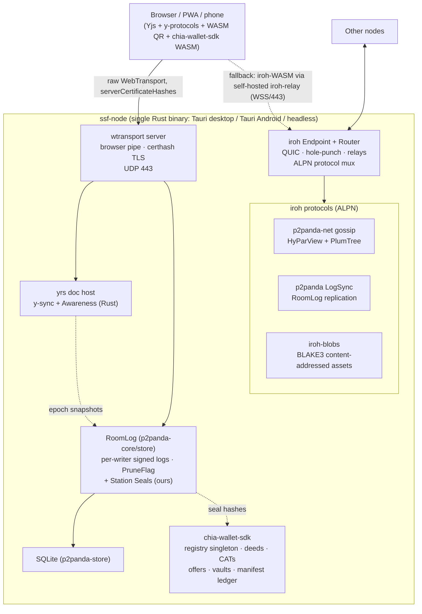

# STUDY — Architecture Distilled v005
*A synthesis pass over [STUDY-Architecture v004](STUDY-Architecture%20v004.md) and its four independent reviews ([GPT‑5.5](../REVIEWS/REVIEW-20260703-ArchitectureV004-GPT55.md), [Gemini 3.1 Pro](../REVIEWS/REVIEW-20260703-ArchitectureV004-Gemini31Pro.md), [Gemini 3.5 Flash](../REVIEWS/REVIEW-20260703-ArchitectureV004-Gemini35Flash.md), [Opus 4.8](../REVIEWS/REVIEW-20260703-ArchitectureV004-Opus48.md)), grounded in fresh primary-source checks (2026‑07‑04) of MDN/Chrome platform data, the iroh, p2panda, y-crdt/yrs, chia-wallet-sdk, Autobase and Hypercore source trees, and the repository's issues (#1, #12), PRs, GDD/TDD, and prototype stubs.*

**Date:** 2026-07-04 · **Author:** Claude Fable 5 (GitHub Copilot)

> **Reading this doc:** v001 surveyed the space. v002 made it a layered, sovereignty-first decision. v003 fixed the CA dependency with cert-hash pinning. v004 verified the browser platform facts and split the trust lanes. The four v004 reviews converged on one addition — *adopt the Cabal/Hypercore model of per-writer append-only logs for durable social state* — and contributed a storage-split matrix, a four-axis pruning scheme, and a pile of pitfalls.
>
> **v005 does five things:**
>
> 1. **Re-verifies the platform ledger** and corrects two claims that expired *since v004 was written eight hours ago* — proof that the verification discipline must be continuous, not episodic (§3).
> 2. **Finds the one gap every review missed — including my own: the entire Cabal/Hypercore/Autobase stack is JavaScript-only.** Adopting its *model* while our node is Rust/Tauri means either embedding a second runtime on every device (heavy, hostile to Android/F-Droid) or realizing the model on Rust-native primitives. §5 names this **the Runtime Gap** and resolves it.
> 3. **Proposes the all-Rust node**: `iroh` (transport) + `p2panda` (append-only room logs, groups, encryption) + `yrs` (Yjs-wire-compatible CRDT hosting) + `wtransport` (browser pipe) + `chia-wallet-sdk` (settlement) — five verified, permissively-licensed, actively-maintained crates, one runtime, one binary (§6).
> 4. **Upgrades three subsystems with primitives we previously planned to hand-roll**: the locked-network WSS bridge becomes the open-source, e2e-encrypted **iroh-relay**; the market order book becomes **gossiped Chia offer files** (settlement-grade total order for free); the registry/manifest tooling becomes **chia-wallet-sdk** in both Rust and browser WASM (§8–§10).
> 5. **Ships the deployment playbook as code** — node, browser client, RoomLog seam, QR capability flow, registry, systemd, and the Station-in-a-Box — with links into this repository and the upstream ones (§12).
>
> The sovereign premise is unchanged and non-negotiable: **nothing on the critical path may depend on infrastructure we or our players do not control.** v005 differs from v004 only on *how*, never *whether*.

---

## 1. TL;DR — What v005 Changes vs v004

| Topic | v004 said | v005 verdict |
|-------|-----------|--------------|
| Browser↔node primary transport | Raw WebTransport + `serverCertificateHashes` (Baseline 2026, incl. Safari 26.4) | ✅ **Keep unchanged.** Re-verified 2026‑07‑04 on MDN: all majors, incl. iOS/Android WebViews (§3.1) |
| LAN dialing & Local Network Access | "WebSockets/WebTransport/WebRTC are *not yet* gated" on LNA | ❌ **Expired.** MDN now lists WebTransport as *Subject to Local Network Access restrictions* from **Chrome 147**; the LNA prompt itself shipped in Chrome 142. LAN dial from a public origin now triggers a permission prompt on Chromium; design for it (§3.2) |
| Diegetic "comms weather" via `WebTransport.getStats()` | Assumed available | ⚠️ **Chrome does not expose `getStats()`** (Firefox partial, Safari full). Use our own ping/echo datagrams for RTT/loss on Chromium (§3.3) |
| Native backbone | `rust-libp2p` (QUIC, gossipsub, Kademlia, Relay v2, DCUtR) | 🔧 **Replace with `iroh`** — QUIC with in-connection hole-punching, self-hostable relays, DNS *and* Mainline-DHT discovery, mDNS-local, WASM-in-browser, and it is the substrate `p2panda` already rides. One stack fewer to bridge (§6.2) |
| Browser fallback lane | `js-libp2p` webRTC-direct ↔ `rust-libp2p` webrtc | 🔧 **Replace with iroh-WASM via self-hosted iroh-relays.** The v004 "WSS bridge on a volunteer node" tier and the fallback lane merge into one audited, e2e-encrypted, open-source component we don't have to write (§8) |
| Durable social state (chat/boards/contracts) | Not designed; reviews say "adopt Cabal/Autobase model" | ➕ **RoomLog on `p2panda`**: per-writer Ed25519 signed append-only logs, owner-controlled authority groups (`p2panda-auth`), group encryption (`p2panda-encryption`), built-in pruning (`PruneFlag`) — the Autobase model, Rust-native, MIT/Apache-2.0 (§7) |
| Quorum checkpoints (Autobase `signedLength`) | (from Opus 4.8 review) use Autobase indexers | 🔧 p2panda has no off-the-shelf equivalent — **we build "Station Seals"**: a small quorum-signature message over a log-frontier hash; optionally anchored on Chia. This is the one piece of novel protocol we own (§7.3) |
| Live room state | Yjs docs + signed delta envelope | ✅ Keep — and the node hosts them **natively via `yrs`** (verified: the Rust y-sync protocol + `Awareness` ship in the `yrs` crate). Positions ride awareness, never the persisted doc (§6.3, §9) |
| Markets / total order | (Opus 4.8): sequencer or Chia; CRDT causal order is not enough | ➕ **The order book is a pool of gossiped, signed Chia offer files.** The chain enforces an offer settles at most once — double-spend-proof marketplaces without building a sequencer for the settlement-grade path (§10) |
| Chia integration | Hand-rolled registry record + injected wallet | 🔧 **`chia-wallet-sdk`** (Rust + **browser WASM bindings**, verified): CATs, NFTs, DIDs, offers, **vaults (multi-sig custody)**, clawbacks, and even an on-chain **Bulletin** primitive. Registry + manifest ledger + deeds all get real tooling (§10) |
| Relay/seed policy, capability QR, passkey-PRF, F-Droid, Android Doze, storage split, 4-axis pruning | v004 + reviews | ✅ **Adopted wholesale**; folded into §7/§9/§11 with the reviews credited. Not relitigated |

---

## 2. Method — Sources & Verification Discipline

Everything load-bearing was re-checked against primary sources **on 2026‑07‑04**, one day after v004 and its reviews:

- **MDN** `WebTransport` compat table (page last modified 2026‑06‑19) — Baseline 2026 banner, per-browser versions, worker availability, the LNA restriction row, `getStats` support.
- **Chrome for Developers** — "New permission prompt for Local Network Access" (updated 2025‑09‑29: prompt launched Chrome 142).
- **iroh docs** (docs.iroh.computer) — what-is-iroh, relays, language/platform matrix, WASM-browser page.
- **p2panda monorepo** (github.com/p2panda/p2panda) — crate inventory, `SPDX-License-Identifier: MIT OR Apache-2.0` headers, `p2panda-core` operation format (Ed25519 `verifying_key` + `signature`, `seq_num`, `backlink`, BLAKE3 `payload_hash`, `PruneFlag`), `p2panda-net` gossip (HyParView + PlumTree configs), `LogSync`, mDNS, confidential discovery, the high-level `p2panda` Node API (causal ordering, pruning, SQLite, crash-resilient pipeline).
- **y-crdt/y-crdt** — `yrs::sync::{Protocol, AsyncProtocol, Awareness, SyncMessage}`: a complete Rust implementation of the y-sync wire protocol *including awareness*, plus Yjs-compat tests and the `ywasm` bindings.
- **xch-dev/chia-wallet-sdk** — `bindy` multi-target bindings with an explicit **`wasm`** feature and `wasm/src/lib.rs` (`bindy_wasm!`), drivers for CATs/NFTs/DIDs/Offers/Vaults(MIPS)/ClawbackV2/**Bulletin**/XCHandles, `RpcClient`, and a test simulator.
- **holepunchto/autobase + hypercore** — verified 2026‑07‑03 (previous session): `signedLength` quorum checkpoints, indexer writer sets, optimistic blocks, fast-forward; Hypercore `clear`/`truncate`/mark-and-sweep/`prologue`. Apache-2.0. **All JavaScript.**
- **Repository:** Issues #1 (rooms/companies/markets/blockchain custody) and #12 (QR phone chat, seeders, SSL question, Alluxia‑F's follow-up questions); PRs #2–#13 (docs professionalization, architecture studies v002–v004, core-loop/camera/character/navigation demos); [ROADMAP.md](../../ROADMAP.md); [docs/TDD/02-Systems/CoreTechnology.md](../../docs/TDD/02-Systems/CoreTechnology.md); [docs/TDD/03-Implementation/Phase1-ExecutionPlan.md](../../docs/TDD/03-Implementation/Phase1-ExecutionPlan.md) (still cites v002 + `simple-peer` — amendment list in §15); the still-empty Sprint‑3 seams [NetworkProvider.ts](../../prototypes/01-core-loop-demo/src/network/NetworkProvider.ts) and [YjsSync.ts](../../prototypes/01-core-loop-demo/src/network/YjsSync.ts).

Claims I could **not** verify to primary-source standard are explicitly tagged **[SPIKE]** and appear in §14/§15 rather than being asserted as fact.

---

## 3. Verification Ledger — Corrections & Confirmations

### 3.1 ✅ Confirmed: the WebTransport foundation holds (and two details improved)

Re-checked on MDN 2026‑07‑04. `WebTransport` is **Baseline 2026** — Chrome/Edge 97+, Firefox 114+, Safari **26.4** (desktop + iOS + WebView-on-iOS), Chrome Android 97+, Samsung Internet 18+, WebView Android 97+. `serverCertificateHashes`: Chrome/Edge 100+, Firefox 125+, Safari 26.4, Samsung Internet 19+, **WebView Android 100+** (relevant to the Tauri Android client's webview, though v004's decision to own WT in Rust stands). Two additions v004 didn't note:

- **`WebTransport` works in Web Workers in all majors** (MDN banner) — the §12 worker topology is safe cross-browser.
- The new **`protocol`** property (ALPN-style application protocol negotiation *inside* WT) is in Chrome 143+/Safari 26.4 — useful later for versioning `ssf-wt/1` vs `/2` without a second port, but Firefox lacks it, so keep in-band version negotiation.

### 3.2 ❌ Expired v004 claim: Local Network Access now gates WebTransport (Chrome 147)

v004 §3.5 said LNA "is not yet gating WebSockets/WebTransport/WebRTC." That was true when Chrome's blog post was written and is **no longer true**: MDN's compat table now carries a *"Subject to Local Network Access restrictions"* row for WebTransport marked **Chrome 147** (and the LNA permission prompt itself launched in **Chrome 142**). Consequences:

1. **The LAN/dorm direct-dial flow on Chromium now triggers a permission prompt** (public origin → private IP). Design it diegetically: *"Extend station comms onto your local network?"* → user taps Allow. One prompt per origin.
2. **Requests from Service/Shared Workers require the permission to have been granted from a document context first** — the phone client must make its first LAN dial from the page, not from inside the network worker.
3. The **mixed-content exemption** (private-IP literals, `.local` names, `targetAddressSpace: "local"`) and the **enterprise policy** pre-grant remain available.
4. **Firefox and Safari still ship no LNA gate** — Firefox remains the smoothest LAN-party browser, reinforcing v004 §6.4's "Firefox is first-class" stance.
5. The cleanest LNA-free LAN modes are: (a) the **native/Tauri client** (no browser gate at all), and (b) a **page served from the LAN itself** (private→private is not gated in LNA's first milestone) — which §12.6's Station-in-a-Box exploits.

**Meta-lesson:** v004's platform table went stale in *one day* on this row. The `BrowserSupportMatrix.md` maintenance policy GPT‑5.5 proposed (v004 review §4.9) is hereby promoted from "nice to have" to **required pre-sprint ritual**.

### 3.3 ⚠️ New pitfall: `WebTransport.getStats()` is not implemented in Chrome

MDN: `getStats()` — **Chrome/Edge: No** (footnoted), Firefox 114 partial, Safari 26.4 full. v004 §12.4's "comms weather" console assumed WT stats were free. On Chromium they aren't. **Fix (cheap):** the protocol already has datagrams — add a 1-byte `PING`/`PONG` frame pair and compute RTT/jitter/loss ourselves in the network worker; use `getStats()` where present as a bonus. This also gives *identical* metrics across transports (WT, relay, WebRTC), which the TransportMode ladder needs anyway.

### 3.4 ✅ Confirmed: iroh — QUIC hole-punching stack with self-hostable relays and browser WASM

Verified from docs.iroh.computer (2026‑07‑04):

- **Endpoint = keypair.** Peers dial a stable `EndpointID` (public key), not an IP; connections are QUIC + TLS 1.3, e2e-encrypted; hole-punching happens *inside* the QUIC connection (an `n0_nat_traversal` extension inspired by the IETF QUIC NAT-traversal draft), with QAD (QUIC Address Discovery) probes to relays. "Roughly 9 out of 10 networking conditions allow a direct connection" (their number; treat as vendor-optimistic until our locked-network matrix says otherwise — §15 spike).
- **Relays are stateless, e2e-blind, and self-hostable** — open-source binary (`iroh-relay` in n0-computer/iroh), used first as rendezvous, then as encrypted fallback path. n0's free public relays are **rate-limited, dev-only** — a sovereignty trap if we shipped with defaults (§13 P‑3).
- **Discovery is pluggable and includes a fully P2P option**: DNS (self-hostable `dns.iroh.link`-style server) *and* **BitTorrent Mainline DHT** (BEP‑44 signed records) *and* local mDNS. The Mainline option means peer discovery can survive without *any* project-run DNS — a nice redundancy alongside the Chia registry.
- **Router + ALPN protocol composition**: `iroh-blobs` (BLAKE3-verified content-addressed transfer — our asset lane), `iroh-gossip` (topic broadcast), custom protocols, all multiplexed on one endpoint.
- **WASM/browser is supported** (dedicated docs page + browser-echo example; endpoint connects via relay-WebSockets since browsers can't UDP). Official bindings: Rust/Python/Swift/**Kotlin (Android)**/JavaScript (Node N-API).
- **Swappable transports below QUIC, including Tor/Nym/Bluetooth** — a documented path for the §14 dark-frontier ideas.

### 3.5 ✅ Confirmed: p2panda — the Cabal/Autobase *model* as Rust crates, MIT OR Apache-2.0

Verified from the monorepo (2026‑07‑04). Every crate header reads `SPDX-License-Identifier: MIT OR Apache-2.0`. The pieces map one-to-one onto what the four reviews asked for:

| Review ask (v004 cycle) | p2panda delivery (verified) |
|---|---|
| Per-writer signed append-only logs (Cabal/Hypercore model) | `p2panda-core`: `Header { verifying_key, signature, seq_num, backlink, payload_hash (BLAKE3), extensions }` — Ed25519-signed, fork-tolerant, single-writer logs composable into multi-writer streams |
| Deterministic multi-writer ordering (Autobase `apply`) | high-level `p2panda` node: "multi-writer causal ordering", event-processor pipeline with at-least-once delivery, ACKs, replay, crash recovery, atomic SQLite transactions |
| Pruning as a first-class citizen (Opus 4.8 §7) | `PruneFlag` header extension in `p2panda-core` (feature `prune`); the Node API lists pruning as a built-in; docs: "state vectors exchanged in constant size" |
| Owner-controlled co-host / indexer set (Opus 4.8 §4.1's Sybil fix) | `p2panda-auth`: "decentralised, offline-first group management with fine-grained, per-member permissions" (their access-control CRDT is documented in two 2025 blog posts) |
| Room-scoped E2EE | `p2panda-encryption`: group data- and message-encryption with post-compromise security and optional forward secrecy; `p2panda-spaces` composes auth+encryption (**explicitly pre-1.0/unstable** — §13 P‑2) |
| Gossip + sync over our transports | `p2panda-net`: iroh endpoint, gossip with **HyParView membership + PlumTree broadcast** (the "mesh subsetting" Gemini 3.1 Pro §6.5 asked to spike — it's literally the shipped algorithm pair), `LogSync`, mDNS, **confidential topic discovery via private-set-intersection** (topics behave like secret radio frequencies — §14.2) |
| Store-and-forward / sneakernet tier | p2panda is "broadcast-only at its heart… compatible with shortwave, packet radio, BLE, LoRa **or simply a USB stick**" — the DTN/data-mule tier is a design goal of the substrate, not a bolt-on |
| Proof it runs inside Tauri mobile apps | Toolkitty (iOS/Android/desktop, Tauri) and Dash Chat (offline-first messenger, Tauri) are shipping on it |

### 3.6 ✅ Confirmed: yrs hosts Yjs natively in Rust — including Awareness

Verified in y-crdt/y-crdt: `yrs` is the Rust port of Yjs (wire-compatible; the repo carries Yjs-compat tests), and — the part none of the reviews noticed — **`yrs::sync` implements the complete y-sync protocol in Rust**: `SyncStep1/SyncStep2/Update` messages, an extensible `Protocol`/`AsyncProtocol` trait pair, an `Auth` message with `PermissionDenied`, `Custom` message tags (a clean home for our signed-delta envelope), **and the `Awareness` CRDT-less presence structure**. Consequence: the Tauri/headless node hosts room docs and presence *natively* — no JS, no bridge, and the browser keeps using stock Yjs + `y-protocols` unmodified. This is the load-bearing fact that makes §6's one-runtime node real for the CRDT lane.

### 3.7 ✅ Confirmed: chia-wallet-sdk — Rust *and* browser-WASM Chia tooling

Verified in xch-dev/chia-wallet-sdk: the `bindy` binding layer has explicit `napi` (Node), **`wasm`** (browser), and `pyo3` targets; `wasm/src/lib.rs` generates the browser API. Drivers cover CATs, NFTs, DIDs, **Offers** (settlement payments, `NotarizedPayment`), **Vaults/MIPS** (multi-sig custody — company-owned stations from Issue #1!), ClawbackV2, streamed assets, option contracts, an **on-chain `Bulletin`/`BulletinMessage` primitive**, the **XCHandles** name-registry drivers (prior art for our station registry), an `RpcClient` for coinset-style full-node HTTP endpoints, and a local simulator for tests. v003/v004 assumed we'd hand-roll most of this; we won't.

### 3.8 ✅ Re-affirmed from the review cycle (adopted, not relitigated)

Two-lane trust split; raw-WT-primary; Tauri‑2 Android APK as the sovereign phone (iOS-web the honest asterisk); manifest ledger = *post-install* integrity only; WebAuthn **PRF** feature-detected with fallbacks; SharedWorker absent on Chromium-Android (present Firefox-Android 151+); Yjs state-vector re-handshake on reconnect; TURN-over-TLS + reverse-tunnel bridges as convenience tier; capability tokens with short TTLs + challenge-bound QR; RF‑1 cold-start durability handshake; allowlisted-signed-only seeding; the storage-split matrix and four-axis pruning (Opus 4.8 §6–§7); store-and-forward as the design floor. **Autobase/Hypercore/Cabal remain the *conceptual* reference** — verified good ideas — but see §5 for why they cannot be the implementation.

---

## 4. Review Adjudication — the Four v004 Reviews

| # | Suggestion | Source | Verdict | Where |
|---|-----------|--------|---------|-------|
| 1 | RoomLog layer between Yjs and Chia (append-only, seeded, subjective moderation) | GPT‑5.5 §5.3–5.6 | **Adopt** — realized on p2panda instead of Hypercore | §7 |
| 2 | Adopt the Cabal *model*, not the *stack*; Autobase indexers = permissioned quorum | Opus 4.8 §5 | **Adopt the model; correct the substrate** (Runtime Gap, §5) | §5–§7 |
| 3 | Reject open leaderless consensus (Sybil-defenceless) | Opus 4.8 §4.1 vs Gemini 3.1 Pro §6.3 | **Adopt Opus 4.8's rebuttal** — authority = small owner-controlled group | §7.2 |
| 4 | Storage-split matrix; positions = awareness only (reverse CoreTechnology.md anti-pattern) | Opus 4.8 §6 | **Adopt verbatim** | §9 |
| 5 | Four-axis pruning + per-device budgets + Chia-anchored checkpoints | Opus 4.8 §7 | **Adopt** — realized as PruneFlag + Station Seals | §7.3–7.4 |
| 6 | Markets need total order (sequencer or Chia), not causal CRDT order | Opus 4.8 §4.3 | **Adopt + improve**: Chia offer files *are* the total order for settlement-grade trades | §10 |
| 7 | Yjs state-vector handshake on WT reconnect | Gemini 3.5 Flash §2.1 | **Adopt** (code in §12.3) | §12.3 |
| 8 | Mobile = outbound-only client; foreground-service hosting; demote-before-death | Gemini 3.5 Flash §2.2, GPT‑5.5 §4.4, Gemini 3.1 Pro §2.4 | **Adopt** | §11 |
| 9 | LNA preflight/permission handling | Gemini 3.5 Flash §2.3 | **Adopt — updated**: prompt-based (not CORS-preflight) since Chrome 142/147 | §3.2 |
| 10 | Common `SsfEnvelope` across all transports (bridge by envelope) | GPT‑5.5 §4.3 | **Adopt** | §12.2 |
| 11 | Hardware role table as product promises | GPT‑5.5 §4.11 | **Adopt** | §11 |
| 12 | TURN-over-TLS, reverse-WSS bridge | GPT‑5.5 §6.1–6.2, Gemini 3.1 Pro §3.1 | **Adopt — subsumed**: iroh-relay *is* a reverse tunnel on 443 with better properties | §8 |
| 13 | MASQUE/CONNECT-UDP (RFC 9298) as principled UDP-over-443 | Opus 4.8 §8.3 | **Adopt as research tier** (native first) | §8 |
| 14 | UDP-443 masquerade spike | Opus 4.8 §8.2 | **Adopt** — pin WT listener to UDP/443 in spikes | §12.1, §15 |
| 15 | Cloudflare-Worker blind forwarders | Gemini 3.1 Pro §3.2 | **Modify → de-emphasize**: iroh-relay self-hosting covers the need without a third-party PaaS on the path | §8 |
| 16 | Subjective moderation per station/community | GPT‑5.5 §5.6, Opus 4.8 §5.1 | **Adopt** — mute/block lists are client-local views over per-writer logs | §7.5 |
| 17 | Capability revocation: TTLs, challenge-bound QR, gossiped revocation sets | Opus 4.8 §4.2 | **Adopt** | §11.3 |
| 18 | RF‑1 cold-start durability handshake ("pin to ≥N nodes") | Opus 4.8 §4.4 | **Adopt** — `DurabilityState` in the NetworkProvider port | §12.2 |
| 19 | Blind-seeding legal exposure → allowlisted-signed-only seeding | Opus 4.8 §4.5 | **Adopt** | §11.2 |
| 20 | Physical-board = local-only as a storage-tiering gift | Opus 4.8 §4.6 | **Adopt** — physical boards live only in the room's log replicas | §9 |
| 21 | Browser features: Document PiP, silent-audio keepalive, Idle Detection, Network Info, Background Fetch, CompressionStream, Storage Buckets | Opus 4.8 §9 | **Adopt opportunistically** (CompressionStream is Baseline → use in RoomLog storage now) | §12.3 |
| 22 | WebNN local AI, WebRTC Encoded Transform E2EE | Gemini 3.1 Pro §4 | **Adopt opportunistically** (deferred phases) | §14 |
| 23 | Archivist profession, data crystals, NPC data-mules, erasure-coded vaults | Opus 4.8 §10, GPT‑5.5 §7.4 | **Adopt (design, Phase 3+)** — now with a substrate built for it (§3.5 sneakernet row) | §14 |
| 24 | Multi-writer *movement* validation by consensus | Gemini 3.1 Pro §6.3 | **Reject** (Sybil, §4.1 above); movement stays host-soft-authority with signed intents + migration | §7.2 |
| 25 | Browser-native Hypercore replication over WT/WebRTC | Gemini 3.5 Flash §4.1 | **Reject as written** — would put the JS-only stack back on the critical path; the browser talks RoomLog via the node protocol instead | §5 |

---

## 5. The Runtime Gap — the error every review (including mine) missed

The four reviews converged on the right *data model*: per-writer signed append-only logs, permissioned indexer/co-host quorums, quorum-signed checkpoints, subjective moderation. GPT‑5.5 recommended "Hypercore/Autobase or Iroh or Willow or a custom Rust log" in passing; the Opus 4.8 review then made the strongest case for **Autobase semantics** specifically — and left the implementation question dangling with "build on the modern, maintained, Apache-2.0 substrate."

Here is the problem, stated plainly: **Hypercore, Corestore, Hyperswarm, and Autobase are JavaScript libraries that run on Node/Bare.** There is no maintained Rust implementation of Autobase at all, and the community Rust Hypercore crates cover the single-core data structure, not the multi-writer/corestore/swarm layers. Meanwhile the entire v004 node story — Tauri desktop, Tauri-Android APK, headless seeds — is **Rust**. Adopting the Autobase *stack* would therefore mean embedding a second runtime (Node or Bare) inside every node:

- ~30–80 MB of extra runtime per install, against Tauri's ~12 MB thesis;
- a Rust↔JS IPC boundary through the hottest data path (log replication);
- a second language for every security-critical code review;
- materially worse Android/F-Droid reproducibility (NDK + Node embedding);
- and a bus-factor bet on Bare, a young runtime from a single vendor.

Every alternative was already on the table; nobody scored them against the runtime requirement. Scored now:

| Option | Model fit | Runtime | License | Maturity | Verdict |
|---|---|---|---|---|---|
| Autobase/Hypercore (Holepunch) | ★★★ (it *is* the model) | ❌ JS/Bare sidecar | Apache-2.0 | Mature | **Reference semantics; not shippable in our node** |
| Cabal stack | ★★ | ❌ JS, unmaintained | **AGPL-3.0** | Frozen ~2022 | Rejected (v004 cycle) — unchanged |
| **p2panda crates** | ★★★ (logs, groups, encryption, pruning, gossip, sync) | ✅ Rust, rides iroh | **MIT OR Apache-2.0** | Active; core solid; `spaces` pre-1.0 | **Adopt** (§7), wrapped behind our `RoomLog` port |
| Willow/Earthstar | ★★★ (capabilities via Meadowcap) | Rust impl immature | varies | Early | Watch list |
| iroh-docs | ★★ (multi-writer KV, not logs) | ✅ Rust | Apache/MIT | Maintained, narrow | Not a fit for social logs |
| Custom `SsfLog` (~1–2 kLOC on iroh-gossip + BLAKE3 + Ed25519) | ★★☆ (exactly what we spec) | ✅ Rust | ours | We own every bug | **Fallback** if p2panda churn bites (§13 P‑2) |

**Decision:** adopt the **Autobase model on p2panda crates**, behind a thin `RoomLog` port so the implementation can be swapped (p2panda ↔ custom ↔ future Willow) without touching game code. The browser never links any of this directly — it speaks the node's framed protocol (§12.2), so the Runtime Gap is a node-side decision invisible to clients. This single correction is what turns the review cycle's consensus from *aspiration* into *a Cargo.toml*.

---

## 6. The All-Rust Node — one runtime, five verified subsystems



### 6.1 Why this collapse is a simplification, not a rewrite

v004 required **three network stacks** with a hand-written bridge: raw `wtransport` (browser pipe) + `rust-libp2p` (native swarm: QUIC, gossipsub, Kademlia, Relay v2, DCUtR, webrtc-direct) + `js-libp2p` (browser fallback). v005 requires **two**, and the second one ships its own browser story:

- `wtransport` stays exactly as v003/v004 designed it (the sovereign certhash lane — unchanged, already spec-verified).
- **iroh replaces the entire rust-libp2p feature set we were using**: QUIC transport → iroh QUIC; gossipsub → iroh-gossip/p2panda-gossip (HyParView+PlumTree); Kademlia discovery → iroh DNS + **Mainline DHT** + mDNS + the Chia registry; Relay v2 + DCUtR → iroh relays + in-QUIC hole-punching; and it adds **iroh-blobs** (BLAKE3-verified content addressing) which rust-libp2p never gave us — that is the §9 asset lane solved.
- The **browser fallback lane** stops being a second protocol family (js-libp2p webrtc-direct) and becomes **the same iroh network entered from WASM over relay-WebSockets**. Fewer handshakes to reason about; the GPT‑5.5 §4.3 "B2B user-agent bridge" shrinks to envelope-forwarding between two Rust modules in one process.

The trade: iroh's relay tier (needed by browsers-as-iroh-peers and ~1-in-10 native pairs) is a **convenience-lane component with a real domain/cert** — exactly the same sovereignty class as v004's WSS bridge tier, but now it's an audited, stateless, e2e-blind, open-source binary any player can run instead of bespoke bridge code we'd have to write and secure ourselves (§8).

### 6.2 Division of labor (the corrected v004 §6.1 matrix)

| Path | Mechanism | CA? | Reach | Role |
|---|---|---|---|---|
| Browser↔node **primary** | `new WebTransport()` + certhash ↔ `wtransport`, our framed protocol | none | Baseline 2026 | Datagrams: ticks/awareness/ping · Streams: y-sync, RoomLog, assets, capabilities |
| Browser↔swarm **fallback** | iroh-WASM endpoint via **self-hosted iroh-relay** (WSS/443) | relay needs a cert (convenience lane) | all browsers | Locked networks; also the phone path when the room host is unreachable directly |
| Node↔node | iroh QUIC (direct, hole-punched, or relayed) | none | native | RoomLog sync, gossip, blobs, registry chatter |
| Browser↔browser | WebRTC brokered over the node pipe | none | all | Proximity voice/video only |
| LAN | WT to private IP (LNA prompt on Chromium 147+, §3.2) or mDNS for natives | none | see §3.2 | Dorm/LAN-party |
| Settlement/registry | chia-wallet-sdk: native light wallet (node) / WASM + coinset RPC or injected wallet (browser) | n/a | n/a | Deeds, CATs, offers, seals, manifest ledger |

### 6.3 What runs where (the CRDT lane, resolved by yrs)

- **Browser:** stock `yjs` + `y-protocols` (sync + awareness), `y-indexeddb` for instant local load. Unchanged from v004.
- **Node:** `yrs` with `yrs::sync::{DefaultProtocol, Awareness}` (§3.6) — the node is a first-class y-sync peer, holds the authoritative room docs, applies the signed-envelope check before `apply_update`, emits epoch snapshots into the RoomLog, and relays awareness (positions) **without ever persisting it**.
- **Wire:** identical y-sync bytes both directions; our signed-delta envelope rides `Message::Custom` tags so vanilla y-protocols tooling still parses the stream during development.

---

## 7. RoomLog — durable social state, the Cabal model in Rust

### 7.1 Data model

A **room** = one p2panda **topic** (32-byte secret; discovered via doors/QR/registry — the map-embedded-network idea from [CoreTechnology.md](../../docs/TDD/02-Systems/CoreTechnology.md) realized). Within a topic:

- Every participant writes to their **own single-writer log** (`p2panda-core`: Ed25519-signed headers, `seq_num` + `backlink` hash-chain, BLAKE3 payload hashes, fork-tolerant). Nobody can wipe a board: readers simply *ignore* logs from muted authors (Cabal's defining property, kept).
- Message kinds are CBOR payloads: `chat`, `board-post`, `mail`, `contract-offer`, `contract-accept`, `mod-flag`, `door-event`, `snapshot-ref` (Yjs epoch anchors), `seal` (§7.3).
- The high-level `p2panda` node handles **causal ordering** across writers, at-least-once delivery, replay, and SQLite persistence — the Autobase `apply` role.

### 7.2 Authority: owner-controlled groups, not open consensus

Adopting Opus 4.8 §4.1 (contra Gemini 3.1 Pro §6.3): the writer/co-host set is **permissioned**. `p2panda-auth` provides decentralized, offline-first groups with per-member fine-grained permissions — the room owner admits co-hosts (desktop/headless nodes of trusted players) and grants roles: `write` (post to your log), `co-host` (serve sync + countersign seals), `owner` (manage the group). Drive-by phones (Issue #12) post via **capability-scoped optimistic writes**: the node accepts a signed message from a non-member if it carries a valid room capability (§11.3), then republishes it into a host-side "guests" log — the Autobase "optimistic block" pattern with the capability as the self-verification. *Movement stays host-soft-authority per v004 §9.3* — RoomLog is for durable social/economic state, not per-tick simulation.

### 7.3 Station Seals — the quorum checkpoint we build ourselves

p2panda gives us logs, groups, and pruning, but **no Autobase-`signedLength` equivalent** — no primitive where a quorum signs "history up to here is canonical and safe to prune behind." This is the one novel protocol piece v005 takes ownership of, and it is small:

```text
Seal {
  room_id,                       // topic id
  epoch: u64,                    // monotone
  frontier: Vec<(log_id, seq)>,  // per-writer high-water marks
  frontier_hash: blake3,         // hash over the frontier + the covered ops
  yjs_snapshot_hash: blake3,     // the room doc epoch snapshot (§9)
  signers: Vec<(pubkey, sig)>,   // ≥ quorum of the room's co-host group
}
```

- Emitted periodically (and on host migration) by co-hosts; gossiped as a normal RoomLog message.
- **Safe pruning:** any replica may drop operations at-or-before a sealed frontier (`PruneFlag` marks the cut), keeping only `frontier_hash` for verification — Opus 4.8's axis‑3 compaction realized. Late-returning peers fast-forward from the latest seal + retained tail instead of replaying months.
- **Chia anchor (optional, tiny):** the room's registry singleton records `(epoch, frontier_hash)` on rotation — Issue #1's "rooms saved in blockchain?" answered precisely: *not the bytes, the seal*. A peer that was away for months trusts the chain, not the swarm, about which compacted state is canonical. Doubling as GPT‑5.5's "station black box": host migration resumes from the latest seal.
- **[SPIKE]** quorum size vs. co-host churn; seal cadence vs. Chia fee dynamics (batch many rooms per spend, v004 §8.2's staged pattern).

### 7.4 Pruning — the four axes land on concrete APIs

| Axis (Opus 4.8 §7) | v005 mechanism |
|---|---|
| 1 · Interest scope | Subscribe only to topics for rooms you inhabit (p2panda partial sync); physical boards replicate **only** among that room's co-hosts (GDD rule, §9); Yjs subdocs load on room entry |
| 2 · Age tiering + local GC | `PruneFlag` + SQLite deletes below the sealed frontier; per-device byte budgets via `navigator.storage.estimate()` (web) / DB size (node); CompressionStream before OPFS writes |
| 3 · Checkpoint compaction | Station Seals (§7.3) + Yjs epoch snapshots (`gc: true`, snapshot → new epoch, drop old tombstone graph) |
| 4 · Global anchor | Seal hash into the room's Chia singleton; 32 bytes on-chain buys trustless "which compacted state is real" |

### 7.5 Moderation

Per-writer logs make moderation **subjective and local** (Cabal's model, GPT‑5.5 §5.6): `mute`/`block` are client-side filters; stations publish a default moderation list as a signed RoomLog message that clients *may* subscribe to; companies/friend-groups can publish their own. Nobody needs global consensus to stop seeing a vandal, and no moderator can destroy another author's data — they can only stop *relaying* it (allowlisted seeding, §11.2).

---

## 8. Locked Networks — the ladder, upgraded

| Tier | Path | Change vs v004 |
|---|---|---|
| 0 · Native/local | Tauri in-process node; mDNS LAN; **Station-in-a-Box AP** (§12.6) | added the box |
| 1 · Direct UDP | WT/QUIC on **UDP 443** (masquerade spike — most "UDP blocked" nets allow 443); iroh direct | pin listener to 443 in spikes |
| 2 · P2P traversal | iroh in-QUIC hole-punching + QAD (replaces libp2p DCUtR/AutoNAT) | simpler, one vendor stack |
| 3 · TCP/443 relayed | **self-hosted iroh-relays** — stateless, e2e-blind, open-source, discoverable via the Chia registry's `relays` field | replaces bespoke WSS bridge *and* the js-libp2p fallback; TURN-TCP/TLS remains only for WebRTC voice |
| 4 · Store-and-forward | signed RoomLog bundles over any channel — p2panda is broadcast-only-capable by design (USB, LoRa, radio) | substrate-native now |
| 5 · Community bridges | well-known HTTPS/443 iroh-relays run by station cooperatives, keys in the registry | formalized |
| 6 · Research (native-only) | **MASQUE/CONNECT-UDP (RFC 9298)** proxies on 443; iroh-over-**Tor/Nym** transports (documented iroh swap points) | Tor/Nym now concretely pluggable |

Design floor unchanged: *a hostile network demotes you to a lower-bandwidth citizen; it never ejects you.* Rejections unchanged: no DoH tunneling, no domain fronting, no covert evasion.

---

## 9. Storage Split — the routing table (final form)

Carried from the Opus 4.8 review §6 with v005 substrate names; this is the canonical answer to "how much of which data goes over which protocol":

| Class | Example | Substrate | Persisted by | Prune trigger |
|---|---|---|---|---|
| Ephemeral awareness | positions, typing, who's-here, voice RTP | **Yjs/yrs Awareness** + WT datagrams | **nobody — never written to disk** | vanishes in seconds |
| Live spatial state | room layout, furniture, doors, power, repair | **Yjs (browser) / yrs (node)** docs, `gc:true`, per-room subdocs | room host + co-host quorum | epoch snapshot → seal → drop old epoch |
| Social/economic log | chat, boards, mail, contracts, mod-lists, door events | **RoomLog (p2panda)** | subscribers by interest; deep history → archivists | age tier + `PruneFlag` behind seals |
| Bulk content | glTF, voxel rigs, textures, sound | **iroh-blobs** (BLAKE3 content-addressed) | on-demand LRU cache; pinned by seeders | byte-budget eviction; re-fetch by hash |
| Settlement | deeds, CATs, shares, offers, seals, app manifests | **Chia** via chia-wallet-sdk | the chain | never (only local refs GC) |

Two GDD rules become storage rules verbatim: **physical bulletin boards** replicate only within the room's co-host set (never gossip globally); **terminal boards** are station-scoped aggregations. And the [CoreTechnology.md](../../docs/TDD/02-Systems/CoreTechnology.md) line "Cabal club for short term user position tracking" remains **formally deprecated** (append-only logs must never carry positions — Opus 4.8 §6.1).

---

## 10. Markets & Settlement — Chia offers as the order book

The Opus 4.8 review (§4.3) correctly showed that causal CRDT order cannot arbitrate "who bought it first" — and proposed a host sequencer or Chia settlement. v005 sharpens that with a primitive we now have verified tooling for:

**A Chia offer file is a partially-signed transaction that anyone may complete, and the chain guarantees it settles at most once.** So the exchange floor from Issue #1 ("NYSE/CBOE-style call-out markets") decomposes into:

1. **Order book = a RoomLog topic full of signed offer files** (maker posts `contract-offer` carrying the serialized offer). Replication is just gossip; there is nothing to double-spend because the book is only advertisements.
2. **Taking = settling the offer on-chain** (`chia-wallet-sdk`: `Offer`, `NotarizedPayment`, settlement spends — verified in the SDK, browser-WASM included). Two takers racing? The chain picks exactly one winner; the loser's spend fails cleanly. **Total order purchased from the blockchain instead of built from consensus code.** Community DEXes (Dexie, Hashgreen) already run this exact pattern in production — we inherit a proven market microstructure.
3. **Soft/in-game barter** (spacefuel for a haircut) stays on the **host sequencer**: signed intents → host-signed results → logged to RoomLog. Cheap, instant, good enough where stakes are low.
4. **Company custody** (Issue #1's company-owned stations/spaceports): chia-wallet-sdk **Vaults (MIPS)** give multi-sig custody of deeds/treasuries — a company is a vault + a members group in `p2panda-auth` + a stock CAT. Whale-resistance stays a game-economy rule (warehouse restock limits from Issue #1) enforced by the *station's own* market host — sovereignty means whales can run their own market, not that they can drain Furlong's strategic reserve.

The **registry** (v004 §8.1 `v:4` record) is unchanged in shape, plus two fields — `relays: [url]` (iroh-relay hints) and `seal: {epoch, frontierHash}` — and is now read/written through chia-wallet-sdk singleton drivers on both native and browser-WASM (§3.7) instead of hand-rolled puzzles. The **XCHandles** drivers in the same SDK are prior art for name→station resolution if we later want `furlong.xch`-style handles. **The browser light-verification caveat stands** (v004 §3.8): until the proof-verifying WASM path is proven, public RPC reads are convenience with multi-mirror quorum. **[SPIKE]**

---

## 11. Deployment Roles, Relay Policy, Identity

### 11.1 Hardware roles (product promises — GPT‑5.5 §4.11, updated)

| Device | Promise | Infra roles |
|---|---|---|
| Desktop Tauri | full client + node | room host, co-host/sealer, RoomLog seed, iroh-relay-lite, blob seeder, wallet, station console |
| Headless (VPS/Pi) | community backbone | seeds, relays, registry advertiser, archivist, **no rendering** |
| Android Tauri (F-Droid/sideload) | sovereign phone client | outbound-only by default; *temporary foreground host* with visible notification; relay/seed opt-in (Wi-Fi + charging) |
| iOS PWA / desktop browser | convenience client | none (SW-pinned app shell, exportable keys); the honest asterisk |
| iroh-relay volunteer | reachability utility | stateless, e2e-blind; quota'd; listed in registry |

### 11.2 Relay/seed policy — "contribute safely" (v004 §11, kept)

Reservation caps, per-room quotas, capability-gated relay use, bandwidth ceilings, and **allowlisted-signed-content-only seeding** (a node re-seeds a blob only if its hash appears in a room manifest signed by an author its moderation view trusts — Opus 4.8 §4.5's legal-exposure fix). Relay accounting feeds the Phase‑3 comms-guild profession.

### 11.3 Identity & capabilities (consolidated from the cycle)

Portable Ed25519 game keypair (signs RoomLog ops, Yjs envelopes, registry reads); passkey/OS-keychain **wraps** it where PRF exists (feature-detected; Argon2id-passphrase + encrypted-file/QR export otherwise); WebAuthn RP-ID caveat stands. QR flow is **challenge-bound**: QR carries a room-scoped challenge + certhash; phone answers over WT with its pubkey; node mints an audience-bound, short-TTL Biscuit-style capability (photograph-the-QR replay dies). Rooms keep a small gossiped revocation set, pruned behind seals like everything else.

---

## 12. Deployment Playbook — with code

> Everything below is written against the crates/APIs verified in §3 and marked **illustrative** where signatures are simplified. Repository seams referenced: [NetworkProvider.ts](../../prototypes/01-core-loop-demo/src/network/NetworkProvider.ts), [YjsSync.ts](../../prototypes/01-core-loop-demo/src/network/YjsSync.ts), [Phase1-ExecutionPlan.md](../../docs/TDD/03-Implementation/Phase1-ExecutionPlan.md). Upstream code: [n0-computer/iroh](https://github.com/n0-computer/iroh) · [p2panda/p2panda](https://github.com/p2panda/p2panda) · [y-crdt/y-crdt](https://github.com/y-crdt/y-crdt) · [BiagioFesta/wtransport](https://github.com/BiagioFesta/wtransport) · [xch-dev/chia-wallet-sdk](https://github.com/xch-dev/chia-wallet-sdk) · reference semantics: [holepunchto/autobase](https://github.com/holepunchto/autobase).

### 12.1 The node (`ssf-node`): one binary, five subsystems

```toml
# ssf-node/Cargo.toml (illustrative pins; run the licensing/version audit per §15)
[dependencies]
tokio        = { version = "1", features = ["full"] }
iroh         = "0.9x"                # Endpoint, Router, relays, discovery
iroh-blobs   = "0.9x"                # BLAKE3 content-addressed assets
p2panda-core  = "0.5"                # signed append-only logs (+ "prune")
p2panda-net   = "0.5"                # gossip (HyParView/PlumTree), LogSync, mDNS
p2panda-store = "0.5"                # SQLite operation store
p2panda-auth  = "0.5"                # room authority groups
yrs          = "0.2x"                # Yjs-compatible CRDT + y-sync + Awareness
wtransport   = "0.6"                 # WebTransport server (browser pipe)
chia-wallet-sdk = "0.2x"             # registry singleton, deeds, offers, seals
blake3, ed25519-dalek, serde, ciborium, rcgen = "*"
```

```rust
// ssf-node/src/main.rs — assembly sketch (illustrative; APIs per §3.4/§3.5/§3.6)
use iroh::{protocol::Router, Endpoint};

#[tokio::main]
async fn main() -> anyhow::Result<()> {
    let cfg = NodeConfig::load("node.toml")?;                    // §12.5

    // 1 · iroh endpoint: stable key identity, hole-punching, self-hosted relays only
    let endpoint = Endpoint::builder()
        .secret_key(cfg.node_key.clone())
        .relay_mode(cfg.relays.clone().into())                   // NEVER default publics (§13 P-3)
        .discovery_n0_dns(cfg.dns_discovery)                     // optional, self-hostable
        .discovery_dht()                                         // Mainline DHT (BEP-44) — no project DNS needed
        .bind().await?;

    // 2 · RoomLog: p2panda gossip + log-sync + SQLite, one topic per room
    let rooms = RoomLogHost::spawn(&endpoint, &cfg.database_url).await?; // wraps p2panda-net builders

    // 3 · Assets: BLAKE3 content-addressed blob store, allowlist-gated seeding (§11.2)
    let blobs = iroh_blobs::BlobsProtocol::new(&open_store(&cfg)?, None);

    // 4 · Live state: yrs docs + Awareness per room; signed-envelope check before apply
    let docs = YrsRoomHost::new(rooms.clone());                  // yrs::sync::DefaultProtocol under the hood

    // 5 · Chia: registry advertise (staged cert rollover), seals, deeds — chia-wallet-sdk
    let ledger = ChiaService::start(&cfg.chia).await?;

    // Router: every subsystem is an ALPN protocol on ONE QUIC endpoint
    let _router = Router::builder(endpoint.clone())
        .accept(iroh_blobs::ALPN, blobs)
        .accept(b"ssf/roomlog/1", rooms.clone())
        .spawn();

    // Browser pipe: raw WebTransport on UDP 443 (locked-net spike, §8 Tier 1),
    // ≤14-day self-signed ECDSA-P256 identity, staged current/next hashes → registry
    let wt_identity = wtransport::Identity::self_signed(&cfg.wt_hosts)?; // rcgen underneath
    ledger.advertise_registry_v5(&endpoint, &wt_identity, rooms.seal_head()).await?;
    serve_webtransport(cfg.wt_bind /* e.g. 0.0.0.0:443 */, wt_identity, docs, rooms, blobs).await
}
```

The `serve_webtransport` accept-loop is v003's `wt_listener.rs` unchanged in spirit: accept session → read `Hello{room_id, capability}` → verify capability (§11.3) → hand the session's streams to the y-sync handler (`yrs::sync::DefaultProtocol::handle`) and the RoomLog/asset handlers, datagrams to the tick/awareness/ping path (§3.3).

### 12.2 The shared envelope and ports (browser + node speak one shape)

```ts
// shared/protocol.ts — the GPT-5.5 §4.3 envelope, now the only message shape on every transport
export type SsfEnvelope = {
  v: 1;
  room: string;
  kind: 'tick' | 'awareness' | 'ysync' | 'roomlog' | 'asset' | 'cap' | 'ping' | 'pong';
  seq: number;              // per-sender, per-kind
  author: Uint8Array;       // Ed25519 pubkey
  payload: Uint8Array;      // CBOR body (y-sync bytes, p2panda op, blob request…)
  sig?: Uint8Array;         // required for state-mutating kinds
};

export type TransportMode =
  | 'direct-unreliable' | 'direct-reliable'
  | 'relayed-unreliable' | 'relayed-reliable'
  | 'store-forward' | 'offline';

export type DurabilityState = {                 // Opus 4.8 §4.4 — surfaced diegetically
  replicas: number;         // co-hosts holding the latest seal
  sealedEpoch: number;
  pinned: boolean;          // "station records backed up"
};

export interface NetworkProvider {              // fills prototypes/01-core-loop-demo/src/network/NetworkProvider.ts
  connect(boot: RoomBootstrap): Promise<void>;  // certhash dial → fallback ladder (§8)
  mode(): TransportMode;
  durability(): DurabilityState;
  sendTick(buf: Uint8Array): void;                       // datagram, fire-and-forget
  openChannel(kind: SsfEnvelope['kind']): Promise<Duplex>;
  stats(): { rttMs: number; loss: number };              // own ping/pong — §3.3
}

export interface RoomLog {                      // NEW seam (Opus 4.8 §12) — p2panda-shaped
  append(kind: string, body: Uint8Array): Promise<OpId>;
  subscribe(from?: SealRef): AsyncIterable<RoomLogOp>;   // causal order, post-seal fast-forward
  moderation(): ModerationView;                          // local mute/block over per-writer logs
  sealHead(): Promise<SealRef>;
}
```

### 12.3 The browser client — dial, sync, presence

```ts
// web/src/adapters/sovereignNetwork.ts
import * as Y from 'yjs';
import { Awareness, applyAwarenessUpdate, encodeAwarenessUpdate } from 'y-protocols/awareness';
import * as syncProtocol from 'y-protocols/sync';

export async function connectPrimary(boot: RoomBootstrap): Promise<RoomSession> {
  const wt = new WebTransport(boot.wtUrl, {                       // Baseline 2026 incl. Safari 26.4 (§3.1)
    serverCertificateHashes: boot.certHashes.map(h => ({ algorithm: 'sha-256', value: b64(h) })),
  });
  await wt.ready;

  // capability handshake (challenge-bound QR flow, §11.3)
  const cap = await answerChallenge(wt, boot.challenge, myKeypair);

  // y-sync over one reliable bidi stream — WITH the state-vector re-handshake
  // (Gemini 3.5 Flash §2.1): SyncStep1 both ways on every (re)connect, never blind streaming
  const ys = frame(await wt.createBidirectionalStream(), 'ysync');
  const doc = await loadLocalDoc(boot.roomId);                    // y-indexeddb: instant local-first load
  ys.send(syncProtocol.writeSyncStep1(doc));                      // node's yrs answers SyncStep2 (§3.6)

  // presence: positions ride AWARENESS over DATAGRAMS — never the persisted doc (§9)
  const awareness = new Awareness(doc);
  onMove(p => { awareness.setLocalStateField('pos', p); });
  awareness.on('update', ({ added, updated, removed }) =>
    wt.datagrams.writable.getWriter().write(
      env('awareness', encodeAwarenessUpdate(awareness, [...added, ...updated, ...removed]))));

  // comms weather: our own RTT probe — Chrome has no WT getStats() (§3.3)
  startPingLoop(wt.datagrams, stats => hud.commsWeather(stats));

  return new RoomSession(wt, doc, awareness, cap);
}

// Fallback (locked networks): the SAME room via an iroh-WASM endpoint through a
// self-hosted iroh-relay (WSS/443). One import, feature-detected, mode → 'relayed-reliable'.
export async function connectFallback(boot: RoomBootstrap) {
  const { Endpoint } = await import('@number0/iroh-wasm');        // [SPIKE] §15 — maturity gate
  const ep = await Endpoint.bind({ relays: boot.relays });
  return wrapIrohSession(await ep.connect(boot.nodeId, 'ssf/roomlog/1'), boot);
}
```

RoomLog bytes are compacted with **CompressionStream** before OPFS writes (Baseline, §4 #21); per-device budgets read `navigator.storage.estimate()` and evict cold assets first (Storage Buckets where present).

### 12.4 Signed Yjs deltas verified node-side (yrs)

```rust
// node: reject unauthorized mutations BEFORE they touch the doc (v004 §9.1, on yrs)
use yrs::sync::{DefaultProtocol, Message, Protocol};
use yrs::updates::decoder::Decode;

fn on_ysync_frame(env: SsfEnvelope, room: &mut Room) -> anyhow::Result<Vec<Message>> {
    anyhow::ensure!(room.members.may_write(&env.author), "not a member/capability holder");
    anyhow::ensure!(verify_ed25519(&env.author, &env.payload, env.sig()?), "bad signature");
    // now (and only now) run the standard y-sync state machine
    Ok(DefaultProtocol.handle(&mut room.awareness, &env.payload)?.into_vec())
}
```

### 12.5 `node.toml` and the headless seed

```toml
[node]     database_url = "ssf.sqlite"
[wt]       bind = "0.0.0.0:443"          # UDP 443 masquerade (§8 Tier 1)
           hosts = ["203.0.113.7"]       # cert SANs; ≤14-day auto-rotating, staged next-hash
[iroh]     relays = ["https://relay.stationfurlong.example"]   # self-hosted; NEVER default publics
           dht = true                                          # Mainline discovery
[rooms]    seed = ["deck:furlong:cantina", "deck:furlong:promenade"]
           budget_gb = 20
[relaypolicy] max_reservations = 32; max_bytes_per_min = 50_000_000; capability_required = true
[chia]     wallet = "keys/station.key"; registry_singleton = "xch1..."; seal_cadence_hours = 24
```

```ini
# /etc/systemd/system/ssf-node.service — Persona D (community seed / archivist)
[Unit]        Description=StarStationFurlong node    After=network-online.target
[Service]     ExecStart=/usr/local/bin/ssf-node --config /etc/ssf/node.toml
              Restart=on-failure   User=ssf   AmbientCapabilities=CAP_NET_BIND_SERVICE
[Install]     WantedBy=multi-user.target
```

### 12.6 Station-in-a-Box (new): the LAN-sovereign deployment

A Raspberry Pi image that is a **complete station with zero internet**: `ssf-node` (headless) + Wi-Fi AP + captive portal that serves the PWA **from the LAN origin** + mDNS. Because the page itself is served from the local network, Chromium's LNA gate (§3.2) never fires (no public→local hop), natives discover it via mDNS, and phones join via the QR flow against the box's certhash. Dorms where the campus net blocks everything, classrooms, game jams, and the Issue #12 "seeders as visible lore" fantasy all get served by one ~$50 artifact — and it doubles as the sneakernet courier: carry the box, carry the station (p2panda store-and-forward, §8 Tier 4). **[SPIKE §15]** — page-level TLS for the LAN origin (installed-PWA offline shell vs. local CA vs. `.local` cert UX) is the one open wrinkle.

### 12.7 Chia lane snippets (browser WASM + node)

```ts
// browser: verify a Station Seal anchor via chia-wallet-sdk WASM (§3.7)
import init, { RpcClient } from 'chia-wallet-sdk-wasm';
await init();
const rpc = new RpcClient(mirrors.pickQuorum());                 // multi-mirror until proofs land (§10)
const rec = await rpc.getCoinRecordsByHint(stationSingletonHint);
const { epoch, frontierHash } = parseRegistryV5(rec);            // trust anchor for RoomLog fast-forward
```

```rust
// node: company custody = multi-sig vault (Issue #1) — chia-wallet-sdk MIPS drivers
let vault = clvm.mint_vault(parent_coin_id, company_custody_hash, memos)?;  // m-of-n officers
// deed CAT for a room module travels into the vault; freighter loading/unloading = vault spends,
// which IS the on-chain custody trail Issue #1 asked for.
```

---

## 13. Pitfalls & Gaps Registry (each with its fix)

| # | Pitfall | Severity | Fix |
|---|---|---|---|
| P‑1 | **Runtime Gap**: Autobase/Hypercore/Cabal are JS-only; adopting the stack forces a second runtime into every Rust node | Critical (was invisible) | Adopt the *model* on p2panda behind the `RoomLog` port (§5–§7); Holepunch stays the semantics reference |
| P‑2 | **p2panda is pre-1.0**: APIs may break; `p2panda-spaces` explicitly unstable; `p2panda-blobs` mid-refactor (use iroh-blobs directly instead) | High | Pin exact versions; wrap behind `RoomLog`; Phase‑1 rooms = signed-but-unencrypted with capability-gated transport, `spaces`-based E2EE is a Phase‑2 spike; fallback = custom `SsfLog` on `p2panda-core` only (its most stable crate) or pure iroh-gossip |
| P‑3 | **iroh public-relay trap**: defaults point at n0's rate-limited relays — a third-party dependency on the critical path | High | Ship with **self-hosted relays only**, registry-discovered; relay list is user-editable; docs make "run a relay" a one-liner (§8, §12.5) |
| P‑4 | **iroh-WASM maturity** (browser endpoint via relay-WS) | Medium | Raw WT stays primary; iroh-WASM is the fallback lane behind feature detection; spike before Sprint 3 (§15) |
| P‑5 | **LNA expansion**: Chrome 147 gates WT to LAN; workers need doc-context grant first | Medium | Diegetic prompt; first LAN dial from the page; enterprise-policy note for schools; Firefox path; Station-in-a-Box serves from LAN origin (§3.2, §12.6) |
| P‑6 | **No `getStats()` on Chromium WT** | Low | Own ping/pong datagrams; uniform metrics across transports (§3.3) |
| P‑7 | **Station Seals are novel protocol** (quorum checkpoint) | Medium | Keep the message tiny and auditable; spike quorum/cadence; anchor on Chia so a wrong swarm can't rewrite history (§7.3) |
| P‑8 | **Group-encryption membership churn under partition** (MLS-adjacent ordering) | Medium | Defer E2EE rooms to the `spaces` spike; capability-gating + signed ops are Phase‑1 sufficient for game chat |
| P‑9 | **Browser Chia light-verification still unproven** (carried from v004 §3.8) | High (unchanged) | wallet-sdk WASM + coinset RPC with multi-mirror quorum as convenience; proof-verifying client remains a go/no-go spike (§10) |
| P‑10 | **Total-order needs** beyond markets (contract acceptance, auctions) | Medium | Chia offers for value; host sequencer + RoomLog receipt for soft cases; never "the CRDT will sort it out" (§10) |
| P‑11 | Platform tables rot fast (LNA row flipped in a day) | Chronic | `docs/TDD/BrowserSupportMatrix.md` with date-checked rows; re-verify before every networking sprint (§3.2) |
| P‑12 | Carried, still open: WebAuthn-PRF coverage, F-Droid reproducibility (Rust+NDK+Vite), Android Doze host-thrash, capability revocation UX, RF‑1 durability | — | §11, §15 spike list; unchanged from the v004 cycle |

---

## 14. Outside-the-Box

1. **Station-in-a-Box** (§12.6) — the sovereignty thesis as a physical object; also the classroom/game-jam onboarding story and the ultimate de-platforming answer: the station fits in a backpack.
2. **Radio bands are real**: p2panda's confidential discovery (private-set-intersection over topic knowledge) means *you literally cannot hear a frequency you don't know* — tune the SpacePhone by learning topic secrets from doors, maps, and NPCs. Network mechanics as diegetic mechanics, no extra crypto invented.
3. **The order book is paper**: Chia offer files as in-world *contract documents* — printable, tradeable, QR-able, dead-droppable (GPT‑5.5's sneakernet crates now carry legally-binding cargo). An offer pinned to a physical bulletin board is both fiction and a working financial instrument.
4. **Data mules with manifests**: NPC freighters carry RoomLog bundles between stations (p2panda store-and-forward is substrate-native, §3.5); the mail arriving *because the ship docked* is the frontier fantasy and the DTN tier in one mechanic. Archivist profession + data-crystal cold storage (Opus 4.8 §10) ride the same rails.
5. **Seals as civic ritual**: co-host countersigning of a Station Seal can surface in-world — the "notary terminal" prints the epoch hash; players *see* durability (DurabilityState, §12.2) instead of trusting it.
6. **Dark-frontier transports**: iroh's documented Tor/Nym transport swap = smuggler routes — slower, anonymous lanes as endgame content and as a real censorship posture (research tier, native only).
7. **Local AI stays on the table** (WebNN/llama.cpp on the node for robotic captains) — opportunistic, off critical path, per the v004 cycle.

---

## 15. Spikes & Phase‑1 Amendments

### 15.1 Prioritized spikes (supersedes v004 §13.1)

1. **WT certhash dial matrix** (carried, top spot): Chrome/FF/Safari 26.4, desktop+mobile, IP-literal vs DNS, **UDP 443**, LAN with the **Chrome 147 LNA prompt** recorded (§3.2).
2. **RoomLog-on-p2panda**: 3 co-hosts + 1 flapping phone; causal convergence, capability-scoped guest writes, `PruneFlag` compaction behind a Seal, post-seal fast-forward; measure vs the Autobase reference behavior. *(Subsumes the v004-cycle host-thrash + retention spikes.)*
3. **Station Seal protocol**: quorum size/cadence; Chia anchor cost; months-away peer recovery from seal + chain only.
4. **iroh adoption gate**: endpoint-under-wtransport coexistence (two QUIC sockets), self-hosted relay + DHT-only discovery drill (kill DNS, kill relay — measure what survives), **iroh-WASM fallback lane** maturity (P‑4).
5. **yrs⇄Yjs conformance**: browser y-protocols vs node `yrs::sync` incl. Awareness churn + epoch snapshot/restore (§3.6).
6. **chia-wallet-sdk**: registry v5 singleton on testnet11 (staged cert rollover), offer-book round-trip (make/gossip/take/observe-double-take-fail), WASM bundle size/perf budget (P‑9 go/no-go).
7. **Android**: `tauri android build` with the full crate set (iroh + p2panda + yrs + wtransport-client); Doze/foreground-service host demotion; F-Droid reproducibility inventory.
8. **Comms-weather probe**: ping/pong datagram stats vs `getStats()` where present (§3.3).
9. **Station-in-a-Box image**: Pi + AP + captive portal + LAN-origin PWA TLS story (§12.6).
10. **MASQUE/CONNECT-UDP** relay prototype (research tier, native-only).

### 15.2 Concrete repo edits (unchanged files, listed for the next PR)

- [Phase1-ExecutionPlan.md](../../docs/TDD/03-Implementation/Phase1-ExecutionPlan.md): replace the `simple-peer` row with **raw WebTransport (primary) + iroh-WASM relay (fallback)**; replace "Embedded Signaler (axum + tokio-tungstenite WSS)" with **`wtransport` server + iroh endpoint**; Architecture Reference → **v005**; add spikes 1–6 as Sprint‑3 pre-work.
- [NetworkProvider.ts](../../prototypes/01-core-loop-demo/src/network/NetworkProvider.ts): implement the §12.2 port (`TransportMode`, `DurabilityState`, `stats()`).
- [YjsSync.ts](../../prototypes/01-core-loop-demo/src/network/YjsSync.ts): state-vector re-handshake, signed-envelope hook, awareness-for-positions, epoch-snapshot hook (§12.3).
- New `RoomLog.ts` port stub beside them (§12.2) — the seam exists from day one even while the Phase‑1 adapter is a single-writer stub.
- [CoreTechnology.md](../../docs/TDD/02-Systems/CoreTechnology.md): annotate the Cabal bullets → "superseded by RoomLog (v005 §7); positions explicitly excluded"; keep the map-embedded-network idea, which v005 realizes via topic secrets.
- New `docs/TDD/BrowserSupportMatrix.md` with date-stamped rows (P‑11).

---

## 16. Final Recommendation

Keep everything the v004 cycle proved: the two trust lanes, raw-WebTransport certhash as the sovereign browser pipe, Tauri desktop + Android as the fully sovereign clients, Chia as discovery + settlement, signed-intent soft-host authority, the storage-split matrix, four-axis pruning, and store-and-forward as the floor. Then make the three moves the evidence now forces:

1. **Close the Runtime Gap.** The Cabal/Autobase *model* is right and its *stack* is JavaScript; a Rust node cannot ship it. Realize the model on **p2panda** behind a swappable `RoomLog` port, add the one missing primitive ourselves (**Station Seals**), and keep Holepunch as the semantics reference.
2. **Consolidate the native stack on iroh** — QUIC hole-punching, self-hosted stateless relays (which subsume the WSS-bridge tier), Mainline-DHT discovery redundancy, blobs for assets, WASM for the browser fallback — and host Yjs **natively via yrs** so the node is one runtime, one binary, five verified subsystems.
3. **Buy total order instead of building it**: the market's order book is gossiped Chia offer files settled at most once by the chain (via chia-wallet-sdk, Rust *and* browser WASM), with the host sequencer reserved for soft barter — and keep re-verifying the platform ledger every sprint, because v004's LAN-access row expired in a single day.

In one line: **v004 proved the browser platform is ready; v005 proves the *node* can actually be built — one Rust binary in which transport, memory, money, and forgetting are all sovereign — and hands Sprint 3 the code seams to start.**

---

*Companion to [STUDY-Architecture v004](STUDY-Architecture%20v004.md) and the four v004 reviews. Grounded in Issues [#1](https://github.com/Bella-Addormentata/StarStationFurlong/issues/1) and [#12](https://github.com/Bella-Addormentata/StarStationFurlong/issues/12), [ROADMAP.md](../../ROADMAP.md), [CoreTechnology.md](../../docs/TDD/02-Systems/CoreTechnology.md), and primary-source checks of MDN, Chrome LNA, iroh, p2panda, y-crdt, chia-wallet-sdk, Autobase, and Hypercore dated 2026‑07‑03/04. Highest-leverage next step: **spike #2 (RoomLog-on-p2panda) alongside spike #1 (the certhash dial matrix)** — together they de-risk both novel axes of this document.*
