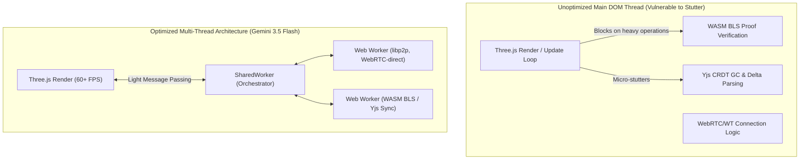

# Review of STUDY-Architecture v003
**Date**: 2026-07-03  
**Evaluator**: Gemini 3.5 Flash (GitHub Copilot)  
**Focus**: Performance Optimization, Mobile-First Edge Constraints, Security/Authentication of Shared State, and Diegetic System Design

---

## 1. Executive Summary & Core Verdict

The v003 architecture is a significant leap forward. It resolves the load-bearing CA-trust paradox of v002 by utilizing **WebTransport with certificate-hash pinning (`serverCertificateHashes`)** and **libp2p WebRTC-direct**. This successfully anchors browser-to-node transport trust in the immutable Chia ledger. 

This review provides a critical critique of v003 under the lens of **high-performance web mechanics, battery/UI thread budget on mobile devices, Local Network Access constraints, and zero-trust security for peer-to-peer room state**. We detail practical solutions to bypass corporate and university firewalls, introduce unexploited web capabilities, and propose game mechanics that contextualize network states (latency/bandwidth) as in-universe atmospheric simulation.

---

## 2. Hard Architectural Realities & Hidden Pitfalls

While [brainstorming/AI BRAINSTORMING/STUDY-Architecture v003.md](brainstorming/AI%20BRAINSTORMING/STUDY-Architecture%20v003.md) and [brainstorming/REVIEWS/REVIEW-20260703-ArchitectureV003-GPT55.md](brainstorming/REVIEWS/REVIEW-20260703-ArchitectureV003-GPT55.md) explore the physical networking constraints, several critical lower-level software bottlenecks must be addressed to protect core gameplay loops.



### 2.1 The DOM Main Thread Blocking Bottleneck (Micro-Stutters)
- **The Issue**: In prototypes like [prototypes/01-core-loop-demo/src/network/NetworkProvider.ts](prototypes/01-core-loop-demo/src/network/NetworkProvider.ts), the networking and sync layers are run directly on the browser's single main execution thread.
- **The Pitfall**: Running heavy JS/WASM-based cryptography (such as Chia BLS signature verification) and parsing voluminous Yjs CRDT JSON frames directly on the main thread will choke the Three.js rendering thread. Any spike in peer activity, layout replication, or chat volume will cause visible micro-stutters and frame drops back-to-pack.
- **Why it matters**: A real-time space hangout has zero tolerance for local rendering lag when a player walks into a high-density area like the Promenade.

### 2.2 Local Network Access (LNA) Restriction Trap
- **The Issue**: Modern Web browsers (such as Chromium and Safari) enforce strict **Local Network Access (LNA) policies**. A secure context page hosted at a public origin (e.g., `https://furlong.space` or `https://gateway.ipfs.io`) is forbidden from initiating socket connections to local IP subnets (e.g., `127.0.0.1`, `192.168.1.X`, or custom LAN scopes) where a local Tauri companion node runs, unless a secure handshake occurs.
- **The Pitfall**: The WebTransport dial will simply crash at connection setup on the client side with an LNA security exception. 
- **Implication**: Players on the same local subnet (e.g. LAN party, dorm room) won't be able to connect directly to each other's native nodes via WebTransport, fracturing local multiplayer capabilities unless correct preflight responses and security exception headers are engineered.

### 2.3 The WebRTC Connection Mesh Storm ($O(N^2)$ Scaling Failure)
- **The Issue**: Mesh architectures scale exponentially in connection complexity. For a room with $N$ active voice-enabled players, a direct WebRTC peer network requires:
  $$C = \frac{N(N - 1)}{2} = \mathcal{O}(N^2)$$
  individual peer connections.
- **The Pitfall**: At 10–12 players, mobile devices running phone chat (e.g., Issue #12) will suffer connection starvation, severe jitter, and audio/video pipeline dropout due to OS-enforced socket cap limits and excessive CPU encoder overhead.
- **Implication**: Standard WebRTC multi-peer structures can only service micro-rooms. Larger hangouts will crash, necessitating a soft-authority delegation system or a zero-trust Selective Forwarding Unit (SFU) mode running on native Tauri hosts.

### 2.4 The Security/Vandalism Risk in Unsigned Yjs Delta Chains
- **The Issue**: Yjs is an amazing document sync tool, but it natively operates under a trust-all model. Once a client is connected to a Yjs CRDT space, they can generate arbitrary insert/delete operations.
- **The Pitfall**: A rogue node or modified client can dispatch malicious tombstone/delete deltas to wipe clean a bulletin board, delete player-owned modules, or spam state tables.
- **Implication**: Uncapped write permissions mean total lack of sovereignty over localized room state. The architecture needs an operations verification layer.

---

## 3. Circumventing Locked-Down Networks (Advanced Engineering)

To guarantee connection stability for campus dorms and corporate networks that completely block UDP transport, we must introduce a reliable fallback matrix.

```
       +---------------------------------------------+
       |   Client attempts WebTransport (UDP/443)    |
       +----------------------+----------------------+
                              |
                     [Success | Fail (UDP Blocked)]
                              v
       +----------------------+----------------------+
       |   Client falls back to WebRTC over TCP      |
       |  (ICE candidate typ: tcp, multiplexed)      |
       +----------------------+----------------------+
                              |
                     [Success | Fail (DPI Filtering)]
                              v
       +----------------------+----------------------+
       |   Ephemeral DNS-over-HTTPS (DoH) Tunneling  |
       | (Sync mini state/chat packets as DNS TXT)   |
       +----------------------+----------------------+
```

### 3.1 WebRTC over TCP (ICE TCP) masquerading
When strict firewalls perform deep packet inspection (DPI) and shut down standard UDP sockets, native Tauri nodes must fall back to listening on **TCP port 443**. By passing TCP ICE candidates (`typ tcp`) to browsers, we can establish secure bidirectional WebRTC data channels wrapped in standard TCP frames that look identical to secure HTTPS traffic.

### 3.2 Ephemeral DNS-over-HTTPS (DoH) Tunneling for Low-Bandwidth Presence
If outbound TCP/UDP to unrecognized IPs is strictly blocked except for standard DNS, the browser client can utilize a public DNS-over-HTTPS provider (such as Cloudflare or Google DoH) to fetch and push tiny encrypted state updates.
- **How it works**: Small state payloads (e.g., player presence, text chat characters) are base64-encoded and appended as subdomains in a query to a designated domain monitored by our native peer seeders (`<payload>.tunnel.ssf.example`). 
- **Sovereignty intact**: Because DoH is encrypted and routed through massive global DNS providers, firewalls cannot block it without blocking all Web lookup services for the entire network.

### 3.3 Dorm Room LAN Mesh via mDNS & Tauri Relay
If the external internet gateway is down or completely restricted, native Tauri nodes running on local dorm machines can launch a local **mDNS (multicast DNS)** scan. Nodes announce themselves as local LAN relays, allowing browser clients in the same dorm to connect locally. 

---

## 4. Unexploited Browser Capabilities & Value-Adds

Developing a lightweight, multi-platform client allows us to leverage advanced Web API architectures that v003 didn't cover.

### 4.1 SharedWorker as the Network Orchestrator
Instead of spawning the network stack inside every single tab or running individual libp2p swarms when a player opens multiple tabs (e.g. tracking local transactions, reading a separate bulletin board, spacephone), we can run a single **SharedWorker**.
- **Impact**: All tabs connect to one SharedWorker context. The worker houses the libp2p node, maintains the WebTransport sockets, caches Yjs sync state, and distributes updates to all tabs via `MessageChannel`. Slashes battery usage, memory footprint, and network connection count.

### 4.2 Web Security & Hardware-Backed Wallets (WebHID)
- **Use Case**: WebHID allows browser tabs to communicate directly with native hardware wallets (like Ledger or Trezor) over USB. Players can execute on-chain Chia settlements, deed transfers, or asset transfers directly from their physical secure element without needing Tauri or intermediate native software.

### 4.3 Web Cryptography API (Hardware-Accelerated Encryption)
Instead of forcing WASM to perform symmetric encryption on WebRTC media blocks, we can utilize native **WebCrypto PBKDF2 / AES-GCM**.
- **Impact**: Zero-lag, zero-trust media encryption. For SpacePhone calls running through a native Tauri player-node relay, the browser encrypts standard audio frames using WebCrypto at the hardware driver level. The Tauri node merely routes the binary buffers without any ability to decrypt the calls, satisfying top-tier privacy constraints.

### 4.4 Web Audio API (Spatial/Proximity Filters and Radio Static)
- **Use Case**: Implement actual space-grade communications. The Web Audio API can construct complex real-time audio graphs:
  - **Proximity Chat**: Auto-attenuate audio volume based on $3D$ vector distances computed in [prototypes/01-core-loop-demo/src/renderer.ts](prototypes/01-core-loop-demo/src/renderer.ts).
  - **Atmospheric/Degradation Modeling**: Dynamically add biquad bandpass filters, ring modulation, and low-frequency noise (radio wave crackle) when players are far apart, behind walls, or when network packets are dropping. Network state becomes a natural part of the soundscape.

---

## 5. Outside-the-Box In-Game Designs

We can build the technical mechanics of the serverless network directly into the game's lore, mechanics, and UI.

### 5.1 "Space Comm Weather" as a Network Diagnosis
Instead of a technical error dialog reading "Connection Jitter: High / Packet Loss: 20%", we can present this in-game as an atmospheric anomaly:
- **Game UI**: The player's SpacePhone shows an "Electromagnetic Interference warning due to local Solar Flare active in Furlong grid."
- **Gameplay Integration**: High packet loss degrades voice connection quality by mapping of the packet loss rate directly to a Web Audio noise-gate. Smoothly blends mechanical realities into immersive roleplay.

### 5.2 Comms Infrastructure Professional Guilds (The Tech-Preneur Role)
Since native Tauri seed nodes require bandwidth and running relays costs money, players can build in-game careers around establishing network stability:
- **Mechanic**: Players contract with "Furlong Comms Guilds", spending their in-game currency or CATs to allocate bandwith slots on native nodes. A player who maintains a highly reliable community node earns passive income or special trading favors on the decentralized local bulletin board directories.

### 5.3 Space Crate "Sneakernet" (Dead Drops)
If a player is entirely isolated from the internet (offline or strictly censured), they can still progress their offline station activities.
- **Mechanic**: Under store-and-forward mode, crafting queues, inventory ledger updates, and signature proofs are packed into a local "Physical Cargo File" (.ccfg / .ssf).
- **Physical Handover**: The player saves this to a portable flash drive (or QR code) and gives it to another spacer at a local meetup. Once that spacer returns to an unblocked Tauri network node, the transaction is validated on the blockchain on their behalf, completing the loop secure-by-proof.

---

## 6. Crucial Missing Studies (Spikes List)

Before we start production of Sprint 3 and Sprint 4 network engines in [prototypes/01-core-loop-demo/src/network/NetworkProvider.ts](prototypes/01-core-loop-demo/src/network/NetworkProvider.ts), we must investigate these specific edge cases:

1. **WASM-to-Worker Isolation Spike**: Build a test model where the entire Yjs state-syncing engine and Chia BLS crypto engines are isolated inside a dedicated Web Worker to verify complete eradication of main thread micro-stutters.
2. **Local Network Access (LNA) Preflight Spike**: Verify that a Tauri node's embedded HTTP server can successfully respond to Chromium preflight queries so custom LAN connections work without manual user security bypasses.
3. **Signed CRDT Delta Pipeline Spike**: Design a wrapper around Yjs updates where every update is wrapped in a signed message payload, rejecting unsigned mutations from unauthenticated peer connections.
4. **ICE-TCP Port 443 Fallback Spike**: Code a minimal proof-of-concept where a native Tauri host acts as a WebRTC ICE-TCP host on port 443 to verify firewall circumvention.

---

## 7. Actionable Phase 1 Roadmap Revisions

Before writing any line of production networking code, we must align our [ROADMAP.md](ROADMAP.md) Phase 1 tasks with the physical constraints of v003. We suggest upgrading Phase 1 tasks with the following roadmap:

- [ ] **Spike 1: Multi-Thread Offloader**: Move the Yjs sync and identity code off the UI thread into a Web Worker pipeline.
- [ ] **Spike 2: ICE-TCP Fallback**: Implement the automatic TCP port 443 fallback in the native Tauri binary.
- [ ] **Spike 3: QR Cert Phone Bootstrap**: Complete Issue #12's phone chat logic over WebTransport with absolute verification of server certificate hash-pinning.
