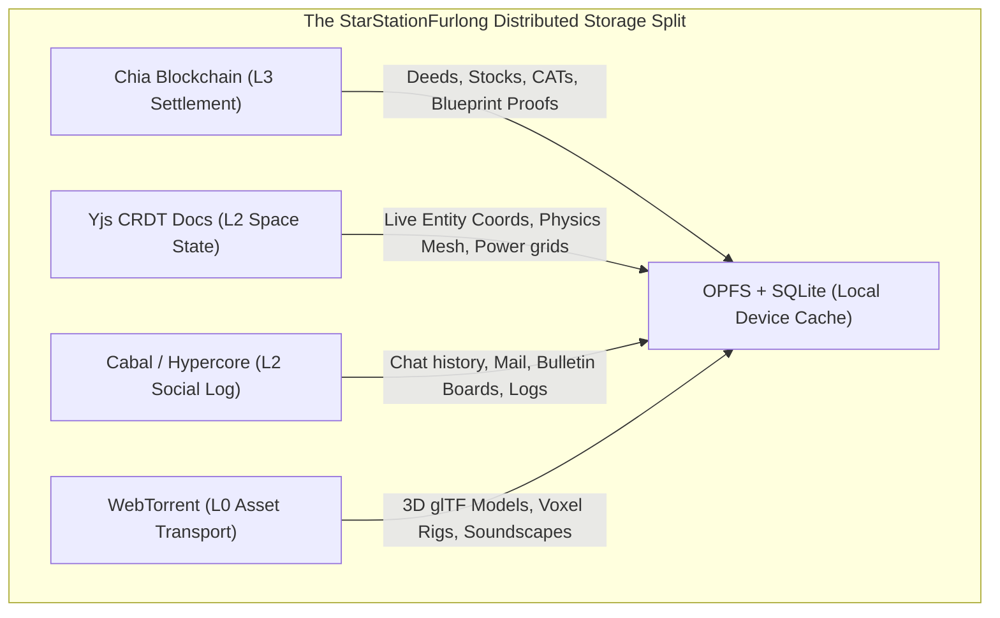

# Review of STUDY-Architecture v004 — Gemini 3.5 Flash
**Date**: 2026-07-03  
**Evaluator**: Gemini 3.5 Flash (GitHub Copilot)  
**Focus**: Multi-Platform Deployment Realities, Distributed Storage Protocol Splits (Hypercore/Cabal), Network/DPI Circumvention, and Zero-Trust Verification

---

## 1. Executive Summary & Verdict

The v004 architecture is a masterclass in verification and structural repair. By auditing the platform assumptions of v003 and the underlying reviewers' recommendations, it establishes a mathematically sound, platform-accurate blueprint. 

Major validated corrections include:
- Elevating WebTransport + `serverCertificateHashes` to the cross-browser default due to its newly launched **Baseline 2026** status (including Safari 26.4).
- Rejecting the broken assumption of `rust-libp2p` native WebTransport server compatibility (replacing with raw `wtransport` servers alongside libp2p WebRTC-direct).
- Designing a native Android APK build using Tauri 2 to bypass the browser's first-load Web-PKI hurdle on mobile, leaving iOS-web as our single remaining platform hurdle.
- Defining a proper multi-threaded Worker topology that respects browser limits (e.g., WebRTC staying on the main thread, and lack of SharedWorker support on Chrome-Android).

This review addresses the remaining hidden holes, proposes concrete methods to bypass strict firewalls without compromising sovereignty, and details a complete **Multi-Protocol Storage Split** utilizing **Cabal (Hypercore)**, **Yjs**, **WebTorrent**, and the **Chia blockchain**.

---

## 2. Unresolved Pitfalls & Hidden Technical Gaps in v004

Despite its rigor, v004 still contains several load-bearing gaps that will fail under stress if not resolved before Phase 1 networking implementation.

### 2.1 The "State Vector Drift" Trap in Raw WebTransport Streams
- **The Pitfall**: v004 correctly replaces libp2p-WebTransport with a raw `wtransport` server communicating with browser clients via a custom, lightweight length-prefixed stream protocol. However, Yjs updates are incremental byte arrays. If a browser temporary disconnects due to Wi-Fi packet drop and dials back into the same player node, sending raw incremental streams without a strict state handshake will cause either:
  1. **Data loss**: If updates generated by the node or other clients during the disconnect are missed.
  2. **CRDT Corruption**: If stream chunks are parsed out of order.
- **The Fix**: The raw WebTransport handshake *must* execute a two-step state-sync protocol:
  1. The client sends its local Yjs state vector (`Y.encodeStateVector(doc)`).
  2. The Tauri node compares this with its authoritative document and writes back only the missing chronological block updates (`Y.encodeStateAsUpdate(doc, clientStateVector)`).

### 2.2 The Mobile Wake Lock & Sockets Suspension Reality
- **The Pitfall**: v004 introduces a native Android Tauri 2 client to run the local Rust core. While this avoids the Web-PKI load block, mobile OS battery-optimization schedulers (Android's Doze mode, iOS background execution restrictions) aggressively shut down raw listening sockets, drop background UDP connections, and freeze active background processes.
- **The Fix**: The mobile native app should explicitly launch a **Foreground Service** with an ongoing OS notification when active in a station. Furthermore, we must declare the Android/iOS client as a **pure outbound-only player client**. It must *never* initialize the raw `wtransport` listening server or act as an active peer in the libp2p DHT swarm, preserving cellular battery and preventing OS battery-scheduler termination.

### 2.3 Local Network Access (LNA) Preflight CORS Gate
- **The Pitfall**: Under Chrome's phased LNA rollout, even if WebTransport and WebRTC are not fully blocked yet, any local asset delivery or HTTP routing from a public origin (`https://furlong.space`) to a local companion node (`https://127.0.0.1:4443`) will require the local node to respond correctly to **preflight OPTIONS checks** returning the `Access-Control-Allow-Private-Network: true` header. Failing to handle this preflight logic will render local LAN play and local companions un-routable.

---

## 3. The Distributed Storage Protocol Split (Core Analysis)

To prevent resource exhaustion on mobile devices and avoid the bloated state issues of standard real-time architectures, we must formalize the separation of game content, game state, and game chat across specialized distributed storage protocols.



### 3.1 The Division of Data Labor Matrix

| Category | Storage Protocol | Lifetime | Consistency Model | Core Reasoning |
|---|---|---|---|---|
| **Game Content** (Assets)<br/>*3D glTF meshes, voxel grids, sound layers, textures.* | **WebTorrent (WebRTC)** ∪ **IPFS/Helia** cached in **OPFS** | Permanent, read-only | Content-Addressed Hash Verified | Browsers cannot download heavy raw files from DHTs natively. Files are split into cryptographic chunks, distributed co-operatively, and verified locally. |
| **Game State** (Real-time Spatial)<br/>*Door status, logical coordinates, repair levels, engine fuel, inventories.* | **Yjs CRDT** over **WebTransport Datagrams / Streams** | Ephemeral, short-lived | Concurrency Resolved, Soft Host Validation | Web-native, perfect for real-time collaborative coordinate state. Compacts constantly to prevent document memory bloat. |
| **Game Chat & Bulletins** (Social)<br/>*Local room chats, SpacePhone mail, persistent bulletin boards.* | **Cabal / Hypercore (Append-Only logs)** | Long-lived, append-only | Cryptographically Signed Log Chain | **Critical Integration Point**: Using Yjs for chat results in infinite document growth. Using append-only hypercores allows every player to cryptographically own their post logs. Prevents vandalism; other users can ignore/mute a vandal's feed without breaking room integrity. |
| **Monetary Ledger** (Value Balance)<br/>*Station deeds, CAT counts, cargo manifests.* | **Chia Blockchain (Layer 3)** | Permanent, immutable | Global Consensus | Security-critical, handles high-value asset transitions. Latency-tolerant (18-second blocks). |

---

## 4. Integrating Cabal / Shared Hypercore Hosting

To natively support Cabal-style hypercore peer replication in the zero-install web client without introducing centralized proxy gateways, we must adapt the transport layers:

### 4.1 Browser-Native Hypercore over WebTransport & WebRTC
Traditional Cabal relies on raw TCP/UDP sockets to run the hypercore replication protocol. We can replace this transport fallback on the browser client:
- **Tauri Node as a Multi-Core Relay**: The native Tauri/headless nodes run standard rust-based hypercore swarms. They expose a raw WebTransport endpoint to the browser, wrapping hypercore replication frames inside a dedicated WebTransport stream.
- **Browser-to-Browser WebRTC Replication**: When two browser clients are in the same spatial room, they can run hypercore replication protocols directly against each other's local IndexedDB-backed hypercore caches using WebRTC Data Channels. This bypasses the need for any default centralized database.

---

## 5. Bypassing Strict Campus/Corporate Firewalls

To guarantee connection stability for players inside heavily locked-down environments (where UDP is strictly dropped above port 53), we must implement robust, non-deceptive TCP fallbacks.

### 5.1 SNI-Multiplexed WSS on Port 443
When Deep Packet Inspection (DPI) blocks direct TCP WebRTC candidate connections and dropped WebTransport handshakes, the client must descend down the fallback ladder to a **WebSocket over SSL (WSS)** endpoint:
- **The Setup**: Volunteer nodes run a standard web server (Nginx/Envoy) serving an ordinary HTTPS site on port 443. Incoming connections targeting a specific SNI (Server Name Indication) are automatically multiplexed directly into our local axum-based signaling / WSS bridge socket.
- **Why it works**: A firewall cannot block this without blocking all normal HTTPS browsing traffic to that specific host.

### 5.2 TURN-over-TCP Fallback
Our `NetworkProvider` configuration should automatically bundle a list of community-operated **TURN-over-TCP/443** server endpoints. When direct UDP hole punching fails:
- WebRTC media and data packets are encapsulated in standard TLS/TCP frames.
- This mimics general HTTPS traffic, allowing complete traversals of symmetric NAT firewalls.

---

## 6. Unexploited Browser Capabilities & Features For StarStationFurlong

Beyond v004, several fresh, non-obvious Web APIs can be creatively exploited to elevate gameplay.

### 6.1 OPFS SyncAccessHandle inside background Workers
- **Use Case**: Real-time asset loading in Three.js requires rapid read/write performance. Using standard IndexedDB for assets is slow.
- **Implementation**: Background Workers can spin up an **Origin Private File System (OPFS)** session and request a `FileSystemSyncAccessHandle`. This grants the background thread direct, synchronous, exclusive access to raw byte sectors on the device's storage bus. Assets (such as large voxel libraries or maps) are decoded, parsed, and parsed straight to the main visual thread at solid SSD speed, bypassing JS main-thread main loops entirely.

### 6.2 WebAssembly SIMD Vector Math for Particle/Physics Engines
- **Use Case**: Calculating real-time collision detections for 12+ players using our A* pathfinding system.
- **Implementation**: Compile Rapier-physics into a WASM module utilizing **SIMD (Single Instruction, Multiple Data)** instructions. On modern browsers, WASM SIMD compiles down to native AVX/SSE assembly blocks, granting our web client near-native performance for collision mappings.

### 6.3 Progressive Web App (PWA) Custom Protocol Registry
- **Use Case**: Instant invites. Clicking a link on a web page or chat app should boot the game directly into a specific room.
- **Implementation**: Register the `web+ssf://` protocol handler in the PWA manifest:
  ```json
  "protocol_handlers": [
    {
      "protocol": "web+ssf",
      "url": "/#join=%s"
    }
  ]
  ```
  Now, when a player clicks a link like `web+ssf://room=deck:furlong:cantina&cert=3q2...`, the browser launches the installed PWA and routes the connection data straight to our network provider.

---

## 7. Areas Missing / Requiring Further Study

1. **Self-Signed Android WebView Trust Mappings**:
   - While Tauri 2 compiling to an APK avoids visual issues, we must verify that the embedded Android WebView doesn't throw hidden TLS exceptions when parsing loopback requests to local companion APIs.
2. **Cross-Origin Isolation Web Worker Hurdles**:
   - Compiling multi-threaded WASM requires the web server to emit specific headers (`Cross-Origin-Opener-Policy: same-origin` and `Cross-Origin-Embedder-Policy: require-corp`). We must verify if running under these isolation guidelines restricts the web client's ability to fetch assets from random IPFS gateways or un-isolated player mirrors.
3. **Cabal Feed Pruning & Retention Polices**:
   - If player logs are kept on-disk permanently, heavily populated station chat feeds will slowly bloat storage. We must model and test a structured **Cabal feed retention policy** (e.g., auto-archiving blocks older than 30 days locally while maintaining verification indexes).

---

## 8. Actionable Phase 1 Implementation Revisions

To align our current [ROADMAP.md](../../ROADMAP.md) and development files with the verified v004 baseline, make the following immediate edits:

1. **Adapt the Network Provider Interface**:
   Update our stubs in [prototypes/01-core-loop-demo/src/network/NetworkProvider.ts](../../prototypes/01-core-loop-demo/src/network/NetworkProvider.ts) to expose the raw `TransportMode` enum (§6.3) and support runtime fallback switching.
2. **Introduce Yjs State Handshaking**:
   Revise [prototypes/01-core-loop-demo/src/network/YjsSync.ts](../../prototypes/01-core-loop-demo/src/network/YjsSync.ts) to include the state vector handshake protocol instead of raw incremental streaming.
3. **Develop a WASM QR Decoder Engine**:
   Remove any reliance on the native `BarcodeDetector` platform API and implement a cross-browser, CPU-bound WASM-based QR scanner.
