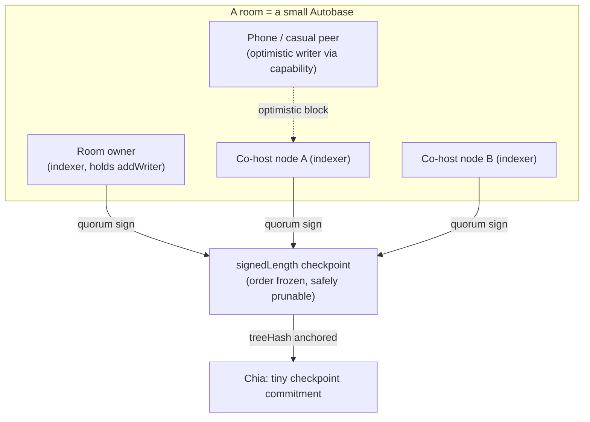

# Review of STUDY-Architecture v004
**Date:** 2026-07-03
**Evaluator:** Claude Opus 4.8 (GitHub Copilot)
**Focus:** Sovereign-serverless mechanics; desktop/mobile deployment; the Cabal/Hypercore shared-hosting question; the *content vs. state vs. chat* storage split; and — the part every prior review under-served — **data pruning so no single player's storage burden grows without bound.**

---

## 1. Executive Verdict

`STUDY-Architecture v004.md` is the strongest version yet. Its two-lane trust split (app-shell vs. node-transport), its correction of the rust-libp2p WebTransport-server myth, and its Tauri-Android sovereign path are all correct and I do not relitigate them. The three companion reviews ([GPT‑5.5](REVIEW-20260703-ArchitectureV004-GPT55.md), [Gemini 3.1 Pro](REVIEW-20260703-ArchitectureV004-Gemini31Pro.md), [Gemini 3.5 Flash](REVIEW-20260703-ArchitectureV004-Gemini35Flash.md)) already cover the App-Manifest-Ledger first-load paradox, the WebAuthn-PRF caveat, the raw-WebTransport→libp2p bridge risk, Android lifecycle/host-migration thrash, F-Droid friction, TURN-over-TLS, LNA preflight, and Yjs state-vector re-handshake. **I treat those as accepted and build past them.**

This review contributes six things the others did not:

1. **A hard rebuttal of the "leaderless multi-writer consensus" idea** (Gemini 3.1 Pro §6): an *open* co-host quorum is Sybil-defenceless. The fix is already sitting in the tool the same reviewer invoked — **Autobase indexers** — which give a *permissioned* quorum, a quorum-signed checkpoint, and the pruning anchor all at once (§5).
2. **The pruning story as a first-class subsystem** (§7), grounded in the *actual* verified primitives — Yjs `gc`+snapshot+subdocs, Hypercore `clear`/`truncate`/**mark-and-sweep**/`prologue`/`signedLength`, and content-addressed eviction — not hand-waving.
3. **A corrected storage-split matrix** (§6) that fixes an anti-pattern the project's *own* design doc introduced: [CoreTechnology.md](../../docs/TDD/02-Systems/CoreTechnology.md) proposes "Cabal club for short term user position tracking" — putting **ephemeral positions into an append-only log is the single worst storage decision available** and must be reversed.
4. **New pitfalls** the others missed: capability-token revocation with no server, causal order being insufficient for markets/contracts, replication-factor-1 cold-start death, and blind-seeding legal exposure (§4).
5. **New network-circumvention angles** framed as *reachability without evasion* — MASQUE/CONNECT-UDP, UDP-443 masquerade, and the "don't-need-egress" intra-campus/DTN paths (§8).
6. **New browser capabilities** aimed squarely at v004's own open problems — Document Picture-in-Picture and silent-audio keepalive against tab-throttling, Idle Detection for clean host handoff, Network Information for the seeding policy, Background Fetch, and CompressionStream for log compaction (§9) — plus outside-the-box economy/DTN ideas (§10).

**Recommendation:** accept v004; fold in a **v005 "Durability, Shared Hosting & Data Retention"** chapter built on the Autobase-indexer model and the four-axis pruning scheme below. Keep soft host-authority for *movement*; move *history* (chat, bulletins, mail, contracts, room geometry) to a small permissioned multi-writer quorum with signed checkpoints and aggressive, tiered pruning.

---

## 2. Sources Reviewed

**Local:** [STUDY-Architecture v004](../AI%20BRAINSTORMING/STUDY-Architecture%20v004.md), [v003](../AI%20BRAINSTORMING/STUDY-Architecture%20v003.md); the three v004 reviews; [docs/TDD/01-Architecture.md](../../docs/TDD/01-Architecture.md); [docs/TDD/02-Systems/CoreTechnology.md](../../docs/TDD/02-Systems/CoreTechnology.md); [docs/GDD/01-Concept-Story.md](../../docs/GDD/01-Concept-Story.md), [02-Core-Gameplay.md](../../docs/GDD/02-Core-Gameplay.md); [ROADMAP.md](../../ROADMAP.md); the empty Sprint‑3 stubs [NetworkProvider.ts](../../prototypes/01-core-loop-demo/src/network/NetworkProvider.ts) and [YjsSync.ts](../../prototypes/01-core-loop-demo/src/network/YjsSync.ts).

**GitHub issues (read directly):** **#1** (rooms as CubeSat U-classes, space-truckers relocating modules, "*Rooms saved in blockchain? Placement saved in blockchain?*", whale-proof markets + strategic reserve, company-hosted capsules/spaceports, tradable shares, NYSE/CBOE-style exchanges) and **#12** (in-game QR → phone-browser room chat; door-list room hopping; "*web-based or app?*"; "*QR could include IPs of super-user seeders … would Chrome block non-SSL?*"; short-lived access key; Alluxia‑F's open-vs-token safety question and "seeders as visible lore vs. invisible magic").

**Web (verified this session):** `cabal-club/cabal-core` + `cabal-cli` (subjective moderation model, `replicate()` returns a duplex stream pipeable onto *any* transport, `--seed` headless mode, QR join, **AGPL-3.0**, effectively unmaintained since ~2022); `holepunchto/autobase` (causal-DAG linearization, **`signedLength`** quorum checkpoints, fast-forward, indexer quorum, optimistic self-verifying blocks, **Apache-2.0**); Hypercore reference (`clear`, `truncate`, **`startMarking`/`markBlock`/`sweep`** mark-and-sweep GC, `info({storage:true})`, `treeHash`, `signedLength`, `prologue`/`quorum`/`signers` manifests, sparse `download`/`get`).

---

## 3. What I Affirm (no need to repeat)

v004's spine is sound and the three prior reviews' corrections are correct. I explicitly agree with and will not re-argue: the two trust lanes; raw-WebTransport-primary + webRTC-direct-fallback; Android-native as the sovereign phone path with iOS-web as the honest asterisk; `TransportMode` degradation; signed CRDT deltas; content-addressed signed room geometry; the manifest ledger being *post-install* integrity only; passkey-PRF being feature-detected-optional; and Android being a *temporary foreground* host at best. Everything below is additive.

---

## 4. New Errors & Pitfalls (not raised by the other three reviews)

### 4.1 "Honest-majority" leaderless consensus is Sybil-defenceless in an open game
Gemini 3.1 Pro §6 proposes eliminating host-migration thrash by making *every* full node a co-host and validating movement by consensus, "as long as honest nodes outnumber malicious ones." **That clause is doing enormous unearned work.** In an open, free-to-clone game (the GDD's whole onboarding is "you are a new clone"), an attacker spins up 100 headless co-hosts for the cost of bandwidth and *becomes* the majority. There is no free Sybil resistance in P2P.

The fix is not to abandon multi-writer resilience — it is to make the writer set **permissioned, small, and owner-controlled**, which is *exactly* what **Autobase indexers** are (§5.2): the room owner (or a capability they issue) decides who is an indexer; a **quorum-signed `signedLength`** defines an order that cannot be rewritten; non-indexers may still contribute via *optimistic, self-verifying* blocks. This reconciles GPT‑5.5's "keep soft authority" with Gemini's "kill the single point of failure" — the answer is *a few* authorities, not *one* and not *anyone*.

### 4.2 Capability tokens cannot be revoked in a serverless world
v004 §8.3 adopts Macaroon/Biscuit capability tokens for QR/doors — good — but attenuated bearer tokens are **only as revocable as your ability to broadcast a revocation**. In a network with no central authority and intermittently-connected nodes, a leaked door/chat token (photograph the QR over someone's shoulder — Issue #12's exact threat) is valid until it expires. Mitigations that must be specified now:
- **Short TTLs by default** (minutes for drive-by QR chat, not days), with silent re-issue to still-present clients.
- **Audience binding at mint time** — but this needs the phone's pubkey *before* the QR is drawn, a chicken-and-egg the QR flow ignores. Fix: QR carries a short-lived *room-scoped challenge*; the phone answers over WebTransport with its key; the node then mints the audience-bound capability. One extra round trip, no bearer-token-in-a-photo risk.
- **A gossiped revocation set** scoped per room (small, prunable) so a compromised token can be killed before expiry — this is itself append-only state that needs the §7 pruning rules.

### 4.3 Causal order ≠ total order — markets and contracts need a sequencer or Chia
v004 and Gemini 3.1 Pro lean on CRDT/append-log consensus for room state. That is correct for chat and bulletins, but **Issue #1's live exchanges, contract bidding, and whale-proof purchase limits require a *total order* with fairness** ("who hit the buy button first / who accepted the contract first"). Autobase gives *eventually-consistent causal* order with fork reordering — two buyers on opposite sides of a network partition can both "win" until the linearizer merges, then one write silently reorders. For a marketplace that is a double-spend/oversell bug, not a merge nuance. **Decision needed:** order-sensitive economic actions run through either (a) a room-host *sequencer* whose result is signed and then logged, or (b) Chia settlement for anything with real value. Do **not** treat "the CRDT will sort it out" as sufficient for money.

### 4.4 The replication-factor-1 cold-start death (durability's real hole)
v004 celebrates "every install is infrastructure," but a **brand-new private room created by a lone player on a phone has replication factor 1 and cannot seed** (mobile is seed-off, §5.4). If that player closes the tab before any desktop/archivist node has pulled the room, the room's entire state — deed aside — is *gone*. This is the inverse of the de-platforming resilience v004 claims. **Fix:** creating durable state (a new room, a new company, a bulletin post meant to persist) must trigger an explicit "pin to ≥N durable nodes" handshake and surface durability to the player diegetically ("station records not yet backed up — find a data relay"). Durability must be *earned and shown*, not assumed.

### 4.5 Blind seeding is a legal and storage liability, not just a bandwidth one
GPT‑5.5 flagged relay abuse; the deeper issue is **content**. "Every install re-seeds rooms it visited" means players host UGC — bulletin images, custom voxel skins, voice snippets — they never chose and cannot vet. That is both a moderation problem and, for some jurisdictions, a legal-exposure problem for the seeding user. The default must be **allowlisted, signed content only**: a node seeds an asset chunk *only* if its hash appears in a room manifest signed by an author the node's subjective-moderation view (§5.1) trusts. Unsigned/unknown content is fetched peer-to-peer on demand but **never re-seeded by default**. This also bounds storage (§7): you only persist what you chose to trust.

### 4.6 The GDD already contains a storage-boundary the plan ignores (a *good* catch)
[02-Core-Gameplay.md](../../docs/GDD/02-Core-Gameplay.md) specifies **physical bulletin boards are strictly local** — "stored at the board's location, only readable by a player standing in front of it, does not sync to remote stations," while **terminal boards aggregate station-wide.** This is a *gift*: it is a natural, in-fiction **interest-scoping and replication boundary.** Physical-board data should be held only by the room's host/co-host quorum (never globally gossiped); terminal-board data is station-scoped; nothing is universe-replicated. The architecture should adopt the GDD's local/terminal distinction verbatim as its *storage tiering rule*, turning a narrative choice into free pruning.

---

## 5. The Cabal / Hypercore Consideration (as requested)

### 5.1 What Cabal actually is — and what to take from it
Cabal is **not a chat app to bolt on; it is a data model.** Verified from `cabal-core`: each user writes their own **append-only signed log** (a Hypercore); peers replicate logs and each client independently computes **materialized views** (channels, messages, moderation). Its defining property is **subjective moderation**: *"every user sees themselves as an administrator"* — `hide`/`mute`/`block`/`mod`/`admin` flags are applied from **your** vantage point, and a shared **moderation key** lets a group converge on the same admin set voluntarily. Crucially, `cabal.replicate(isInitiator)` returns a **duplex stream that pipes onto any transport** (tcp, ws, utp — and therefore *our* WebTransport/WebRTC streams).

**This is the exact anti-grief property Yjs lacks** (Gemini 3.5 Flash §2.4): you cannot "tombstone-wipe" a Cabal board, because each writer only controls their own log and readers simply *ignore* muted writers' logs. That is a strictly better trust model for social content than a shared mutable CRDT.

**But do not adopt the Cabal *stack*.** `cabal-core`/`cabal-cli` are JS-only, effectively unmaintained since ~2022, built on the deprecated `discovery-swarm`/`multifeed` era, and **AGPL-3.0** (a licensing hazard for an F-Droid/native distribution alongside MIT/Apache deps). Adopt the *model* on the modern, maintained, **Apache-2.0** substrate:

### 5.2 Autobase-on-Hypercore is the correct modern realization
`holepunchto/autobase` (verified: actively maintained, Apache-2.0) is Cabal's model, done right:
- **Per-writer logs → causal DAG → linearized deterministic view** (`apply`/`open`). This is Cabal's multifeed + views, with proper causal ordering.
- **Indexer quorum + `signedLength`**: a *permissioned* set of indexers quorum-signs a checkpoint after which order is immutable. **This is the answer to §4.1's Sybil problem AND to §7's pruning problem in one primitive.**
- **`addWriter`/`removeWriter`**: the room owner grows/shrinks the co-host set — soft authority without a single point of failure.
- **Optimistic self-verifying blocks**: a drive-by phone (Issue #12) can post to a room it isn't a writer of, if the block self-verifies against a capability — no promotion needed.
- **Fast-forward**: a returning peer jumps to the signed checkpoint instead of replaying months of history (a bootstrap *and* pruning win).

### 5.3 This reconnects to the project's *own* original intent
[CoreTechnology.md](../../docs/TDD/02-Systems/CoreTechnology.md) already says: *"Cabal Club for short term chat… different physical game rooms saved as separate chats,"* *"bulletin boards… powered by Cabal technology,"* and *"map-embedded network data: … Cabal keys … encoded inside the game world map."* v004 dropped this thread; the Autobase model **restores it** on a buildable footing. One correction, though — see §6.1: that same doc's *"Cabal club for short term user position tracking"* is an anti-pattern and must be reversed.

---

## 6. The Storage Split — Content vs. State vs. Chat vs. Settlement

The user's question — *how much should be split across which protocols* — has a crisp routing rule: **route each datum by the product of (mutability × lifetime × trust-value × size).** That yields four lanes, and one hard correction.

### 6.1 Correction first: positions are **ephemeral awareness**, not logged state
Putting live positions/presence into Cabal/Hypercore (as CoreTechnology.md suggests) means an **append-only log that grows forever to store data that is worthless one second later** — the worst possible fit. Positions must use **Yjs *awareness*** (the non-persisted presence channel) or raw **WebTransport datagrams**, and be **written to disk by no one.** This single change removes what would otherwise be the fastest-growing data in the game.

### 6.2 The corrected division-of-labor matrix

| Class | Example | Protocol | Mutability × Lifetime | Who must retain it | Prune trigger |
|---|---|---|---|---|---|
| **Ephemeral awareness** | positions, typing, "who's in room", voice RTP | Yjs *awareness* / WT datagrams | mutable / **seconds** | **nobody** (never persisted) | n/a — vanishes |
| **Live spatial state** | room layout, furniture, power/door config, repair levels | **Yjs doc** (`gc:true`, per-room subdoc) over WT streams | mutable / session→weeks | room host + co-host quorum | signed **snapshot → new epoch**; drop old epoch |
| **Social / economic log** | chat, mail, bulletins, contracts, moderation, order *history* | **Autobase/Hypercore** per-writer logs | append-only / months | subscribers by interest; deep history → archivists | age-tier + mark-and-sweep past `signedLength` |
| **Bulk content** | glTF meshes, voxel rigs, textures, soundscapes | **content-addressed** (WebTorrent/IPFS/Hyperblobs) | immutable / permanent-by-hash | on-demand cache; pinned by seeders/archivists | LRU under device byte-budget |
| **Settlement** | deeds, CATs, company shares, checkpoint commitments | **Chia** | immutable / permanent | the chain (we keep only refs) | never (we prune only local refs) |

### 6.3 How much of each, in practice (the proportion question)
By **volume of bytes**, bulk **content dominates by 2–3 orders of magnitude** (MB–GB) — therefore it must be *demand-distributed and evictable*, never replicated to every player. Live **state is tiny but hot** (KB–low-MB/room) — replicate it widely to whoever is present, and compact it. **Social logs are small-per-item but unbounded over time** — replicate by *interest* (room/station scope, per §4.6) and prune by *age*. **Settlement is minuscule but permanent** — anchor globally on Chia. So the rule of thumb: **replicate state broadly, replicate chat narrowly, distribute content lazily, anchor value globally.** The mistake to avoid is uniform replication — it is the thing that kills phones.

### 6.4 Do we still need Yjs *and* Autobase?
Yes, and the boundary is clean: **Yjs for mutable spatial editing** (its rich per-field conflict resolution is exactly right for "two people rearrange furniture"), **Autobase for append-only social/economic history** (its subjective moderation + signed checkpoints are exactly right for "nobody can wipe the board and old history compacts safely"). Trying to force chat into Yjs bloats the doc; trying to force live layout into an append-log reinvents a CRDT badly. Keep both, bounded as above. *(Spike: whether a single Autobase view can subsume live state too, to drop Yjs — recommended to defer; Yjs is already in the Sprint-3 plan.)*

---

## 7. Data Pruning — Bounding the Per-Player Storage Burden (the centerpiece)

**Problem statement.** A naïve sovereign P2P game grows local storage as *O(total game history × replication factor)*. Left alone, a two-year-old station's chat logs, every room's CRDT tombstone graph, and every asset ever seen will exceed a phone's budget and eventually a desktop's. Pruning is not an optimization; it is what keeps the network survivable. There are **four independent axes** — apply all of them.

### 7.1 Axis 1 — Interest scope (don't hold what you don't touch)
Replicate only rooms/stations you actually inhabit. The primitives exist and are verified:
- **Hypercore sparse mode:** `core.download({start,end})` / `core.get(i,{wait:true})` fetch only ranges you need; `core.has()` reports what's local. You never hold a room you never visited.
- **Yjs subdocuments:** load a room's doc on entry, unload on exit.
- **The GDD boundary (§4.6):** physical boards = host-only; terminal boards = station-scoped; nothing universe-wide.

### 7.2 Axis 2 — Age tiering + local GC (drop old bytes, keep proofs)
Split every store into **hot / warm / cold / frozen**:
- **Hot** (live epoch, last ~N days chat): full local copy.
- **Warm** (older, still-likely): kept on desktop nodes, LRU on laptops.
- **Cold** (archival): held by archivist nodes (§10), fetched on demand.
- **Frozen** (verification only): keep the **32-byte Merkle root / snapshot hash**, drop the content. Re-fetch is Merkle-verifiable on return.

Verified Hypercore mechanism: **mark-and-sweep** — `core.startMarking()` → `core.markBlock(keepStart, keepEnd)` for recent + starred/pinned messages → `core.sweep()` clears everything else from *local* storage while retaining the tree so cleared blocks stay re-fetchable and verifiable. `core.clear(0, cutoff)` does the same for a simple age cutoff. `core.info({storage:true})` reports real bytes so the client can sweep to a budget.

### 7.3 Axis 3 — Checkpoint & compaction (make forgetting *safe*)
The reason naïve pruning is dangerous: a returning offline peer with divergent edits can't merge into a compacted history. **Signed checkpoints remove the danger:**
- **Autobase `signedLength`**: the indexer quorum (§5.2) signs an index after which order is immutable. Everyone can safely drop pre-checkpoint blocks; late peers `fast-forward` to the checkpoint instead of replaying history.
- **Hypercore `prologue` manifests**: publish a *new* compacted core whose manifest `prologue` = the `treeHash` at the checkpoint. Peers adopt the compact core and discard the long tail; the prologue cryptographically proves it descends from the agreed state.
- **Yjs epochs**: at a checkpoint, emit a host/quorum-signed snapshot (`Y.encodeStateAsUpdate` of the *live* values only, with `gc:true` already having dropped deleted content), declare a new epoch, and discard the prior epoch's tombstone graph. Pre-checkpoint offline edits reconcile against the snapshot, not the raw history.

### 7.4 Axis 4 — Anchor the checkpoint on Chia (tiny, trustless, permanent)
Publish only the **checkpoint commitment** — `{roomId, epoch, treeHash/stateHash, signedLength, quorumSig}` — as a small Chia record (or fold it into the §8.1-style registry singleton). Cost: a few dozen bytes on-chain per compaction. Benefit: a peer that was gone for months can trust *which* compacted state is canonical without trusting any single node, and can discard everything before it. This is the missing link that makes §7.3's compaction **safe against a malicious majority of transient peers** — the anchor is on the unkillable ledger, not in the swarm. It also directly answers Issue #1's literal question — *"Rooms saved in blockchain? Placement saved in blockchain?"* — with the right nuance: **not the room's bytes, just its signed checkpoint hash.**

### 7.5 Per-device budgets (make it concrete)
Enforce with `navigator.storage.estimate()` (web) / `core.info({storage:true})` (node) and evict by policy:

| Device | Retains | Seeds? | Hard cap (illustrative) |
|---|---|---|---|
| Phone (web or Tauri) | current station live epoch + last ~7 days current-room chat + visible assets | **never** | 200–500 MB, LRU |
| Laptop / casual | "home" station + recent visits, ~30–90 days chat | opt-in, Wi-Fi + charging | few GB |
| Always-on desktop / headless | all subscribed rooms, deep warm history, relay + seed | yes | user-set |
| **Archivist** (profession, §10) | erasure-coded cold epochs for many rooms | yes, compensated | large, opt-in |

---

## 8. Circumventing Locked-Down Networks (new angles)

The strongest framing is **reachability without evasion** — respect v004's rejection of covert tunnelling, and prefer *not needing egress* and *looking exactly like traffic the network already permits.*

1. **Don't need egress at all (intra-campus / LAN).** Two dorm players on the same university network never leave it — link-local/mDNS discovery + direct WebTransport works with no traversal, and (v004 §6.4) Firefox has no LNA gate. The "LAN party" case should be a *first-class* mode, not a footnote; most dorm cohabitants are on one campus network.
2. **UDP-443 masquerade (test it explicitly).** WebTransport *is* HTTP/3 = QUIC, and QUIC on **UDP/443** is indistinguishable from ordinary HTTP/3 browsing to most campus DPI. Many networks that "block UDP" actually block *all UDP except 443*. The spike matrix (v004 §13.1 #3) must pin nodes' WebTransport listener to **UDP/443 specifically** and measure — this alone may clear a large fraction of "locked" networks with zero extra machinery.
3. **MASQUE / CONNECT-UDP (RFC 9298) as the principled UDP-over-TCP path.** For networks that truly kill UDP, the IETF-standard answer is tunnelling QUIC datagrams through an HTTP/2 or HTTP/3 **CONNECT-UDP** proxy on 443 — a volunteer/community node runs the MASQUE proxy; native (Tauri) clients tunnel through it; browsers reach it as a relay behind their WebTransport pipe. This is v004's Tier-6 "research" item promoted to **the** sanctioned TCP/443 escape, and it is *not* deception — it's a published proxy standard.
4. **WebSocket-over-HTTP/2 (RFC 8441) + ECH.** The WSS bridge tier (v004 Tier 3) is stronger if it multiplexes over an existing H2/443 connection and uses **Encrypted Client Hello** so SNI-based blocking can't single out the bridge hostname without breaking unrelated HTTPS.
5. **Store-and-forward as the honest floor.** When all live paths fail, the GDD's asynchronous economy (contracts, mail, bulletins, crafting queues) still runs on signed Autobase bundles uploaded whenever *any* connectivity appears — a bad network demotes you to a lower-bandwidth citizen, never ejects you.

*(I concur with the prior reviews' TURN-over-TLS and user-deployed Cloudflare/Deno forwarders, and with v004's rejection of DoH tunnelling — I do not repeat them.)*

---

## 9. Browser Capabilities Not Yet Exploited

Aimed at v004's *own* open problems (tab-throttling, host handoff, mobile seeding policy), with support caveats flagged as spikes.

| Capability | Solves | Note / caveat |
|---|---|---|
| **Document Picture-in-Picture** | The "Active-Tab Tyranny" (v001 §3.I): a PiP window counts as *visible*, so `requestAnimationFrame`/timers aren't throttled — a player can keep a room "warm" (present, relaying, in voice) in a floating window while doing other work | Chromium-only today; feature-detect, treat as enhancement |
| **Silent-audio / Media Session keepalive** | Same throttling problem, cross-browser: an active `AudioContext` (even near-silent room ambience) markedly reduces background suspension; Media Session adds OS media controls | Works broadly; ties into the GDD's proximity-audio anyway |
| **Idle Detection API** | Clean host handoff (Gemini 3.1 Pro §2.4 thrash): detect the local user going idle and **voluntarily demote** the host *before* peers declare it dead, instead of a hard drop | Chromium-only, permission-gated; degrade to activity heuristics elsewhere |
| **Network Information API** (`connection.type`, `saveData`) | Enforces v004's "seed only on Wi-Fi/unmetered" rule programmatically | Chromium-mostly; on others fall back to explicit user toggle |
| **Background Fetch** | Large asset/room prefetch that survives tab close and shows OS progress — repairs the "close tab = client vanishes mid-download" gap | Chromium-only; enhancement |
| **CompressionStream / DecompressionStream** | Compact Autobase blocks and Yjs snapshots before OPFS write and before transport — direct storage/bandwidth win for §7 | **Baseline** across browsers |
| **Storage Buckets + `storage.estimate()`** | Give eviction *priority* (keep keys + live epoch, sacrifice cold assets first) and measure the budget that drives §7 pruning | Chromium for Buckets; `estimate()` broad |
| **Badging API** (`setAppBadge`) | Unread-chat / contract-expiry flair on the installed PWA/APK icon | Minor, opportunistic |

*(WebTransport-in-Worker + OPFS `SyncAccessHandle`, WASM SIMD, WebRTC Encoded-Transform E2EE, WebNN, PWA protocol handlers — already surfaced by v004/the Gemini reviews; I endorse them without repeating.)*

---

## 10. Outside-the-Box Ideas

1. **The Archivist / Data-Vault profession (turn pruning into economy).** GPT‑5.5's "comms guild" covers relay; extend it to *storage*. Players who run high-capacity **archivist nodes** hold cold epochs and rare assets and are paid in-game (spacefuel/CATs) per byte-served or per room-pinned. This makes §7's "someone must keep the cold tail" a *career*, not a cost — and fits the GDD's company/contract economy directly.
2. **Cold storage as a physical item.** Old epochs migrate onto in-world **"data crystals" / archive drives** that are inventory objects. Holding the item = pinning the erasure-coded shard; losing/selling it = releasing it. A diegetic, legible metaphor for cold storage that also teaches players *why* data has weight.
3. **NPC ships as data mules (delay-tolerant networking).** The GDD already has robotic captains and space-truckers running routes between stations. Let a ship in transit **physically carry a signed CRDT/Autobase bundle** (mail, contracts, bulletin sync) between stations — a Bundle-Protocol/DTN store-and-forward that is *literally* on-theme ("the frontier is high-latency"). This is the sneakernet tier (v004 §12.4) fused into game fiction and route economics.
4. **Erasure-coded cold vaults.** Instead of full replication of cold history (expensive) or single-archivist custody (fragile), shard cold epochs with Reed–Solomon across the archivist swarm (Storj/Filecoin-style): the swarm collectively holds the data at a fraction of full-replication cost, tolerating node loss. *(Spike — new subsystem, defer past Phase 1.)*
5. **Checkpoint-on-Chia as the "station black box."** §7.4's signed checkpoints double as GPT‑5.5's "station black box recorder" and Issue #1's on-chain placement history — one primitive serves host-migration recovery, safe pruning, *and* tamper-evident room/deed lineage.
6. **Map-embedded discovery (already latent in the design).** [CoreTechnology.md](../../docs/TDD/02-Systems/CoreTechnology.md)'s "network metadata hidden in the map" + v004's capability-carrying doors = walking to a terminal/console *is* how you receive the room's Autobase key + capability + asset manifest. Discovery becomes exploration; no seed list to leak.

---

## 11. Missing / Needs Further Study (spikes to add)

1. **Autobase-as-room spike** — a room = a small Autobase; owner holds `addWriter`; movement stays soft-host-sequenced (§4.3) but chat/bulletins/contracts are indexer-quorum logs. Measure convergence, fork-reorder UX, and `signedLength` cadence with 3–12 co-hosts and 1 flapping mobile peer (subsumes Gemini 3.1 Pro's thrash test).
2. **Pruning/compaction spike** — implement the four axes; verify a phone stays under budget across a simulated 2-year station history via mark-and-sweep + epoch snapshots + Chia-anchored checkpoints; confirm a months-away peer fast-forwards correctly.
3. **Sybil/economics spike** — cost to mint N indexers; whether indexer eligibility needs a Chia-identity/stake gate; oversell/double-accept tests on contracts under partition (§4.3).
4. **Cold-start durability spike** — the "pin to ≥N durable nodes before a new room is safe" handshake and its diegetic surfacing (§4.4).
5. **UDP-443 + MASQUE reachability matrix** — dorm/corporate/CGNAT/captive-portal; measure how much is cleared by UDP-443 alone before any relay (§8).
6. **Content-provenance seeding spike** — "seed only allowlisted signed chunks" default; measure moderation/latency trade-off (§4.5).
7. **Licensing audit** — keep AGPL `cabal-core` **out**; build on Apache-2.0 Autobase/Hypercore to protect the F-Droid/native distribution.

---

## 12. Concrete Phase 1 Amendments

The Sprint-3 seams are still empty stubs ([NetworkProvider.ts](../../prototypes/01-core-loop-demo/src/network/NetworkProvider.ts), [YjsSync.ts](../../prototypes/01-core-loop-demo/src/network/YjsSync.ts)) — this is the cheap moment to shape them:

- **`NetworkProvider`**: add the `TransportMode` enum (v004 §6.3) *and* a `DurabilityState` signal (§4.4). Pin the reference WebTransport listener to **UDP/443** for the reachability spike (§8).
- **`YjsSync`**: implement the state-vector re-handshake (Gemini 3.5 Flash §2.1); add `gc:true`, per-room subdocs, and a signed-**epoch/snapshot** hook (§7.3). Route **positions to *awareness*, never to the persisted doc** (§6.1).
- **New `RoomLog` port** (Autobase-shaped): per-writer append, subjective-moderation flags, `signedLength` checkpoint, `prologue` compaction — even if the Phase-1 adapter is a single-writer stub, define the seam now.
- **New `StorageBudget` service**: `estimate()`-driven eviction + mark-and-sweep, so pruning is designed in, not retrofitted.
- Point the **Architecture Reference** at v004 (Phase-1 plan still cites v002/`simple-peer`), and record that **chat/bulletins/contracts target the Autobase model, not Yjs**, restoring the Cabal thread from [CoreTechnology.md](../../docs/TDD/02-Systems/CoreTechnology.md).

---

## 13. Final Recommendation

Ship v004's spine. Then, in v005:

1. **Adopt the Cabal *model* on Autobase/Hypercore, not the Cabal *stack*** — subjective moderation for social content, a **small owner-permissioned indexer quorum** for resilience (killing both the single-host thrash *and* the open-consensus Sybil hole), and Apache-2.0 licensing.
2. **Make the storage split explicit and correct** — ephemeral awareness (no disk), Yjs live state (compacted), Autobase social/economic logs (interest+age pruned), content-addressed bulk (evictable), Chia settlement (tiny/permanent) — and **reverse the "positions in Cabal" anti-pattern.**
3. **Treat pruning as a subsystem, not a hope** — four axes (interest / age+GC / signed-checkpoint compaction / Chia-anchored commitment), enforced per-device budgets, with cold history carried by a paid **Archivist profession** and, one day, erasure-coded vaults and NPC data-mules.
4. **Fix the new pitfalls now while the seams are empty** — revocation TTLs + challenge-bound QR, a real sequencer/Chia path for money, an explicit cold-start durability handshake, and allowlisted-signed-only seeding.

In one line: **v004 proved the game can be sovereign and reachable; v005 must prove it can *remember the right things, forget the rest safely, and never crush a single player's disk* — and the Autobase indexer checkpoint is the one primitive that ties shared hosting, Sybil resistance, and safe pruning together.**

---

*Companion to [STUDY-Architecture v004](../AI%20BRAINSTORMING/STUDY-Architecture%20v004.md) and its reviews by [GPT‑5.5](REVIEW-20260703-ArchitectureV004-GPT55.md), [Gemini 3.1 Pro](REVIEW-20260703-ArchitectureV004-Gemini31Pro.md), and [Gemini 3.5 Flash](REVIEW-20260703-ArchitectureV004-Gemini35Flash.md). Grounded in Issues #1 and #12, [CoreTechnology.md](../../docs/TDD/02-Systems/CoreTechnology.md), and primary-source checks of cabal-core, Autobase, and Hypercore. Highest-leverage next step: the **Autobase-as-room + four-axis pruning** spike (§11 #1–#2).*
