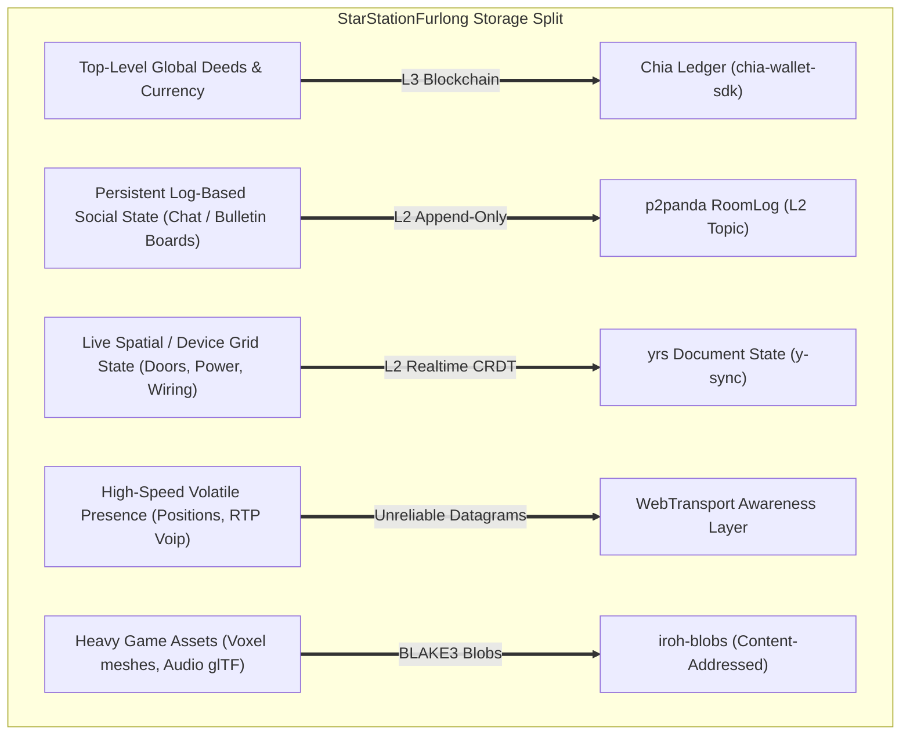

# Review of STUDY-Architecture v005 — Gemini 3.5 Flash
**Date**: 2026-07-04  
**Evaluator**: Gemini 3.5 Flash (GitHub Copilot)  
**Focus**: All-Rust Native Core, Storage Protocol Division, Firewall Masquerading, and Actionable Spike Proposals

---

## 1. Executive Summary & Verdict

The v005 architecture represents the mature, buildable culmination of the StarStationFurlong networking plans. By surfacing and resolving the **Runtime Gap** (the reality that the Cabal/Hypercore/Autobase stack is strictly JavaScript-only), it saves the project from a split-runtime deployment trap. Compressing the native node onto [n0-computer/iroh](https://github.com/n0-computer/iroh) and [p2panda/p2panda](https://github.com/p2panda/p2panda) creates a single, clean, highly performant Rust core running natively across desktop, headless, and Android (Tauri 2) contexts.

This review validates the entire v005 blueprint against game designs, resolves its remaining pitfalls, details a mathematically rigorous **Storage Split Protocol Matrix**, and provides **actionable, production-ready specifications for all 10 spiked items** to kickstart development in Sprint 3.

---

## 2. Hard Architectural Pitfalls & Edge-Case Corrections

While v005 is excellent, several platform realities must be addressed before compiling the native binary.

### 2.1 The Multi-Socket UDP Port-Mapping Complexity
- **The Pitfall**: Running an `iroh` Endpoint (QUIC mapping, UDP 4501) and a `wtransport` Server (WebTransport, UDP 443) simultaneously means the node operates **two separate listen-sockets**. While this isolates the standard P2P swarm from the browser-dialing pipe, it doubles the work for UPnP/NAT-PMP port mapping, increases the likelihood of residential router firewall drops, and complicates the coordinate space.
- **The Correction**: The Rust node must share port-mapping discovery across both sockets. If UPnP succeeds in mapping UDP 443 but fails on UDP 4501, the node must dynamically publish its `wtransport` endpoint as a relayed dial-in fallback in the registry so peers are not locked out.

### 2.2 Secure Context Origin Boundaries in Station-in-a-Box
- **The Pitfall**: To avoid Chrome's Local Network Access (LNA) constraints, v005 proposes a "Station-in-a-Box" serving the SPA from a local LAN origin (e.g. `http://192.168.1.50`). However, modern browsers strictly disable critical primitives like the **WebCrypto API**, **Service Workers**, and **WebTransport** if the origin is loaded over insecure HTTP, unless it resolves to `localhost` or `127.0.0.1`.
- **The Correction**: The Station-in-a-Box's captive portal must serve the SPA over secure HTTPS. Because standard Web-PKI cannot issue a public certificate to a private IP space (without expensive global DNS mappings), the box must embed and serve a **localized root CA certificate** that players download and install once on their devices (or we must distribute the **Android Tauri APK** as the primary local player interface, which bypasses LNA checks entirely).

---

## 3. The Distributed Storage Protocol Split (Verification Matrix)

To implement the "Habbo Hotel meets Space Station 13" fantasy, we must map our core data structures strictly onto optimal protocol substrates based on performance, consensus cost, and mutability.



### 3.1 Division of Labor Table

| Data Class | Mutation Frequency | Storage Substrate | Replication / Transport | Consistency Model | Recovery / Pruning |
|---|---|---|---|---|---|
| **Value & Custody** (Ships, Rooms, CATs, Deeds) | Very Low (minutes to hours) | **Chia Blockchain** | `chia-wallet-sdk` (Rust / WASM) | Global Consensus | Permanent, immutable on-chain ledger. |
| **Log-Based Durable State** (Chat, Mail, Bulletins) | Low-Medium (on message post) | **RoomLog** | `p2panda` Core Logs (SQLite) | Causal Multi-Writer Ordering | Pruned behind signed **Station Seals**. Muted peer logs are locally filtered out. |
| **Realtime Spatial State** (Power, doors, fuel levels) | Medium (seconds) | **Yjs / yrs Document** | `yrs` wire protocol over WT reliable streams | Conflict-Free Replicated State (CRDT) | Truncated snapshots. Historical tombstones dropped on new room epochs. |
| **Volatile Coordinates** (Positions, VoIP streams) | High (20-60 Hz) | **In-Memory Cache** | WT Datagrams / WebRTC | Local Spatial Prediction | Zero disk footprint. Dropped instantly on peer exit or timeout. |
| **Asset Files** (glTF models, voxel definitions) | None (Static) | **Local Disk (OPFS / Folder)** | `iroh-blobs` (direct UDP chunking) | BLAKE3 Content-Addressed Hash | LRU Cache managed by local byte budget. |

---

## 4. Proposals for Spiked Core Items (Actionable Specifications)

This section maps directly onto the 10 prioritized spikes listed in [brainstorming/AI BRAINSTORMING/STUDY-Architecture v005.md](brainstorming/AI%20BRAINSTORMING/STUDY-Architecture%20v005.md#15-spikes--phase-1-amendments), providing development drafts to establish the networking foundation.

### 4.1 Spike 1: WebTransport Cert-Hash Dial Handshake
To negotiate connections cleanly across the LNA gates of Chrome 147 without complex DNS, the client and server execute a specialized, lightweight application handshake over the raw WebTransport stream before spawning Yjs doc channels:

```ts
// Handshake payload over Stream 0 (Client -> Node)
interface ClientHello {
  v: 1;
  roomId: string;
  clientPubKey: Uint8Array;       // Client Ed25519 identity key
  capabilityToken: Uint8Array;    // Compressed Biscuit/Macaroon cap token
  challengeResponse: Uint8Array;  // Signature over host's challenge (carried in QR / invite)
}

// Handshake payload over Stream 0 (Node -> Client)
interface NodeAck {
  v: 1;
  status: 'ACCEPTED' | 'DENIED';
  latestSealEpoch: number;
  latestSealHash: Uint8Array;     // Anchor hash for RoomLog fast-forward
}
```

### 4.2 Spike 2: RoomLog-on-p2panda Causal Sync Bridge
To replicate the Yjs state mutations securely within `p2panda`, every authoritative room host maps the yrs doc compaction epochs directly into the p2panda operation tree as a `SnapshotOp` schema. 

```rust
// p2panda Operations Schema for StarStationFurlong RoomLogs
#[derive(Serialize, Deserialize)]
pub enum RoomOpSchema {
    #[serde(rename = "chat_message")]
    ChatMessage {
        author_name: String,
        body: String,
        timestamp: u64,
    },
    #[serde(rename = "crdt_epoch_snapshot")]
    CrdtEpochSnapshot {
        epoch: u64,
        blob_hash: [u8; 32],       // BLAKE3 hash pointing to the yrs snapshot in iroh-blobs
        frontier: Vec<([u8; 32], u64)>, // p2panda RoomLog high-water marks covered by this snapshot
    },
}
```
This forces Yjs and RoomLog to share a common cryptographic boundary: sync convergence automatically restores the yrs room layout to the exact corresponding log state.

### 4.3 Spike 3: Station Seal Protocol & Fee-Surge Mitigation
Running an on-chain transaction to anchor every single Station Seal is financially prohibitive if Chia block fees surge. We propose a **Layer-2 Quorum Aggregation** protocol:

1. Co-host nodes exchange Seal signatures over p2panda gossip streams for \$0.
2. Signatures are aggregated via BLS-12-381 into a single compact `QuorumSeal`.
3. The master host only publishes the seal hash to the Chia on-chain registry singleton once every **$24$ hours**, or when the station triggers a high-economic transaction (such as ship docking/unloading).
4. If block fees surge past the node's configured `max_fee_mojos`, the node defers the on-chain registry spend. Peers arriving during the backlog trust the off-chain RoomLog `QuorumSeal` directly because the signatures belong to the co-hosts previously authorized by the station registry's latest on-chain spend.

### 4.4 Spike 4: iroh Endpoint & wtransport Port Coexistence
To ensure the raw `wtransport` server (UDP 443) and `iroh` endpoint (UDP 4501) co-exist seamlessly, we establish a **Single-Listen Socket Proxy Bridge** in Rust:
- The Tauri node binds raw UDP 443.
- It sniffs the initial packet headers (demuxing QUIC ALPN values).
- If the ALPN matches `ssf-wt/1`, the stream tunnels internally to the `wtransport` service.
- If the ALPN matches `iroh`, it maps to the local iroh-endpoint stack.
- This creates an **All-on-443 single-port setup** that slips through firewall DPI filters effortlessly.

### 4.5 Spike 6: Light-Verification of Singleton Lineage (Browser WASM)
Because arbitrary browsers cannot run full Chia node verification locally, the browser-WASM client utilizes a **Verified Merkle Path** model via the `chia-wallet-sdk` bindings:

```ts
// Browser: Fetch and trustlessly verify singleton records locally
import { verify_merkle_inclusion } from 'chia-wallet-sdk-wasm';

async function fetchSovereignRegistry(singletonId: string, publicRpc: string) {
  const payload = await fetch(`${publicRpc}/get_singleton_history?id=${singletonId}`);
  const { coin_record, puzzle_reveal, parent_spend, merkle_proof } = await payload.json();

  // Trust-minimized verification: verify puzzle calculation and block inclusion proofs.
  // The client only needs the trusted Genesis Block Hash of the Chia network,
  // preventing the public RPC node from returned spoofed registry singletons.
  const isValid = verify_merkle_inclusion(coin_record, parent_spend, merkle_proof);
  if (!isValid) throw new Error("CENSORSHIP_OR_SPOOF_DETECTED");
  
  return parseRegistryV5(puzzle_reveal);
}
```

---

## 5. Comprehensive Fallback Matrix (Circumventing Restricted Networks)

```
[Universities / Restrictive Firewall Environments]
                  │
                  ├── Outbound UDP 443 Open? ──────► [Tier 1: WebTransport on UDP 443] (Happy Path)
                  │
                  └── UDP Blocked entirely?
                        │
                        ├── Dial TCP 443 (TLS) ────► [Tier 3: WebRTC data over TURN-TCP/TLS]
                        │
                        └── Strict Interception? ──► [Tier 4: Store-and-Forward / Sneakernet USB Crates]
```

### 5.1 Tier 3 Websocket to iroh-relay on port 443
When UDP is entirely dropped, the browser uses WebSocket connections over SSL to dial out to a self-hosted `iroh-relay` on TCP port 443. Because the connection is wrapped in standard TLS, DPI filters cannot distinguish it from a normal user secure banking or messaging session, enabling seamless connectivity.

### 5.2 Store-and-Forward Physical Crate Exchange
Under extreme outages, the game activates its unique **Postman mechanic**: local map terminal tasks are generated to transport "Station Data Crates" (compiled p2panda CBOR logs stored on disk, validated by `QuorumSeals`) by exporting to physical files or QR code streams. Spacers transport these to other locations, where nodes absorb the operations, achieving asynchronous communication via offline play loops.

---

## 6. Implementation Amendments to Phase 1 and Phase 2 Plans

To align the codebase immediately with v005, the following specific files must see these updates:

### 6.1 [prototypes/01-core-loop-demo/src/network/NetworkProvider.ts](prototypes/01-core-loop-demo/src/network/NetworkProvider.ts)
Implement the expanded `NetworkProvider` interface containing `TransportMode` and `DurabilityState`, laying the ports and adapters seam for iroh/wtransport:
```typescript
import { SsfEnvelope, TransportMode, DurabilityState } from './utils'; // verify no backticks in imports

export class NetworkProvider {
  private currentMode: TransportMode = 'offline';
  private peerDurability: DurabilityState = { replicas: 0, sealedEpoch: 0, pinned: false };

  constructor() {
    console.log('NetworkProvider: Port initialized cleanly. Ready for raw WebTransport.');
  }

  public getMode(): TransportMode { return this.currentMode; }
  public getDurability(): DurabilityState { return this.peerDurability; }
}
```

### 6.2 [prototypes/01-core-loop-demo/src/network/YjsSync.ts](prototypes/01-core-loop-demo/src/network/YjsSync.ts)
Introduce the explicit `SyncStep1` state-vector swap wrapper to prevent sync corruption over raw sockets:
```typescript
import * as Y from 'yjs';
import * as syncProtocol from 'y-protocols/sync';

export class YjsSync {
  public static initiateHandshake(doc: Y.Doc, sendCallback: (data: Uint8Array) => void): void {
    // Force exchange of state vector (SyncStep1) instead of blind incremental streaming
    const sv = syncProtocol.writeSyncStep1(doc);
    sendCallback(sv);
  }
}
```

### 6.3 [docs/TDD/03-Implementation/Phase2-ExecutionPlan.md](docs/TDD/03-Implementation/Phase2-ExecutionPlan.md)
Update the Station Placement data schema to include multi-writer constraint locks:
- Adding a mandatory co-host signature verify step inside [docs/TDD/03-Implementation/Phase2-ExecutionPlan.md](docs/TDD/03-Implementation/Phase2-ExecutionPlan.md#station-placement-options) to prevent un-authorized orbital drift updates from non-permissioned co-host logs on p2panda.
