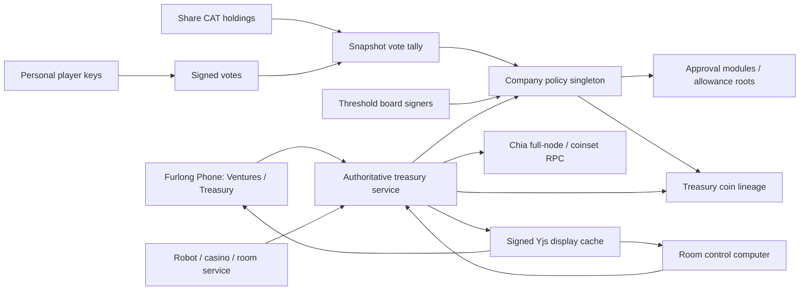
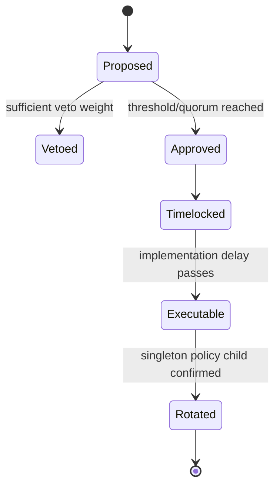

# Company Treasury and Governance Plan

*Star Station Furlong - company custody, room funding, device allowances, governance, membership changes, and key rotation.*

**Status:** architecture proposal; documentation only. No runtime money path should depend on this document until the testnet gates in section 17 pass.

> **Amendment (sovereign/serverless):** the "authoritative Rust treasury service" architecture in §4 and §13 is **superseded** by [sovereign-treasury-serverless-plan.md](sovereign-treasury-serverless-plan.md) — Chialisp puzzles are the only money authority, the service's roles decompose into a treasury profile of every player's own `ssf-p2p-node`, and proposal acceptance and vote checkpoints become on-chain events. Chain access is **proposed** to move to the Chia peer protocol — re-stated 2026-09-05 with binding conditions and still pending maintainer ratification (amendment §6/§14), since that reverses §13.1's settled posture. The invariants, puzzles, threats (§17.1), migration, and mainnet ceremony below are unchanged. The contracts, tests, and gates are **amended, not unchanged**: §7.1's `TreasuryProposalAcceptance`/`serviceSig` are deleted in favor of derived `ProposalWindows`, §7.2's `VoteInclusionProof` changed shape and its vote body's field set is pinned by shared vectors, `maxFeeMojos` is added to `CompanyTreasuryPolicy` (§12) and `DeviceAllowance` (§9.1) and enters the policy hash, `stateCoinId` binds each §9.1 execution request to the state coin it consumes, the §12 CBOR profile gains a no-byte-strings rule, §17.3–§17.4's service-shaped test and gate actors get per-node substitutions, and §18's sequence gains gating spikes S-0/S-1/S-3 — see the amendment's §10–§13 for the full deltas. Original text is preserved below per repo convention.

**Code root:** unless a path starts with `brainstorming/`, every `src/...` path in this document is relative to `prototypes/0.29.0-core-loop-demo/`.

**Companions:**

- [sovereign-treasury-serverless-plan.md](sovereign-treasury-serverless-plan.md) — the serverless amendment (supersedes §4/§13)
- [chia-ventures-shared-ownership.md](chia-ventures-shared-ownership.md)
- [chia-authority-architecture.md](chia-authority-architecture.md)
- [module-wallets-chia-funding-plan.md](module-wallets-chia-funding-plan.md)
- [transfer-offers-deeds-shares.md](transfer-offers-deeds-shares.md)
- [craps-chia-backend-plan.md](craps-chia-backend-plan.md)
- [Dexie DBX](https://dexie.space/dbx) and [Dexie Governance](https://dexie.space/governance)
- [CircuitDAO Treasury](https://docs.circuitdao.com/technical-manual/treasury/), [Governance](https://docs.circuitdao.com/technical-manual/governance/), and [Approval Mods](https://docs.circuitdao.com/technical-manual/advanced-topics/approval-mods/)

---

## 1. Decision summary

A company treasury is not a private key shared by company members. It is a stable on-chain company identity with:

1. one permanent company/treasury singleton id;
2. a rotatable board signing policy;
3. one shareholder voting asset in v1;
4. delayed governance for policy and high-risk treasury changes;
5. operation-specific, capped allowances for managers, rooms, robots, and casino devices;
6. an authoritative Rust/Chia settlement service;
7. signed Yjs records as display caches, never as money authority.

A room does not own a second independent wallet by default. A room stores a signed binding to a personal or company treasury and selects a funding profile. Devices consume narrowly scoped allowances under that binding.

The first implementation keeps one equal-vote share class. Data structures are class-aware, but Class A/Class B super-voting remains disabled until the governance game has been playtested.

### 1.1 What ships first

The first implementation PR after this document should add data contracts, validators, and read-only UI only. It must not move real funds. On-chain execution follows behind testnet singleton, rotation, approval, replay, and partition tests.

### 1.2 What does not ship in v1

- no shared company seed or exported company private key;
- no browser-side treasury signing key;
- no Yjs integer balance treated as authoritative;
- no CRDT lease presented as authoritative money serialization;
- no automatic treasury spending based only on room ownership;
- no direct shareholder ability to spend treasury funds;
- no dual-class super-voting enabled by default;
- no full CircuitDAO Treasury Ring unless measured concurrency requires it;
- no mainnet company-share trading before legal review.

PR 110 still stores local casino state and prototype chip balances in the room's Yjs casino map. Its owner-wallet and per-machine modes are local-only game accounting, and its unsafe shared-bankroll mode is disabled. Invariant 5 below is the target state for PR D/E, not a claim that current prototype casino accounting is already authoritative.

---

## 2. Reference projects: what to copy and what not to copy

### 2.1 Dexie/DBX: governance participation and transparency

Useful patterns:

- token holders are members;
- voting power is proportional to confirmed token holdings;
- proposals and outcomes are publicly inspectable;
- treasury balances and allocations are visible;
- treasury use is separated from ordinary application operations;
- strategic allocations require governance approval.

Adaptation for Star Station Furlong:

- company shares determine proposal and voting weight at a pinned snapshot height;
- the phone presents proposals, votes, treasury balances, receipts, and policy history;
- votes are signed messages that anyone can recount against the on-chain snapshot;
- treasury execution is not performed by the voting token itself.

Do not copy blindly:

- one-token-one-vote is vulnerable to low turnout, concentration, and vote buying;
- transferable share ownership should not automatically grant hot-wallet custody;
- token voting is too slow for routine robot/device operations.

### 2.2 CircuitDAO: constrained execution and delayed governance

Useful patterns:

- a stable singleton carries protocol policy/state;
- proposals cannot execute without a prior proposal operation;
- proposal threshold, veto period, implementation delay, and maximum change are explicit constraints;
- approval modules authorize operation classes rather than granting unrestricted treasury access;
- treasury coins recreate themselves through controlled lineage;
- high-risk changes require governance while routine operations use constrained approval paths.

Adaptation for Star Station Furlong:

- the company singleton stores or commits to the current treasury policy;
- each allowance type has an approved operation module/hash;
- policy changes carry veto and implementation delays;
- device payments prove an allowance and policy version;
- board rotation changes policy lineage, not company identity;
- old capabilities become invalid when the policy version changes.

Do not copy initially:

- CircuitDAO's closed Treasury Ring solves protocol-scale multi-coin accounting and whole-ring proofs;
- ring ordering is operationally complex and partly governance-maintained;
- Star Station Furlong should begin with one treasury coin or a small fixed set of purpose lanes;
- add ring/shard behavior only after real contention measurements and dedicated Chialisp review.

---

## 3. Core invariants

These are requirements, not implementation suggestions.

1. **No shared secrets.** Every human signs with a personal key. Company authority is threshold policy, not knowledge of one company seed.
2. **Stable identity.** Company and treasury ids survive board, manager, and shareholder changes.
3. **Holdings are not custody.** Shares grant voting weight and declared access rights; they do not reveal or imply spending keys.
4. **Roles are explicit.** Shareholder, director, treasurer, manager, operator, auditor, and device are separate authorities.
5. **Money is authoritative outside Yjs.** Yjs may cache signed policy/proposal/receipt records, never establish balances or final settlement.
6. **Every spend is bounded.** Asset, amount, destination, operation, device, room, period, and expiry can all be constrained.
7. **Every action is replay-safe.** Proposals, approvals, allowances, and receipts have unique ids and policy versions.
8. **Membership exits converge safely.** Selling shares changes voting weight; losing a role revokes capabilities; losing board signer status rotates the board policy.
9. **Policy changes are delayed.** High-risk changes include a veto window and implementation delay.
10. **Partition safety beats availability.** If authoritative state cannot be reached, spending stops. It never falls back to local LWW counters.
11. **Auditability.** Every executed treasury operation identifies the proposal or allowance that authorized it.
12. **Least authority for automation.** A robot or casino machine receives an allowance, never the treasury signing policy.

The current casino implementation violates invariant 5 for non-real-value prototype chips. That debt is explicitly replaced, not blessed, by the authoritative adapter planned in sections 13 and 19.3.

---

## 4. Architecture overview



The authoritative treasury service in this diagram is aspirational PR D+ infrastructure. It does not exist on `main`. Until it is implemented and passes the testnet gates, treasury screens are read-only/mock views and no on-chain company spending is enabled.

> **Superseded:** there will be no authoritative treasury service. See [sovereign-treasury-serverless-plan.md](sovereign-treasury-serverless-plan.md) §0–§3 for the decomposition of this diagram's `Service` box into puzzles, the per-player treasury node profile, and on-chain events.

### 4.1 Trust placement

The browser may:

- display balances and receipts;
- create proposal drafts;
- sign personal votes or approval requests;
- request a spend under an allowance;
- verify returned proofs and signatures.

The browser may not:

- hold a company treasury seed;
- decide the authoritative balance;
- declare a proposal executable;
- serialize concurrent spends with a room-doc lease;
- construct an unrestricted treasury spend.

The Rust service may build and submit spends only after it verifies on-chain state, policy lineage, threshold approvals, allowance limits, and replay identifiers.

---

## 5. Company identity, shares, board, and treasury

### 5.1 Permanent company identity

Use one singleton launcher id as the permanent company id. The singleton state commits to:

- company metadata hash;
- treasury policy hash and version;
- board threshold and signer-set commitment;
- share class registry;
- governance constraints;
- approval-module registry;
- emergency/recovery policy;
- treasury coin launcher ids or lane commitments.

Board rotation creates the next singleton child with a new signer-set commitment. The launcher id remains stable, so deeds, rooms, offers, receipts, and UI links do not migrate.

### 5.2 Shares

V1 uses one fixed-supply CAT share asset:

- one whole share equals 1000 CAT mojos;
- voting weight is proportional to verified whole-share balance at snapshot height;
- fractional dust grants neither room access nor voting weight;
- shares do not directly sign treasury spends;
- ordinary transfer changes voting weight after confirmation and access after TTL refresh.

### 5.3 Class-aware schema without dual-class behavior

The policy supports multiple class definitions, but v1 creates only `common`:

```ts
export interface ShareClassPolicy {
  id: string;                  // "common" in v1
  assetId: string;             // CAT asset id
  votesPerWholeShare: number;  // 1 in v1
  grantsRoomAccess: boolean;
  transferable: boolean;
  convertsToClassId?: string;
  sunsetHeight?: number;
}
```

`ShareClassPolicy` is a Registry-v2 contract, not current `ventures.ts` state. The current venture record has one integer share map, one-vote-per-share semantics, and venture-wide shareholder access. Class conversion, class-specific access, and sunset enforcement remain disabled until their CAT/policy rules exist on testnet.

If dual class is later enabled:

- Class A may have greater voting weight;
- Class A should be non-transferable or convert to Class B when transferred outside an approved founder set;
- super-voting should have a sunset height or governance-removal path;
- Class A must not directly grant treasury signing power;
- class policy changes are high-risk delayed proposals.

### 5.4 Board and managers

The board is the threshold custody and policy-update authority. Managers receive delegated operational capabilities.

- A shareholder is not automatically a board signer.
- A director is not automatically a daily treasury operator.
- A manager can operate only within explicit allowances.
- An auditor has read-only proofs and receipt access.
- A device has no human governance rights.

---

## 6. Key custody and rotation

### 6.1 No company private-key export

Each board member controls a personal BLS signing key through their wallet/node. The company policy requires an `m-of-n` threshold. No API returns a combined seed.

Acceptable implementations:

- Chia SDK MedievalVault or equivalent threshold vault;
- FROST/threshold signing if supported and reviewed;
- multiple approval coins whose combined announcements satisfy policy.

An implementation must be explicit about whether aggregation is cryptographic threshold signing or an on-chain `m-of-n` puzzle. Do not use those terms interchangeably.

### 6.2 Rotation workflow

Rotation is required when:

- a director leaves or loses the signer role;
- a signer key is lost or compromised;
- threshold policy changes;
- an emergency guardian acts after the configured delay.

Rotation state machine:



The rotation spend must:

1. prove the current company singleton lineage;
2. prove the approved proposal id and policy hash;
3. install the new signer-set commitment and threshold;
4. increment `policyVersion`;
5. preserve the company launcher id;
6. invalidate prior-version manager and device capabilities;
7. emit a receipt discoverable by company clients.

Outstanding proposal rule at rotation:

- proposals still inside their voting window are voided and must be resubmitted against the new policy version;
- proposals with a final tally may be re-authorized only by a deterministic carry-forward rule in the rotation payload;
- absent that explicit carry-forward, they are void;
- carry-forward preserves the exact proposal id, payload bytes, old-policy tally proof, and acceptance checkpoint; the rotator may only bind that immutable result to the new policy version;
- a proposal that conflicts with the new policy is void and cannot be rewritten or resurrected under its old id;
- every execution proves the prior policy hash, proposal snapshot, and current policy version, so rotation and proposal execution cannot race under different rule sets.

### 6.3 Share sale versus key rotation

Selling shares does not automatically rotate treasury keys unless the seller also loses a board signer role.

When a person sells all shares:

- future vote weight becomes zero after confirmation;
- shareholder-derived room access expires after the verification TTL;
- outstanding votes remain weighted at their proposal's pinned snapshot;
- manager/director roles are evaluated separately;
- any role configured as `requiresShareholding` is revoked through policy;
- device sessions issued personally by that member are revoked if policy says they are non-transferable.

When a board signer leaves, rotation is mandatory even if they retain shares.

### 6.4 Emergency recovery

Optional recovery should be delayed and visible:

- guardian threshold different from daily board threshold;
- long relative time lock;
- guardian may rotate authority, not withdraw arbitrary funds;
- recovery proposal and final receipt are publicly auditable;
- recovery cannot bypass immutable destination/amount rules for ordinary allowances.

Emergency recovery is a `rotate-board` proposal variant with `recoveryMode: true` and a guardian-threshold proof; it is not a separate unrestricted spend type. It remains disabled in v1 and PR B until open decision 7 defines guardian membership, threshold, delay, and challenge rules.

---

## 7. Governance model

### 7.1 Proposal lifecycle

A proposal is an immutable signed record. A separate acceptance record pins its share snapshot and policy-derived block windows so a proposer cannot choose a historical snapshot or shorten voting, veto, or implementation delays:

```ts
export type TreasuryProposalKind =
  | "pay"
  | "budget"
  | "appoint-manager"
  | "revoke-manager"
  | "bind-room"
  | "change-policy"
  | "rotate-board"
  | "add-share-class"
  | "dissolve";

export interface UnsignedTreasuryProposal {
  v: 1;
  networkGenesisChallenge: string;
  companyId: string;
  policyVersion: number;
  kind: TreasuryProposalKind;
  payloadHash: string;
  proposerPub: string;
}

export interface TreasuryProposal extends UnsignedTreasuryProposal {
  proposalId: string;
  proposerSig: string;
}

export interface TreasuryProposalAcceptance {
  v: 1;
  proposalId: string;
  policyVersion: number;
  governanceRuleHash: string;
  snapshotHeight: number;
  snapshotBlockHash: string;
  acceptedHeight: number;
  acceptedBlockHash: string;
  votingEndsHeight: number;
  vetoEndsHeight: number;
  executableFromHeight: number;
  expiresAfterHeight: number;
  acceptanceCheckpointId: string;
  serviceSig: string;
}
```

Payload bytes are retained separately but addressed by `payloadHash`. The identifier and signature targets are non-recursive and domain-separated:

```ts
const proposalId = sha256(canonicalEncode({
  domain: "ssf-treasury-proposal:v1",
  proposal: unsignedProposal,
}));

const proposerSig = signPersonalKey(canonicalEncode({
  domain: "ssf-treasury-proposal-signature:v1",
  networkGenesisChallenge: unsignedProposal.networkGenesisChallenge,
  proposalId,
}));
```

The authoritative service accepts only the current policy version and the latest sufficiently confirmed canonical snapshot. It derives every `*Height` from `acceptedHeight` and the proposal kind's committed governance rule; clients and puzzles recompute those values rather than trusting supplied numbers. The acceptance record is included in an on-chain governance checkpoint before voting opens. Wall-clock dates are display estimates only and never authorize a vote or execution.

> **Superseded:** `TreasuryProposalAcceptance`/`serviceSig` are replaced by an on-chain registration event and the derived, unsigned `ProposalWindows` record — every node computes identical deadlines from chain data with nobody to trust. See [sovereign-treasury-serverless-plan.md](sovereign-treasury-serverless-plan.md) §4 and the shipped contracts in `src/treasuryTypes.ts`.

### 7.2 Voting

Votes are signed personal messages:

```ts
export interface TreasuryVote {
  v: 1;
  networkGenesisChallenge: string;
  proposalId: string;
  voterPuzzleHash: string;
  voterGamePub: string;
  choice: "yes" | "no" | "abstain" | "veto";
  sequence: number;
  chiaAddressProof: string;
  voteId: string;
  gameSig: string;
}

export interface VoteInclusionProof {
  v: 1;
  voteId: string;
  checkpointRoot: string;
  checkpointHeight: number;
  checkpointBlockHash: string;
  merkleProof: string;
}
```

> **Amended:** the shipped `VoteInclusionProof` is `{ v: 1; voteId: Hex32; checkpointId: Hex32; steps: MerkleStep[] }` with `MerkleStep { side: "left" | "right"; hash: Hex32 }` — see [src/treasuryTypes.ts](../prototypes/0.29.0-core-loop-demo/src/treasuryTypes.ts) and [sovereign-treasury-serverless-plan.md](sovereign-treasury-serverless-plan.md) §10. The sketch above predates the checkpoint contract's final shape.

Tally rules:

- weight comes from verified CAT balances at `snapshotHeight`;
- each class applies its policy weight;
- spent-after-snapshot coins still count; confirmed-after-snapshot coins do not;
- a vote counts only with a valid inclusion proof rooted in a checkpoint confirmed no later than `votingEndsHeight`;
- duplicate votes use the valid vote with the greatest per-voter `sequence`; equal-sequence conflicts choose the lexicographically smallest `voteId`;
- votes are public and independently recountable;
- vote ids and signatures cover a canonical unsigned vote body and the network genesis challenge;
- delegation is disabled in v1; a later design must specify cycles, transitivity, revocation, direct-vote precedence, inclusion, and snapshot timing before enabling it.

### 7.3 Proposal classes and thresholds

Policy commits one complete rule for every proposal kind:

```ts
export type GovernancePassRule =
  | "majority-cast"
  | "supermajority-cast"
  | "supermajority-total-supply";

export interface GovernanceKindRule {
  proposalThresholdBps: number;
  passRule: GovernancePassRule;
  yesThresholdBps: number;
  quorumBps: number;
  vetoBps: number;
  votingBlocks: number;
  vetoBlocks: number;
  implementationDelayBlocks: number;
  executionWindowBlocks: number;
}

export type ProposalKindRules = Record<
  TreasuryProposalKind,
  GovernanceKindRule
>;
```

Suggested defaults for playtesting, not final constants. Target durations shown for people are converted to conservative block counts in policy; block height is authoritative:

| Proposal | Proposal threshold | Pass rule | Veto | Delay |
| --- | ---: | ---: | ---: | ---: |
| Routine payment within approved budget | manager capability | none | none | none |
| One-time payment outside approved budget | 1% | >50% cast | 20% total | 24 h target |
| New recurring budget | 1% | >50% cast | 20% total | 24 h |
| Appoint/revoke manager | 2% | >50% cast | 20% total | 24 h |
| Bind company treasury to room | 2% | >50% cast | 20% total | 24 h |
| Change spending policy | 5% | 66% cast + quorum | 25% total | 72 h |
| Rotate board | 5% | 66% cast + quorum | 25% total | 72 h |
| Add/change share class | 10% | 75% cast + quorum | 25% total | 7 d |
| Dissolve/sweep treasury | 10% | 75% total supply | 25% total | 7 d |

Exact values belong in company policy and are constrained by minimum platform safety rules.

In this table, `>50% cast` means a majority of valid non-abstain votes cast after quorum is met. `66% cast + quorum` means both a two-thirds yes share of valid cast votes and a minimum participating share of total eligible voting weight. `75% total supply` means yes votes representing at least 75% of all eligible voting weight, regardless of turnout. High-risk proposals should require both a supermajority of votes cast and an explicit total-supply quorum.

### 7.4 Optimistic daily operations

Routine operations should not require a company-wide vote. Shareholders approve budgets and roles; managers act under bounded allowances. This follows the useful CircuitDAO distinction between governance operations and approval-module operations.

---

## 8. Treasury custody and approval modules

### 8.1 Treasury coin shape

V1 on-chain prototype:

- one company treasury singleton coin;
- one policy singleton reference;
- one approval-module registry commitment;
- controlled deposits and withdrawals;
- unique child recreation preserving lineage;
- receipts linked through coin announcements and proposal/allowance ids.

If one coin becomes a concurrency bottleneck, add a small fixed lane set:

- operations lane;
- casino liability lane;
- payroll/robot lane;
- reserves lane.

Do not implement an arbitrary ring until whole-treasury proofs and parallel demand justify its governance and spend-bundle complexity.

Migration from one treasury coin to fixed lanes does not change the company launcher id. Governance increments `policyVersion`, launches/recognizes lane coins under the company policy, expires allowances bound to the original coin, and issues replacement allowances targeting a specific lane. Existing receipts remain valid; unspent funds move only through a proposal-authorized migration bundle.

### 8.2 Operation-specific approval

Approval modules constrain what an actor may request. Examples:

- `room-operations`: rent, power, docking, repairs;
- `casino-bankroll`: reserve and settle approved games;
- `robot-operations`: charging, parts, service fees;
- `manager-payment`: bounded arbitrary payment to an allowlist;
- `treasury-deposit`: deposit-only path;
- `governance-execution`: proposal-bound policy/custody changes.

Conceptual Chialisp shape (not production code):

```clojure
(mod (POLICY_HASH ALLOWANCE_ROOT solution)
  (let ((operation (f solution))
        (proof     (f (r solution)))
        (outputs   (r (r solution))))
    (if (and
          (sha256tree-eq POLICY_HASH (policy-from proof))
          (merkle-proof ALLOWANCE_ROOT (allowance-from proof))
          (operation-allowed operation proof)
          (outputs-within-caps outputs proof)
          (not-expired proof))
      (emit-controlled-conditions operation outputs)
      (x))))
```

Production puzzles must use audited libraries, exact condition semantics, safe integer checks, and deterministic tree hashes.

---

## 9. Allowances for rooms, robots, and casino devices

### 9.1 Allowance data contract

> **Amended:** the shipped contract adds `maxFeeMojos: MojoString` to `DeviceAllowance` (the chain-checkable fee bound of [sovereign-treasury-serverless-plan.md](sovereign-treasury-serverless-plan.md) §8/§10) and `stateCoinId: Hex32` to `TreasuryExecutionRequestBody` — each signed request binds to the exact state coin it consumes, so an authorization cannot replay across state-coin generations (amendment §3/§10). The blocks below predate those fields; [src/treasuryTypes.ts](../prototypes/0.29.0-core-loop-demo/src/treasuryTypes.ts) is authoritative.

```ts
export type TreasuryOperation =
  | "casino-reserve"
  | "casino-settle"
  | "casino-refund"
  | "robot-charge"
  | "robot-parts"
  | "room-rent"
  | "room-repair"
  | "room-service"
  | "manager-payment";

export interface DeviceAllowance {
  v: 1;
  allowanceId: string;
  networkGenesisChallenge: string;
  companyId: string;
  policyVersion: number;
  subject: {
    kind: "room" | "device" | "robot" | "manager";
    id: string;
    authorityHead: {
      headId: string;
      version: number;
      scheme: "ed25519" | "bls12381";
      publicKey: string;
    };
  };
  roomId?: string;
  operations: TreasuryOperation[];
  assetId: "xch" | string;
  maxPerOperation: string; // decimal mojo string
  maxPerPeriod: string;
  periodBlocks: number;
  destinationPuzzleHashes?: string[];
  startsAtHeight: number;
  expiresAfterHeight: number;
  stateCoinLauncherId: string;
  nonce: string;
  policyProof: string;
}

export interface TreasuryExecutionRequestBody {
  v: 1;
  requestId: string;
  networkGenesisChallenge: string;
  allowanceId: string;
  policyVersion: number;
  authorityHeadId: string;
  authorityVersion: number;
  operation: TreasuryOperation;
  payloadHash: string;
  expiresAfterHeight: number;
}

export interface TreasuryExecutionRequest
  extends TreasuryExecutionRequestBody {
  subjectSig: string;
}
```

Amounts crossing JSON boundaries are decimal strings and become checked `u64`/`bigint` values only inside validated code. The canonical subject key includes both `kind` and `id`, preventing cross-kind collisions.

An allowance cache is public and conveys no authority by itself. Every execution request signs the canonical request body and replay id with the current key in `authorityHead`; the service verifies its scheme, head id, version, and public key against policy. A puzzle hash may identify a destination or Chia authority, but it is not itself a signing key. Devices without protected keys act through an explicitly named manager/operator authority rather than an unauthenticated furniture id.

Period caps are atomic on-chain invariants, not service database counters. Each allowance has a state coin lineage committing to its current period index, spent amount, and sequence. An authorized spend consumes that state coin and recreates its unique child with updated consumption in the same spend bundle; Chialisp rejects an amount over the remaining cap. Period rollover derives from confirmed block height. Concurrent services therefore contend for the same current state coin, and only one valid child can advance. The Rust service indexes this lineage but cannot override it.

Every allowance binds `policyVersion`. Rotation invalidates all earlier-version allowances immediately; replacement allowances receive new ids and authority versions rather than reusing prior capabilities.

### 9.2 Casino allowances

Casino devices need two distinct authorities:

1. game fairness/settlement authority;
2. treasury payout authority.

A casino allowance should bind:

- game engine id/version;
- machine/table furniture id;
- room id;
- accepted stake denominations;
- maximum payout per round;
- maximum aggregate liability per period;
- required fairness transcript mode;
- expiry and policy version;
- settlement id replay protection.

A slot machine never signs from the treasury. It sends a settlement request to the authoritative service. The service verifies the accepted wager, allowance, fairness transcript, current treasury coin, and replay id before building a spend.

#### 9.2.1 Existing slot-machine pattern

PR 110's per-machine operator session lease, request TTL, paytable hash, commit-reveal transcript, and replay-safe request id are useful game-session patterns. They serialize which browser may advance a local round, but they are not a money lock and cannot authorize company funds. The treasury allowance generalizes the operation/TTL/replay concepts while moving reserve and settlement authority into the Rust/Chia service.

### 9.3 Robot allowances

A robot dock may receive allowance for:

- charging fees;
- approved parts vendors;
- maintenance up to a period cap;
- docking/transport service fees.

Robot scripts cannot generate arbitrary destinations or amounts. Script actions map to operation templates enforced by the allowance.

### 9.4 Room allowances

The room computer may select a company funding profile for:

- approved casino devices;
- robots and docks;
- room services;
- maintenance budgets.

Binding a room does not grant edit rights by itself. Room/deed authority and treasury authority remain separate predicates.

---

## 10. Room treasury binding

### 10.1 Data contract

```ts
export interface RoomTreasuryBinding {
  v: 1;
  networkGenesisChallenge: string;
  roomId: string;
  companyId: string;
  treasuryLauncherId: string;
  policyVersion: number;
  profileId: string;
  boundByPub: string;
  boundAtHeight: number;
  expiresAfterHeight?: number;
  policyReceiptId: string;
  sig: string;
}
```

The room doc stores a signed cache of this binding. Clients verify it against company policy and the room deed/authority head. It is not authoritative merely because it appears in Yjs.

> **Amended 2026-09-05 (PR 119 follow-up).** "Verify against company policy and the room deed/authority head" is two predicates, checked in different places and never presented as one:
>
> - **P-room — who may bind this room.** `boundByPub` MUST equal the room owner's identity key: `players[roomInfo.owner].keyB64` today, read live on every read; the verified authority head's `owner_ed25519_pubkey` once room deeds land (issue #138, [chia-authority-architecture.md](chia-authority-architecture.md)) — same field, same comparison, no schema change, and the only code that changes is `gamesDoc.readRoomOwnerKey`. Owner only, and the RAW owner: venture shareholders do pass the shareholder-extended owner gate for room edits, docking and door policies (`main.ts` `isLocalPlayerRoomOwner`), but a deed is the personal owner's alone (`currentRoomDeedIsMine`), and a binding is a statement about the room's deed, not about its edit rights — so the deed holder's key signs it; widening to co-hosts or the company is PR F's call through the authority head and the policy, and a strict subset now cannot be invalidated by that later. The cache layer proves authorship only (`sig` verifies under the record's own key); the owner comparison is a READ rule in the view layer (`treasuryView.bindingSigner`), and the slot stays plain-replace and un-gated on write (invariant 5). Verdicts: **OWNER-SIGNED** anchors the company scope; **OWNER UNKNOWN** and **NO OWNER KEY** show the record as the claim it is and withhold the company details and proposal list — deliberately no fail-open, because once a room has synced the only peer action that produces an unknown owner is deleting or overwriting the owner's entry, and trusting any signer then turns censorship into forgery (an honest deed hand-over never leaves a room in that state, since it refuses a recipient with no key); **NOT OWNER-SIGNED** is refused as this room's funding, still reported as held, and renders no company details. The signer's fingerprint is always shown. What OWNER-SIGNED is worth today, in one sentence: the key the room document currently names as owner signed this, and naming the owner is two unauthenticated map writes (`roomInfo.owner`, `players[owner].keyB64`) — room-document trust, no more. The badge therefore says "as its records name them", and may say "confirmed against the room's deed" only for a key a verified head supplied.
> - **P-company — does the company agree.** `policyReceiptId` MUST name a confirmed receipt of an accepted `bind-room` proposal for exactly this (companyId, treasuryLauncherId, policyVersion, roomId, profileId) on the pinned network, with that policy version current. Not checkable in the browser; PR D/F own it, and until then every surface prints **Company approval · not checked** beside the receipt id, so an owner's signature is never read as the company's consent.
>
> Recorded with the rule: a legacy (`Local-Clone`) room cannot show an owner-signed binding until it is claimed under a keyed owner — and claiming is itself one unauthenticated write today; a venture office room keeps its founder as `roomInfo.owner` (deed hand-over refuses office rooms), so PR F's writer must not treat the office founder's key as the company's consent, and ventures need a way to rotate the office owner key; **deletion is not revocation** — with no sequence, tombstone or reader watermark, any binding the owner ever signed can be re-put and reads OWNER-SIGNED again, which is safe only while no writer exists, so PR F's first writer is gated on a signed unbind tombstone carrying seq/height, highest-seq-wins on read, and a per-reader watermark; and when an authority head supplies the owner key, `authority_root` must be anchored outside the peer-writable room doc (bootstrap link, room seed, or a roomId derived from the launcher id) and readers must keep a per-peer highest-seen `seq` watermark, or a swapped root or rolled-back head re-anchors a stale binding. Open decision #10 is resolved by this rule: a binding persists until the owner KEY changes (which demotes it automatically) or a PR F unbind; `expiresAfterHeight` stays an optional self-imposed cap.

### 10.2 Room control computer UI

Add a `FUNDING` section to `createRoomTerminalUI` in `devices.ts`:

- current source: personal / company;
- company and treasury identity;
- policy version and verification status;
- selected room funding profile;
- covered systems and remaining period budgets;
- pending bind/unbind proposal;
- link to the phone Treasury app;
- explicit offline/read-only/error states.

Commands:

- `REQUEST COMPANY FUNDING` creates or opens a proposal;
- `SELECT PROFILE` chooses among already approved profiles;
- `UNBIND` follows company and deed policy;
- `REFRESH PROOF` asks the authoritative service for current chain state.

The room computer does not display or request treasury private keys.

PR C implements this section as read-only/mock UI. It must not query or install live company bindings until PR D supplies verified treasury snapshots and PR F supplies proposal-authorized room bindings.

> **Superseded (2026-09-05, as shipped in PR 119):** PR C took the read-only branch of every "read-only/mock" slash and mocked nothing. The funding source is reported as record / no record / cannot read / not owner-signed rather than "personal / company" — a missing record is never inferred to mean personal funding (invariant 5); no snapshot or balance is mocked; `REFRESH PROOF` will ask the player's own node ([sovereign plan](sovereign-treasury-serverless-plan.md) §2), not a service. The four commands are present and disabled.

---

## 11. Furlong Phone: Ventures and Treasury

Extend `renderVenturesApp()` in `main.ts` with a Treasury tab.

### 11.1 Treasury overview

- verified balances by asset;
- reserved versus available amounts;
- current board and threshold;
- current policy version;
- rooms funded by the company;
- active device/manager allowances;
- pending proposals and execution windows;
- recent receipts;
- chain sync and proof status.

PR C's MVP is verified/mock balances plus a proposal list and offline/proof states. Interactive proposal, role, allowance, and execution controls arrive in PR F after the service and policy proofs exist.

> **Superseded (2026-09-05, as shipped in PR 119):** PR C shows no balance — mocked or otherwise — until the node lane supplies a verified one, and the panel says why. Nothing named `TreasuryService` exists in the browser: the seam the sovereign plan §2 keeps "in role as the browser↔local-node contract" is the local HTTP API PR D defines, and PR C's result-form readers (`ok` / `absent` / `unreadable` / `too-large`) with a trust badge on every panel are the display contract it must feed.

### 11.2 Proposal flow

1. choose proposal type;
2. fill a type-specific form;
3. review canonical payload and thresholds;
4. sign with personal identity;
5. publish proposal record;
6. collect signed votes;
7. show veto and implementation clocks;
8. request execution when eligible;
9. verify confirmed receipt.

### 11.3 Board and role management

- nominate director/manager;
- view required and collected approvals;
- revoke manager capabilities;
- rotate board policy;
- emergency recovery status;
- explain why a role is unavailable after share sale or policy rotation.

### 11.4 Share class UI

V1 displays one `COMMON` class. The UI may read multiple class definitions, but must not expose class creation until the delayed-governance and conversion rules are implemented.

---

## 12. Canonical TypeScript contracts

> **Amended & implemented:** this section shipped as [src/treasuryTypes.ts](../prototypes/0.29.0-core-loop-demo/src/treasuryTypes.ts) with a Rust twin ([ssf-p2p-node/src/treasury_codec.rs](../prototypes/0.29.0-core-loop-demo/ssf-p2p-node/src/treasury_codec.rs)) and shared golden vectors — see [sovereign-treasury-serverless-plan.md](sovereign-treasury-serverless-plan.md) §10. Deltas from the sketches below: `CompanyTreasuryPolicy` gains `maxFeeMojos: MojoString`, which `policyHashOf` includes; the shipped `policyHashOf` also applies `sortedSet()` to `signerPuzzleHashes`/`shareClasses`/`approvalModuleHashes` and null-normalizes optional share-class fields, which the example code below skips — so the example computes a **different** policy hash than the shipped code; the CBOR profile adds one clarification (no byte strings — binary travels as lowercase hex text); and `voteIdOf`'s field order is pinned by vectors. The shipped code is authoritative over these sketches.

The first code PR should introduce a dependency-light module, for example `src/treasuryTypes.ts`, containing types, canonical encoders, hashes, and guards only.

```ts
export type MojoString = string;
export type Hex32 = string;

export interface CompanyTreasuryPolicy {
  v: 1;
  networkGenesisChallenge: Hex32;
  companyId: Hex32;
  treasuryLauncherId: Hex32;
  policyVersion: number;
  board: {
    threshold: number;
    signerPuzzleHashes: Hex32[];
  };
  shareClasses: ShareClassPolicy[];
  governanceRules: ProposalKindRules;
  approvalModuleHashes: Hex32[];
  emergencyPolicyHash?: Hex32;
}

export interface TreasuryReceipt {
  v: 1;
  receiptId: Hex32;
  networkGenesisChallenge: Hex32;
  companyId: Hex32;
  policyVersion: number;
  operation: TreasuryOperation;
  authorization:
    | { kind: "proposal"; proposalId: Hex32 }
    | { kind: "allowance"; allowanceId: Hex32 };
  requestId: Hex32;
  spendBundleId: Hex32;
  confirmedHeight?: number;
  confirmedBlockHash?: Hex32;
  assetId: "xch" | Hex32;
  amount: MojoString;
  destinations: Hex32[];
}
```

Guard rules:

```ts
export function isMojoString(value: unknown): value is MojoString {
  return typeof value === "string"
    && value.length >= 1
    && value.length <= 20
    && /^(0|[1-9][0-9]*)$/.test(value)
    && (value.length < 20 || value <= "18446744073709551615");
}

export function isPolicyVersion(value: unknown): value is number {
  return Number.isSafeInteger(value) && (value as number) >= 1;
}
```

`canonicalEncode` uses the Star Station Furlong deterministic-CBOR profile: RFC 8949 deterministic encoding, definite lengths only, no floats or tags, UTF-8 strings, and the shortest integer encoding. Arrays with set semantics are sorted by their canonical encoded bytes before hashing. TypeScript and Rust implementations must reject values outside this profile.

Canonical hashes must include every authority-bearing field, use explicit field order and domain tags, and bind the Chia network genesis challenge:

```ts
const bytes = canonicalEncode({
  domain: "ssf-company-treasury-policy:v1",
  v: policy.v,
  networkGenesisChallenge: policy.networkGenesisChallenge,
  companyId: policy.companyId,
  treasuryLauncherId: policy.treasuryLauncherId,
  policyVersion: policy.policyVersion,
  board: policy.board,
  shareClasses: policy.shareClasses,
  governanceRules: policy.governanceRules,
  approvalModuleHashes: policy.approvalModuleHashes,
  emergencyPolicyHash: policy.emergencyPolicyHash ?? null,
});
const policyHash = sha256(bytes);
```

Never hash ordinary `JSON.stringify` output unless the canonical ordering and number representation are guaranteed by the helper.

PR B must include shared TypeScript/Rust test vectors: canonical bytes, SHA-256 digest, signatures, malformed cases, and boundary amounts. Both runtimes must produce byte-for-byte identical encodings before any hash becomes a policy or authorization commitment.

---

## 13. Browser/Rust service boundary

> **Superseded:** this section's remote service is replaced by the treasury node profile in [sovereign-treasury-serverless-plan.md](sovereign-treasury-serverless-plan.md) §2/§3. Replacing §13.1's operator-run/cross-check full nodes with Chia peer-protocol chain access (amendment §6) is **proposed with binding conditions (2026-09-05) and pending maintainer ratification** (amendment §14; see the §13.1 and §20 notes). The `TreasuryService` interface below survives in role as the browser's contract with **its own local node**, with amended signatures: `ProposalWindows` replaces `TreasuryProposalAcceptance`, and inclusion proofs use the shipped `{voteId, checkpointId, steps}` shape. The verification duties listed for "the Rust implementation" become duties of every player's node; §13.1's reorg/receipt rules carry over in substance, executed per-node (the idempotency ledger becomes the chain itself — amendment §3).

Define an interface before selecting transport:

```ts
export interface TreasuryService {
  getCompanySnapshot(companyId: string): Promise<CompanyTreasurySnapshot>;
  getProposal(proposalId: string): Promise<TreasuryProposal>;
  submitProposal(
    proposal: TreasuryProposal,
  ): Promise<TreasuryProposalAcceptance>;
  submitVote(vote: TreasuryVote): Promise<VoteInclusionProof>;
  requestExecution(request: TreasuryExecutionRequest): Promise<TreasuryReceipt>;
  verifyAllowance(allowance: DeviceAllowance): Promise<AllowanceStatus>;
}
```

The Rust implementation should:

- query coinset/full-node state;
- verify singleton and CAT lineage;
- verify proposal snapshot/tally;
- verify board threshold or approval-module proof;
- acquire spendable coin state from the node/mempool, not Yjs;
- build deterministic spend bundles;
- submit transactions;
- track confirmation/reorg status;
- return proof-bearing receipts;
- deduplicate `requestId` across retries.

### 13.1 Full-node trust boundary

> **Proposed superseded (2026-09-05, pending maintainer ratification in the sovereign plan §14):** the operator-run full node and independently administered cross-check node below would be withdrawn, with chain access moving to the Chia peer protocol from each player's own node under an N-peer cross-check and the binding conditions in [sovereign-treasury-serverless-plan.md](sovereign-treasury-serverless-plan.md) §6 and §14. The honesty rule in the second paragraph — name every residual trusted-node assumption, never label it trustless, approve each one at the mainnet gate — is unchanged and now applies per node.

The v1 service uses a synced, self-run Chia full node in the same operator trust domain for candidate chain and mempool data. Browser-supplied RPC endpoints and public coinset responses are untrusted. Before accepting a governance snapshot, policy transition, or confirmed receipt, the service must cross-check the finalized height, header hash, and relevant coin records with at least one independently administered full node. Disagreement, inadequate confirmation depth, rollback, or an unavailable cross-check stops acceptance and spending.

Where available, the service verifies header, singleton, CAT, and coin lineage proofs locally. If the selected Chia RPC cannot provide a proof for a required claim, the implementation must document the trusted-node assumption and may not label that claim trustless. A production/mainnet gate must explicitly approve each residual assumption. The service verifies the exact spend-bundle hash it constructed before submission and reconciles that hash against mempool and confirmed-chain observations.

Receipt confirmation is a replaceable signed status attestation over an immutable receipt. A reorg that removes `confirmedBlockHash` changes the status to `reorged`/pending and clients stop treating it as final. The same `requestId` may be retried only after the former spend is proven absent and the original authorization remains valid; all attempts remain linked in the idempotency ledger.

Potential Rust integration points:

- `prototypes/0.29.0-core-loop-demo/ssf-p2p-node/src/chia_lane.rs` for current Chia RPC/config patterns;
- a new treasury module/crate rather than expanding presence resolution into a general wallet;
- Tauri/node RPC commands that expose request/response DTOs, never private key bytes.

---

## 14. Yjs cache design

A company office doc may cache signed records in a `treasury` Y.Map:

```text
policy                                    -> CompanyTreasuryPolicy cache (shape-checked, plain-replace)
proposal:<proposalId>                     -> TreasuryProposal (signed)
vote:<proposalId>:<voterGamePub>          -> TreasuryVote (signed; slot keyed by the authenticating game key)
allowance:<allowanceId>                   -> DeviceAllowance cache
binding:<roomId>                          -> RoomTreasuryBinding (signed; §10.1 owner rule applied on read)
receipt:<receiptId>                       -> TreasuryReceipt cache
sync                                      -> ChainSyncStatus (display-only; carries the genesis; a per-peer claim)
registration:<proposalId>                 -> ProposalRegistration
windows:<proposalId>                      -> ProposalWindows (derived — recompute to trust)
checkpoint:<proposalId>:<checkpointId>    -> TreasuryCheckpoint
session:<proposalId>:<sessionId>          -> SigningSession shell (zero authority)
sessionsig:<sessionId>:<signerPuzzleHash> -> one collected signature
payload:<payloadHash>                     -> proposal payload bytes, lowercase hex
```

Rules:

- no authoritative `balance` integer;
- no CRDT mutex/lease presented as money serialization;
- records include policy version and signatures/proofs;
- caches are replaceable from chain/service state;
- conflicting signed records resolve through canonical authority rules, not last-write-wins arrival;
- receipts and proposal ids are idempotent;
- prune only after retaining an auditable chain pointer;
- `sync` is a per-node display claim, not a status (amended 2026-09-05 to match `treasuryDoc.ts`): offline / read-only / paused states come from the local node's own verdict, never from this key; it carries `networkGenesisChallenge` and is rejected off-network like every other record, because it is the only cache value used as a clock;
- reachability through a bounded reader is allowed for the read-only screen only (as implemented in PR 119, 2026-09-05): a hostile peer can crowd honest records past `treasuryDoc.ts`'s traversal guard, the screen discloses it (`discoveryCutShort`), and that is permitted there because nothing on it acts on a record (§4.1) and the sovereign plan §5 makes a vote's countability independent of any display. This map is the vote transport and the data-availability store behind checkpoint roots, not a display cache, so the same bound in any other reader — a governance-lane screen, or a node building a checkpoint root from its replica — is a data-availability censorship tool and is not allowed; PR C.1's reader-maintained first-seen index removes the guard and gates PR F.

---

## 15. Systems touched

All `src/...` paths in this table are under `prototypes/0.29.0-core-loop-demo/`.

| System | Current surface | Planned impact |
| --- | --- | --- |
| Ventures/cap table | `src/ventures.ts` (`VentureRecord`, `transferShares`, `ventureLedger`) | Add company/treasury ids, class-aware metadata, treasury summary cache; keep cap-table writes separate from money |
| Phone Ventures app | `src/main.ts` (`renderVenturesApp`) | Add Treasury/Proposals/Roles/Receipts views and signed action flows |
| Phone Bank app | no complete company bank on main | Add personal/company account selector and handoff into Treasury views; never expose seeds |
| Room ownership | `src/games/gamesDoc.ts` (`readRoomOwner`) and `src/main.ts` owner gates | Verify room binding against deed/company authority; do not conflate treasury access with edit access |
| Room control computer | `src/devices.ts` (`createRoomTerminalUI`) | Add Funding section, profiles, proof state, and proposal links |
| Edit permissions | `src/editMode.ts`, `main.ts` | No automatic expansion from treasury binding; roles remain explicit |
| Deeds | `src/deeds.ts`, `src/offers.ts` | Company singleton custody and room binding reference stable company id |
| Offers | `src/offers.ts` | Later real CAT/NFT offers; treasury proposals may authorize acquisition/sale |
| Casino ledger | `src/casinoDoc.ts` | Replace Yjs balance authority before real value; add treasury adapter behind funding source |
| Roulette/craps | `src/croupier.ts`, `src/crapsCroupier.ts`, `src/crapsBackend.ts` | Request authoritative allowance-backed reserve/settle operations |
| Slot machine | `src/slotCroupier.ts` and slot funding APIs | Keep owner/machine local modes; company funding only through authoritative adapter |
| Robots | `src/robotDoc.ts`, `src/world.ts`, `src/poolWaiter.ts` | Bind dock/robot operation templates to capped allowances |
| Furniture lifecycle | `src/furniture.ts`, `src/furnitureDoc.ts`, `src/world.ts` | Revoke/unbind device allowances on removal; furniture ids are allowance subjects |
| Identity | `src/keypair.ts`, `src/identity.ts` | Personal Ed25519 signatures and explicit Chia address/key proofs; no company seed |
| Authority heads | `brainstorming/chia-authority-architecture.md` | Company policy and room bindings anchor under stable singleton lineage |
| Chia node | `ssf-p2p-node/src/chia_lane.rs` plus new treasury module | Coinset/full-node reads, spend construction, submission, receipts, reorg handling |
| Network/room sync | Yjs/iroh room docs | Signed display caches only; stop spending when authoritative service is unavailable |
| UI status/hints | existing device/phone status patterns | Add pending, veto, timelock, confirmation, reorg, expired, revoked, and offline states |

### 15.1 Import/dependency boundaries

- `treasuryTypes.ts` must import no DOM, Yjs, furniture, or UI code.
- `treasuryTypes.ts` contains types, canonical encoding, hashing, and guards only; it performs no IO.
- `treasuryDoc.ts` imports `treasuryTypes.ts` plus Yjs for signed cache serialization, but no UI modules.
- `treasuryService.ts` is an interface/adaptor; browser implementation may call node/Tauri RPC and does not expose Yjs internals.
- `devices.ts` and `main.ts` consume service interfaces, not Rust transport details.
- `casinoDoc.ts` must not become a treasury authority.
- `robotDoc.ts` stores routine configuration, not money balances.
- Rust presence code should not own company governance; use a separate module boundary.

---

## 16. Membership and authority transitions

### 16.1 Share transfer

After a confirmed share transfer:

1. update verified holdings caches;
2. revoke shareholder-derived room access after TTL;
3. leave prior snapshot votes unchanged;
4. check `requiresShareholding` roles;
5. propose/revoke affected manager capabilities;
6. rotate board only if signer membership changed.

### 16.2 Manager departure

Manager removal increments or supersedes the relevant capability root. Requests under old policy versions fail. Already confirmed receipts remain valid.

### 16.3 Director departure

Director removal requires delayed board rotation. The company id and treasury lineage remain unchanged. During a contested rotation, high-risk spends pause; existing low-risk allowances may continue only if policy explicitly allows it.

### 16.4 Company dissolution

Dissolution is a high-threshold proposal that:

- revokes manager/device allowances;
- unbinds rooms;
- resolves outstanding proposals;
- freezes new company offers when the dissolution acceptance checkpoint is confirmed;
- cancels outstanding company-authored offers by spending or replacing their source coins before distribution; deleting an offer file or Yjs record is not cancellation;
- settles or cancels authorized liabilities;
- transfers deeds according to approved terms;
- sweeps treasury assets through an explicit distribution policy;
- publishes a terminal company receipt.

The dissolution proposal must contain the immutable distribution policy: asset/deed recipients, amounts or formulas, handling of unclaimed allocations, and execution deadline. Shareholders approve that exact payload hash; executors cannot substitute a different distribution. Do not infer distribution from current Yjs cap tables.

---

## 17. Threat model and required tests

### 17.1 Threats

- malicious shareholder creates proposals or buys votes;
- compromised manager tries to exceed allowance;
- removed member replays old capability;
- duplicate browser sessions submit the same execution;
- partitioned room docs show conflicting policy caches;
- a peer floods the treasury cache map so honest records sit past any traversal bound a reader imposes — a browser panel, or a node building a checkpoint root from its replica;
- a peer writes a room funding binding under a fresh key, or rewrites who owns the room, so another company's board and proposals render as this room's;
- a peer deletes the owner's players entry so the room's owner key becomes unknown, then relies on a reader that fails open;
- device id is removed/reused;
- stale share snapshot is used for voting/access;
- chain reorg invalidates apparent execution;
- signer disappears during rotation;
- malicious node lies about balances or confirmation;
- integer overflow/precision loss in browser JSON;
- allowance destination substitution;
- proposal payload differs from voted payload;
- governance changes rules while a proposal is active.

### 17.2 Unit/property tests

- canonical encoding is stable across JS/Rust;
- malformed amounts, hashes, classes, roles, and periods fail guards;
- allowance spend never exceeds operation/period caps;
- changing any payload byte changes the proposal hash;
- settlement request id is idempotent;
- old policy versions cannot execute;
- Class A conversion/sunset logic remains disabled in v1;
- vote tally at snapshot height handles confirmed/spent ranges correctly.

### 17.3 Multi-client tests

- two tabs submit the same request;
- two rooms consume one period allowance concurrently;
- Yjs partition produces conflicting caches while money remains safe;
- manager is revoked during an in-flight request;
- shareholder sells during vote;
- board rotates while devices are online;
- authoritative service unavailable: spending stops, UI stays read-only;
- reorg changes receipt from confirmed to pending/failed.

### 17.4 Testnet gates

Before any real-value/mainnet path:

1. mint and follow company singleton lineage;
2. rotate 1-of-1 to 2-of-3 without changing launcher id;
3. acquire an NFT1 deed into `P2Singleton(companyId)`, then dispose of it through a separate approved proposal;
4. mint fixed-supply CAT shares and verify snapshot balances with lineage checks;
5. execute allowed and denied allowance spends, including concurrent requests at a period boundary;
6. prove old policy/capabilities fail after rotation;
7. test duplicate execution, vote inclusion ordering, policy-derived deadlines, and mempool contention;
8. test reorg recovery and receipt reconciliation;
9. test key loss/emergency rotation;
10. prove node disagreement or an unavailable cross-check stops governance acceptance and spending;
11. independently review Chialisp and Rust spend construction.

### 17.5 Network separation and mainnet promotion

Testnet is a complete deployment environment, not a namespace that later becomes mainnet. Every policy, proposal, vote, allowance, request, receipt, offer, cache, and signature domain binds the configured Chia genesis challenge. The service reads the connected node's network identity at startup and refuses to run if it differs from release configuration. Network selection is operator/release configuration and is never controlled by an in-game browser setting.

> **Amended 2026-09-05 (what PR C established at the seam).** Under the serverless design the browser carries its own build-time pin (`VITE_SSF_TREASURY_GENESIS`, `treasuryNetwork.ts`) beside the node's release configuration, and four rules the paragraph above did not state now apply: (1) an unconfigured browser build has **no** network — every treasury read is disabled and nothing renders; (2) no placeholder genesis is ever permitted, because every 64-hex value is a live network id (a 64-zero placeholder was valid `Hex32` and made itself the live network, publishable by any peer); (3) the browser's pin must equal the genesis its own node reports over loopback, or the treasury UI refuses exactly as the node refuses to run — PR D wires the comparison, the rule stands now; (4) the player-facing network name is a free-text label with no tie to the pin, so the pinned genesis itself is shown in full wherever the label is, until the name is derived from the genesis.

Testnet singleton launcher ids, CAT asset ids, NFT deeds, treasury and allowance coins, offers, and receipts do not migrate. Mainnet promotion creates fresh assets and lineages with production signer keys through a recorded deployment ceremony. Before promotion: all testnet gates pass; custody and guardian policies are final; independent Chialisp and Rust security reviews are complete; transferable-share and distribution flows pass legal review; recovery and pause drills succeed; monitoring is active; and initial spending caps are deliberately low. Mainnet starts with canary deposits and spends before broader funding is enabled.

---

## 18. Implementation sequence and PR boundaries

### PR A - architecture document (this PR)

- this document only;
- settle trust boundaries, terms, system map, and staged gates;
- no runtime behavior or money movement.

### PR B - TypeScript contracts and signed cache records

- `treasuryTypes.ts` interfaces, canonical encoding, hashes, and guards;
- `treasuryDoc.ts` signed cache records;
- unit tests for canonical bytes and validation;
- no balances or execution.

### PR C - read-only phone and room UI

- Treasury views in Ventures app;
- room Funding section;
- ~~mocked/service snapshots~~ — **superseded (2026-09-05):** nothing is mocked; every panel reads the room's signed caches and carries a badge for how much checking happened, and balances report that no verified source exists yet (§14);
- offline/proof/error states;
- no spend commands enabled;
- no live company binding queries until PR D and PR F exist — the room-side owner check of §10.1 is a read rule over the cache and shipped in PR C; the company-side receipt check did not.

### PR D - Rust testnet treasury service

> **Superseded:** PR D builds a `treasury` module inside `ssf-p2p-node` (a profile of every player's node), not a service; the custody spike moved to spike S-2 and gained serverless coordination criteria; new spikes S-0 (peer-protocol chain lane), S-1 (registration/checkpoint coins), and S-3 (peer-disagreement/reorg drill) gate PR D/E. See [sovereign-treasury-serverless-plan.md](sovereign-treasury-serverless-plan.md) §11 for the revised sequence.

- custody-primitive spike chooses and documents MedievalVault/on-chain `m-of-n`, threshold signing, or approval-coin semantics before implementation begins;
- company singleton and policy lineage;
- share snapshot verifier;
- board rotation;
- proposal/receipt verification;
- deterministic spend construction;
- testnet-only feature gate.

### PR E - allowance engine plus one vertical slice

- approval/capability contract;
- stateful on-chain allowance coin lineage with atomic period accounting;
- authoritative service indexes current allowance state but cannot replace puzzle enforcement;
- integrate one robot operation or one casino table on testnet;
- partition, duplicate, revocation, and reorg tests.

### PR F - governance execution and company custody

- proposal/vote/timelock/veto UI;
- threshold execution;
- room bindings;
- manager lifecycle;
- deed custody migration.

### Later - optional multi-class and treasury lanes

- Class A/Class B only after explicit governance review;
- treasury lanes/ring only after contention metrics;
- mainnet only after legal and security review.

### 18.1 Responsibility matrix

| Work | Accountable role | Required reviewers |
| --- | --- | --- |
| Canonical TypeScript contracts and cache guards | frontend/data-contract owner | Rust owner, security reviewer |
| Singleton, CAT, vault, and approval puzzles | Chialisp owner | independent Chialisp/security reviewer |
| Treasury service and node RPC | Rust/node owner | frontend contract owner, security reviewer |
| Phone and room UI | frontend UX owner | accessibility reviewer, treasury service owner |
| Casino/robot vertical slice | gameplay-system owner | treasury service owner, multi-client test owner |
| Governance and custody UX | governance product owner | legal reviewer, security reviewer |
| Testnet gates, partitions, replay, and reorgs | integration/QA owner | Rust, frontend, and Chialisp owners |
| Treasury cache index (sovereign plan §11, PR C.1) | frontend/data-contract owner | security reviewer |

Named people may change, but each PR must assign these roles before review begins.

---

## 19. Migration from current systems

### 19.1 Current venture records

- retain existing venture ids as aliases;
- founding singleton creates permanent company id;
- publish signed alias record old id -> launcher id;
- freeze old share ledger after CAT distribution;
- keep UI names and room links stable.

### 19.2 Current room ownership

Personal deeds remain valid. A room may bind company funding without transferring its deed. Company ownership of a module is a separate deed-custody operation.

### 19.3 Current casino funding

- current `SlotFundingConfig` modes `owner` and `machine` remain local prototype chip accounting;
- future `personal` and `company` treasury sources live behind `TreasuryFundingAdapter` and do not reuse those Yjs modes as money authority;
- unsafe CRDT shared-bankroll wagering remains disabled;
- introduce `TreasuryFundingAdapter` behind existing game funding interfaces;
- only the adapter calls authoritative reserve/settle APIs;
- no automatic conversion of local chips to XCH/CAT value.

Conceptual adapter:

```ts
export interface TreasuryFundingAdapter {
  quoteReserve(request: CasinoReserveRequest): Promise<ReserveQuote>;
  reserve(request: CasinoReserveRequest): Promise<ReserveReceipt>;
  settle(request: CasinoSettleRequest): Promise<TreasuryReceipt>;
  refund(request: CasinoRefundRequest): Promise<TreasuryReceipt>;
}
```

### 19.4 Current robots

Robot routines remain Yjs configuration. A future paid action references an allowance id and operation template; it does not embed payment logic in `robotDoc.ts`.

---

## 20. Open decisions

> **Amended:** the amendment ([sovereign-treasury-serverless-plan.md](sovereign-treasury-serverless-plan.md) §14) answers decision **9** (fees: treasury/allowance spends self-pay within `maxFeeMojos`, committed in policy and in each allowance; publishers pay their own dust) and decision **12** (data availability: office-doc replication plus checkpoint-publisher retention; un-checkpointed votes don't count), and constrains half of decision 1 (custody coordination must tolerate offline signers). Those were genuinely open here, so the amendment's answers ride this PR's normal review. By contrast, the chain-access posture and the B-7 audit re-scoping (amendment §6/§11/§14) **reverse previously settled positions**; they were re-stated on 2026-09-05 with binding conditions (sovereign plan §14, recorded by the PR 119 follow-up commit) and remain pending the maintainer's explicit ratification there. The remaining items stand as written, except #10, resolved by the §10.1 rule as implemented in PR 119.

These require explicit decisions before PR B or PR D:

1. MedievalVault/on-chain `m-of-n` versus threshold-signature custody.
2. One treasury coin versus fixed purpose lanes on testnet.
3. Snapshot voting only versus board veto plus shareholder veto.
4. Required quorum and minimum platform-enforced delays.
5. Whether ordinary company shares grant room access by default.
6. Whether manager roles require continuing share ownership.
7. Emergency guardian composition and delay.
8. Which asset pays casino liabilities: XCH, company CAT, or a dedicated casino CAT.
9. Who pays transaction fees for allowance execution.
10. Whether room funding bindings expire or persist until revoked. **Resolved by the §10.1 rule as implemented in PR 119 (2026-09-05):** a binding persists until the owner key changes, which demotes it automatically, or until a PR F unbind; `expiresAfterHeight` stays optional.
11. Legal treatment of transferable shares and any revenue distribution.
12. Data availability for proposal payloads and vote archives.

Recommended defaults:

- on-chain threshold vault using reviewed SDK primitives;
- one treasury coin for the first testnet spike;
- one equal-vote common share class;
- explicit manager roles;
- shareholder veto plus delayed high-risk execution;
- company treasury pays its own fees within approved caps;
- no dividends or mainnet share trading before legal review.

---

## 21. Acceptance criteria for the architecture

The architecture is ready for implementation only when reviewers agree that:

- no company private key is shared or browser-exported;
- company identity survives every key rotation;
- shareholders cannot directly spend treasury funds;
- board, manager, shareholder, room owner, and device rights are distinct;
- every automated spend is constrained by an allowance;
- Yjs is never authoritative for money or execution serialization;
- member exit and board rotation have deterministic revocation behavior;
- proposal payloads, votes, policies, allowances, and receipts are canonical and replay-safe;
- first implementation is testnet-only and feature-gated;
- the listed system integrations and tests have owners and PR boundaries.
- no treasury/share-governance code is compiled into a mainnet binary before explicit legal review of share issuance, treasury custody, voting, and any revenue distribution.

---

## 22. Final recommendation

Adopt Dexie's simple, transparent token-holder governance UX for company participation. Adopt CircuitDAO's deeper separation between governance changes and operation-specific approvals for treasury execution. Keep one stable company singleton identity, one common share class, threshold board custody, delayed high-risk proposals, and narrowly scoped device allowances.

Do not solve shared treasury authority with shared keys, Yjs balances, CRDT leases, or browser election. If the authoritative Chia service is unavailable, company spending pauses. That is the correct failure mode for money.
