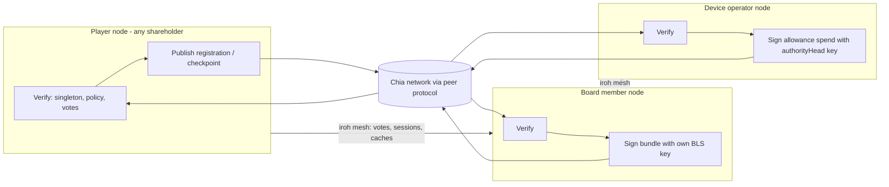

# Sovereign Serverless Treasury Plan

*Star Station Furlong — the company treasury with no service to run: Chialisp as the only money authority, a treasury profile of every player's own node, on-chain registration and checkpoints instead of service signatures, and — proposed, pending maintainer ratification (§6/§14) — chain access over the Chia peer protocol.*

**Status:** architecture amendment to [company-treasury-governance-plan.md](company-treasury-governance-plan.md) (PR 111). It supersedes that document's §4 and §13 (the "authoritative Rust treasury service") and amends §7.1, §7.2 (the `VoteInclusionProof` shape), §9.1, §12, §17.3–§17.4 (per-node actor substitutions), §18, and §20 — the contract, test, and sequence deltas are enumerated in §10–§13 below. Everything else in PR 111 — invariants, threats (§17.1), migration, dissolution, mainnet ceremony — stands unchanged and is not restated here.

**Code root:** unless a path starts with `brainstorming/`, every `src/...` and `ssf-p2p-node/...` path is relative to `prototypes/0.29.0-core-loop-demo/`.

**Ships with this document (PR B start):** [src/treasuryTypes.ts](../prototypes/0.29.0-core-loop-demo/src/treasuryTypes.ts), [src/treasuryTypes.test.ts](../prototypes/0.29.0-core-loop-demo/src/treasuryTypes.test.ts), [ssf-p2p-node/src/treasury_codec.rs](../prototypes/0.29.0-core-loop-demo/ssf-p2p-node/src/treasury_codec.rs), and the shared golden vectors under [test-vectors/treasury/](../prototypes/0.29.0-core-loop-demo/test-vectors/treasury/) — the §10 contract deltas below are implemented, not proposed.

**Companions:**

- [company-treasury-governance-plan.md](company-treasury-governance-plan.md) — the base architecture this amends
- [chia-ventures-shared-ownership.md](chia-ventures-shared-ownership.md)
- [chia-authority-architecture.md](chia-authority-architecture.md)
- [module-wallets-chia-funding-plan.md](module-wallets-chia-funding-plan.md)
- [keyed-identity-contacts-plan.md](keyed-identity-contacts-plan.md) (§6 sovereignty check, §8 companies)
- [REVIEWS/REVIEW-20260710-ChiaHub.md](REVIEWS/REVIEW-20260710-ChiaHub.md)
- [AI BRAINSTORMING/STUDY-Architecture v006.md](AI%20BRAINSTORMING/STUDY-Architecture%20v006.md) and [v007](AI%20BRAINSTORMING/STUDY-Architecture%20v007.md)

---

## 0. Reconciliation: the one contradiction, decided once

PR 111 was reviewed and merged with an "authoritative Rust treasury service" at its center: an operator-run service holding a synced full node "in the same operator trust domain," cross-checking against "at least one independently administered full node," signing `TreasuryProposalAcceptance` records, publishing vote checkpoints, and keeping an idempotency ledger. That is a server, and it contradicts the standing doctrine this repo builds on:

> "The sovereign premise is unchanged and non-negotiable: nothing on the critical path may depend on infrastructure we or our players do not control." — STUDY-Architecture v006

> "`ssf-p2p-node` is the only networking implementation. 'App companion', 'station', and 'beacon' are *profiles* of it, not programs." — STUDY-Architecture v007 §3 (the One-Node Doctrine)

> "No servers, PKI, CA, key-directory, or STUN/TURN beyond the existing iroh mesh." — keyed-identity-contacts-plan.md §6

> "the chain can be the swarm's address book and its metronome, but never its pipe" — ChiaHub review

The resolution is already latent in PR 111 itself. Its strongest line about the service is a demotion: *"The Rust service indexes this lineage but cannot override it"* (§9.1). Period caps are atomic on-chain state coins; policy is a singleton lineage; contention is serialized by the chain. The service was never the authority — it was a convenience wrapper around the authority. This document deletes the wrapper and names what remains.

| PR 111 server-shaped element | Sovereign replacement | Section |
| --- | --- | --- |
| Authoritative treasury service (§4, §13) | Chialisp puzzles as the only money authority + a `treasury` profile of every player's own `ssf-p2p-node` | §2, §3 |
| `TreasuryProposalAcceptance.serviceSig` (§7.1) | On-chain proposal **registration** event; windows derived by pure function — nothing to sign, nobody to trust | §4 |
| Service-published vote checkpoints (§7.2) | **Anyone-can-checkpoint** coin spends; deterministic union tally | §5 |
| Operator full node + "independently administered" cross-check (§13.1) | Chia **peer-protocol** chain access from each node, cross-checked across independent full-node peers; per-node local pause (**proposed — pending ratification, §14**) | §6 |
| Service-verified threshold execution (§13) | Non-interactive BLS **signing sessions** gossiped over the mesh; the bundle's own asserts enforce timing | §7 |
| Service idempotency ledger (§13.1) | Chain-enforced replay protection: one state-coin child per step, `requestId` committed in the solution | §3 |
| Service fee/submission policy (§20 decision 9) | Spends self-pay within `maxFeeMojos`; publishers pay their own dust; anyone may resubmit a complete bundle | §8 |

Everything below assumes PR 111's vocabulary and does not re-argue its settled decisions (one share class, no shared keys, Yjs never authoritative, testnet first).

---

## 1. Decision summary

The company treasury is three things, none of which is a service:

1. **Puzzles.** The company singleton, policy lineage, share CAT, allowance state coins, and approval modules enforce every money invariant on chain. If a spend violates policy, it fails puzzle-side no matter who built it.
2. **A node profile.** Every player's `ssf-p2p-node` can verify all treasury state. Nodes holding relevant keys (board members, allowance subjects) can additionally construct and sign spends. Nodes of interested parties (any shareholder) can publish registrations and checkpoints. Per the One-Node Doctrine these are capabilities of the one node binary, gated by which keys a player holds — not separate programs, and never a hosted endpoint.
3. **On-chain events.** Proposal acceptance, vote inclusion, execution, and receipts are all coin spends or deterministic functions of coin spends. Every node derives the same lifecycle from the same chain.

There is no service to run, no service to sign, and no service to outage. When a node cannot verify chain state to its own satisfaction, *that node* stops treating balances as final and *its* spending pauses — invariant 10 with a better failure geometry, because one operator's outage no longer freezes (or worse, silently unfreezes) anyone else.

## 2. The treasury node profile

Three roles, all inside `ssf-p2p-node`, all feature-gated like the existing chia lane:

- **Verifier (every node).** Follows the company singleton and policy lineage, the share CAT for snapshots, allowance state-coin lineages, registrations, checkpoints, and receipts. Pure reads plus local proof verification. This role has no keys and no authority; it exists so that *no player ever has to take anyone's word* for treasury state.
- **Key-holder (board and subject nodes).** A board member's node signs governance/custody bundles with that member's own BLS key — the same custody stance as the presence lane's per-node key ([module-wallets-chia-funding-plan.md](module-wallets-chia-funding-plan.md)): personal keys in personal nodes, never a shared company seed (invariant 1). An allowance subject's operator node signs execution requests and allowance spends with the `authorityHead` key.
- **Publisher (any interested node).** Publishes registration and checkpoint spends (§4, §5) from the player's personal wallet, exactly as [ssf-p2p-node/src/chia_publish.rs](../prototypes/0.29.0-core-loop-demo/ssf-p2p-node/src/chia_publish.rs) publishes presence records today.

The browser keeps the §4.1 trust placement from PR 111 unchanged — display, drafts, personal signatures, verification — and talks only to **its own local node** over the existing loopback lane, the same way it fetches the WebTransport fingerprint today. The §13 `TreasuryService` interface survives **in role** as the browser↔local-node contract, with amended signatures: `submitProposal` returns the derived `ProposalWindows` (§4) instead of a signed acceptance, inclusion proofs use the shipped `{voteId, checkpointId, steps}` shape, and nothing in the interface implies a remote party. Transport: extend the node's local HTTP API rather than adding envelope kinds to the WT bridge — the envelope lane stays game-sync-shaped, and the HTTP API already has the loopback-only CORS posture. (Reviewable; see §14.)

## 3. Money authority and replay without a service

**Authority.** Unchanged from PR 111 §8–§9 — and now exclusively so. The allowance state coin commits period index, spent amount, and sequence; an authorized spend consumes it and recreates one child with updated consumption in the same bundle; Chialisp rejects an over-cap amount. Nobody indexes their way around that, and nobody needs to be trusted not to.

**Replay.** The state coin admits exactly one child per step, and the spend's solution commits the `requestId` (announced, so the receipt binds to it). A different bundle reusing a `requestId` fails puzzle-side; an identical retry deduplicates in the mempool as the same spend. PR 111 §13.1's retry rule — "only after the former spend is proven absent and the original authorization remains valid" — becomes a local-node rule, with the chain itself as the idempotency ledger.

**Submission.** Whichever node completes a bundle submits it; anyone may resubmit a fully signed bundle (it is the same spend). Contention over one allowance state coin is scoped to that subject; at company scale (~19 s blocks, per-subject state coins) the documented CircuitDAO behavior applies: the loser observes the new child and rebuilds. The allowance subject's node is the *conventional* single submitter; convention, not mechanism, because the mechanism doesn't need it.

## 4. Proposal registration and derived windows

PR 111's acceptance record existed to stop a proposer from choosing a flattering snapshot or shortening deadlines, and it solved that by having a service sign the honest values. The sovereign version deletes the trusted party instead of the distrust:

1. The proposer (or anyone holding the signed proposal) publishes a **registration coin spend** — the proven `chia_publish` shape: a spend carrying a hint derived from `companyId` for discovery and a memo committing `{proposalId, payloadHash, policyVersion, kind}`.
2. `acceptedHeight` is the registration spend's **confirmation height, read from chain** — never a supplied number. `acceptedBlockHash` likewise.
3. Every window is a **pure function** of `(acceptedHeight, GovernanceKindRule)`, and the snapshot is pinned at the registration height itself (`snapshotHeight = acceptedHeight`). `deriveProposalWindows()` in [src/treasuryTypes.ts](../prototypes/0.29.0-core-loop-demo/src/treasuryTypes.ts) and `derive_proposal_windows()` in [ssf-p2p-node/src/treasury_codec.rs](../prototypes/0.29.0-core-loop-demo/ssf-p2p-node/src/treasury_codec.rs) are golden-vector-matched, so every browser and every node computes identical deadlines from identical chain facts.
4. The result is `ProposalWindows` — a **derived view, not a signed artifact**. It replaces `TreasuryProposalAcceptance`; `serviceSig` and `acceptanceCheckpointId` are gone, `registrationCoinId` is the anchor. Cache it in the Yjs treasury map freely (invariant 5: caches are replaceable); recompute it to trust it.

Validity is checked identically by every node: current `policyVersion`, kind known to policy, proposer meets `proposalThresholdBps` at the snapshot. An invalid registration is deterministically ignored by everyone — it wasted its publisher's dust and fee, which is also the spam bound (plus a per-policy cap on concurrently tracked proposals per proposer).

PR 111 §7.1's rule that *"clients and puzzles recompute those values rather than trusting supplied numbers"* is retained verbatim; what changed is that there is no longer a party whose supplied numbers anyone might have trusted.

## 5. Votes, checkpoints, and data availability

**Votes** are unchanged (§7.2): signed personal messages, replay-safe via per-voter `sequence`, weighted at `snapshotHeight`. They travel in the company office doc's `treasury` Y.Map (`vote:<proposalId>:<voterPub>`, per §14 of PR 111) over the iroh mesh, and — like any signed self-authenticating record — over any other channel players care to use.

**Checkpoints** replace the service's inclusion proofs. Any shareholder — typically the proposer, or any voter who fears censorship or partition — publishes a **checkpoint coin spend** before `votingEndsHeight`: hinted under the proposal, memo committing the `TreasuryCheckpoint` body whose `voteRoot` is a merkle root over the distinct vote ids they hold (tree defined in §10; implemented and cross-tested in both runtimes). Multiple checkpoints per proposal are normal and cheap.

**The deterministic tally rule:** counted votes = the union of valid votes provably included in *any* checkpoint confirmed no later than `votingEndsHeight`. Per-voter max-`sequence` dedup applies across the union; equal sequences resolve to the lexicographically smallest `voteId` (both unchanged from §7.2). Every node that can read the chain and obtain the vote payloads computes the same tally.

**Data availability (PR 111 open decision 12 — resolved).** Vote and proposal payloads replicate in the office doc, which members' nodes already persist across restarts; a checkpoint publisher MUST retain the payloads behind their root; any holder can republish, because signed payloads are self-authenticating. A vote absent from every confirmed checkpoint **does not count** — that is the deterministic answer to a gossip partition, and self-checkpointing is the escape hatch: a voter who can reach the chain can always make their own vote count without anyone's cooperation. If every copy of the payloads behind a root is lost, those votes are uncountable, and the only harmed party is the side that failed to retain what it wanted counted.

On-chain tally *enforcement* in puzzles remains out of v1 scope, exactly as in PR 111: the tally authorizes the board's threshold execution, every node recounts it independently, and an execution that contradicts the deterministic tally is publicly provable misconduct against a specific policy version. What changed is that recounting requires no privileged data: the inputs are chain state plus self-authenticating gossip.

## 6. Chain access: the peer protocol, not a gateway

**Proposal (pending maintainer ratification — see §14): v1 treasury chain access is built on the Chia light-wallet peer protocol** — direct connections from `ssf-p2p-node` to full-node peers on the Chia network itself (coin-state subscriptions by puzzle hash/hint, puzzle-and-solution requests for lineage verification, block header requests), cross-checked across **N ≥ 2 independent peers** for every finality-sensitive claim: governance acceptance, snapshot balances, allowance state, receipt confirmation. This is the "relying only on the Chia blockchain and peer-to-peer connections" reading taken literally: the chain is reached the way chain participants reach it, not through anyone's HTTPS gateway.

Mechanics and honest labels:

- **Client crates.** `chia-sdk-client` (peer connections + Chia TLS) joins the existing chia-sdk *sub-crate* set — the umbrella crate stays rejected for the Windows-GNU export-ordinal reasons documented in [ssf-p2p-node/Cargo.toml](../prototypes/0.29.0-core-loop-demo/ssf-p2p-node/Cargo.toml). Whether the added TLS/client symbol mass fits under the GNU ceiling is an explicit spike question (S-0, §11); the release-profile-links / MSVC-dev verdict from the toolchain item applies.
- **Peer bootstrap.** `SSF_CHIA_PEERS` (explicit peer list — including "my own full node," which under this design is simply a peer the player happens to run and trust) plus the Chia DNS introducers as the zero-config default, then peer gossip (`RequestPeers`). The DNS-introducer rung is third-party *bootstrap*, in exactly the class of the Mainline DHT bootstrap nodes the mesh already accepts — it introduces you to the network; it is not on the critical path afterward and is bypassed entirely by a configured peer list.
- **The seam.** One chain-access trait in the node; the peer-protocol implementation is primary. The existing `CoinsetClient` becomes the *dev/fallback* implementation behind the same seam — useful for tests and quick tooling, never the default for money paths. The current hardcoded `CoinsetClient::testnet11()` call sites (chia_publish, chia_resolve, chia_craps_fair) migrate to the seam, and network selection becomes release/operator configuration with a startup check: the node reads its peers' network id / genesis challenge and **refuses to run** on a mismatch with its release configuration (PR 111 §17.5, unchanged).
- **Trust labels** (required by PR 111 §13.1's honesty rule): a claim checked against a single peer is a **trusted-node** assumption. Agreement across N independently chosen peers is a **trusted-set** assumption — strictly better, still not trustless. **Trustless** is reserved for claims the node verifies locally: parent puzzle-reveal lineage checks (already done today in `chia_resolve.rs` for memo decoding, extended to singleton/CAT lineage walking), signature verification, and — the recorded stretch rung — **weight-proof light sync**, which upgrades header trust to cryptographic verification and is deliberately *not* v1 scope. Every mainnet-gate review inherits §13.1's rule: each residual trusted-set assumption is named and approved explicitly, or the path doesn't ship.
- **Disagreement and unreachability.** Peers disagreeing on a finality-sensitive claim, inadequate confirmation depth, an observed rollback, or fewer than N reachable peers → the node marks affected state non-final, its UI shows the existing offline/read-only states from PR 111 §10.2/§11.1, and **its** spending pauses. Recovery is automatic when verification succeeds again. Nobody else's node is affected; there is no global pause to operate, and none to fail open.

PR 111 §13.1's spend-bundle-hash reconciliation and reorg rules carry over in substance, executed per-node (its service idempotency ledger reads as §3's chain-as-ledger): the node verifies the exact bundle hash it constructed, reconciles against mempool and confirmed observations, and flips receipts to `reorged`/pending when their block disappears.

## 7. Custody: signing sessions over the mesh

The custody bakeoff (S-2, absorbing PR 111 §18 PR D's "custody-primitive spike") evaluates candidates **under serverless coordination constraints**, which reorders the preference list:

1. **On-chain `m-of-n` with per-signer `AGG_SIG` conditions (MedievalVault / reviewed SDK vault) — first.** BLS signature collection is non-interactive: each board node independently signs the same canonical bundle whenever it happens to be online; any node holding `m` valid partial signatures aggregates and submits. No rounds, no simultaneity, partition-tolerant by construction.
2. **FROST threshold signing — researched fallback.** Spike b4 simulated it for Station Seals; its interactive signing rounds want all participating signers reachable in a session, which is exactly what a sovereign mesh cannot promise. Reserved (as the module-wallets doc already reserves it) for rare high-ceremony operations if the vault path fails review.
3. PR 111 §6.1's demand stands: every candidate states explicitly whether it is cryptographic threshold signing or an on-chain `m-of-n` puzzle. The two are not interchangeable and the docs must never blur them.

**Coordination** is a `SigningSession` record (§10) in the treasury Y.Map: proposal id, canonical `bundleHash`, required threshold, collected signatures. It gossips over the existing mesh like any signed cache; an offer-file-like export/import (the [transfer-offers](transfer-offers-deeds-shares.md) `ssf://` carrier pattern) is the out-of-band fallback when signers don't share a mesh session. The record conveys **zero authority** — a forged or stale session cannot make the chain accept anything, because:

**Timing is puzzle-enforced.** Execution bundles assert `executableFromHeight ≤ current height < expiresAfterHeight` (veto window and expiry from §4's derived windows) plus `ASSERT_BEFORE_HEIGHT` staleness bounds. Premature submission fails on chain, not by a service's refusal. Offline signers delay nothing structurally: sessions simply wait for the m-th signature or expire and re-collect against a fresh bundle.

## 8. Fees and submission (open decision 9 — resolved)

- Treasury and allowance spends **self-pay fees from the spent coins**, bounded by the new `maxFeeMojos` field committed in policy and in each allowance (§10). PR 111's own recommended default, made a contract field so the bound is chain-checkable.
- Registration and checkpoint publishers pay their own dust and fees from their personal wallets — the `chia_publish` model, unchanged. Publishing is a shareholder's voluntary act in their own interest (getting a proposal accepted, getting votes counted).
- Submission: §3. Whoever completes a bundle submits; resubmission is harmless; fee *estimation* is per-node and may differ between nodes — accepted (§15).

## 9. Devices: the house is a node profile

The casino "house," the robot dock's payer, and the room's funding agent are the same thing: a **node profile with an allowance subject key** — precisely the craps plan's house/operator node stance ("Rust engine in the node… keeps key custody in the node, trust boundary unchanged").

- The machine's operator node holds the allowance's `authorityHead` key, signs `TreasuryExecutionRequest`s, constructs reserve/settle/refund spends against the allowance state coin, and submits. Every other node verifies the resulting receipts like any chain fact.
- Integration seams are the shipped ones: the `CrapsBackend`/game-backend seam and PR 111 §19.3's `TreasuryFundingAdapter`, now implemented against the **local node's** treasury RPC instead of a remote service. Local prototype chips remain non-money; the disabled shared-bankroll mode stays disabled until the PR E vertical slice replaces it — PR 111's invariant-5 debt statement is unchanged.
- A device without a protected key still acts through a named manager/operator authority (§9.1 of PR 111), which under this plan concretely means: through that person's node.

## 10. Contract deltas (implemented in this PR)

Implemented in [src/treasuryTypes.ts](../prototypes/0.29.0-core-loop-demo/src/treasuryTypes.ts) with the Rust twin in [ssf-p2p-node/src/treasury_codec.rs](../prototypes/0.29.0-core-loop-demo/ssf-p2p-node/src/treasury_codec.rs), golden-vector-matched byte-for-byte (the `chia_craps_fair`/`fairDice` house pattern):

1. **`TreasuryProposalAcceptance` → `ProposalRegistration` + `ProposalWindows`.** `serviceSig` and `acceptanceCheckpointId` deleted; `registrationCoinId`, `acceptedHeight`, `acceptedBlockHash` anchor the derivation; `deriveProposalWindows(registration, rule)` is the shared pure function; `governanceRuleHashOf(kind, rule)` (domain `ssf-governance-rule:v1`) pins which rule derived the windows.
2. **`TreasuryCheckpoint`** (domain `ssf-treasury-checkpoint:v1`): `{v, networkGenesisChallenge, companyId, proposalId, voteRoot, voteCount, publisherPub}` + its `checkpointId` (excluded from its own hash) + observed `checkpointCoinId`/`confirmedHeight`.
3. **Checkpoint vote tree:** leaves are the distinct vote ids sorted bytewise; `leaf = sha256(0x00 ‖ voteId)`, `node = sha256(0x01 ‖ left ‖ right)`; an odd node is **promoted, never duplicated** (no CVE-2012-2459-shaped ambiguity). `voteRootOf`, `voteInclusionStepsOf`, `verifyVoteInclusion` in TS; `vote_root_of` in Rust. The shipped proof record is `VoteInclusionProof {v, voteId, checkpointId, steps: MerkleStep[]}`, replacing PR 111 §7.2's sketched shape. The eventual Chialisp must match these vectors exactly.
4. **`SigningSession`** (§7): a cache record, no authority-bearing fields beyond the signatures it ferries.
5. **`maxFeeMojos`** on `CompanyTreasuryPolicy` and `DeviceAllowance`; included in `policyHashOf`.
6. **Vote ids** are defined concretely: `voteIdOf` hashes the canonical unsigned vote body under domain `ssf-treasury-vote:v1` (PR 111 §7.2 required this; the field order is now pinned by vectors).
7. Everything else in PR 111 §12 lands as written: `isMojoString`'s bounded lexical guard, the deterministic-CBOR profile (RFC 8949 deterministic, definite lengths, no floats/tags, shortest heads, bytewise-sorted map keys — plus one profile clarification: **no byte strings**; binary travels as lowercase hex text, which keeps the JSON fixture lane exact), set-semantics array sorting, domain-tagged non-recursive proposal ids and signature targets, genesis-challenge binding in every id.

## 11. Revised PR and spike sequence

| Stage | Was (PR 111 §18) | Now | Gates |
| --- | --- | --- | --- |
| **S-0 spike** (new) | — | **Chia peer-protocol lane**: `chia-sdk-client` connect → subscribe by hint/puzzle-hash → coin states → puzzle-and-solution lineage check → 2-peer cross-check, on testnet11 from `ssf-p2p-node`; record the Windows-GNU link verdict for the added TLS/client crates | gates PR D |
| **S-1 spike** (new) | — | **Registration + checkpoint coins** on testnet11 (extends the `chia_publish` pattern); two independent nodes derive byte-identical `ProposalWindows` from the confirmed registration → new golden acceptance vector | gates PR D |
| **S-2 spike** | inside PR D | **Custody bakeoff under serverless coordination** (§7): vault `m-of-n` vs FROST (reuse the b4 harness); measure offline-signer tolerance and veto-window puzzle enforcement | gates PR F |
| **S-3 spike** (new) | — | **Peer-disagreement + reorg drill**: a lying/lagging peer pauses that node's spending and no one else's; a reorg flips a receipt to `reorged` and reconciliation follows §13.1 | gates PR E |
| **PR B** | contracts + caches + tests | Same scope with §10 deltas. **Started with this document**: `treasuryTypes.ts` + vitest suite + `treasury_codec.rs` + shared vectors + CI lanes. Remainder: `treasuryDoc.ts` signed-cache records over the Yjs treasury map | tsc + vitest + `cargo test --features chia-lane` green |
| **PR C** | read-only phone/room UI | Unchanged; "mocked/service snapshots" reads "mocked/local-node snapshots" | — |
| **PR D** | Rust testnet treasury **service** | **`treasury` module in `ssf-p2p-node`** behind a `treasury` cargo feature (requires `chia-lane`; added to CI like the chia lanes): the chain-access seam (§6), singleton/policy follower, share-snapshot verifier, registration/checkpoint reader, local browser-facing RPC. Consumes `treasury_codec` with typed structs | S-0, S-1 |
| **PR E** | allowance engine + vertical slice | Same puzzles and atomic caps; the executor is the subject's node (§9); one casino table or robot operation on testnet | S-3, PR D |
| **PR F** | governance execution + custody | Same scope; execution via signing sessions (§7); board rotation drill 1-of-1 → 2-of-3 across two real machines | S-2, PR E |
| Later | multi-class, lanes, mainnet | Unchanged from PR 111 (each behind explicit review) | — |

**Relationship to existing gates, stated honestly:**

- **B-7 (chia-wallet-sdk WASM audit) — proposed here as not gating the node-side path.** Its defining text (STUDY-Architecture v006 §3.6) scopes it to the per-driver *browser* surface with node-side Rust use unaffected — but later docs (craps-chia-backend-plan §8, the ChiaHub review's C0, keyed-identity-contacts-plan) have leaned on B-7 as a broader gate for chain/wallet work, so the narrow reading is contestable; hence the ratification flag below. The node-side lane already runs on chia-sdk *sub-crates*, live-proven on testnet11, and the browser holds zero chain code under this design. B-7 remains the gate it always was for future *browser* light-verification. This is **not** an audit waiver for new chain-facing code: the crates S-0 introduces (`chia-sdk-client` and the TLS stack it pulls in) get the equivalent per-crate audit **inside S-0, as part of the same review that gates PR D**. This reading — B-7 de-gated, replaced by an S-0 audit obligation — is itself pending maintainer ratification (§14).
- **b6 (iroh sovereignty gate, re-opened) does not gate treasury correctness.** The chain, not the mesh, is the authority, and every artifact — registration, checkpoint, vote, signing session — has an on-chain or file-transportable form. What b6's unfinished relay work degrades is vote-gossip *convenience* during mesh partitions; §5's self-checkpoint rule is the designed answer, and closing b6 improves quality of life, not safety.
- **The company op-log prerequisite.** [keyed-identity-contacts-plan.md](keyed-identity-contacts-plan.md) §8 names asset-ownership-as-signed-ledger the load-bearing prerequisite for companies, with the RoomLog machinery generalizing to a company op-log. PR B's `treasuryDoc.ts` designs against the Yjs treasury map now, with the op-log named as the durability hardening step — same staging PR 111 already implied by keeping caches replaceable.

**Responsibility matrix (per PR, assigned before review begins — PR 111 §18.1 with the service-owner row deleted):** canonical contracts → frontend/data-contract owner + Rust owner + security reviewer; puzzles → Chialisp owner + independent reviewer; node treasury module and chain-peer seam → Rust/node owner + contract owner + security reviewer; phone/room UI → frontend UX owner + accessibility reviewer; vertical slice → gameplay owner + multi-client test owner; governance/custody UX → governance owner + legal reviewer; gates/drills → integration/QA owner + all three code owners.

## 12. Test strategy

- **Golden vectors, both runtimes** (shipping now): [test-vectors/treasury/](../prototypes/0.29.0-core-loop-demo/test-vectors/treasury/) holds the canonical-CBOR profile cases (self-checked against RFC 8949 Appendix A at generation time) and the contract vectors (policy hash, proposal id, signature bytes, vote id, vote roots, checkpoint id, derived windows, set sorting). `npm test` (vitest — a new frontend convention introduced here, since PR 111 §17.2's unit tests had no runner to live in) asserts them in TypeScript; `cargo test --features chia-lane` asserts the identical files in Rust. A drift in either encoder fails one CI lane or the other.
- **CI:** the PR-checks workflow gains the vitest lane; the Rust vectors ride the existing chia-lane check+test lanes. PR D's `treasury` feature gets its own check/test lane when it lands.
- **Multi-machine acceptance** (written at PR F time, outline fixed now, in the [slice2](slice2-two-machine-test.md)/[v029](v029-three-machine-test.md) house pattern — roles by network position, numbered tests with ✅/❌ criteria, release-gating): `treasury-two-node-governance-test.md` will drill (1) board rotation 1-of-1 → 2-of-3 with the launcher id unchanged, (2) a vote during a mesh partition — both sides tally identically after heal because the checkpoint decides, (3) duplicate execution from two nodes — the state coin admits one child, the loser rebuilds, (4) peer-disagreement pause — the affected node goes read-only, the other keeps operating, (5) reorg receipt drill — `confirmed` → `reorged` → reconciled.
- **Testnet gates:** PR 111 §17.4's eleven gates stand, with the serverless actor substitutions: gate 7's duplicate/contention tests run from two independent *player nodes*; gate 10 becomes *"peer disagreement or an unavailable cross-check stops THAT node's governance acceptance and spending"* — and adds its converse, *"…and does not stop any other node's."*

## 13. What is unchanged from PR 111

For reviewers keeping score: invariants 1–12 (§3); company identity, shares, classes, board/manager separation (§5); rotation semantics and share-sale-vs-rotation rules (§6); vote weighting, dedup, thresholds, proposal-kind rules (§7.2–7.4; the `VoteInclusionProof` record shape changed — §10); treasury coin shape and approval modules (§8); allowance scoping for casino/robot/room (§9, minus "the service verifies" phrasing; the `DeviceAllowance` contract gains `maxFeeMojos` — §10); room binding (§10); phone UI (§11); the canonical-CBOR profile and guard rules (§12, extended per §10 above); Yjs cache rules (§14); the systems-touched map and import boundaries (§15); membership transitions and dissolution (§16); threats and unit tests (§17.1–17.2; §17.3's "authoritative service unavailable" multi-client test reads per-node under this plan); network separation and the mainnet promotion ceremony (§17.5); migration from current ventures/rooms/casino (§19); acceptance criteria including the legal-review compile gate (§21); and the language rule — players see **venture, company, shares, Registry**; *singleton, CAT, vault, checkpoint coin* never reach game UI.

## 14. Open decisions

**Resolved by the sovereignty constraint (previously PR 111 §20):**

- *#9 fees* → self-paid within `maxFeeMojos`; publishers pay their own dust (§8).
- *#12 data availability* → office-doc replication + checkpoint-publisher retention + anyone-republishes; un-checkpointed votes don't count (§5).
- *Custody coordination shape* (half of #1) → must tolerate non-interactive, offline-signer collection (§7); which primitive wins stays open pending S-2.

**Proposed in this PR, pending maintainer ratification (not yet decided):**

- *Chain access posture* → peer protocol first, N-peer cross-check, coinset demoted to dev/fallback (§6). This **reverses PR 111 §13.1's settled posture** (operator-run full node plus an independently administered cross-check node), so it needs an explicit owner decision; it is recorded here as this document's proposal, not as a decision anyone has made.
- *B-7 audit scope* → de-gated for the node-side path, replaced by a per-crate audit obligation inside S-0 (§11). Same status: proposal, not decision.

**Still genuinely open (owners assign before PR D):** #1 final custody primitive (S-2 verdict); #2 one treasury coin vs fixed lanes (recommend one coin, unchanged); #3 board veto vs shareholder veto composition; #4 quorum and minimum platform delays; #5 whether common shares grant room access by default; #6 whether manager roles require shareholding; #7 guardian composition/delay; #8 which asset pays casino liabilities; #10 room binding expiry; #11 legal treatment of transferable shares.

**Newly opened by this document:** (a) the browser↔node treasury RPC transport — extend the local HTTP API (recommended, §2) vs new WT envelope kinds; (b) the PR D cargo feature name (`treasury` requiring `chia-lane`, recommended) vs widening `chia-lane`; (c) N, the cross-check peer count, and the peer-selection policy (recommend N=2 for testnet, revisit before mainnet).

## 15. Consequences we accept

Stated in the [m345 build-plan](m345-v029-build-plan.md) tradition — costs of the serverless shape, accepted deliberately:

1. **Fee estimation is per-node.** Two nodes may attach different fees to equivalent spends; within `maxFeeMojos` this is noise, not a fault.
2. **Two operators of one allowance can race.** The chain picks one child; the loser rebuilds. Convention (the subject's node submits) reduces it; nothing needs to prevent it.
3. **There is no global pause switch.** Pausing is each node's local verdict. The upside is stated in §1; the cost is that "the company has stopped spending" is a per-node observation, not an operable global state. The dissolution and emergency paths of PR 111 §16 are the governance-level stops.
4. **Vote convenience degrades with mesh health** until b6 closes; self-checkpointing bounds the damage to fee-cost (§5, §11).
5. **Peer-protocol chain access is trusted-set, not trustless, in v1.** The labels in §6 are load-bearing; weight-proof light sync is the recorded upgrade path, and no claim gets the word "trustless" without local verification behind it.
6. **More on-chain events than the service design** (registrations, checkpoints): dust + fees per governance action. This is the price of nobody-to-trust, it is bounded, and it is paid by the party who wants the action to happen.

---

## 16. Final recommendation

PR 111 got the invariants right and the operator wrong. Keep every invariant; carry the contracts, tests, and gates forward with only the deltas §10–§13 enumerate; delete the service. The chain is the treasury's authority; every player's node is its verifier; key-holders are its actors; and the correct failure mode for money — *when in doubt, stop* — becomes each sovereign node's own, locally enforced, individually recoverable verdict.
