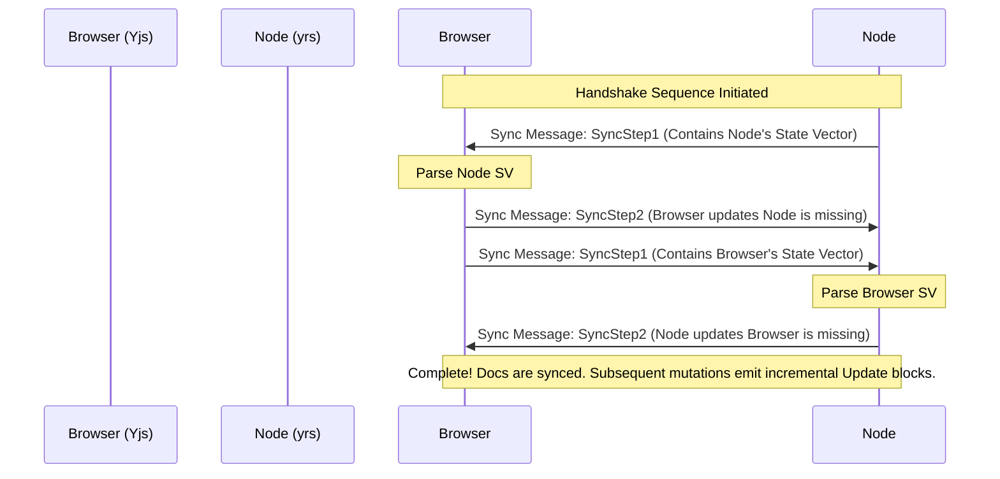

# Spike B‑5 — yrs ⇄ Yjs Sync Conformance & Awareness Limits

> **yrs is the raw native engine; Yjs is the browser interface.** This spike validates structural wire conformance, handshake flow sequencing, and document sync capabilities over real-time TCP channels.

---

## 🛠️ Y‑Sync Protocol Wire Handshake Flow

Yjs synchronization follows an exact state-vector response pattern. Understanding the exact message sequence was verified in our dual Rust/Browser implementation:



1. **`SyncStep1` (Type 0):** Used to query the other partner. Carries the sender's current logical timestamp mappings (the `StateVector`).
2. **`SyncStep2` (Type 1):** Sent as a reply to `SyncStep1`. Synthesizes and serializes the exact set of modified blocks/operations needed to catch the peer up to date.
3. **`Update` (Type 2):** Sent whenever any reactive event changes the document state locally, syncing small incremental deltas rather than state vectors.

---

## 🧭 Critical Conformance Findings

### 1. Header & VarInt Framing Rule
Any custom protocol frame mapped within `yrs`/`Yjs` must strictly prefix content packages using **varint length indicators**. Our decoder implements variable-length unsigned integers:
```rust
fn read_var_uint(bytes: &[u8], mut cursor: usize) -> Result<(u32, usize)> {
    // ... bit shifting on 0x80 markers
}
```

### 2. Transaction Mutex & Mutability Rule
`yrs` strictly prevents concurrent transaction access:
* Parallel reading/writing on a document is completely impossible. 
* Any data manipulation or reading must take place under scope-level transaction guards (`ReadTxn` / `WriteTxn` scopes matching `yrs` lifetime constraints).

### 3. Awareness Lane Limitation Verification
As outlined in [STUDY-Architecture v006](brainstorming/AI%20BRAINSTORMING/STUDY-Architecture%20v006.md#1-tldr--what-v006-changes-vs-v005), **never track player positions via the Yjs Awareness metadata channel**. 
* **The Reason:** Every time `Awareness.set_local_state` is mutated, Yjs serializes and broadcasts the **complete client state object** to all connected sync nodes. Under a 20 Hz movement frequency, this would trigger catastrophic state replication overhead.
* **The Decision:**
  * **Datagram Ticks (UDP):** Carry immediate (x, y, z) positioning inside raw 13-byte datagrams.
  * **Awareness (TCP):** Retained strictly for discrete presence updates (name updates, speaking indicators, typing, AFK).

---

## 🎮 Running the Spike

### 1. Start yrs Server
```powershell
cd spikes/b5-yrs-yjs-conformance
cargo run --release
```

### 2. Open client
1. Open your browser and navigate to `http://localhost:8081` (automatically resolved as a local secure context origin).
2. Click **Start Y-Sync Handshake**.
3. Observe the logs:
   * Node initiates the connection with `SyncStep1`.
   * Client responds with its own state diff (`SyncStep2`) and its state vector (`SyncStep1`).
   * Node responds with the missing updates (`SyncStep2`).
   * Real-time metadata maps synchronize.
4. Type into the update box or adjust parameters to watch real-time concurrent bi-directional synchronization stream automatically back-and-forth!
